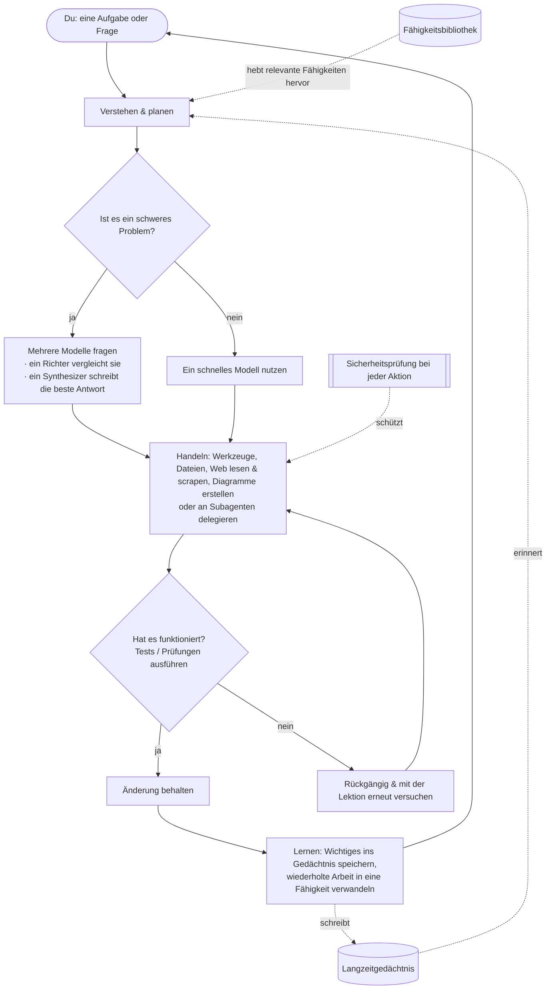

<div align="center">


# Chimera

**Der kontrollierte, sich selbst weiterentwickelnde Agent — bewiesen und kontrolliert.**<br/>
<sub>Denkt mit vielen Köpfen, erledigt echte Arbeit selbst, lernt nur Bewiesenes und ist sicher durch Architektur.</sub>

[](https://pypi.org/project/chimera-agent/)
[](LICENSE)
[](https://www.python.org/)
[](https://github.com/brcampidelli/chimera-agent/actions/workflows/ci.yml)
[](https://mypy-lang.org/)
[](https://github.com/astral-sh/ruff)
[](https://discord.gg/ACvBbrmguV)
[](https://www.reddit.com/r/ChimeraAgent/)

[](https://donate.stripe.com/9B63cofM491m4SBfe177O00)

<sub><a href="README.md">English</a> · <a href="README.pt-BR.md">Português</a> · <a href="README.es.md">Español</a> · <b>Deutsch</b> · <a href="README.fr.md">Français</a> · <a href="README.zh-CN.md">中文</a> · <a href="README.ja.md">日本語</a></sub>

</div>

Die meisten KI-Assistenten setzen alles auf ein **einziges** Modell und vergessen alles, sobald der
Chat endet. **Chimera macht zwei Dinge anders:** Bei schweren Fragen fragt es **mehrere** KI-Modelle
gleichzeitig und verschmilzt ihre Antworten zu einem stärkeren Ergebnis, und es **merkt sich Dinge
und lernt**, sodass es umso nützlicher wird, je öfter du es benutzt. Es plaudert nicht nur — gib ihm
ein Ziel, und es plant, nutzt Werkzeuge, überprüft seine eigene Arbeit und behält nur das, was
wirklich funktioniert.

> **Kostenlos und quelloffen (Apache-2.0), in früher, aber aktiver Entwicklung.** Es funktioniert
> bereits von Anfang bis Ende: chatte mit ihm, lass es Aufgaben eigenständig erledigen, betreibe es
> als Bot in deiner Lieblings-Messaging-App, stelle es auf einem Server bereit, damit es rund um die
> Uhr arbeitet, und beobachte, wie es aus seinem Tun lernt. Es ist **Alpha** — solide und ausgiebig
> getestet (**1000+ automatisierte Tests**, strikte Typprüfung und Linting bei jeder Änderung), aber
> im Produktivbetrieb noch nicht kampferprobt.

---

## Warum Chimera

Stell dir die meisten KI-Werkzeuge so vor, dass du **einen** Experten fragst und hoffst, dass er
recht hat. Chimera ist wie ein **Gremium aus Experten**, das debattiert, ein **fairer Richter**, der
ihre Antworten abwägt, und ein **Autor**, der das beste kombinierte Ergebnis liefert — und dann ein
Teamkollege, der die Arbeit tatsächlich **erledigt** und daraus **lernt**. Was es besonders macht, in
einfachen Worten:

- 🧠 **Viele Köpfe, eine Antwort.** Bei kniffligen Fragen stellt Chimera mehreren Modellen dieselbe Frage, lässt ein Modell ihre Antworten vergleichen und lässt ein finales Modell die beste kombinierte Antwort schreiben — so bekommst du etwas Ausgewogeneres, das seltener falsch liegt als ein einzelnes Modell für sich. (Es tut das nur, wenn es sich lohnt, um schnell und günstig zu bleiben.)
- 🚀 **Es macht die Arbeit, nicht nur Gerede.** Gib ihm ein Ziel. Es zerlegt es, nutzt Werkzeuge, bearbeitet Dateien, führt die Tests aus und **behält eine Änderung nur, wenn sie besteht**. Geht etwas kaputt, macht es die Änderung rückgängig und versucht es erneut — so hinterlässt es kein Chaos.
- 🧬 **Es wird besser, je mehr du es benutzt.** Es merkt sich deine Vorlieben und wichtige Fakten über Gespräche hinweg und verwandelt Aufgaben, die es wiederholt, still und leise in wiederverwendbare Fähigkeiten. Es ist darauf ausgelegt, sich stetig zu verbessern, statt über lange Läufe langsam schlechter zu werden — ein Problem, das viele Agenten unbemerkt aushöhlt.
- 🛡️ **Sicher von Grund auf.** Jede riskante Aktion durchläuft zuerst eine Sicherheitsprüfung, alles Zerstörerische fragt nach Bestätigung, und nicht vertrauenswürdiger Code kann in einem abgeschotteten Container ohne Netzwerk laufen. (Diese Prüfungen sind ein günstiger erster Filter, nicht die eigentliche Grenze — die Sandbox ist es; und die Container-Isolierung ist optional. Siehe [SECURITY.md](SECURITY.md).)
- 🔌 **Jedes Modell, läuft überall.** Nutze große gehostete Modelle oder deine eigenen lokalen über eine einzige Schnittstelle — auf deinem Laptop oder einem 5-Dollar-Server, rund um die Uhr.
- 🧩 **Wirklich deins.** Quelloffen, kein Lock-in, kein Anbieter-Konto nötig. Du betreibst es, es gehört dir, du kannst alles ändern.

## Wie Chimera im Vergleich abschneidet

Chimera versucht nicht, die riesigen Agenten-Projekte im *Umfang* zu übertreffen. Es setzt auf die
drei Dinge, die eine echte Reverse-Engineering-Studie von fünf führenden Projekten (OpenClaw, Hermes,
nanobot, CrewAI, LangGraph) als das erkannt hat, was sie **alle offen lassen** — und macht sie zu
seinem Kern:

- 🧬 **Selbstevolution mit einem Fitness-Signal.** Die anderen "lernen", indem sie einfach anhängen, was auch immer passiert ist, oder durch menschliche Pull-Requests — nichts misst, ob eine gelernte Änderung tatsächlich geholfen hat. Chimera behält eine Änderung **nur, wenn ein verifiziertes Ergebnis beweist, dass sie es tat**: Der Evolutionsschritt ist an den echten Working-Tree-Diff und ein ehrliches A/B gekoppelt, nie an das Wort des Modells. Unabhängiger Beleg, dass das zählt: [EvoAgentBench (arXiv 2607.05202)](https://arxiv.org/abs/2607.05202) hat gemessen, dass *automatische*, ungegatete Methoden zur Erfahrungskodierung regelmäßig **negativen Transfer** erzeugen — eine populäre Methode verschlechterte sich um **−12,3 Punkte** bei Aufgaben, auf die sie nicht abgestimmt war. Chimeras Gate führt jetzt auch einen **Transfer-Holdout** aus: Eine gelernte Änderung darf einen disjunkten Ausschnitt gleicher Fähigkeit nicht verschlechtern, bevor sie befördert wird — so kann sie nicht einfach ihr eigenes Eval auswendig lernen.
- 🛡️ **Sicherheit durch Architektur.** Prompt Injection gilt inzwischen weithin als *nicht patchbar*; die populären Agenten mildern sie auf App-Ebene ab oder erklären sie für außerhalb des Fokus (eines lieferte 135k öffentlich exponierte Instanzen und einen Marktplatz, der zu ~12 % voller bösartiger Skills war). Chimera verfolgt die Taint-Provenienz durchgängig, entfernt Steuer-Tokens aus nicht vertrauenswürdigem Inhalt, engt den Werkzeugzugriff bei einem tainted Lauf ein, sichert Retries mit Seiteneffekten ab und führt nicht vertrauenswürdigen Code in einem optionalen, abgeschotteten Container aus.
- 📊 **Ehrliche, veröffentlichte Benchmarks.** ~20 % der als "gelöst" markierten Fälle einer populären Rangliste sind tatsächlich falsch. Chimera meldet jede Zahl mit einem Konfidenzintervall — **einschließlich der Läufe, in denen es nicht gewann** — und würfelt nie neu, um Signifikanz zu erzeugen. Ein aufgezeichneter gepaarter Lauf zeigt, wie die volle Schleife **ein schwaches Modell auf einer vorregistrierten 15-Aufgaben-Suite anhebt — 60 % → 73 % (+13pp), aus zwei Aufgaben, die sie wiederherstellte (roher Fehlschlag → verifiziertes Bestehen) mit null Regressionen** — ehrlich als noch-nicht-signifikant gemeldet. Und beim **offiziellen Terminal-Bench** landete ein vorregistriertes A/B mit N=40 auf einem **varianzdominierten Boden ohne signifikanten Unterschied in beide Richtungen** — unverändert veröffentlicht ([`bench/terminal_bench/RESULTS.md`](bench/terminal_bench/RESULTS.md)), einschließlich der **Rücknahme eines falschen Zwischenergebnisses**, sobald der Kontrollarm gemessen war. Null-Ergebnisse und Selbstkorrekturen werden ebenfalls veröffentlicht; das ist der Punkt.

**In einem Satz: der kontrollierte, sich selbst weiterentwickelnde Agent — bewiesen und kontrolliert.** Es ist Alpha, und es sagt das auch.

## Token-Ökonomie — gemessen, nicht behauptet

Zwei "mehr Modelle = besser"-Instinkte, an echten Läufen stresstestet (Vorhersagen registriert
*vor* jedem Lauf, Siege **und** Niederlagen veröffentlicht — siehe [`bench/`](bench/)):

**Fusion ist vorbehalten, nicht Standard.** In einer Reasoning-Suite mit 12 Aufgaben erreichte die
mittlere Stufe allein 100 % bei 846 Tokens; volle Fusion erreichte ebenfalls 100 % — für **9.526
Tokens (~11×)**. Fusion sitzt also hinter einer Kaskade billig→Gate→mittel→Fusion, die nur
eskaliert, wenn ein kostenloses Gate versagt, und erreicht ~mittlere Qualität zu ~1/12 der Kosten
von Fusion.

**Hierarchische Orchestrierung gewinnt nur dort, wo sie sollte — und nach einem Gesetz, das wir
aufschreiben können.** `chimera orchestrate` teilt eine Aufgabe auf abgegrenzte Worker auf statt auf
einen großen Kontext. Ein einzelner Agent schickt jedes Dokument in jeder Runde erneut; abgegrenzte
Worker lesen jedes einmal. So skaliert die Token-Ersparnis als **(D−1)/D** in der Anzahl der
Dokumente D — an echten Läufen bis auf <0,2 % bestätigt:

| Dokumente (D) | gemessene Token-Ersparnis | (D−1)/D |
|---|---|---|
| 2 | 49.9% | 50% |
| 3 | 66.7% | 66.7% |
| 4 | 74.8% | 75% |
| 5 | 79.9% | 80% |

Die Ersparnis bleibt konstant, wenn das Gespräch länger wird, und steigt mit der Dokumentgröße auf
dieselbe Grenze zu ([vollständiger Sweep, 3 Achsen](bench/hierarchy_sweep/README.md)). Und wo es
sich *nicht* auszahlt — eine Single-Shot-Aufgabe mit einer Runde — erkennt der Klassifikator das und
**fällt auf einen einzelnen Agenten zurück** (dieser Lauf kostete +47 % mehr Tokens; wir haben ihn
ebenfalls veröffentlicht).

**Das ehrliche Sternchen.** Dies sind *Token*-Zahlen. Mit Prompt-Caching berechnet ein Anbieter die
wiederholten Dokumente des einzelnen Agenten mit ~0,1×, sodass der *Dollar*-Gewinn kleiner ist — und
jenseits weniger Runden kann er sich **umkehren** (unabhängige Worker bezahlen den kalten Kontext
erneut, den der einzelne Agent cacht). Wir liefern das
[Modell, das das quantifiziert](bench/hierarchy_sweep/cache_cost.py), statt die Token-Zahl still als
Dollar-Zahl auszugeben.

## Funktionen

### 🧠 Denken & Handeln
- **Mehrere Modelle zu einer Antwort verschmelzen** (`chimera fuse`) — ein Gremium aus Modellen, ein Richter, der aufzeigt, wo sie übereinstimmen, sich widersprechen oder etwas übersehen, und ein Synthesizer, der die finale Antwort schreibt. Ein smarter Router investiert diesen zusätzlichen Aufwand nur bei schweren Problemen, und wenn sich die ersten Modelle bereits einig sind, bricht er frühzeitig ab — in unseren Benchmarks gemessen mit **~20–28 % weniger Tokens ohne Genauigkeitsverlust**. (Fusion / Mixture-of-Agents an sich ist nichts Einzigartiges — es gibt sie in OpenRouter und anderen Tools; der Unterschied hier ist, dass sie in die Agenten-Schleife hinter diesem kostenbewussten Router eingebaut und gemessen ist, kein Modell, das man auswählt.)
- **Aufgaben eigenständig erledigen** (`chimera solve`) — es plant, handelt mit Werkzeugen und **verifiziert dann und macht rückgängig**: Es führt deine Prüfung aus (z. B. Tests) und behält die Änderung nur, wenn sie besteht, andernfalls macht es sie rückgängig und versucht es erneut. Optional arbeitet es an einer isolierten Kopie deines Projekts, sodass nichts angefasst wird, bis es bewiesen ist.
- **Teams von Spezialisten** (`chimera crew`, `chimera crew-isolated`) — mehrere rollenfokussierte Agenten teilen sich eine Aufgabe. Im isolierten Modus arbeitet jeder an seiner **eigenen privaten Kopie parallel**; sichere Änderungen werden zusammengeführt, Konflikte werden gemeldet statt still überschrieben, und die Änderungen eines schlechten Workers können durch einen Test pro Worker abgelehnt werden. Ein Supervisor kann die Arbeit aller zu einem einheitlichen Bericht zusammenfügen.
- **Delegieren und erkunden** — jeder Agent kann eine in sich geschlossene Teilaufgabe an einen frischen **Subagenten** übergeben, der nur das Ergebnis zurückmeldet, sodass der Hauptkontext sauber bleibt. Der **Context Explorer** (`chimera explore`) findet die richtigen Dateien und Zeilen in einer Codebasis und liefert eine kurze Antwort, statt alles abzuladen.

### 🧬 Gedächtnis & Selbstverbesserung
- **Langzeitgedächtnis** — es behält Kurzzeit-, jüngste, faktische und Über-dich-Erinnerungen, plus eine Karte, wie Dinge zusammenhängen. Es kann Erinnerungen in einer schnellen Volltext-Datenbank speichern, ein Profil deiner Vorlieben in jeden Chat mitnehmen, doppelte Notizen automatisch zusammenführen und behutsam vorschlagen, eine Vorliebe zu speichern, wenn du eine erwähnst.
- **Lernt neue Fähigkeiten** — wenn es bei derselben Art von Aufgabe mehr als einmal erfolgreich ist, verwandelt es das automatisch in eine getestete, wiederverwendbare Fähigkeit.
- **Optionales Selbsttraining (fortgeschritten)** — es kann seine eigene Erfahrung aufzeichnen, damit du später ein Modell daraus feinjustieren kannst. Standardmäßig aus; nichts wird trainiert, ohne dass du danach fragst.

### 🔌 Verbinden & Automatisieren
- **Sprich überall mit ihm** — ein Terminal-Chat, eine Vollbild-Terminal-App oder als Bot auf **Discord, Telegram, Slack, Signal und WhatsApp**. Es gibt außerdem einen einfachen HTTP-Endpunkt.
- **Zeitplanung & Proaktivität** — gib ihm wiederkehrende Aufgaben in einfacher Sprache ("fasse jeden Morgen die Nachrichten zusammen"). Mit dem eingebauten Scheduler in Betrieb **handelt es pünktlich**, nicht nur, wenn du ihm schreibst.
- **Werkzeuge & Integrationen** — Dateien lesen und schreiben, Shell-Befehle ausführen, **vollständig gerenderte Webseiten lesen und ganze Websites scrapen oder crawlen** (mit injektionssicherer strukturierter Extraktion) und Code sicher in einer Sandbox ausführen. Verbinde nahezu jeden Webdienst (über seine API) oder ein externes Werkzeug — einschließlich jedes **MCP-Servers** ([Anleitung + lauffähiges Beispiel](docs/mcp.md)) — und importiere deine Einrichtung aus anderen Agenten-Werkzeugen, die du bereits nutzt.
- **Alles inklusive** — Websuche, Bilderzeugung (gehostet **oder vollständig lokal**), **Speech-to-Text** und Text-to-Speech, **Medien-Download**, **Datenanalyse & Diagramme**, E-Mail, Kalender, Code-Ausführung und mehr, bereit zum Einschalten.

### 🚀 Überall laufen, sicher
- **Jedes Modell, eine Schnittstelle** — gehostete Modelle oder deine eigenen lokalen, mit automatischem Fallback, falls eines ausfällt, und Rotation über mehrere Schlüssel.
- **Server-Deployment mit einem Befehl** — betreibe es mit Docker (oder auf Bare-Metal), sodass es läuft und beim Neustart wieder hochfährt. Siehe **[docs/deploy.md](docs/deploy.md)**.
- **Sicherheitskern** — eine Prüfung bei jeder Aktion (erlauben / warnen / blockieren / nachfragen), ein **optionaler** netzwerkisolierter Container für nicht vertrauenswürdigen Code (`CHIMERA_SANDBOX=docker`; der Standard-Runner *local* ist *nicht* isoliert) und ein vollständiges Audit-Protokoll dessen, was es getan hat.

## Schnellstart

Du brauchst **Python 3.11+** und [uv](https://docs.astral.sh/uv/) (einen schnellen Python-Installer).

**1. Installieren** — von PyPI:
```bash
pip install chimera-agent
```
Damit steht der Befehl `chimera` bereit. (Die Beispiele unten nutzen `uv run chimera` für einen
Checkout aus dem Quellcode — mit pip install genügt `chimera …`.) Um an Chimera selbst zu arbeiten, klone das Repo:
```bash
git clone https://github.com/brcampidelli/chimera-agent.git
cd chimera-agent
uv sync --extra dev
```

**2. Einen KI-Anbieter-Schlüssel hinzufügen.** Am einfachsten ist ein [OpenRouter](https://openrouter.ai)-
Schlüssel — ein Schlüssel schaltet über 100 Modelle frei.
```bash
cp .env.example .env
# .env öffnen und z. B. setzen:  CHIMERA_OPENROUTER_KEYS=sk-or-...
```

**3. Prüfen, ob alles bereit ist**
```bash
uv run chimera doctor
```

**4. Ausprobieren**
```bash
uv run chimera chat                         # ein Gespräch führen (es merkt sich Dinge)
uv run chimera run "Explain what you can do in 3 bullets"
uv run chimera fuse "What's the best way to learn to cook?" --show-panel   # mehrere Modelle verschmolzen sehen
uv run chimera solve "add a hello() function to app.py and a test for it" --verify "pytest -q"
```

**Auf einem Server betreiben (damit es rund um die Uhr arbeitet):**
```bash
docker compose up -d      # Gateway + Scheduler; startet automatisch neu
```
Vollständige Anleitung (Docker oder systemd, Zeitplanung, Backups, Sicherheit): **[docs/deploy.md](docs/deploy.md)**.

**5. In 5 Minuten etwas Echtes tun: E-Mail-Triage.** Richte Chimera auf deinen Posteingang und
erhalte eine Zehn-Sekunden-Zusammenfassung — nur lesend, klassifiziert URGENT / PERSONAL /
NEWSLETTER / COLD-SALES, und optional jeden Morgen geplant:
```bash
uv run chimera workflow examples/email_triage/triage.yaml -w ./triage_workspace
```
Einrichtung + tägliche Zeitplanung + ehrliche Vorbehalte: **[examples/email_triage/README.md](examples/email_triage/README.md)**.

## 🧰 Was Chimera kann — und wie du jede Funktion einschaltest

Neu hier? Chimera läuft direkt nach `pip install chimera-agent` + einem KI-Schlüssel. Einige
Fähigkeiten (Dokumente lesen, Audio hören, Diagramme erstellen, Video herunterladen…) brauchen ein
kleines optionales Paket — ein sogenanntes **„Extra"** — und einige einen Dienst-Schlüssel. Dieser
Abschnitt listet **jede Fähigkeit, genau was zu installieren ist und den Befehl zum Ausprobieren**.
Keine Vorkenntnisse nötig.

### Alles auf einmal einschalten
```bash
pip install 'chimera-agent[full]'     # jede Nicht-GPU-Funktion unten, in einem Befehl
```
Audio und Video brauchen außerdem **ffmpeg** auf deinem Computer:
`macOS: brew install ffmpeg` · `Ubuntu/Debian: sudo apt install ffmpeg` · `Windows: choco install ffmpeg`.
Lieber schlank? Behalte `pip install chimera-agent` und füge nur die gewünschten Extras hinzu (siehe
Spalte „Braucht"). **Docker? Das offizielle Image enthält bereits alles unten.**

### Jede Fähigkeit, Punkt für Punkt
**Braucht** = was hinzufügen: `—` funktioniert in der Basis-Installation · `[extra]` = `pip install 'chimera-agent[extra]'` · `Schlüssel: X` = ein Anbieter-Schlüssel in `.env`.

| Was du bekommst | Braucht | So benutzt du es |
|---|---|---|
| **Chat, der sich an dich erinnert** | — | `chimera chat` |
| **Eine Frage stellen** | — | `chimera run "erkläre X in 3 Punkten"` |
| **Vollbild-Terminal-App** | — | `chimera tui` |
| **Eine Aufgabe erledigen, nur behalten wenn ein Test besteht** | — | `chimera solve "füge hello() zu app.py + einen Test hinzu" --verify "pytest -q"` |
| **Mehrere Modelle zu einer Antwort verschmelzen** | — | `chimera fuse "deine Frage" --show-panel` |
| **Ein Team von Spezialisten-Agenten** | — | `chimera crew "deine Aufgabe" --mode supervisor` |
| **Ein ganzes Projekt bis zum Ende führen** (pausiert vor riskanten Schritten) | — | `chimera project start spec.yaml -w .` |
| **Bilder sehen** (Vision) | Schlüssel: Gemini oder OpenAI | `chimera run --image foto.jpg "was ist das?" --model gemini/gemini-2.0-flash` |
| **Audio hören** (Sprache → Text) | `[stt]` + ffmpeg | `chimera run "transkribiere meeting.mp3"` |
| **Sprechen** (Text → Sprache) | Schlüssel: ElevenLabs oder OpenAI | bitte eine Aufgabe „lies das laut nach speech.mp3 vor" |
| **Dokumente lesen** (PDF, Word, Excel → Text) | `[documents]` | `chimera run "fasse bericht.pdf zusammen"` |
| **Video/Audio herunterladen** (YouTube + 1000+ Seiten) | `[media-dl]` + ffmpeg | `chimera run "lade das Audio von <url> herunter"` |
| **Daten analysieren & Diagramme erstellen** | `[data,viz]` | `chimera run "lade umsatz.csv und plotte den Monatsumsatz"` |
| **Im Web suchen** | Schlüssel: Tavily | `chimera run "suche im Web: die neueste Python-Version"` |
| **Echte Webseiten lesen & scrapen** (ein echter Browser) | — | `chimera run "öffne example.com und nenne die Überschrift"` |
| **Langzeitgedächtnis** | — | `chimera memory add "..."` · `chimera memory search "..."` |
| **Wiederverwendbare Skills selbst lernen** | — | passiert während `chimera solve`; auflisten mit `chimera skills` |
| **Wiederkehrende Arbeit planen** | — | `chimera cron add brief "0 8 * * *" "fasse die Nachrichten zusammen"` |
| **Als Chat-Bot laufen** (Discord/Telegram/Slack/Signal/WhatsApp) | `[messaging]` | `chimera serve --cron --discord` |
| **Beliebiges externes Tool anbinden** (MCP) | `[mcp]` | Anleitung: [docs/mcp.md](docs/mcp.md) |
| **Bilder generieren** (gehostet) | Schlüssel: OpenAI | bitte eine Aufgabe „generiere ein Bild von …" |
| **Bilder generieren** (100 % lokal, GPU nötig) | `[imagegen-local]` | dasselbe, offline |

> Installiere Extras einzeln, wenn du es schlank willst — `messaging`, `mcp`, `documents`, `media-dl`,
> `stt`, `data`, `viz`, `youtube` (alle in `full` enthalten), plus `imagegen-local` und `train` (nur GPU).
> Beispiel: `pip install 'chimera-agent[documents,stt]'`.

### Zum ersten Mal? Sechs Schritte für Einsteiger
1. **Installiere Python 3.11+** ([python.org](https://www.python.org/downloads/)); prüfe mit `python --version`.
2. **Installiere Chimera:** `pip install 'chimera-agent[full]'` (oder nur `chimera-agent` für den schlanken Kern).
3. **Hol dir einen KI-Schlüssel** — ein [OpenRouter](https://openrouter.ai)-Schlüssel ist am einfachsten (ein Schlüssel → 100+ Modelle).
4. **Gib Chimera den Schlüssel:** kopiere `.env.example` nach `.env`, setze `CHIMERA_OPENROUTER_KEYS=sk-or-...`.
5. **Prüfe, ob alles bereit ist:** `chimera doctor` — es sagt, was eingerichtet ist und was fehlt.
6. **Probier es aus:** `chimera chat`.

Ab hier funktioniert jeder Befehl aus der Tabelle oben. Vollständige Befehlsreferenz mit
Copy-&-Paste-Beispielen: **[docs/usage.md](docs/usage.md)**.

## Wie es funktioniert

Gib Chimera eine Aufgabe; es plant (und hebt die relevantesten eingebauten Fähigkeiten hervor), denkt
(verschmilzt Modelle, wenn das Problem schwer ist), handelt mit Werkzeugen — liest und scrapt das Web,
bearbeitet Dateien, erstellt Diagramme —, **überprüft seine eigene Arbeit und behält nur, was
besteht**, und lernt dann aus dem Ergebnis — indem es Gedächtnis und neue Fähigkeiten in die nächste
Aufgabe zurückspeist.



## Befehle

Jeder Befehl lautet `chimera <name>` (oder `uv run chimera <name>` vor der Installation).

```bash
chimera doctor / models / features    # Einrichtung prüfen, Modelle auflisten, optionale Fähigkeiten sehen
chimera chat                          # interaktiver Assistent, der sich über Runden hinweg merkt
chimera tui                           # Vollbild-Terminal-App
chimera run "PROMPT" --image pic.png  # Einmal-Antwort (kann ein Bild lesen)
chimera fuse "PROMPT" --show-panel    # mehrere Modelle verschmelzen: Panel -> Richter -> Synthesizer
chimera solve "TASK" --verify "pytest -q" --isolate   # eine Aufgabe erledigen; Änderung nur behalten, wenn die Prüfung besteht
chimera crew "TASK" --mode supervisor         # ein Team von Spezialisten geht eine Aufgabe an
chimera crew-isolated "TASK" -W "name:role" --verify "..." --synthesize   # Team, jeder in seiner eigenen isolierten Kopie
chimera explore "where is login handled?"     # die richtigen Dateien/Zeilen finden, eine kurze Antwort erhalten
chimera deliver "a launch plan" -o plan.md    # ein poliertes Dokument erzeugen
chimera serve --cron [--discord|--telegram|--slack|--signal]   # als Dienst betreiben: Chat-Bot + Scheduler
chimera cron add "brief" "0 8 * * *" "Summarize the news"       # wiederkehrende Arbeit planen
chimera memory add / graph / consolidate      # Langzeitgedächtnis: speichern, verknüpfen, aufräumen
chimera kanban add/board/run                   # ein Task-Board, das Arbeit an den Agenten verteilt
chimera workflow flow.yaml                     # eine wiederholbare Automatisierung ausführen, die in einer Datei beschrieben ist
chimera migrate <source> <dir> --apply         # Einstellungen, Fähigkeiten und Gedächtnis aus einem anderen Agenten-Werkzeug importieren
chimera evolve status / tune / recipe          # optional: selbst-optimieren; Daten vorbereiten, um ein Modell feinzujustieren
chimera fusion-bench / skillcard-bench / schema-bench / sandbox-bench   # ehrliche A/B-Benchmarks: Kosten, Qualität & Nebenwirkungen messen, bevor man einer Funktion vertraut
chimera pet new --name Chimi                   # einen kleinen virtuellen Begleiter adoptieren :)
```

Siehe den **[Nutzungsleitfaden](docs/usage.md)** für jeden Befehl mit Copy-Paste-Beispielen.

## Architektur

Chimera ist ein Python-Paket mit klar getrennten Teilen, sodass du jedes Stück für sich verstehen oder
erweitern kannst:

```
chimera/
  core/          die Agenten-Schleife: planen, handeln, verifizieren, behalten-oder-rückgängig und isolierte Arbeitskopien
  fusion/        die "Viele-Köpfe"-Engine: Panel -> Richter -> Synthesizer + der smarte Router
  memory/        Kurzzeit- / jüngstes / faktisches / Über-dich-Gedächtnis + ein Beziehungsgraph
  skills/        die eingebaute Fähigkeitsbibliothek und wie relevante Fähigkeiten gefunden werden
  evolution/     neue Fähigkeiten aus Erfolg lernen und die Erfahrung, aus der es lernt
  governance/    der Sicherheitskern (erlauben/warnen/blockieren/nachfragen), Audit-Protokoll und Änderungskontrollen
  orchestration/ Teams von Agenten: Rollen, Crews, isolierte parallele Worker, einheitliche Berichte
  ecosystem/     fortgeschrittene Selbstverbesserung: Agenten, die Agenten entwerfen, optionales Modelltraining
  kanban/        ein Task-Board, das dem Agenten Karten übergibt
  workflow/      eine wiederholbare Automatisierung in einer einfachen Datei beschreiben und ausführen
  tools/         eingebaute Werkzeuge (Dateien, Shell, Web, Suche) + Code-Ausführung
  sandbox/       Werkzeuge lokal oder in einem abgeschotteten Container ausführen
  integrations/  externe Werkzeuge und jede Web-API verbinden
  scheduler/     wiederkehrende Aufgaben + der Daemon, der sie pünktlich auslöst
  migration/     bring deine Einrichtung aus anderen Agenten-Werkzeugen mit
  providers/     eine Schnittstelle zu jedem Modell, mit Fallback und Schlüsselrotation
  interface/     die gemeinsame Konversations-Engine (genutzt von Chat, App und Bots)
  server/        das Messaging-Gateway und der HTTP-Endpunkt
  cli/           der `chimera`-Befehl
```

Siehe [docs/architecture.md](docs/architecture.md) für das vollständige Design.

## Vision & Ziele

**Chimeras Ziel ist einfach: ein KI-Agent, den jeder betreiben kann, der besser denkt, indem er viele
Modelle kombiniert, statt einem zu vertrauen, der wirklich besser wird, je mehr er benutzt wird, und
der dabei sicher und vollständig offen bleibt.**

Die meisten KI-Werkzeuge heute sind entweder klug-aber-vergesslich (sie verlieren alles, sobald der
Chat endet) oder leistungsfähig-aber-geschlossen (du kontrollierst sie nicht). Und viele, die
versuchen, sich "selbst zu verbessern", werden über lange Läufe unbemerkt *schlechter*. Chimera ist
unser Versuch eines anderen Weges:

- **Besseres Denken, keine höhere Rechnung** — kombiniere mehrere Modelle nur, wenn es hilft, sodass die Qualität steigt, ohne zu verschwenden.
- **Echtes Gedächtnis und echte Fähigkeiten** — merke dir, was wichtig ist, und verwandle wiederholte Arbeit in wiederverwendbare Fertigkeiten.
- **Verbesserung, die anhält** — dem langsamen Verfall widerstehen, der andere Agenten aushöhlt, indem es seine eigene Arbeit überprüft und den Zustand sicher außerhalb des Modells hält.
- **Sicher und transparent** — jede Aktion ist überprüfbar, und zerstörerische fragen zuerst nach.
- **Offen für alle** — kostenlos, unter Apache-2.0 lizenziert, gemeinschaftsgetrieben, kein Lock-in.

Es ist früh (Alpha), und Ehrlichkeit ist uns wichtig: Es ist im intensiven Produktivbetrieb noch nicht
bewiesen. Wenn dich diese Vision begeistert, würden wir uns über deine Hilfe freuen, sie zu erreichen.

## Entwicklung

```bash
git clone https://github.com/brcampidelli/chimera-agent.git
cd chimera-agent
uv sync --extra dev

uv run ruff check .      # Stil/Lint
uv run mypy chimera      # strikte Typprüfungen
uv run pytest -q         # die Testsuite
```

Beiträge sind sehr willkommen — Code, Doku, Ideen, Fehlerberichte. Beginne mit
[CONTRIBUTING.md](CONTRIBUTING.md) und unserem [Verhaltenskodex](CODE_OF_CONDUCT.md).
Ein Sicherheitsproblem gefunden? Siehe [SECURITY.md](SECURITY.md).

## Community

Hast du eine Frage, eine Idee oder möchtest du beitragen? **[Komm zu uns auf Discord](https://discord.gg/ACvBbrmguV)** — alle sind willkommen.

Lieber Reddit? Folge **[r/ChimeraAgent](https://www.reddit.com/r/ChimeraAgent/)** für Updates und Diskussionen.

## Unterstützen

Chimera ist kostenlos und open source, offen entwickelt. Wenn es dir hilft, kannst du die Entwicklung
mit einer einmaligen Spende unterstützen — jeder Beitrag zählt und wird sehr geschätzt. 💜

**[💜 Über Stripe spenden](https://donate.stripe.com/9B63cofM491m4SBfe177O00)**

## Lizenz

[Apache-2.0](LICENSE) — frei zu nutzen, zu ändern und darauf aufzubauen.
