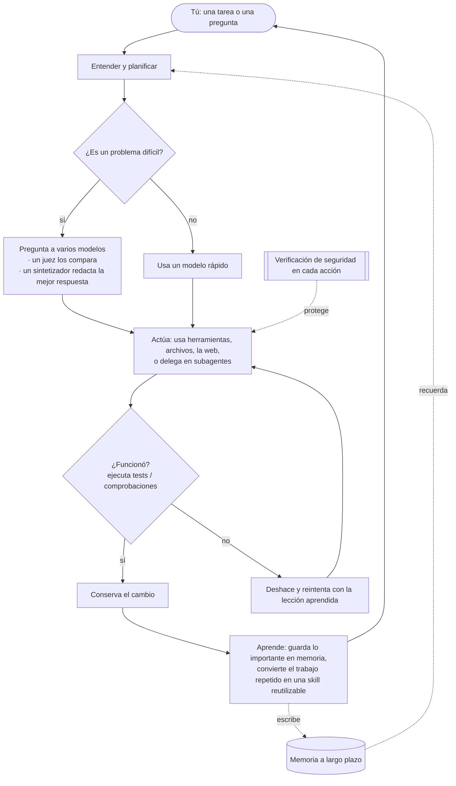

<div align="center">


# Chimera

**El agente auto-evolutivo gobernado — probado y gobernado.**<br/>
<sub>Piensa con muchas mentes, hace el trabajo solo, aprende solo lo comprobado y es seguro por arquitectura.</sub>

[](https://pypi.org/project/chimera-agent/)
[](LICENSE)
[](https://www.python.org/)
[](https://github.com/brcampidelli/chimera-agent/actions/workflows/ci.yml)
[](https://mypy-lang.org/)
[](https://github.com/astral-sh/ruff)
[](https://discord.gg/ACvBbrmguV)
[](https://www.reddit.com/r/ChimeraAgent/)

[](https://donate.stripe.com/9B63cofM491m4SBfe177O00)

<sub><a href="README.md">English</a> · <a href="README.pt-BR.md">Português</a> · <b>Español</b> · <a href="README.de.md">Deutsch</a> · <a href="README.fr.md">Français</a> · <a href="README.zh-CN.md">中文</a> · <a href="README.ja.md">日本語</a></sub>

</div>

La mayoría de los asistentes de IA lo apuestan todo a un **único** modelo y se olvidan de todo cuando
termina la conversación. **Chimera hace dos cosas de forma distinta:** para las preguntas difíciles
consulta a **varios** modelos de IA a la vez y combina sus respuestas en un único resultado más
sólido, y **recuerda y aprende**, así que se vuelve más útil cuanto más lo usas. No solo conversa —
dale un objetivo y planifica, usa herramientas, revisa su propio trabajo y conserva únicamente lo que
de verdad funciona.

> **Gratis y open-source (Apache-2.0), en desarrollo temprano pero activo.** Ya funciona de principio
> a fin: conversa con él, deja que complete tareas por su cuenta, ejecútalo como un bot en tu app de
> mensajería favorita, despliégalo en un servidor para que trabaje 24/7 y míralo aprender de lo que
> hace. Está en **alpha** — sólido y probado a fondo (más de 1000 tests automatizados, verificación de
> tipos estricta y linting en cada cambio), pero todavía no curtido en producción.

---

## Por qué Chimera

Piensa en la mayoría de las herramientas de IA como preguntarle a **un** experto y confiar en que
tenga razón. Chimera es como tener un **panel de expertos** que debaten, un **juez imparcial** que
sopesa sus respuestas y un **redactor** que entrega el mejor resultado combinado — y luego un
compañero de equipo que de verdad **hace el trabajo** y **aprende** de él. Esto es lo que lo hace
especial, en pocas palabras:

- 🧠 **Muchas mentes, una respuesta.** Para las preguntas difíciles, Chimera pregunta lo mismo a varios modelos, deja que un modelo compare sus respuestas y hace que un modelo final redacte la mejor respuesta combinada — así obtienes algo más equilibrado y con menos probabilidad de estar mal que cualquier modelo por sí solo. (Lo hace solo cuando vale la pena, para seguir siendo rápido y económico.)
- 🚀 **Hace el trabajo, no solo habla.** Dale un objetivo. Lo desglosa, usa herramientas, edita archivos, ejecuta los tests y **conserva un cambio solo si pasa**. Si algo se rompe, lo deshace y lo intenta de nuevo — así no deja un desastre atrás.
- 🧬 **Mejora cuanto más lo usas.** Recuerda tus preferencias y datos importantes entre conversaciones, y convierte discretamente las tareas que repite en skills reutilizables. Está diseñado para seguir mejorando en lugar de empeorar poco a poco a lo largo de ejecuciones largas — un problema que degrada silenciosamente a muchos agentes.
- 🛡️ **Seguro por diseño.** Toda acción arriesgada pasa primero por una verificación de seguridad, cualquier acción destructiva pide confirmación, y puede ejecutar código no confiable dentro de un sandbox aislado. (Esas verificaciones son un primer filtro barato, no la frontera real — el sandbox lo es; y el aislamiento en contenedor es opcional. Consulta [SECURITY.md](SECURITY.md).)
- 🔌 **Cualquier modelo, corre donde sea.** Usa grandes modelos alojados en la nube o los tuyos propios en local a través de una única interfaz — en tu portátil o en un servidor de $5, las 24 horas.
- 🧩 **Realmente tuyo.** Open-source, sin ataduras, sin necesidad de una cuenta de proveedor. Tú lo ejecutas, tú lo controlas, puedes cambiar lo que quieras.

## Funcionalidades

### 🧠 Pensar y hacer
- **Combina varios modelos en una respuesta** (`chimera fuse`) — un panel de modelos, un juez que saca a la luz dónde coinciden, dónde discrepan o qué se les escapa, y un sintetizador que redacta la respuesta final. Un enrutador inteligente solo dedica este esfuerzo extra a los problemas difíciles, y cuando los primeros modelos ya coinciden se detiene antes de tiempo — medido en ~20–28% menos tokens sin pérdida de precisión en nuestros benchmarks. (La fusión / mixture-of-agents en sí no es exclusiva nuestra — la encuentras en OpenRouter y otras herramientas; la diferencia aquí es que está integrada en el bucle del agente, detrás de ese enrutador consciente del costo, y está medida, no es un modelo que eliges.)
- **Completa tareas por su cuenta** (`chimera solve`) — planifica, actúa con herramientas y luego **verifica y revierte**: ejecuta tu comprobación (p. ej. tests) y conserva el cambio solo si pasa; de lo contrario lo deshace y reintenta. Opcionalmente trabaja sobre una copia aislada de tu proyecto para que no se toque nada hasta que esté probado.
- **Equipos de especialistas** (`chimera crew`, `chimera crew-isolated`) — varios agentes enfocados en roles se reparten un mismo trabajo. En modo aislado, cada uno trabaja en su **propia copia privada en paralelo**; las ediciones seguras se fusionan, los conflictos se señalan en lugar de sobrescribirse en silencio, y los cambios de un worker defectuoso pueden rechazarse mediante un test por worker. Un supervisor puede reunir el trabajo de todos en un único informe unificado.
- **Delega y explora** — cualquier agente puede pasar una subtarea autocontenida a un **subagente** nuevo que solo informa del resultado, manteniendo limpio el contexto principal. El **Explorador de Contexto** (`chimera explore`) encuentra los archivos y las líneas correctas en un código y devuelve una respuesta breve en lugar de volcarlo todo.

### 🧬 Memoria y automejora
- **Memoria a largo plazo** — mantiene memorias a corto plazo, recientes, factuales y sobre ti, además de un mapa de cómo se relacionan las cosas. Puede guardar memorias en una base de datos de texto completo rápida, llevar un perfil de tus preferencias a cada conversación, fusionar notas duplicadas automáticamente y sugerirte con delicadeza guardar una preferencia cuando mencionas una.
- **Aprende nuevas skills** — cuando tiene éxito en el mismo tipo de tarea más de una vez, lo convierte automáticamente en una skill probada y reutilizable.
- **Autoentrenamiento opcional (avanzado)** — puede registrar su propia experiencia para que luego puedas afinar un modelo a partir de ella. Desactivado por defecto; nada se entrena sin que lo pidas.

### 🔌 Conectar y automatizar
- **Habla con él donde sea** — un chat de terminal, una app de terminal a pantalla completa, o como un bot en **Discord, Telegram, Slack, Signal y WhatsApp**. También hay un endpoint HTTP simple.
- **Programación y proactividad** — dale tareas recurrentes en lenguaje natural ("cada mañana, resume las noticias"). Con el programador integrado en marcha, **actúa a tiempo**, no solo cuando le escribes.
- **Herramientas e integraciones** — lee y escribe archivos, ejecuta comandos de shell, navega por la web y ejecuta código de forma segura en un sandbox. Conecta casi cualquier servicio web (a través de su API) o herramienta externa, e importa tu configuración desde otras herramientas de agentes que ya usas.
- **Con las pilas incluidas** — búsqueda web, generación de imágenes, texto a voz, correo, calendario, ejecución de código y más, listos para activar.

### 🚀 Corre donde sea, con seguridad
- **Cualquier modelo, una interfaz** — modelos alojados en la nube o los tuyos en local, con conmutación automática si uno está caído y rotación entre varias claves.
- **Despliegue en servidor con un comando** — ejecútalo con Docker (o en bare-metal) para que siga activo y se reinicie al arrancar. Consulta **[docs/deploy.md](docs/deploy.md)**.
- **Núcleo de seguridad** — una verificación en cada acción (permitir / advertir / bloquear / preguntar), un contenedor con red aislada **opcional** para código no confiable (`CHIMERA_SANDBOX=docker`; el runner local por defecto *no* está aislado) y un registro de auditoría completo de lo que hizo.

## Inicio rápido

Necesitas **Python 3.11+** y [uv](https://docs.astral.sh/uv/) (un instalador de Python rápido).

**1. Instalar** — desde PyPI:
```bash
pip install chimera-agent
```
Esto te da el comando `chimera`. (Los ejemplos de abajo usan `uv run chimera` para una copia del
repositorio — con pip install, solo ejecuta `chimera …`.) Para trabajar en el propio Chimera, clona el repo:
```bash
git clone https://github.com/brcampidelli/chimera-agent.git
cd chimera-agent
uv sync --extra dev
```

**2. Añade la clave de un proveedor de IA.** Lo más fácil es una clave de [OpenRouter](https://openrouter.ai) — una sola
clave desbloquea más de 100 modelos.
```bash
cp .env.example .env
# abre .env y define, por ejemplo:  CHIMERA_OPENROUTER_KEYS=sk-or-...
```

**3. Comprueba que todo está listo**
```bash
uv run chimera doctor
```

**4. Pruébalo**
```bash
uv run chimera chat                         # mantén una conversación (recuerda)
uv run chimera run "Explain what you can do in 3 bullets"
uv run chimera fuse "What's the best way to learn to cook?" --show-panel   # mira varios modelos combinados
uv run chimera solve "add a hello() function to app.py and a test for it" --verify "pytest -q"
```

**Ejecútalo en un servidor (para que trabaje 24/7):**
```bash
docker compose up -d      # gateway + programador; se reinicia automáticamente
```
Guía completa (Docker o systemd, programación, backups, seguridad): **[docs/deploy.md](docs/deploy.md)**.

## Cómo funciona

Dale a Chimera una tarea; planifica, piensa (combinando modelos cuando el problema es difícil), actúa
con herramientas, **revisa su propio trabajo y conserva solo lo que pasa**, y luego aprende del
resultado — realimentando la memoria y las nuevas skills en la siguiente tarea.



## Comandos

Cada comando es `chimera <nombre>` (o `uv run chimera <nombre>` antes de instalar).

```bash
chimera doctor / models / features    # comprueba la configuración, lista modelos, mira capacidades opcionales
chimera chat                          # asistente interactivo que recuerda entre turnos
chimera tui                           # app de terminal a pantalla completa
chimera run "PROMPT" --image pic.png  # respuesta de un disparo (puede leer una imagen)
chimera fuse "PROMPT" --show-panel    # combina varios modelos: panel -> juez -> sintetizador
chimera solve "TASK" --verify "pytest -q" --isolate   # haz una tarea; conserva el cambio solo si pasa la comprobación
chimera crew "TASK" --mode supervisor         # un equipo de especialistas aborda una tarea
chimera crew-isolated "TASK" -W "name:role" --verify "..." --synthesize   # equipo, cada uno en su propia copia aislada
chimera explore "where is login handled?"     # encuentra los archivos/líneas correctos, obtén una respuesta breve
chimera deliver "a launch plan" -o plan.md    # produce un documento pulido
chimera serve --cron [--discord|--telegram|--slack|--signal]   # ejecuta como servicio: bot de chat + programador
chimera cron add "brief" "0 8 * * *" "Summarize the news"       # programa trabajo recurrente
chimera memory add / graph / consolidate      # memoria a largo plazo: guarda, relaciona, ordena
chimera kanban add/board/run                   # un tablero de tareas que despacha trabajo al agente
chimera workflow flow.yaml                     # ejecuta una automatización repetible descrita en un archivo
chimera migrate <source> <dir> --apply         # importa configuración, skills y memoria de otra herramienta de agentes
chimera evolve status / tune / recipe          # opcional: autooptimización; prepara datos para afinar un modelo
chimera fusion-bench / skillcard-bench / schema-bench / sandbox-bench   # benchmarks A/B honestos: mide coste, calidad y efectos secundarios antes de confiar en una funcionalidad
chimera pet new --name Chimi                   # adopta un pequeño compañero virtual :)
```

Consulta la **[Guía de Uso](docs/usage.md)** para cada comando con ejemplos copy-paste.

## Arquitectura

Chimera es un paquete de Python con partes claramente separadas, para que puedas entender o ampliar
cualquier pieza por su cuenta:

```
chimera/
  core/          el bucle del agente: planificar, actuar, verificar, conservar-o-deshacer, y copias de trabajo aisladas
  fusion/        el motor de "muchas mentes": panel -> juez -> sintetizador + el enrutador inteligente
  memory/        memoria a corto plazo / reciente / factual / sobre ti + un grafo de relaciones
  skills/        la biblioteca de skills integrada y cómo se encuentran las skills relevantes
  evolution/     aprender nuevas skills a partir del éxito, y la experiencia de la que aprende
  governance/    el núcleo de seguridad (permitir/advertir/bloquear/preguntar), registro de auditoría y controles de cambio
  orchestration/ equipos de agentes: roles, crews, workers aislados en paralelo, informes unificados
  ecosystem/     automejora avanzada: agentes que diseñan agentes, entrenamiento de modelo opcional
  kanban/        un tablero de tareas que entrega tarjetas al agente
  workflow/      describe una automatización repetible en un archivo simple y ejecútala
  tools/         herramientas integradas (archivos, shell, web, búsqueda) + ejecución de código
  sandbox/       ejecuta herramientas en local o dentro de un contenedor aislado
  integrations/  conecta herramientas externas y cualquier API web
  scheduler/     tareas recurrentes + el daemon que las dispara a tiempo
  migration/     trae tu configuración desde otras herramientas de agentes
  providers/     una interfaz para cada modelo, con fallback y rotación de claves
  interface/     el motor de conversación compartido (usado por chat, la app y los bots)
  server/        el gateway de mensajería y el endpoint HTTP
  cli/           el comando `chimera`
```

Consulta [docs/architecture.md](docs/architecture.md) para el diseño completo.

## Visión y objetivos

**El objetivo de Chimera es simple: un agente de IA que cualquiera pueda ejecutar, que razone mejor
combinando muchos modelos en lugar de confiar en uno, que de verdad mejore cuanto más se usa, y que
se mantenga seguro y totalmente abierto por el camino.**

La mayoría de las herramientas de IA de hoy son o bien inteligentes-pero-olvidadizas (pierden todo
cuando termina la conversación) o capaces-pero-cerradas (no las controlas). Y muchas que intentan
"mejorarse a sí mismas" empeoran silenciosamente a lo largo de ejecuciones largas. Chimera es nuestro
intento de un camino distinto:

- **Mejor razonamiento, no una factura más alta** — combina varios modelos solo cuando ayuda, así la calidad sube sin desperdicio.
- **Memoria real y skills reales** — recuerda lo importante y convierte el trabajo repetido en habilidades reutilizables.
- **Mejora que perdura** — resiste la lenta degradación que deteriora a otros agentes, revisando su propio trabajo y guardando el estado de forma segura fuera del modelo.
- **Seguro y transparente** — cada acción es verificable, y las destructivas preguntan primero.
- **Abierto para todos** — gratis, con licencia Apache-2.0, impulsado por la comunidad, sin ataduras.

Es temprano (alpha), y la honestidad nos importa: todavía no está probado en uso intensivo de
producción. Si esa visión te entusiasma, nos encantaría tu ayuda para llegar allí.

## Desarrollo

```bash
git clone https://github.com/brcampidelli/chimera-agent.git
cd chimera-agent
uv sync --extra dev

uv run ruff check .      # estilo/lint
uv run mypy chimera      # verificación de tipos estricta
uv run pytest -q         # la suite de tests
```

Las contribuciones son muy bienvenidas — código, documentación, ideas, reportes de errores. Empieza
con [CONTRIBUTING.md](CONTRIBUTING.md) y nuestro [Código de Conducta](CODE_OF_CONDUCT.md).
¿Encontraste un problema de seguridad? Consulta [SECURITY.md](SECURITY.md).

## Comunidad

¿Tienes una pregunta, una idea, o quieres contribuir? **[Únete a nosotros en Discord](https://discord.gg/ACvBbrmguV)** — todos son bienvenidos.

¿Prefieres Reddit? Sigue **[r/ChimeraAgent](https://www.reddit.com/r/ChimeraAgent/)** para novedades y debates.

## Apóyanos

Chimera es gratuito y de código abierto, desarrollado de forma abierta. Si te resulta útil, puedes ayudar a financiar su desarrollo con una donación — cada aporte cuenta y se agradece muchísimo. 💜

**[💜 Donar con Stripe](https://donate.stripe.com/9B63cofM491m4SBfe177O00)**

## Licencia

[Apache-2.0](LICENSE) — libre de usar, cambiar y construir sobre él.
