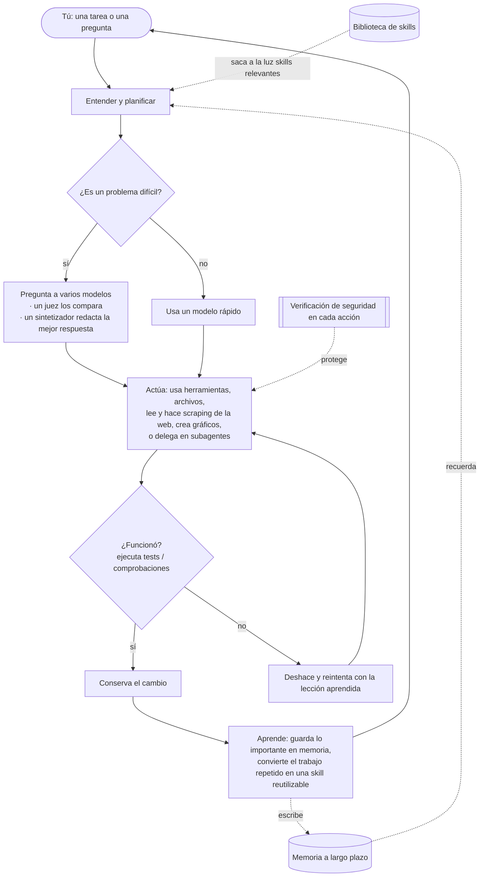

<div align="center">


# Chimera

**El agente auto-evolutivo gobernado — probado y gobernado.**<br/>
<sub>Piensa con muchas mentes, hace el trabajo real por su cuenta, aprende solo lo comprobado y es seguro por arquitectura.</sub>

[](https://chimeraagent.space)
[](https://pypi.org/project/chimera-agent/)
[](LICENSE)
[](https://www.python.org/)
[](https://github.com/brcampidelli/chimera-agent/actions/workflows/ci.yml)
[](https://mypy-lang.org/)
[](https://github.com/astral-sh/ruff)
[](https://discord.gg/ACvBbrmguV)
[](https://www.reddit.com/r/ChimeraAgent/)

[](https://buy.stripe.com/9B6aEQ57q91m1Gp7Lz77O01)

<sub><a href="README.md">English</a> · <a href="README.pt-BR.md">Português</a> · <b>Español</b> · <a href="README.de.md">Deutsch</a> · <a href="README.fr.md">Français</a> · <a href="README.it.md">Italiano</a> · <a href="README.pl.md">Polski</a> · <a href="README.zh-CN.md">中文</a> · <a href="README.ja.md">日本語</a> · <a href="README.ru.md">Русский</a></sub>

</div>

La mayoría de los asistentes de IA lo apuestan todo a un **único** modelo y se olvidan de todo cuando
termina la conversación. **Chimera hace dos cosas de forma distinta:** para las preguntas difíciles
consulta a **varios** modelos de IA a la vez y combina sus respuestas en un único resultado más
sólido, y **recuerda y aprende**, así que se vuelve más útil cuanto más lo usas. No solo conversa —
dale un objetivo y planifica, usa herramientas, revisa su propio trabajo y conserva únicamente lo que
de verdad funciona.

> **Gratis y open-source (Apache-2.0), en desarrollo temprano pero activo.** Ya funciona de principio
> a fin: conversa con él, deja que complete tareas por su cuenta, ejecútalo como un bot en tu app de
> mensajería favorita, despliégalo en un servidor para que trabaje 24/7 y míralo aprender de lo que
> hace. Está en **alpha** — sólido y probado a fondo (**más de 2.800 tests automatizados**, verificación
> de tipos estricta y linting en cada cambio), pero todavía no curtido en producción.

---

## Por qué Chimera

Piensa en la mayoría de las herramientas de IA como preguntarle a **un** experto y confiar en que
tenga razón. Chimera es como tener un **panel de expertos** que debaten, un **juez imparcial** que
sopesa sus respuestas y un **redactor** que entrega el mejor resultado combinado — y luego un
compañero de equipo que de verdad **hace el trabajo** y **aprende** de él. Esto es lo que lo hace
especial, en pocas palabras:

- 🧠 **Muchas mentes, una respuesta.** Para las preguntas difíciles, Chimera pregunta lo mismo a varios modelos, deja que un modelo compare sus respuestas y hace que un modelo final redacte la mejor respuesta combinada — así obtienes algo más equilibrado y con menos probabilidad de estar mal que cualquier modelo por sí solo. (Lo hace solo cuando vale la pena, para seguir siendo rápido y económico.)
- 🚀 **Hace el trabajo, no solo habla.** Dale un objetivo. Lo desglosa, usa herramientas, edita archivos, ejecuta los tests y **conserva un cambio solo si pasa**. Si algo se rompe, lo deshace y lo intenta de nuevo — así no deja un desastre atrás.
- 🧬 **Recuerda, y está construido para seguir mejorando.** Recuerda tus preferencias y datos importantes entre conversaciones, y convierte discretamente las tareas que repite en skills reutilizables, resistiendo la lenta degradación que deteriora a muchos agentes a lo largo de ejecuciones largas. **Advertencia honesta:** que ese aprendizaje acumulado lo haga mediblemente *mejor en las tareas* no está demostrado — siete ejecuciones pre-registradas no encontraron ningún efecto significativo, y retractamos el único positivo que no se replicó ([`bench/learning_lift/RESULTS.md`](bench/learning_lift/RESULTS.md)).
- 🛡️ **Seguro por diseño.** Toda acción arriesgada pasa primero por una verificación de seguridad, cualquier acción destructiva pide confirmación, y el código no confiable puede ejecutarse en un contenedor blindado y sin red. (Esas verificaciones son un primer filtro barato, no la frontera real — el sandbox lo es; y el aislamiento en contenedor es opcional. Consulta [SECURITY.md](SECURITY.md).)
- 🔌 **Cualquier modelo, corre donde sea.** Usa grandes modelos alojados en la nube o los tuyos propios en local a través de una única interfaz — en tu portátil o en un servidor de $5, las 24 horas.
- 🧩 **Realmente tuyo.** Open-source, sin ataduras, sin necesidad de una cuenta de proveedor. Tú lo ejecutas, tú lo controlas, puedes cambiar lo que quieras.

## Cómo se compara Chimera

Chimera no intenta superar en *canales* a los gigantescos proyectos de agentes. Apuesta por las tres
cosas que un verdadero estudio de ingeniería inversa de cinco líderes (OpenClaw, Hermes, nanobot,
CrewAI, LangGraph) descubrió que **todos dejan abiertas** — y las convierte en su núcleo:

- 🧬 **Auto-evolución con una señal de aptitud.** Los demás "aprenden" añadiendo lo que sea que ocurrió, o mediante pull requests humanos — nada mide si un cambio aprendido realmente ayudó. Chimera conserva un cambio **solo cuando un resultado verificado demuestra que lo hizo**: el paso de evolución está condicionado al diff real del árbol de trabajo y a un A/B honesto, nunca a la palabra del modelo. Evidencia independiente de que esto importa: [EvoAgentBench (arXiv 2607.05202)](https://arxiv.org/abs/2607.05202) midió que los métodos de codificación de experiencia *automáticos* y sin control producen habitualmente **transferencia negativa** — un método popular retrocedió **−12,3 puntos** en tareas para las que no fue ajustado. El control de Chimera ahora también ejecuta un **holdout de transferencia**: un cambio aprendido no debe empeorar un segmento disjunto de la misma capacidad antes de promoverse, de modo que no pueda simplemente memorizar su propia evaluación.
- 🛡️ **Seguridad por arquitectura.** La inyección de prompts ahora se considera ampliamente *imparcheable*; los agentes populares la mitigan en la capa de aplicación o la declaran fuera de alcance (uno lanzó 135k instancias expuestas públicamente y un marketplace ~12% lleno de skills maliciosas). Chimera incorpora una capa de defensa real — **opcional con `--taint`, desactivada por defecto**: rastrea la procedencia de la contaminación de forma *heurística* (flujo de referencia/contenido literal, **no** dataflow real — un modelo que parafrasea el texto contaminado lo "lava"), elimina los tokens de control del contenido no confiable, restringe el acceso a herramientas peligrosas durante el resto de una ejecución contaminada y protege los reintentos con efectos secundarios; el código no confiable se ejecuta en un contenedor blindado, opcional. En el corpus incorporado de **7 ataques**, **6 de 7** llamadas dañinas son bloqueadas (**~14%** aún pasan) — medido sobre un agente **ya inyectado** que intenta la llamada del atacante, sin modelo en el circuito. Esa tasa de bloqueo nunca se publica sola: el mismo informe lleva cuánto trabajo *legítimo* rechaza ese estrechamiento, medido sobre un corpus benigno que activa la misma superficie, y la compuerta no lee una mitad sin la otra (`chimera redteam` imprime las dos — una defensa puntuada solo con ataques tiene un máximo trivial: rechazarlo todo). El brazo sin defensa es 100% por construcción, no por medición: una herramienta sin wrapper siempre se ejecuta, así que trátalo como el piso definicional contra el que se compara esta capa, no como un sistema de referencia. Esto no dice nada sobre lo fácil que es inyectar el modelo — la mitad más difícil, aún abierta ([`chimera/eval/injection.py`](chimera/eval/injection.py)). [`SECURITY.md`](SECURITY.md) dice con claridad qué sigue pasando (traspaso entre subagentes, fusión/resumen, puntos de entrada fuera de la CLI): la frontera de contención es el sandbox; esta capa es defensa en profundidad sobre él.
- 📊 **Benchmarks honestos y publicados.** ~20% de los casos "resueltos" de un leaderboard popular en realidad están mal. Chimera reporta cada número con un intervalo de confianza — **incluidas las ejecuciones en las que no ganó** —, nunca vuelve a tirar los dados en busca de significancia, y retracta sus propias afirmaciones cuando una replicación las mata. Los números, los nulos y las retractaciones están todos en [Benchmarks](#benchmarks-honestos).

**En una línea: el agente auto-evolutivo gobernado — probado y gobernado.** Está en alpha, y lo dice.

## Benchmarks (honestos)

Cuatro resultados registrados, publicados juntos a propósito: dos que sostienen la tesis (uno
significativo solo al agruparlos), uno que salió en nuestra contra y uno que retractamos. (También
aparecen en la pantalla **Madurez y Benchmarks** de la app de escritorio, directamente desde el
snapshot incluido — esa pantalla informa de la cobertura del propio proyecto, así que solo se
renderiza bajo el servidor de desarrollo de Vite (`npm --prefix apps/desktop run dev`). `chimera app`
sirve la compilación de producción y no la muestra; un instalador nativo, tampoco.)

- **Elevación de un modelo débil (significativa).** Un modelo barato (`mistral-small-3.2-24b`) + el
  bucle de reintento de Chimera frente al mismo modelo solo, en una **suite pre-registrada de n=100**
  (diseño y tareas comiteadas y publicadas antes de cualquier llamada al modelo): **48,0% → 71,0%
  (+23,0pp)**, IC 95% pareado **[+12,6%, +28,6%] — estadísticamente significativo** (el IC excluye 0),
  a partir de **28 tareas que el bucle recuperó** (fallo crudo → aprobado verificado) frente a 5
  regresiones. Un modelo, una semilla/tarea, tareas Python pequeñas y autocontenidas — **NO** es
  SWE-bench y no generaliza a repositorios reales. Una ejecución, sin re-roll.
  **Esto sustituye a una ejecución anterior de la misma suite** (9,0% → 15,0%, +6,0pp) cuyo harness
  calificaba con un archivo de test que el agente bajo prueba podía editar. Al repetirla con el test
  original restaurado se pilló al agente reescribiendo su propio test de calificación en una tarea —
  o sea, el agujero era real — y la elevación se replicó *mayor*, no menor. La afirmación de la
  ejecución anterior de que "85 de las 100 tareas son lo bastante difíciles como para fallar en ambos
  brazos" tampoco se sostuvo: la repetición mide 24. La errata completa, la evidencia de manipulación
  preservada y lo que no pudo re-verificarse están en
  [`bench/local_lift/RESULTS.md`](bench/local_lift/RESULTS.md).
  Fuente: [`bench/local_lift/_reverify_n100/paired.json`](bench/local_lift/_reverify_n100/paired.json), [`PREREGISTRATION.md`](bench/local_lift/PREREGISTRATION.md).
- **SWE-bench Verified — la evidencia externa más fuerte, y sobrevivió a una replicación diseñada para
  matarla.** Cuatro ejecuciones pre-registradas sobre porciones de `django/django`, calificadas
  **únicamente** por el harness oficial `swebench` 4.1.0 en Docker — nunca auto-reportadas.

  | ejecución | porción | baseline | + Chimera | Δ pareado | IC 95% | |
  |---|---|---|---|---|---|---|
  | 1 (`max_steps=8`) | 19 | 36,8% | 36,8% | +0,0% | [−8,5%, +8,5%] | ns |
  | 2 (`max_steps=30`) | las mismas 19 | 42,1% | 57,9% | +15,8% | [−1,9%, +15,8%] | ns |
  | **3 (replicación)** | **41 inéditas** | 34,1% | 43,9% | **+9,8%** | [−3,5%, +16,7%] | ns |
  | agrupado *(secundario)* | 60 | 36,7% | 48,3% | **+11,7%** | **[+0,8%, +16,4%]** | **significativo** |

  El +15,8% de la ejecución 2 fue un 3–0 en tres pares informativos, y la pre-registración le daba
  **una probabilidad de una entre tres de ser exactamente eso — una muestra afortunada**, con la
  retractación pre-comprometida. La ejecución 3 lo probó en **41 instancias cuyos resultados nunca
  habíamos visto**, sin cambiar nada más. El efecto **reapareció** (+9,8%, dentro de la banda
  registrada de +5 a +20) en una porción que resultó *más difícil* que la de la ejecución 2. Entre
  ambas, los pares discordantes quedan **9 a favor de Chimera contra 2** (p ≈ 2,6% bajo la hipótesis
  nula).

  **El mecanismo se replicó, y es la parte interesante.** Una cuarta ejecución restauró el brazo
  intermedio (scaffold puro, sin la compuerta de diff) sobre las mismas 41 instancias, de modo que los
  tres difieren en exactamente un componente. Los tres **editan al mismo ritmo** (27–28 parches de 41);
  lo que cambia es con qué frecuencia la edición es *correcta*:

  | brazo | resueltas | **precisión cuando editó** |
  |---|---|---|
  | baseline | 14/41 | 50% |
  | + scaffold | 16/41 | 59% |
  | + scaffold **y** compuerta de diff | 18/41 | 67% |

  **Ambos componentes contribuyen, en mitades aproximadamente iguales** (+4,9% cada uno, ninguno
  significativo por separado) — lo que **contradice nuestra propia predicción registrada** de que el
  scaffold cargaría con la mayor parte, y retira una lectura de la ejecución 2 según la cual la
  compuerta de diff "no es lo que produjo la ganancia". La retractación está en
  [`RESULTS.md`](bench/swe_bench/RESULTS.md); la aditividad tan limpia *no* se reclama como un reparto
  50/50 medido, ya que cada comparación se apoya en 5–6 pares discordantes.

  ⚠️ Léelo con honestidad: **el primario fuera de muestra NO es significativo.** El número
  significativo es el **secundario agrupado**, pre-registrado como secundario precisamente porque
  mezcla datos vistos con inéditos — no se asciende a titular ahora que ha cruzado la línea. Y
  **48,3% NO es una puntuación de SWE-bench Verified**: es una porción deliberadamente fácil, de un
  solo repositorio; una puntuación real necesita las 500 completas. El cero exacto de la ejecución 1
  se publica sin cambios, y la ejecución 2 trajo la **retractación que se ganó** (el mecanismo que
  habíamos alegado para sus parches vacíos era erróneo — la cura era el presupuesto de pasos).
  Fuente: [`bench/swe_bench/RESULTS.md`](bench/swe_bench/RESULTS.md), [`PREREGISTRATION.md`](bench/swe_bench/PREREGISTRATION.md).
- **Terminal-Bench (humillante).** A/B pre-registrado con N=40 sobre el benchmark oficial, mismo
  modelo en ambos brazos (`deepseek-chat-v3.1`): **7,5% → 2,5%** con el scaffold, **Δ pareado −5,0pp,
  IC 95% [−5,0%, +1,6%] — no significativo**. El scaffold **no elevó a un modelo ya competente** (no es
  el régimen débil de "goldilocks" donde el scaffolding ayuda); ambos brazos se sitúan en un suelo
  dominado por la varianza. Fuente: [`bench/terminal_bench/RESULTS.md`](bench/terminal_bench/RESULTS.md).
- **¿Ayuda el aprendizaje acumulado? Siete ejecuciones dicen: no de forma demostrable (y un positivo
  fue retractado).** El volante — skills condicionadas a la recurrencia + una prueba de transferencia,
  tarjetas de antipatrón, memoria persistente — se midió en **siete ejecuciones pre-registradas**. La
  ejecución 6 produjo el único positivo de la serie (+6,7% significativo en la métrica de
  transferencia dentro de la familia); **la ejecución 7, con más potencia estadística, lo redujo a
  +2,0% y no significativo — así que fue retractado**, exactamente como se había comprometido en la
  pre-registración. El veredicto honesto: **ninguna ejecución con potencia adecuada muestra que el
  aprendizaje acumulado mejore el éxito en las tareas**, y el cuello de botella es el instrumento —
  tres intentos de escribir una suite que cayera en la franja informativa del 40–60% salieron todos
  en 84–92%. "Mejora cuanto más lo usas" sigue **sin evidencia**.
  Fuente: [`bench/learning_lift/RESULTS.md`](bench/learning_lift/RESULTS.md).

Significativo internamente (en nuestra propia suite difícil). En repositorios reales, **replicado
fuera de muestra y significativo solo al agrupar** — la etiqueta honesta, no la halagadora.
Humillante en Terminal-Bench. La afirmación sobre el aprendizaje está **retractada**. Publicamos todo,
escribimos de antemano la rama en la que el resultado mata nuestra propia afirmación *antes* de
ejecutar, y no repetimos ejecuciones buscando significancia — eso sería p-hacking.

## Economía de tokens — medida, no proclamada

Dos instintos de "más modelos = mejor", puestos a prueba en ejecuciones reales (predicciones
registradas *antes* de cada ejecución, victorias **y** derrotas publicadas — ver [`bench/`](bench/)):

**La fusión es reservada, no la opción por defecto.** En una suite de razonamiento de 12 tareas, el
nivel medio por sí solo obtuvo 100% con 846 tokens; la fusión completa también obtuvo 100% — por
**9.526 tokens (~11×)**. Así que la fusión queda detrás de una cascada barato→control→medio→fusión
que escala solo cuando falla un control gratuito, alcanzando calidad ~media a ~1/12 del costo de la
fusión. Su propio criterio registrado — *cascada ≥ tasa de aprobación del nivel medio a un costo
materialmente menor* — **no se cumplió**: la cascada aterrizó en 91,7% frente al 100% del nivel
medio, porque en esta suite el nivel medio ya satura y no deja margen. El único fallo es
instructivo: una compuerta léxica gratuita no puede pillar una respuesta segura-pero-equivocada
([`bench/cascade/RESULTS.md`](bench/cascade/RESULTS.md)).

**La orquestación jerárquica gana solo donde debe — y por una ley que podemos escribir.**
`chimera orchestrate` reparte una tarea entre workers acotados en lugar de un único gran contexto.
Un solo agente reenvía cada documento en cada turno; los workers acotados leen cada uno una vez. Así
que el ahorro de tokens escala como **(D−1)/D** en el número de documentos D — confirmado en
ejecuciones reales a <0,2%:

| documentos (D) | ahorro de tokens medido | (D−1)/D |
|---|---|---|
| 2 | 49,9% | 50% |
| 3 | 66,7% | 66,7% |
| 4 | 74,8% | 75% |
| 5 | 79,9% | 80% |

El ahorro se mantiene plano a medida que la conversación se alarga y crece con el tamaño del
documento hacia el mismo límite ([barrido completo, 3 ejes](bench/hierarchy_sweep/README.md)). Y
donde *no* compensa — una tarea de un solo disparo con un turno — el clasificador lo detecta y
**recurre a un único agente** (esa ejecución costó +47% más tokens; también la publicamos).

**El asterisco honesto.** Estos son conteos de *tokens*. Con el prompt caching, un proveedor factura
los documentos repetidos del único agente a ~0,1×, así que la victoria en *dólares* es menor — y
pasados unos pocos turnos puede **invertirse** (los workers independientes vuelven a pagar el
contexto frío que el único agente cachea). Publicamos el
[modelo que cuantifica esto](bench/hierarchy_sweep/cache_cost.py) en lugar de proclamar
silenciosamente el número de tokens como si fuera un número en dólares.

## Funcionalidades

### 🧠 Pensar y hacer
- **Combina varios modelos en una respuesta** (`chimera fuse`) — un panel de modelos, un juez que saca a la luz dónde coinciden, dónde discrepan o qué se les escapa, y un sintetizador que redacta la respuesta final. Un enrutador inteligente solo dedica este esfuerzo extra a los problemas difíciles, y cuando los primeros modelos ya coinciden se detiene antes de tiempo — medido en **~20–28% menos tokens** en nuestros benchmarks — con la precisión entre 0 y −8,3pp en tres ejecuciones, una oscilación que leemos como no determinismo del modelo porque cae por completo en el grupo escalado, donde selectivo y completo ejecutan el mismo pipeline. (La fusión / mixture-of-agents en sí no es exclusiva nuestra — la encuentras en OpenRouter y otras herramientas; la diferencia aquí es que está integrada en el bucle del agente, detrás de ese enrutador consciente del costo, y está medida, no es un modelo que eliges.)
- **Completa tareas por su cuenta** (`chimera solve`) — planifica, actúa con herramientas y luego **verifica y revierte**: ejecuta tu comprobación (p. ej. tests) y conserva el cambio solo si pasa; de lo contrario lo deshace y reintenta. Opcionalmente trabaja sobre una copia aislada de tu proyecto para que no se toque nada hasta que esté probado. **Y un párrafo convincente no es una solución:** sin un `--verify` al que apelar, una ejecución que no cambió nada en disco se reporta como fallo, no como éxito — porque lo único que quedaría juzgándola sería un modelo leyendo prosa, que nunca ve el diff. Cada intento registra *quién* lo aprobó (`verifier` / `diff+manager` / `diff` / `manager` / `none`), así que un recibo nunca dice "éxito" sin nombrar la autoridad detrás.
- **Equipos de especialistas** (`chimera crew`, `chimera crew-isolated`) — varios agentes enfocados en roles se reparten un mismo trabajo. En modo aislado, cada uno trabaja en su **propia copia privada en paralelo**; las ediciones seguras se fusionan, los conflictos se señalan en lugar de sobrescribirse en silencio, y los cambios de un worker defectuoso pueden rechazarse mediante un test por worker. Un supervisor puede reunir el trabajo de todos en un único informe unificado.
- **Delega y explora** — cualquier agente puede pasar una subtarea autocontenida a un **subagente** nuevo que solo informa del resultado, manteniendo limpio el contexto principal. El **Explorador de Contexto** (`chimera explore`) encuentra los archivos y las líneas correctas en un código y devuelve una respuesta breve en lugar de volcarlo todo.

### 🧬 Memoria y automejora
- **Memoria a largo plazo** — mantiene memorias a corto plazo, recientes, factuales y sobre ti, además de un mapa de cómo se relacionan las cosas. Puede guardar memorias en una base de datos de texto completo rápida, llevar un perfil de tus preferencias a cada conversación, fusionar notas duplicadas automáticamente y sugerirte con delicadeza guardar una preferencia cuando mencionas una.
- **Aprende nuevas skills** — cuando tiene éxito en el mismo tipo de tarea más de una vez, lo convierte automáticamente en una skill probada y reutilizable.
- **Una biblioteca de skills curada que puedes leer y ampliar** — 23 tarjetas de skill en [`skills/`](skills/), 13 de ellas escritas a partir de los incidentes del propio proyecto. Una tarjeta es **datos, no código**: frontmatter más `Trigger` / `Do` / `Avoid` / `Check` / `Risk`, y no ejecuta nada — el agente la lee dentro del prompt cuando una tarjeta encaja, **opcional con `--skill-cards` (o `CHIMERA_SKILL_CARDS=1`), desactivado por defecto**: el A/B registrado que habría activado esa lectura volvió con +16,7pp pero *no significativo* y con +300% de tokens, así que suspendió su propia compuerta de cambio y se quedó apagado ([`bench/skillcard/RESULTS.md`](bench/skillcard/RESULTS.md)). Están agrupadas por el punto del trabajo en el que aplican (`define` · `build` · `verify` · `review` · `ship`), con descripción, cuerpo y chips de disparo traducidos a nueve idiomas — mantenidos honestos por un test que falla ante una traducción que se ha quedado obsoleta o está a medias. Importa una con `chimera skills-import skills/<nombre>`. Es además el sitio con menor barrera para contribuir: revisar tu pull request es leer una página de markdown, no auditar un diff ([`skills/README.md`](skills/README.md)).
- **Autoentrenamiento opcional (avanzado)** — puede registrar su propia experiencia para que luego puedas afinar un modelo a partir de ella. Desactivado por defecto; nada se entrena sin que lo pidas.

### 📏 Un bucle que se puede medir — y que avisa cuando se ha perdido
Un agente es un modelo **más todo lo que lo rodea**. Esa maquinaria de alrededor es lo que decide si
una ejecución larga sigue siendo útil, y casi todo en ella es invisible hasta que falla. Chimera mide
la suya:

- **Cada ejecución deja un recibo.** Una línea JSONL por ejecución en `traces.jsonl`: tokens por paso, las herramientas llamadas con lo que devolvieron, dónde se descartó el historial — y la **tasa de acierto de caché**, la porción de tokens de prompt que el proveedor sirvió desde caché. Ese es el número de coste real del bucle (un token cacheado cuesta alrededor de una décima parte de uno nuevo, así que recuentos idénticos pueden diferir ~10× en precio) *y* una alarma de diseño: se desploma cada vez que algo reescribe el principio del prompt, lo cual no tiene otro síntoma. Un proveedor que no informa de caché se lee como **desconocido**, nunca como fallo.
- **Se da cuenta de cuándo ha dejado de llegar a algún sitio.** Dos cosas distintas se llaman "problema de contexto": la atención diluyéndose dentro de un prompt largo, y una *trayectoria* que en silencio deja de acumular y empieza a dar vueltas — cada paso individual bien, la ejecución entera sin ir a ninguna parte. El detector de bucles de Chimera pilla la versión estrecha (una ventana de 12 llamadas); una ejecución que revisita los mismos tres archivos cada veinte turnos la atraviesa sin saltar. Por eso hay un segundo detector que compara la **primera mitad de la ejecución con la segunda**: trabajo re-derivado que ya tenía, fallos subiendo, o redundancia disparándose justo después de descartar historial. **Informa y no actúa** — parar, re-planificar y forzar compactación son curas plausibles y no tenemos evidencia de cuál ayuda, así que elegir una incrustaría justo la suposición no medida que este trabajo existe para eliminar.
- **Las ejecuciones largas sobreviven a su propio contexto.** Agotar la ventana solía terminar la ejecución de golpe, lo que convertía a la ventana — y no a la dificultad de la tarea — en el techo real. La compactación ahora deja intacto el mensaje de sistema (es el prefijo estable sobre el que se ancla toda la caché de prompt), nunca deja un resultado de herramienta huérfano de su llamada, y **restaura lo que la ejecución necesita para seguir siendo ella misma**: el archivo abierto, el plan, la lista de tareas, el estado actual. Dice claramente qué descartó en lugar de resumirlo — un agente puede releer un archivo, pero no puede des-creerse un resumen inventado.

### 🔌 Conectar y automatizar
- **Habla con él donde sea** — un chat de terminal, una app de terminal a pantalla completa, o como un bot en **Discord, Telegram, Slack, Signal y WhatsApp**. También hay un endpoint HTTP simple.
- **Programación y proactividad** — dale tareas recurrentes en lenguaje natural ("cada mañana, resume las noticias"). Con el programador integrado en marcha, **actúa a tiempo**, no solo cuando le escribes.
- **Herramientas e integraciones** — lee y escribe archivos, ejecuta comandos de shell, **lee páginas web totalmente renderizadas y hace scraping o rastrea sitios enteros** (con extracción estructurada a prueba de inyección), y ejecuta código de forma segura en un sandbox. Conecta casi cualquier servicio web (a través de su API) o herramienta externa — incluido cualquier **servidor MCP** ([guía + ejemplo ejecutable](docs/mcp.md)) — e importa tu configuración desde otras herramientas de agentes que ya usas.
- **Con las pilas incluidas** — búsqueda web, generación de imágenes (alojada **o totalmente local**), **voz a texto** y texto a voz, **descarga de medios**, **análisis de datos y gráficos**, correo, calendario, ejecución de código y más, listos para activar.

### 🚀 Corre donde sea, con seguridad
- **Cualquier modelo, una interfaz** — modelos alojados en la nube o los tuyos en local, con conmutación automática si uno está caído y rotación entre varias claves.
- **Despliegue en servidor con un comando** — ejecútalo con Docker (o en bare-metal) para que siga activo y se reinicie al arrancar. Consulta **[docs/deploy.md](docs/deploy.md)**.
- **Núcleo de seguridad** — una verificación en cada acción (permitir / advertir / revisar / bloquear), un contenedor con red aislada **opcional** para código no confiable (`CHIMERA_SANDBOX=docker`; el runner local por defecto *no* está aislado) y un registro de auditoría completo de lo que hizo. Que un veredicto de `review` se detenga a preguntarte o simplemente rechace lo decide el modo de aprobación (`CHIMERA_APPROVAL_MODE=ask|deny|allow`) — sin nadie delante, rechaza en vez de inventarse tu consentimiento.
- **Detente antes de que finalice, cuando leyó algo en lo que no se debe confiar** (`--pause-on-taint`) — una ejecución que consumió contenido no confiable se aparca en lugar de finalizar, y te espera. Puedes aceptar el resultado, aceptar una versión que tú editaste, enviar indicaciones y dejar que lo intente de nuevo, o rechazarlo del todo — desde la terminal *o* desde la app de escritorio. Nada se guarda y nada se aprende hasta que decides, y una pausa nunca se reporta como fallo: no ha llegado a un veredicto, está esperando a una persona.
- **Una app de escritorio que pilota una ejecución, no solo la lanza** — cinco destinos en vez de un menú de quince, en diez idiomas. Inicia una ejecución y vete: el progreso sigue ahí cuando vuelves, la barra de estado nombra lo que el agente está haciendo desde cualquier pantalla, y Detener funciona desde todas. Instaladores nativos para Windows / macOS / Linux en [Releases](https://github.com/brcampidelli/chimera-agent/releases).

## Inicio rápido

Necesitas **Python 3.11–3.13** ([python.org](https://www.python.org/downloads/) — comprueba el tuyo
con `python --version`) y, para una copia del código fuente, [uv](https://docs.astral.sh/uv/) (un
instalador de Python rápido).

**1. Instalar** — desde PyPI:
```bash
pip install chimera-agent
```
Esto te da el comando `chimera`. (Los ejemplos de abajo usan `uv run chimera` para una copia del
repositorio — con pip install, solo ejecuta `chimera …`.) Para trabajar en el propio Chimera, clona el repo:
```bash
git clone https://github.com/brcampidelli/chimera-agent.git
cd chimera-agent
uv sync --extra dev
```

**2. Añade la clave de un proveedor de IA.** Lo más fácil es una clave de [OpenRouter](https://openrouter.ai) — una sola
clave desbloquea más de 100 modelos.
```bash
cp .env.example .env
# abre .env y define, por ejemplo:  CHIMERA_OPENROUTER_KEYS=sk-or-...
```

**3. Comprueba que todo está listo**
```bash
uv run chimera doctor
```

**4. Pruébalo**
```bash
uv run chimera chat                         # mantén una conversación (recuerda)
uv run chimera run "Explain what you can do in 3 bullets"
uv run chimera fuse "What's the best way to learn to cook?" --show-panel   # mira varios modelos combinados
uv run chimera solve "add a hello() function to app.py and a test for it" --verify "pytest -q"
```

**Ejecútalo en un servidor (para que trabaje 24/7):**
```bash
docker compose up -d      # gateway + programador; se reinicia automáticamente
```
Guía completa (Docker o systemd, programación, backups, seguridad): **[docs/deploy.md](docs/deploy.md)**.

**5. Haz algo real en 5 minutos: triaje de correo.** Apunta Chimera a tu bandeja de entrada y obtén
un resumen de diez segundos — solo lectura, clasifica en URGENTE / PERSONAL / NEWSLETTER /
VENTA-FRÍA, y opcionalmente prográmalo cada mañana:
```bash
uv run chimera workflow examples/email_triage/triage.yaml -w ./triage_workspace
```
Configuración + programación diaria + advertencias honestas: **[examples/email_triage/README.md](examples/email_triage/README.md)**.

## 🧰 Qué puede hacer Chimera — y cómo activar cada cosa

¿Recién llegas? Chimera funciona justo después de `pip install chimera-agent` + una clave de IA.
Algunas capacidades (leer documentos, oír audio, hacer gráficos, descargar vídeo…) necesitan un
paquete opcional — llamado **"extra"** — y algunas necesitan una clave de servicio. Esta sección
lista **cada capacidad, exactamente qué instalar y el comando para probarla**. Sin conocimientos previos.

### Actívalo todo de una vez
```bash
pip install 'chimera-agent[full]'     # cada función sin GPU de abajo, en un comando
```
El audio y el vídeo también necesitan **ffmpeg** en tu ordenador:
`macOS: brew install ffmpeg` · `Ubuntu/Debian: sudo apt install ffmpeg` · `Windows: choco install ffmpeg`.
¿Prefieres una instalación ligera? Mantén `pip install chimera-agent` y añade solo los extras que
quieras (mira la columna "Necesita"). **¿Usas Docker? La imagen oficial ya incluye todo lo de abajo.**

### Cada capacidad, punto por punto
**Necesita** = qué añadir: `—` funciona en la instalación básica · `[extra]` = `pip install 'chimera-agent[extra]'` · `clave: X` = una clave de proveedor en `.env`.

| Lo que obtienes | Necesita | Cómo usarlo |
|---|---|---|
| **Chat que te recuerda** | — | `chimera chat` |
| **Hacer una pregunta** | — | `chimera run "explica X en 3 puntos"` |
| **App de terminal a pantalla completa** | — | `chimera tui` |
| **App de escritorio** (código · editor · trabajo · conocimiento · automatización, en 10 idiomas) | `[desktop]` o una descarga | `chimera app`, o descarga un instalador nativo (`.exe`/`.dmg`/`.AppImage`/`.deb`) desde [Releases](https://github.com/brcampidelli/chimera-agent/releases) |
| **Hacer una tarea y conservarla solo si pasa una comprobación** | — | `chimera solve "añade hello() a app.py + un test" --verify "pytest -q"` |
| **Pregúntame antes de finalizar algo que leyó de la web** | — | añade `--pause-on-taint` a `chimera solve` |
| **Ver lo que costó de verdad una ejecución, paso a paso** | — | se escribe solo en `.chimera/traces.jsonl` (o `$CHIMERA_HOME`) |
| **Fusionar varios modelos en una sola respuesta** | — | `chimera fuse "tu pregunta" --show-panel` |
| **Un equipo de agentes especialistas** | — | `chimera crew "tu tarea" --mode supervisor` |
| **Llevar un proyecto entero hasta el final** (pausa antes de pasos arriesgados) | — | `chimera project start spec.yaml -w .` |
| **Ver imágenes** (visión) | clave: Gemini u OpenAI | `chimera run --image foto.jpg "¿qué hay aquí?" --model gemini/gemini-2.0-flash` |
| **Oír audio** (voz → texto) | `[stt]` + ffmpeg | `chimera agent "transcribe reunion.mp3"` |
| **Hablar** (texto → voz) | clave: ElevenLabs u OpenAI | pide a cualquier tarea "lee esto en voz alta a speech.mp3" |
| **Leer documentos** (PDF, Word, Excel → texto) | `[documents]` | `chimera agent "resume informe.pdf"` |
| **Descargar vídeo/audio** (YouTube + 1000+ sitios) | `[media-dl]` + ffmpeg | `chimera agent "descarga el audio de <url>"` |
| **Analizar datos y hacer gráficos** | `[data,viz]` | `chimera agent "carga ventas.csv y grafica los ingresos mensuales"` |
| **Buscar en la web** | clave: Tavily | `chimera agent "busca en la web: la última versión de Python"` |
| **Leer y extraer páginas web reales** (un navegador de verdad) | — | `chimera agent "abre example.com y dime el título"` |
| **Memoria a largo plazo** | — | `chimera memory add "..."` · `chimera memory search "..."` |
| **Aprender skills reutilizables solo** | — | ocurre durante `chimera solve`; lista con `chimera skills-stats` (`chimera skills` lista las integradas) |
| **Usar una tarjeta de skill curada** (23 de ellas, 9 idiomas) | — | `chimera skills-import skills/verify-before-claiming` |
| **Programar trabajo recurrente** | — | `chimera cron add brief "0 8 * * *" "resume las noticias"` |
| **Ejecutar como bot de chat** (Discord/Telegram/Slack/Signal/WhatsApp) | `[messaging]` | `chimera serve --cron --discord` |
| **Conectar cualquier herramienta externa** (MCP) | `[mcp]` | guía: [docs/mcp.md](docs/mcp.md) |
| **Generar imágenes** (en la nube) | clave: OpenAI | pide a una tarea "genera una imagen de …" |
| **Generar imágenes** (100% local, requiere GPU) | `[imagegen-local]` | igual, sin conexión |

> Instala extras individualmente si quieres algo ligero — `messaging`, `mcp`, `documents`, `media-dl`,
> `stt`, `data`, `viz`, `youtube` (todos incluidos en `full`), además de `imagegen-local` y `train` (solo GPU).
> Ejemplo: `pip install 'chimera-agent[documents,stt]'`.

¿Primera vez aquí? Los cuatro pasos de [Inicio rápido](#inicio-rápido) más arriba son toda la
configuración — instalar, una clave, `chimera doctor`, `chimera chat` — y a partir de ahí cualquier
comando de la tabla ya funciona. Referencia completa de comandos con ejemplos para copiar y pegar:
**[docs/usage.md](docs/usage.md)**.

## Cómo funciona

Dale a Chimera una tarea; planifica (sacando a la luz las skills integradas más relevantes), piensa
(combinando modelos cuando el problema es difícil), actúa con herramientas — leyendo y haciendo
scraping de la web, editando archivos, creando gráficos — **revisa su propio trabajo y conserva solo
lo que pasa**, y luego aprende del resultado, realimentando la memoria y las nuevas skills en la
siguiente tarea.


```mermaid
flowchart TD
    U([Tú: una tarea o una pregunta]) --> P[Entender y planificar]
    P --> Q{¿Es un problema difícil?}
    Q -- sí --> FUSION[Pregunta a varios modelos<br/>· un juez los compara<br/>· un sintetizador redacta la mejor respuesta]
    Q -- no --> ONE[Usa un modelo rápido]
    FUSION --> ACT[Actúa: usa herramientas, archivos,<br/>lee y hace scraping de la web, crea gráficos,<br/>o delega en subagentes]
    ONE --> ACT
    ACT --> V{¿Funcionó?<br/>ejecuta tests / comprobaciones}
    V -- sí --> KEEP[Conserva el cambio]
    V -- no --> REVERT[Deshace y reintenta con la lección aprendida]
    REVERT --> ACT
    KEEP --> LEARN[Aprende: guarda lo importante en memoria,<br/>convierte el trabajo repetido en una skill reutilizable]
    LEARN --> U
    MEM[(Memoria a largo plazo)] -. recuerda .-> P
    LEARN -. escribe .-> MEM
    SKILLS[(Biblioteca de skills)] -. saca a la luz skills relevantes .-> P
    GOV[[Verificación de seguridad en cada acción]] -. protege .-> ACT
```

## Comandos

Cada comando es `chimera <nombre>` (o `uv run chimera <nombre>` antes de instalar).

```bash
chimera doctor / models / features    # comprueba la configuración, lista modelos, mira capacidades opcionales
chimera chat                          # asistente interactivo que recuerda entre turnos
chimera tui                           # app de terminal a pantalla completa
chimera run "PROMPT" --image pic.png  # respuesta de un disparo (puede leer una imagen)
chimera fuse "PROMPT" --show-panel    # combina varios modelos: panel -> juez -> sintetizador
chimera solve "TASK" --verify "pytest -q" --isolate   # haz una tarea; conserva el cambio solo si pasa la comprobación
chimera crew "TASK" --mode supervisor         # un equipo de especialistas aborda una tarea
chimera crew-isolated "TASK" -W "name:role" --verify "..." --synthesize   # equipo, cada uno en su propia copia aislada
chimera explore "where is login handled?"     # encuentra los archivos/líneas correctos, obtén una respuesta breve
chimera deliver "a launch plan" -o plan.md    # produce un documento pulido
chimera serve --cron [--discord|--telegram|--slack|--signal]   # ejecuta como servicio: bot de chat + programador
chimera cron add "brief" "0 8 * * *" "Summarize the news"       # programa trabajo recurrente
chimera memory add / graph / consolidate      # memoria a largo plazo: guarda, relaciona, ordena
chimera kanban add/board/run                   # un tablero de tareas que despacha trabajo al agente
chimera workflow flow.yaml                     # ejecuta una automatización repetible descrita en un archivo
chimera orchestrate "TASK" --dry-run           # reparte entre workers acotados; --dry-run no cuesta nada
chimera project start spec.yaml -w .           # lleva un proyecto entero hasta el final, preguntando antes de los pasos arriesgados
chimera skills-import skills/<nombre>          # carga una tarjeta de skill curada (datos, no código)
chimera skills-stats / skills-pending          # skills aprendidas: uso, tasa de acierto, lo que espera revisión
chimera migrate <source> <dir> --apply         # importa configuración, skills y memoria de otra herramienta de agentes
chimera evolve status / tune / recipe          # opcional: autooptimización; prepara datos para afinar un modelo
chimera fusion-bench / skillcard-bench / schema-bench / sandbox-bench   # benchmarks A/B honestos: mide coste, calidad y efectos secundarios antes de confiar en una funcionalidad
chimera pet new --name Chimi                   # adopta un pequeño compañero virtual :)
```

Consulta la **[Guía de Uso](docs/usage.md)** para cada comando con ejemplos copy-paste.

## Arquitectura

Chimera es un paquete de Python con partes claramente separadas, para que puedas entender o ampliar
cualquier pieza por su cuenta:

```
chimera/
  core/          el bucle del agente: planificar, actuar, verificar, conservar-o-deshacer, y copias de trabajo aisladas
  fusion/        el motor de "muchas mentes": panel -> juez -> sintetizador + el enrutador inteligente
  memory/        memoria a corto plazo / reciente / factual / sobre ti + un grafo de relaciones
  skills/        la biblioteca de skills integrada y cómo se encuentran las skills relevantes
  evolution/     aprender nuevas skills a partir del éxito, y la experiencia de la que aprende
  governance/    el núcleo de seguridad (permitir/advertir/revisar/bloquear), registro de auditoría y controles de cambio
  orchestration/ equipos de agentes: roles, crews, workers aislados en paralelo, informes unificados
  ecosystem/     automejora avanzada: agentes que diseñan agentes, entrenamiento de modelo opcional
  kanban/        un tablero de tareas que entrega tarjetas al agente
  workflow/      describe una automatización repetible en un archivo simple y ejecútala
  eval/          los harness de benchmark honesto: SWE-bench, Terminal-Bench, red-team de inyección
  tools/         herramientas integradas (archivos, shell, web, búsqueda) + ejecución de código
  scrape/        lectura de páginas totalmente renderizadas, scraping y rastreo de sitios
  rag/           recuperación semántica sobre un repositorio — la pregunta que no tiene una cadena exacta
  sandbox/       ejecuta herramientas en local o dentro de un contenedor blindado
  integrations/  conecta herramientas externas y cualquier API web
  scheduler/     tareas recurrentes + el daemon que las dispara a tiempo
  migration/     trae tu configuración desde otras herramientas de agentes
  providers/     una interfaz para cada modelo, con fallback y rotación de claves
  interface/     el motor de conversación compartido (usado por chat, la app y los bots)
  server/        el gateway de mensajería y el endpoint HTTP
  api/           la API HTTP+SSE con la que habla la app de escritorio
  acp/           el Agent Client Protocol, en los dos sentidos: dirige a otro agente de código, o deja que te dirija un editor
  lsp/           diagnósticos de un servidor de lenguaje real, para que el editor coincida con CI
  complete/      completado en línea — el texto gris que aparece delante del cursor
  proc/          procesos hijos de larga vida: ciclo de vida, framing y supervisión
  tui/           la app de terminal a pantalla completa
  cli/           el comando `chimera`
```

Consulta [docs/architecture.md](docs/architecture.md) para el diseño completo.

## Visión y objetivos

**El objetivo de Chimera es simple: un agente de IA que cualquiera pueda ejecutar, que razone mejor
combinando muchos modelos en lugar de confiar en uno, que de verdad mejore cuanto más se usa, y que
se mantenga seguro y totalmente abierto por el camino.**

La mayoría de las herramientas de IA de hoy son o bien inteligentes-pero-olvidadizas (pierden todo
cuando termina la conversación) o capaces-pero-cerradas (no las controlas). Y muchas que intentan
"mejorarse a sí mismas" empeoran silenciosamente a lo largo de ejecuciones largas. Chimera es nuestro
intento de un camino distinto:

- **Mejor razonamiento, no una factura más alta** — combina varios modelos solo cuando ayuda, así la calidad sube sin desperdicio.
- **Memoria real y skills reales** — recuerda lo importante y convierte el trabajo repetido en habilidades reutilizables.
- **Mejora que perdura** — resiste la lenta degradación que deteriora a otros agentes, revisando su propio trabajo y guardando el estado de forma segura fuera del modelo.
- **Seguro y transparente** — cada acción es verificable, y las destructivas preguntan primero.
- **Abierto para todos** — gratis, con licencia Apache-2.0, impulsado por la comunidad, sin ataduras.

Es temprano (alpha), y la honestidad nos importa: todavía no está probado en uso intensivo de
producción. Si esa visión te entusiasma, nos encantaría tu ayuda para llegar allí.

## Desarrollo

```bash
git clone https://github.com/brcampidelli/chimera-agent.git
cd chimera-agent
uv sync --extra dev

uv run ruff check .      # estilo/lint
uv run mypy chimera      # verificación de tipos estricta
uv run pytest -q         # la suite de tests
```

Las contribuciones son muy bienvenidas — código, documentación, ideas, reportes de errores. Empieza
con [CONTRIBUTING.md](CONTRIBUTING.md) y nuestro [Código de Conducta](CODE_OF_CONDUCT.md).
¿Quieres enseñarle algo nuevo a Chimera? La **[guía de extensión](docs/extending.md)** explica cómo
añadir tu propia **herramienta, skill o receta** (con ejemplos listos para copiar). La contribución
con menor barrera de entrada es una **tarjeta de skill** — un único archivo markdown en
[`skills/`](skills/), sin Python y sin necesidad de abrir una issue.
¿Encontraste un problema de seguridad? Consulta [SECURITY.md](SECURITY.md).

## Comunidad

¿Tienes una pregunta, una idea, o quieres contribuir? **[Únete a nosotros en Discord](https://discord.gg/ACvBbrmguV)** — todos son bienvenidos.

¿Prefieres Reddit? Sigue **[r/ChimeraAgent](https://www.reddit.com/r/ChimeraAgent/)** para novedades y debates.

## Apóyanos

Chimera es gratuito y de código abierto, desarrollado de forma abierta. Si te resulta útil, puedes
ayudar a financiar su desarrollo con una donación única — cada aporte cuenta y se agradece muchísimo. 💜

**[💜 Donar con Stripe](https://buy.stripe.com/9B6aEQ57q91m1Gp7Lz77O01)**

## Licencia

[Apache-2.0](LICENSE) — libre de usar, cambiar y construir sobre él.
