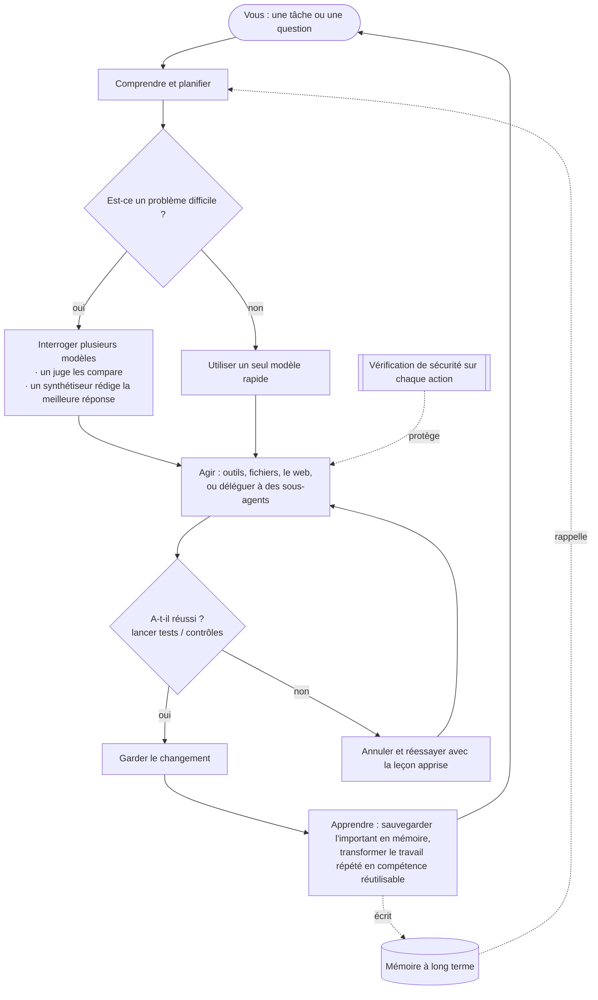

<div align="center">


# Chimera

**L'agent auto-évolutif gouverné — prouvé et gouverné.**<br/>
<sub>Pense avec plusieurs cerveaux, fait un vrai travail seul, n'apprend que ce qui est prouvé, et est sûr par conception.</sub>

[](https://pypi.org/project/chimera-agent/)
[](LICENSE)
[](https://www.python.org/)
[](https://github.com/brcampidelli/chimera-agent/actions/workflows/ci.yml)
[](https://mypy-lang.org/)
[](https://github.com/astral-sh/ruff)
[](https://discord.gg/ACvBbrmguV)
[](https://www.reddit.com/r/ChimeraAgent/)

[](https://donate.stripe.com/9B63cofM491m4SBfe177O00)

<sub><a href="README.md">English</a> · <a href="README.pt-BR.md">Português</a> · <a href="README.es.md">Español</a> · <a href="README.de.md">Deutsch</a> · <b>Français</b> · <a href="README.zh-CN.md">中文</a> · <a href="README.ja.md">日本語</a></sub>

</div>

La plupart des assistants IA misent tout sur un **seul** modèle et oublient tout dès que la
conversation se termine. **Chimera fait deux choses différemment :** pour les questions difficiles,
il interroge **plusieurs** modèles d'IA en même temps et combine leurs réponses en un seul résultat
plus solide, et il **se souvient et apprend** pour devenir de plus en plus utile à mesure que vous
l'utilisez. Il ne fait pas que discuter — donnez-lui un objectif et il planifie, utilise des outils,
vérifie son propre travail, et ne garde que ce qui fonctionne vraiment.

> **Gratuit et open-source (Apache-2.0), en développement précoce mais actif.** Il fonctionne déjà de
> bout en bout : discutez avec lui, laissez-le terminer des tâches tout seul, faites-le tourner comme
> un bot sur votre application de messagerie préférée, déployez-le sur un serveur pour qu'il travaille
> 24h/24, et regardez-le apprendre de ce qu'il fait. C'est une version **alpha** — solide et
> abondamment testée (**plus de 1000 tests automatisés**, vérification de types stricte et lint à chaque
> changement), mais pas encore éprouvée en production.

---

## Pourquoi Chimera

Voyez la plupart des outils d'IA comme le fait d'interroger **un** expert en espérant qu'il ait
raison. Chimera, c'est comme avoir un **panel d'experts** qui débattent, un **juge impartial** qui
pèse leurs réponses, et un **rédacteur** qui livre le meilleur résultat combiné — puis un coéquipier
qui **fait vraiment le travail** et qui **en apprend**. Voici ce qui le rend spécial, en termes
simples :

- 🧠 **Plusieurs cerveaux, une seule réponse.** Pour les questions difficiles, Chimera pose la même question à plusieurs modèles, laisse un modèle comparer leurs réponses, et charge un modèle final de rédiger la meilleure réponse combinée — vous obtenez ainsi quelque chose de plus équilibré et moins susceptible d'être faux qu'un seul modèle seul. (Il ne le fait que lorsque ça en vaut la peine, pour rester rapide et économique.)
- 🚀 **Il fait le travail, il ne se contente pas de parler.** Donnez-lui un objectif. Il le décompose, utilise des outils, modifie des fichiers, lance les tests, et **ne garde un changement que s'il passe**. Si quelque chose casse, il l'annule et réessaie — pour ne pas laisser de désordre derrière lui.
- 🧬 **Il s'améliore à mesure que vous l'utilisez.** Il retient vos préférences et les faits importants d'une conversation à l'autre, et transforme discrètement les tâches qu'il répète en compétences réutilisables. Il est conçu pour continuer à s'améliorer au lieu de se dégrader lentement sur la durée — un problème qui ronge silencieusement beaucoup d'agents.
- 🛡️ **Sûr par conception.** Chaque action risquée passe d'abord par une vérification de sécurité, tout ce qui est destructif demande une confirmation, et le code non fiable peut s'exécuter dans un conteneur verrouillé, sans réseau. (Ces vérifications sont un premier filtre bon marché, pas la vraie frontière — le bac à sable l'est ; et l'isolation par conteneur est optionnelle. Voir [SECURITY.md](SECURITY.md).)
- 🔌 **N'importe quel modèle, tourne partout.** Utilisez de grands modèles hébergés ou vos propres modèles locaux via une interface unique — sur votre ordinateur portable ou un serveur à 5 $, 24h/24.
- 🧩 **Vraiment à vous.** Open-source, sans verrouillage, sans compte fournisseur requis. Vous le faites tourner, il vous appartient, vous pouvez tout modifier.

## Comment Chimera se compare

Chimera ne cherche pas à surpasser les géants des projets d'agents sur *leur* terrain. Il mise sur les
trois choses qu'une véritable étude de rétro-ingénierie de cinq leaders (OpenClaw, Hermes, nanobot,
CrewAI, LangGraph) a trouvées qu'ils **laissent tous ouvertes** — et en fait son cœur :

- 🧬 **Auto-évolution avec un signal de fitness.** Les autres « apprennent » en ajoutant tout ce qui s'est passé, ou par des pull requests humaines — rien ne mesure si un changement appris a réellement aidé. Chimera ne garde un changement **que lorsqu'un résultat vérifié prouve qu'il a aidé** : l'étape d'évolution est conditionnée au vrai diff de l'arbre de travail et à un A/B honnête, jamais à la parole du modèle. Preuve indépendante que ça compte : [EvoAgentBench (arXiv 2607.05202)](https://arxiv.org/abs/2607.05202) a mesuré que les méthodes d'encodage d'expérience *automatiques* et non conditionnées produisent régulièrement du **transfert négatif** — une méthode populaire a régressé de **−12,3 points** sur des tâches pour lesquelles elle n'était pas réglée. Le gate de Chimera exécute désormais aussi un **holdout de transfert** : un changement appris ne doit pas faire régresser une tranche disjointe, de même capacité, avant d'être promu — il ne peut donc pas simplement mémoriser sa propre évaluation.
- 🛡️ **Sécurité par architecture.** L'injection de prompt est aujourd'hui largement considérée comme *impossible à corriger* ; les agents populaires l'atténuent au niveau applicatif ou la déclarent hors périmètre (l'un d'eux a livré 135 000 instances exposées publiquement et une marketplace remplie à ~12 % de compétences malveillantes). Chimera trace la provenance du taint de bout en bout, retire les tokens de contrôle du contenu non fiable, restreint l'accès aux outils lors d'une exécution taintée, protège les réessais à effet de bord, et exécute le code non fiable dans un conteneur verrouillé optionnel.
- 📊 **Des benchmarks honnêtes et publiés.** ~20 % des cas « résolus » d'un classement populaire sont en réalité faux. Chimera rapporte chaque chiffre avec un intervalle de confiance — **y compris les exécutions où il n'a pas gagné** — et ne relance jamais pour obtenir la significativité. Une exécution appariée enregistrée montre la boucle complète **triplant le taux de réussite d'un modèle faible (17 % → 67 %)**, rapportée à une paire près de la significativité, honnêtement. Et sur le **Terminal-Bench officiel**, un A/B pré-enregistré N=40 a atterri sur un **plancher dominé par la variance, sans différence significative dans un sens ou l'autre** — publié tel quel ([`bench/terminal_bench/RESULTS.md`](bench/terminal_bench/RESULTS.md)), y compris **la rétractation d'une lecture intermédiaire erronée** une fois le bras de contrôle mesuré. Les résultats nuls et les auto-corrections sont publiés aussi ; c'est tout l'intérêt.

**En une ligne : l'agent auto-évolutif gouverné — prouvé et gouverné.** C'est de l'alpha, et il le dit.

## Économie de tokens — mesurée, pas revendiquée

Deux intuitions du type « plus de modèles = mieux », mises à l'épreuve sur de vraies exécutions
(prédictions enregistrées *avant* chaque exécution, victoires **et** défaites publiées —
voir [`bench/`](bench/)) :

**La fusion est réservée, pas par défaut.** Sur une suite de raisonnement de 12 tâches, le palier
intermédiaire seul a obtenu 100 % pour 846 tokens ; la fusion complète a aussi obtenu 100 % — pour
**9 526 tokens (~11×)**. La fusion se cache donc derrière une cascade cheap→gate→mid→fusion qui
n'escalade que lorsqu'un gate gratuit échoue, atteignant une qualité ~intermédiaire à ~1/12 du coût
de la fusion.

**L'orchestration hiérarchique ne gagne que là où elle le doit — et selon une loi qu'on peut écrire.**
`chimera orchestrate` répartit une tâche entre des workers cadrés au lieu d'un seul grand contexte. Un
agent unique renvoie chaque document à chaque tour ; les workers cadrés lisent chacun une fois. Ainsi
l'économie de tokens évolue en **(D−1)/D** selon le nombre de documents D — confirmé sur de vraies
exécutions à moins de 0,2 % :

| documents (D) | économie de tokens mesurée | (D−1)/D |
|---|---|---|
| 2 | 49.9% | 50% |
| 3 | 66.7% | 66.7% |
| 4 | 74.8% | 75% |
| 5 | 79.9% | 80% |

L'économie reste stable à mesure que la conversation s'allonge et augmente avec la taille des documents
vers la même limite ([balayage complet, 3 axes](bench/hierarchy_sweep/README.md)). Et là où ça *ne* paie
*pas* — une tâche en un seul coup avec un seul tour — le classifieur le détecte et **retombe sur un agent
unique** (cette exécution a coûté +47 % de tokens en plus ; nous l'avons publiée aussi).

**L'astérisque honnête.** Ce sont des décomptes de *tokens*. Avec le cache de prompt, un fournisseur
facture les documents répétés de l'agent unique à ~0,1×, donc le gain en *dollars* est plus faible — et
au-delà de quelques tours il peut **s'inverser** (les workers indépendants repaient le contexte froid que
l'agent unique met en cache). Nous livrons le
[modèle qui quantifie cela](bench/hierarchy_sweep/cache_cost.py) plutôt que de faire passer discrètement
le chiffre de tokens pour un chiffre en dollars.

## Fonctionnalités

### 🧠 Penser et agir
- **Combiner plusieurs modèles en une seule réponse** (`chimera fuse`) — un panel de modèles, un juge qui fait ressortir où ils sont d'accord, en désaccord, ou passent à côté de quelque chose, et un synthétiseur qui rédige la réponse finale. Un routeur intelligent ne consacre cet effort supplémentaire qu'aux problèmes difficiles, et lorsque les premiers modèles sont déjà d'accord il s'arrête plus tôt — mesuré à environ **~20–28 % de tokens en moins sans perte de précision** sur nos benchmarks. (La fusion / mixture-of-agents en soi n'a rien d'unique — on la trouve dans OpenRouter et d'autres outils ; la différence ici, c'est qu'elle est intégrée à la boucle de l'agent, derrière ce routeur soucieux du coût, et mesurée, pas un modèle que l'on choisit.)
- **Terminer des tâches tout seul** (`chimera solve`) — il planifie, agit avec des outils, puis **vérifie et annule** : il lance votre contrôle (par ex. les tests) et ne garde le changement que s'il passe, sinon il l'annule et réessaie. Il peut, en option, travailler sur une copie isolée de votre projet pour que rien ne soit touché tant que ce n'est pas éprouvé.
- **Des équipes de spécialistes** (`chimera crew`, `chimera crew-isolated`) — plusieurs agents concentrés sur un rôle se partagent une même tâche. En mode isolé, chacun travaille sur sa **propre copie privée en parallèle** ; les modifications sûres sont fusionnées, les conflits sont signalés au lieu d'être écrasés en silence, et les changements d'un mauvais worker peuvent être rejetés par un test propre à chaque worker. Un superviseur peut regrouper le travail de tous en un seul rapport unifié.
- **Déléguer et explorer** — n'importe quel agent peut confier une sous-tâche autonome à un nouveau **sous-agent** qui ne renvoie que le résultat, gardant le contexte principal propre. Le **Context Explorer** (`chimera explore`) trouve les bons fichiers et les bonnes lignes dans une base de code et renvoie une réponse courte au lieu de tout déverser.

### 🧬 Mémoire et auto-amélioration
- **Mémoire à long terme** — il conserve des mémoires à court terme, récentes, factuelles et vous concernant, plus une carte des relations entre les choses. Il peut stocker ses mémoires dans une base de données full-text rapide, transporter un profil de vos préférences dans chaque conversation, fusionner automatiquement les notes en double, et suggérer gentiment d'enregistrer une préférence quand vous en mentionnez une.
- **Apprend de nouvelles compétences** — quand il réussit plus d'une fois le même type de tâche, il en fait automatiquement une compétence testée et réutilisable.
- **Auto-entraînement optionnel (avancé)** — il peut enregistrer sa propre expérience pour que vous puissiez ensuite affiner un modèle à partir de celle-ci. Désactivé par défaut ; rien ne s'entraîne sans que vous le demandiez.

### 🔌 Connecter et automatiser
- **Parlez-lui n'importe où** — un chat en terminal, une application terminal plein écran, ou comme un bot sur **Discord, Telegram, Slack, Signal et WhatsApp**. Il y a aussi un point d'accès HTTP simple.
- **Planification et proactivité** — confiez-lui des tâches récurrentes en langage courant (« chaque matin, résume les actualités »). Avec le planificateur intégré en marche, il **agit à l'heure**, et pas seulement quand vous lui écrivez.
- **Outils et intégrations** — lire et écrire des fichiers, exécuter des commandes shell, naviguer sur le web, et exécuter du code en toute sécurité dans un bac à sable. Connectez presque n'importe quel service web (via son API) ou outil externe — y compris n'importe quel **serveur MCP** ([guide + exemple exécutable](docs/mcp.md)) — et importez votre configuration depuis d'autres outils d'agent que vous utilisez déjà.
- **Tout inclus** — recherche web, génération d'images, synthèse vocale, e-mail, calendrier, exécution de code, et plus encore, prêts à être activés.

### 🚀 Tourner partout, en toute sécurité
- **N'importe quel modèle, une seule interface** — modèles hébergés ou vos propres modèles locaux, avec bascule automatique si l'un est indisponible et rotation entre plusieurs clés.
- **Déploiement serveur en une commande** — faites-le tourner avec Docker (ou en bare-metal) pour qu'il reste actif et redémarre au reboot. Voir **[docs/deploy.md](docs/deploy.md)**.
- **Noyau de sécurité** — une vérification sur chaque action (autoriser / avertir / bloquer / demander), un conteneur à réseau isolé **optionnel** pour le code non fiable (`CHIMERA_SANDBOX=docker` ; le runner *local* par défaut n'est *pas* isolé), et un journal d'audit complet de ce qu'il a fait.

## Démarrage rapide

Vous avez besoin de **Python 3.11+** et de [uv](https://docs.astral.sh/uv/) (un installateur Python rapide).

**1. Installer** — depuis PyPI :
```bash
pip install chimera-agent
```
Vous obtenez la commande `chimera`. (Les exemples ci-dessous utilisent `uv run chimera` pour une
copie du dépôt — avec pip install, lancez simplement `chimera …`.) Pour contribuer à Chimera lui-même, clonez le dépôt :
```bash
git clone https://github.com/brcampidelli/chimera-agent.git
cd chimera-agent
uv sync --extra dev
```

**2. Ajouter une clé de fournisseur d'IA.** Le plus simple est une clé [OpenRouter](https://openrouter.ai) — une seule clé
débloque plus de 100 modèles.
```bash
cp .env.example .env
# ouvrez .env et définissez, par exemple :  CHIMERA_OPENROUTER_KEYS=sk-or-...
```

**3. Vérifier que tout est prêt**
```bash
uv run chimera doctor
```

**4. L'essayer**
```bash
uv run chimera chat                         # ayez une conversation (il s'en souvient)
uv run chimera run "Explain what you can do in 3 bullets"
uv run chimera fuse "What's the best way to learn to cook?" --show-panel   # voir plusieurs modèles combinés
uv run chimera solve "add a hello() function to app.py and a test for it" --verify "pytest -q"
```

**Le faire tourner sur un serveur (pour qu'il travaille 24h/24) :**
```bash
docker compose up -d      # passerelle + planificateur ; redémarre automatiquement
```
Guide complet (Docker ou systemd, planification, sauvegardes, sécurité) : **[docs/deploy.md](docs/deploy.md)**.

**5. Faire quelque chose de concret en 5 minutes : le tri des e-mails.** Pointez Chimera sur votre boîte
de réception et obtenez un résumé de dix secondes — en lecture seule, classant URGENT / PERSONAL /
NEWSLETTER / COLD-SALES, et planifiable en option chaque matin :
```bash
uv run chimera workflow examples/email_triage/triage.yaml -w ./triage_workspace
```
Configuration + planification quotidienne + mises en garde honnêtes : **[examples/email_triage/README.md](examples/email_triage/README.md)**.

## Comment ça marche

Donnez une tâche à Chimera ; il planifie, réfléchit (en combinant des modèles quand le problème est
difficile), agit avec des outils, **vérifie son propre travail et ne garde que ce qui passe**, puis
apprend du résultat — réinjectant la mémoire et de nouvelles compétences dans la tâche suivante.



## Commandes

Chaque commande est `chimera <name>` (ou `uv run chimera <name>` avant l'installation).

```bash
chimera doctor / models / features    # vérifier la configuration, lister les modèles, voir les capacités optionnelles
chimera chat                          # assistant interactif qui se souvient d'un tour à l'autre
chimera tui                           # application terminal plein écran
chimera run "PROMPT" --image pic.png  # réponse en un coup (peut lire une image)
chimera fuse "PROMPT" --show-panel    # combiner plusieurs modèles : panel -> juge -> synthétiseur
chimera solve "TASK" --verify "pytest -q" --isolate   # faire une tâche ; ne garder le changement que si le contrôle passe
chimera crew "TASK" --mode supervisor         # une équipe de spécialistes s'attaque à une tâche
chimera crew-isolated "TASK" -W "name:role" --verify "..." --synthesize   # équipe, chacun dans sa propre copie isolée
chimera explore "where is login handled?"     # trouver les bons fichiers/lignes, obtenir une réponse courte
chimera deliver "a launch plan" -o plan.md    # produire un document soigné
chimera serve --cron [--discord|--telegram|--slack|--signal]   # tourner comme service : bot de chat + planificateur
chimera cron add "brief" "0 8 * * *" "Summarize the news"       # planifier un travail récurrent
chimera memory add / graph / consolidate      # mémoire à long terme : sauvegarder, relier, ranger
chimera kanban add/board/run                   # un tableau de tâches qui distribue le travail à l'agent
chimera workflow flow.yaml                     # exécuter une automatisation répétable décrite dans un fichier
chimera migrate <source> <dir> --apply         # importer réglages, compétences et mémoire depuis un autre outil d'agent
chimera evolve status / tune / recipe          # optionnel : s'auto-optimiser ; préparer les données pour affiner un modèle
chimera fusion-bench / skillcard-bench / schema-bench / sandbox-bench   # benchmarks A/B honnêtes : mesurer coût, qualité et effets de bord avant de faire confiance à une fonctionnalité
chimera pet new --name Chimi                   # adopter un petit compagnon virtuel :)
```

Consultez le **[Guide d'utilisation](docs/usage.md)** pour chaque commande avec des exemples à copier-coller.

## Architecture

Chimera est un paquet Python aux parties clairement séparées, pour que vous puissiez comprendre ou
étendre chaque pièce indépendamment :

```
chimera/
  core/          la boucle de l'agent : planifier, agir, vérifier, garder-ou-annuler, et copies de travail isolées
  fusion/        le moteur « plusieurs cerveaux » : panel -> juge -> synthétiseur + le routeur intelligent
  memory/        mémoire à court terme / récente / factuelle / vous concernant + un graphe de relations
  skills/        la bibliothèque de compétences intégrée et la façon de trouver les compétences pertinentes
  evolution/     apprendre de nouvelles compétences à partir des succès, et l'expérience dont il apprend
  governance/    le noyau de sécurité (autoriser/avertir/bloquer/demander), journal d'audit, et contrôles de changement
  orchestration/ des équipes d'agents : rôles, crews, workers parallèles isolés, rapports unifiés
  ecosystem/     auto-amélioration avancée : des agents qui conçoivent des agents, entraînement de modèle optionnel
  kanban/        un tableau de tâches qui remet des cartes à l'agent
  workflow/      décrire une automatisation répétable dans un fichier simple et l'exécuter
  tools/         outils intégrés (fichiers, shell, web, recherche) + exécution de code
  sandbox/       exécuter les outils localement ou dans un conteneur verrouillé
  integrations/  connecter des outils externes et n'importe quelle API web
  scheduler/     tâches récurrentes + le démon qui les déclenche à l'heure
  migration/     transférer votre configuration depuis d'autres outils d'agent
  providers/     une interface vers chaque modèle, avec bascule et rotation de clés
  interface/     le moteur de conversation partagé (utilisé par le chat, l'application et les bots)
  server/        la passerelle de messagerie et le point d'accès HTTP
  cli/           la commande `chimera`
```

Consultez [docs/architecture.md](docs/architecture.md) pour la conception complète.

## Vision et objectifs

**L'objectif de Chimera est simple : un agent IA que tout le monde peut faire tourner, qui raisonne
mieux en combinant plusieurs modèles au lieu de faire confiance à un seul, qui s'améliore vraiment à
mesure qu'on l'utilise, et qui reste sûr et entièrement ouvert tout au long du chemin.**

La plupart des outils d'IA d'aujourd'hui sont soit intelligents-mais-oublieux (ils perdent tout dès
que la conversation se termine), soit capables-mais-fermés (vous ne les contrôlez pas). Et beaucoup de
ceux qui essaient de « s'améliorer eux-mêmes » deviennent silencieusement *pires* sur la durée. Chimera
est notre tentative d'une autre voie :

- **Mieux penser, sans facture plus salée** — combiner plusieurs modèles seulement quand ça aide, pour que la qualité monte sans gaspillage.
- **Une vraie mémoire et de vraies compétences** — se souvenir de l'important et transformer le travail répété en aptitudes réutilisables.
- **Une amélioration qui dure** — résister à la lente dégradation qui ronge d'autres agents, en vérifiant son propre travail et en gardant l'état en sécurité hors du modèle.
- **Sûr et transparent** — chaque action est vérifiable, et les actions destructives demandent d'abord.
- **Ouvert à tous** — gratuit, sous licence Apache-2.0, porté par la communauté, sans verrouillage.

C'est tôt (alpha), et l'honnêteté compte pour nous : ce n'est pas encore éprouvé en usage intensif de
production. Si cette vision vous enthousiasme, nous serions ravis de votre aide pour y parvenir.

## Développement

```bash
git clone https://github.com/brcampidelli/chimera-agent.git
cd chimera-agent
uv sync --extra dev

uv run ruff check .      # style/lint
uv run mypy chimera      # vérification de types stricte
uv run pytest -q         # la suite de tests
```

Les contributions sont les bienvenues — code, documentation, idées, rapports de bugs. Commencez par
[CONTRIBUTING.md](CONTRIBUTING.md) et notre [Code de conduite](CODE_OF_CONDUCT.md).
Vous avez trouvé un problème de sécurité ? Voir [SECURITY.md](SECURITY.md).

## Communauté

Une question, une idée, ou l'envie de contribuer ? **[Rejoignez-nous sur Discord](https://discord.gg/ACvBbrmguV)** — tout le monde est le bienvenu.

Plutôt Reddit ? Suivez **[r/ChimeraAgent](https://www.reddit.com/r/ChimeraAgent/)** pour les nouveautés et les discussions.

## Soutenir le projet

Chimera est gratuit et open-source, développé au grand jour. S'il vous est utile, vous pouvez aider à
financer son développement par un don unique — chaque contribution compte et est très appréciée. 💜

**[💜 Faire un don via Stripe](https://donate.stripe.com/9B63cofM491m4SBfe177O00)**

## Licence

[Apache-2.0](LICENSE) — libre d'utiliser, de modifier et de construire dessus.
