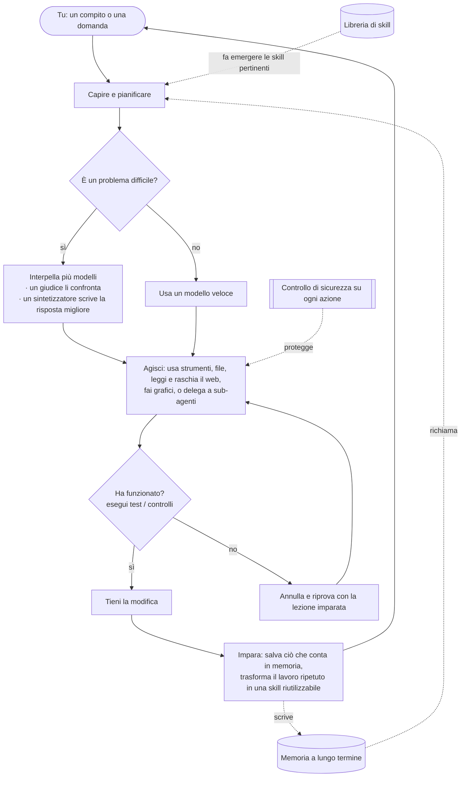

<div align="center">


# Chimera

**L'agente auto-evolutivo governato — provato e governato.**<br/>
<sub>Pensa con molte menti, fa davvero il lavoro da solo, impara solo ciò che è dimostrato ed è sicuro per architettura.</sub>

[](https://chimeraagent.space)
[](https://pypi.org/project/chimera-agent/)
[](LICENSE)
[](https://www.python.org/)
[](https://github.com/brcampidelli/chimera-agent/actions/workflows/ci.yml)
[](https://mypy-lang.org/)
[](https://github.com/astral-sh/ruff)
[](https://discord.gg/ACvBbrmguV)
[](https://www.reddit.com/r/ChimeraAgent/)

[](https://donate.stripe.com/9B63cofM491m4SBfe177O00)

<sub><a href="README.md">English</a> · <a href="README.pt-BR.md">Português</a> · <a href="README.es.md">Español</a> · <a href="README.de.md">Deutsch</a> · <a href="README.fr.md">Français</a> · <b>Italiano</b> · <a href="README.pl.md">Polski</a> · <a href="README.zh-CN.md">中文</a> · <a href="README.ja.md">日本語</a></sub>

</div>

La maggior parte degli assistenti IA punta tutto su un **singolo** modello e dimentica tutto quando
la conversazione finisce. **Chimera fa due cose in modo diverso:** per le domande difficili interpella
**più** modelli contemporaneamente e ne fonde le risposte in un unico risultato più solido, e
**ricorda e impara**, diventando più utile quanto più lo usi. Non si limita a chiacchierare — dagli un
obiettivo e pianifica, usa strumenti, controlla il proprio lavoro e tiene solo ciò che funziona
davvero.

> **Gratuito e open-source (Apache-2.0), in sviluppo iniziale ma attivo.** Funziona già da cima a
> fondo: chatta con lui, lascia che porti a termine compiti da solo, usalo come bot sulla tua app di
> messaggistica preferita, mettilo su un server perché lavori 24/7 e guardalo imparare da ciò che fa.
> È **alpha** — solido e ampiamente testato (**oltre 2.000 test automatizzati**, type-checking e lint
> rigorosi a ogni modifica), ma non ancora temprato in produzione pesante.

---

## Perché Chimera

Pensa alla maggior parte degli strumenti IA come al chiedere a **un** esperto sperando che abbia
ragione. Chimera è come avere un **panel di esperti** che discutono, un **giudice imparziale** che ne
soppesa le risposte e un **redattore** che consegna il miglior risultato combinato — e poi un collega
che il lavoro lo **fa davvero** e ci **impara** sopra. Ecco cosa lo rende speciale, in parole povere:

- 🧠 **Molte menti, una risposta.** Per le domande difficili Chimera pone la stessa domanda a più modelli, lascia che un modello ne confronti le risposte e fa scrivere a un modello finale la migliore risposta combinata — così ottieni qualcosa di più equilibrato e con meno probabilità di essere sbagliato rispetto a un singolo modello. (Lo fa solo quando ne vale la pena, per restare veloce ed economico.)
- 🚀 **Fa il lavoro, non solo chiacchiere.** Dagli un obiettivo. Lo scompone, usa strumenti, modifica file, esegue i test e **tiene una modifica solo se passa**. Se qualcosa si rompe, la annulla e riprova — così non lascia disordine dietro di sé.
- 🧬 **Migliora quanto più lo usi.** Ricorda le tue preferenze e i fatti importanti tra una conversazione e l'altra, e trasforma silenziosamente i compiti che ripete in skill riutilizzabili. È progettato per continuare a migliorare invece di peggiorare lentamente sulle lunghe distanze — un problema che degrada molti agenti senza che ce ne si accorga.
- 🛡️ **Sicuro per progettazione.** Ogni azione rischiosa passa prima da un controllo di sicurezza, qualsiasi cosa distruttiva chiede conferma, e il codice non fidato può girare in un container blindato, senza rete. (Quei controlli sono un primo filtro economico, non il confine vero — la sandbox lo è; e l'isolamento in container è opt-in. Vedi [SECURITY.md](SECURITY.md).)
- 🔌 **Qualsiasi modello, gira ovunque.** Usa grandi modelli ospitati o i tuoi modelli locali tramite un'unica interfaccia — sul tuo portatile o su un server da 5 dollari, tutto il giorno.
- 🧩 **Davvero tuo.** Open-source, nessun lock-in, nessun account di fornitore richiesto. Lo esegui tu, è tuo, puoi cambiare qualsiasi cosa.

## Come si confronta Chimera

Chimera non prova a battere per *quantità di canali* i giganteschi progetti di agenti. Punta sulle tre
cose che un vero studio di reverse engineering di cinque leader (OpenClaw, Hermes, nanobot, CrewAI,
LangGraph) ha scoperto che **lasciano tutti aperte** — e ne fa il proprio nucleo:

- 🧬 **Auto-evoluzione con un segnale di fitness.** Gli altri "imparano" accodando qualunque cosa sia successa, o tramite pull request umane — nulla misura se una modifica appresa abbia davvero aiutato. Chimera tiene una modifica **solo quando un risultato verificato dimostra che ha aiutato**: il passo di evoluzione è condizionato al diff reale dell'albero di lavoro e a un A/B onesto, mai alla parola del modello. Prova indipendente che questo conta: [EvoAgentBench (arXiv 2607.05202)](https://arxiv.org/abs/2607.05202) ha misurato che i metodi *automatici* e non condizionati di codifica dell'esperienza producono regolarmente **transfer negativo** — un metodo popolare è regredito di **−12,3 punti** su compiti per cui non era stato tarato. Il gate di Chimera ora esegue anche un **holdout di transfer**: una modifica appresa non deve far regredire una fetta disgiunta di pari capacità prima di essere promossa, così non può limitarsi a memorizzare la propria valutazione.
- 🛡️ **Sicurezza per architettura.** La prompt injection è ormai ampiamente considerata *non correggibile*; gli agenti popolari la mitigano a livello applicativo o la dichiarano fuori scopo (uno ha distribuito 135k istanze esposte pubblicamente e un marketplace pieno per ~12% di skill malevole). Chimera porta un vero strato di difesa — **opt-in con `--taint`, spento di default**: traccia la provenienza della contaminazione in modo *euristico* (flusso letterale di riferimento/contenuto, **non** dataflow vero — un modello che parafrasa il testo contaminato lo ripulisce), rimuove i token di controllo dai contenuti non fidati, restringe l'accesso agli strumenti pericolosi per il resto di un'esecuzione contaminata e protegge i retry con effetti collaterali; il codice non fidato gira in un container blindato, opt-in. Misurato, non affermato: sul corpus integrato di **7 attacchi** questo riduce il successo dell'attacco dal **100% a ~14%** ([`chimera/eval/injection.py`](chimera/eval/injection.py)). [`SECURITY.md`](SECURITY.md) dice chiaramente cosa passa ancora (passaggi tra sub-agenti, fusione/sintesi, punti d'ingresso diversi dalla CLI) — il confine di contenimento è la sandbox, questo strato è difesa in profondità sopra di essa.
- 📊 **Benchmark onesti e pubblicati.** Circa il 20% dei casi "risolti" di una classifica popolare è in realtà sbagliato. Chimera riporta ogni numero con un intervallo di confidenza — **incluse le esecuzioni in cui non ha vinto** — e non rilancia mai i dadi per ottenere significatività. Un'esecuzione appaiata registrata mostra il loop **sollevare un modello debole su una suite pre-registrata di 100 compiti — 48% → 71% (+23pp), IC 95% [+12,6%, +28,6%] — statisticamente significativo** (l'IC esclude lo zero), a partire da **28 compiti recuperati** (fallimento grezzo → superato e verificato) contro 5 regressioni. Una esecuzione, nessun re-roll. Questo **sostituisce una precedente esecuzione della stessa suite** (9% → 15%, +6pp) il cui harness valutava con un file di test che l'agente poteva modificare — e che, alla riesecuzione, ha modificato una volta. Direzione e significatività si sono replicate e rafforzate una volta irrigidita la valutazione; l'errata corrige, le prove di manomissione conservate e il perché i tassi assoluti dell'originale fossero molto più bassi sono tutti in [`bench/local_lift/RESULTS.md`](bench/local_lift/RESULTS.md). E sul **Terminal-Bench ufficiale**, un A/B pre-registrato con N=40 è finito su un **pavimento dominato dalla varianza, senza differenza significativa in nessuna direzione** — pubblicato così com'è ([`bench/terminal_bench/RESULTS.md`](bench/terminal_bench/RESULTS.md)), inclusa la **ritrattazione di una lettura intermedia sbagliata** una volta misurato il braccio di controllo. Pubblichiamo anche i risultati nulli e le autocorrezioni; è proprio questo il punto.

**In una riga: l'agente auto-evolutivo governato — provato e governato.** È alpha, e lo dice.

## Benchmark (onesti)

Due numeri registrati, entrambi veri, pubblicati insieme di proposito — uno ormai significativo, uno
che ridimensiona. (Compaiono anche nella schermata **Maturità e Benchmark** dell'app desktop,
direttamente dallo snapshot incluso.)

- **Sollevamento di un modello debole (significativo).** Un modello economico (`mistral-small-3.2-24b`)
  + il loop di retry di Chimera contro lo stesso modello da solo, su una **suite pre-registrata di
  n=100** (progetto e compiti committati e pubblicati prima di qualsiasi chiamata al modello):
  **48,0% → 71,0% (+23,0pp)**, IC 95% appaiato **[+12,6%, +28,6%] — statisticamente significativo**
  (l'IC esclude 0), da **28 compiti recuperati dal loop** (fallimento grezzo → superato e verificato)
  contro 5 regressioni. Un modello, un seed/compito, piccoli compiti Python autocontenuti — **NON** è
  SWE-bench e non si generalizza a repository reali. Una esecuzione, nessun re-roll.
  **Questo sostituisce una precedente esecuzione della stessa suite** (9,0% → 15,0%, +6,0pp) il cui
  harness valutava con un file di test che l'agente sotto test poteva modificare. Rieseguendo con il
  test originale ripristinato, l'agente è stato colto a riscrivere il proprio test di valutazione in
  un compito — quindi la falla era reale — e il sollevamento si è replicato *maggiore*, non minore.
  Anche l'affermazione della precedente esecuzione secondo cui "85 dei 100 compiti sono abbastanza
  difficili da far fallire entrambi i bracci" non ha retto: la riesecuzione ne misura 24. L'errata
  corrige completa, le prove di manomissione conservate e ciò che non è stato possibile riverificare
  sono in [`bench/local_lift/RESULTS.md`](bench/local_lift/RESULTS.md).
  Fonte: [`bench/local_lift/_reverify_n100/paired.json`](bench/local_lift/_reverify_n100/paired.json), [`PREREGISTRATION.md`](bench/local_lift/PREREGISTRATION.md).
- **SWE-bench Verified — la prova esterna più forte, ed è sopravvissuta a una replica progettata per
  ucciderla.** Tre esecuzioni pre-registrate su fette di `django/django`, valutate **solo**
  dall'harness ufficiale `swebench` 4.1.0 in Docker — mai autodichiarate.

  | esecuzione | fetta | baseline | + Chimera | Δ appaiato | IC 95% | |
  |---|---|---|---|---|---|---|
  | 1 (`max_steps=8`) | 19 | 36,8% | 36,8% | +0,0% | [−8,5%, +8,5%] | ns |
  | 2 (`max_steps=30`) | le stesse 19 | 42,1% | 57,9% | +15,8% | [−1,9%, +15,8%] | ns |
  | **3 (replica)** | **41 mai viste** | 34,1% | 43,9% | **+9,8%** | [−3,5%, +16,7%] | ns |
  | aggregato *(secondario)* | 60 | 36,7% | 48,3% | **+11,7%** | **[+0,8%, +16,4%]** | **significativo** |

  Il +15,8% dell'esecuzione 2 era un 3–0 su tre coppie informative, e la pre-registrazione gli dava
  **una probabilità su tre di essere esattamente questo — un campione fortunato**, con la
  ritrattazione impegnata in anticipo. L'esecuzione 3 lo ha testato su **41 istanze i cui esiti non
  avevamo mai visto**, senza cambiare altro. L'effetto **è riapparso** (+9,8%, dentro la banda
  registrata da +5 a +20) su una fetta rivelatasi *più difficile* di quella dell'esecuzione 2. Su
  entrambe, le coppie discordanti sono **9 a favore di Chimera contro 2** (p ≈ 2,6% sotto l'ipotesi
  nulla).

  **Il meccanismo si è replicato, ed è la parte interessante.** Una quarta esecuzione ha ripristinato
  il braccio intermedio (solo scaffold, senza il gate sul diff) sulle stesse 41 istanze, così che i
  tre differiscano per esattamente un componente. Tutti e tre **modificano con la stessa frequenza**
  (27–28 patch su 41); ciò che cambia è quanto spesso la modifica è *giusta*:

  | braccio | risolte | **precisione quando ha modificato** |
  |---|---|---|
  | baseline | 14/41 | 50% |
  | + scaffold | 16/41 | 59% |
  | + scaffold **e** gate sul diff | 18/41 | 67% |

  **Entrambi i componenti contribuiscono, in metà all'incirca uguali** (+4,9% ciascuno, nessuno
  significativo da solo) — il che **contraddice la nostra stessa previsione registrata**, secondo cui
  lo scaffold avrebbe portato la maggior parte, e ritira una lettura dell'esecuzione 2 per cui il gate
  sul diff "non è ciò che ha prodotto il guadagno". La ritrattazione è in
  [`RESULTS.md`](bench/swe_bench/RESULTS.md); l'additività così pulita *non* viene rivendicata come
  una divisione 50/50 misurata, dato che ogni confronto poggia su 5–6 coppie discordanti.

  ⚠️ Da leggere onestamente: **il primario fuori campione NON è significativo.** Il numero
  significativo è il **secondario aggregato**, pre-registrato come secondario proprio perché mescola
  dati visti e mai visti — non viene promosso a titolo ora che ha superato la soglia. E **48,3% NON è
  un punteggio SWE-bench Verified**: è una fetta deliberatamente facile, da un solo repository; un
  punteggio vero richiede tutte e 500. Lo zero esatto dell'esecuzione 1 è pubblicato invariato, e
  l'esecuzione 2 ha portato la **ritrattazione che si era meritata** (il meccanismo che avevamo
  sostenuto per le sue patch vuote era sbagliato — la cura era il budget di passi).
  Fonte: [`bench/swe_bench/RESULTS.md`](bench/swe_bench/RESULTS.md), [`PREREGISTRATION.md`](bench/swe_bench/PREREGISTRATION.md).
- **Terminal-Bench (ridimensionante).** A/B pre-registrato con N=40 sul benchmark ufficiale, stesso
  modello in entrambi i bracci (`deepseek-chat-v3.1`): **7,5% → 2,5%** con lo scaffold, **Δ appaiato
  −5,0pp, IC 95% [−5,0%, +1,6%] — non significativo**. Lo scaffold **non ha sollevato un modello già
  competente** (non è il regime debole "goldilocks" in cui lo scaffolding aiuta); entrambi i bracci
  stanno su un pavimento dominato dalla varianza.
  Fonte: [`bench/terminal_bench/RESULTS.md`](bench/terminal_bench/RESULTS.md).
- **L'apprendimento accumulato aiuta? Sette esecuzioni dicono: non in modo dimostrabile (e un positivo
  è stato ritrattato).** Il volano — skill condizionate alla ricorrenza più un test di transfer, schede
  di anti-pattern, memoria persistente — è stato misurato su **sette esecuzioni pre-registrate**.
  L'esecuzione 6 ha prodotto l'unico positivo della serie (+6,7% significativo sulla metrica di
  transfer entro la famiglia); **l'esecuzione 7, con più potenza statistica, l'ha ridotto a +2,0% e
  non significativo — quindi è stato ritrattato**, esattamente come la pre-registrazione si era
  impegnata a fare. Il verdetto onesto: **nessuna esecuzione con potenza adeguata mostra che
  l'apprendimento accumulato migliori il successo nei compiti**, e il collo di bottiglia è lo
  strumento — tre tentativi di scrivere una suite che cadesse nella fascia informativa 40–60% sono
  finiti tutti a 84–92%. "Migliora quanto più lo usi" resta **senza prove**.
  Fonte: [`bench/learning_lift/RESULTS.md`](bench/learning_lift/RESULTS.md).

Significativo internamente (sulla nostra suite difficile). Su repository reali, **replicato fuori
campione e significativo solo una volta aggregato** — l'etichetta onesta, non quella lusinghiera.
Ridimensionante su Terminal-Bench. L'affermazione sull'apprendimento è **ritrattata**. Pubblichiamo
tutto, scriviamo *prima* di eseguire il ramo in cui il risultato uccide la nostra stessa affermazione,
e non rilanciamo per ottenere significatività — sarebbe p-hacking.

## Economia dei token — misurata, non proclamata

Due istinti del tipo "più modelli = meglio", messi alla prova su esecuzioni reali (previsioni
registrate *prima* di ogni esecuzione, vittorie **e** sconfitte pubblicate — vedi [`bench/`](bench/)):

**La fusione è riservata, non predefinita.** Su una suite di ragionamento da 12 compiti il tier
intermedio da solo ha totalizzato il 100% con 846 token; anche la fusione completa ha totalizzato il
100% — per **9.526 token (~11×)**. Perciò la fusione sta dietro una cascata
economico→gate→intermedio→fusione che scala solo quando un gate gratuito fallisce, raggiungendo una
qualità ~intermedia a ~1/12 del costo della fusione.

**L'orchestrazione gerarchica vince solo dove deve — e per una legge che possiamo scrivere.**
`chimera orchestrate` divide un compito tra worker con ambito ristretto invece di un unico grande
contesto. Un singolo agente rispedisce ogni documento a ogni turno; i worker con ambito ristretto lo
leggono una volta sola. Perciò il risparmio di token scala come **(D−1)/D** nel numero di documenti D
— confermato su esecuzioni reali entro lo 0,2%:

| documenti (D) | risparmio di token misurato | (D−1)/D |
|---|---|---|
| 2 | 49,9% | 50% |
| 3 | 66,7% | 66,7% |
| 4 | 74,8% | 75% |
| 5 | 79,9% | 80% |

Il risparmio resta stabile man mano che la conversazione si allunga e cresce con la dimensione del
documento verso lo stesso limite ([sweep completo, 3 assi](bench/hierarchy_sweep/README.md)). E dove
*non* conviene — un compito one-shot con un solo turno — il classificatore lo rileva e **torna a un
singolo agente** (quell'esecuzione è costata il +47% di token; abbiamo pubblicato anche quella).

**L'asterisco onesto.** Questi sono conteggi di *token*. Con il prompt caching un fornitore fattura i
documenti ripetuti del singolo agente a ~0,1×, quindi la vittoria in *dollari* è minore — e dopo
qualche turno può **invertirsi** (i worker indipendenti ripagano il contesto freddo che il singolo
agente mette in cache). Pubblichiamo il [modello che quantifica
questo](bench/hierarchy_sweep/cache_cost.py) invece di spacciare in sordina il numero di token per un
numero in dollari.

## Funzionalità

### 🧠 Pensare e fare
- **Fondi più modelli in una sola risposta** (`chimera fuse`) — un panel di modelli, un giudice che mette in luce dove concordano, dissentono o si perdono qualcosa, e un sintetizzatore che scrive la risposta finale. Un router intelligente spende questo sforzo extra solo sui problemi difficili, e quando i primi modelli concordano già si ferma prima — misurato a **~20–28% di token in meno senza perdita di accuratezza** sui nostri benchmark. (La fusione / mixture-of-agents di per sé non è unica — la trovi in OpenRouter e in altri strumenti; la differenza qui è che è cablata nel loop dell'agente dietro quel router consapevole dei costi, ed è misurata, non un modello che scegli tu.)
- **Porta a termine compiti da solo** (`chimera solve`) — pianifica, agisce con strumenti, poi **verifica e annulla**: esegue il tuo controllo (ad es. i test) e tiene la modifica solo se passa, altrimenti la annulla e riprova. Facoltativamente lavora su una copia isolata del tuo progetto, così nulla viene toccato finché non è dimostrato. **E un paragrafo convincente non è una soluzione:** senza un `--verify` a cui appellarsi, un'esecuzione che non ha cambiato nulla su disco viene riportata come fallimento, non come successo — perché l'unica cosa rimasta a giudicarla sarebbe un modello che legge prosa, e che il diff non lo vede mai. Ogni tentativo registra *chi* lo ha approvato (`verifier` / `diff+manager` / `manager` / `none`), così una ricevuta non dice mai "successo" senza nominare l'autorità che c'è dietro.
- **Squadre di specialisti** (`chimera crew`, `chimera crew-isolated`) — più agenti focalizzati su un ruolo si dividono un lavoro. In modalità isolata ognuno lavora sulla **propria copia privata in parallelo**; le modifiche sicure vengono unite, i conflitti segnalati invece che sovrascritti in silenzio, e le modifiche di un worker difettoso possono essere respinte da un test suo. Un supervisore può fondere il lavoro di tutti in un unico rapporto.
- **Delegare ed esplorare** — qualsiasi agente può passare un sotto-compito autocontenuto a un **sub-agente** fresco che riporta solo il risultato, tenendo pulito il contesto principale. L'**Esploratore di Contesto** (`chimera explore`) trova i file e le righe giuste in una base di codice e restituisce una risposta breve invece di riversare tutto.

### 🧬 Memoria e auto-miglioramento
- **Memoria a lungo termine** — conserva memorie a breve termine, recenti, fattuali e su di te, più una mappa di come le cose sono collegate. Può salvare le memorie in un database full-text veloce, portare un profilo delle tue preferenze in ogni chat, unire automaticamente le note duplicate e suggerire con garbo di salvare una preferenza quando ne nomini una.
- **Impara nuove skill** — quando riesce nello stesso tipo di compito più di una volta, lo trasforma automaticamente in una skill testata e riutilizzabile.
- **Auto-addestramento opzionale (avanzato)** — può registrare la propria esperienza così che tu possa poi fare fine-tuning di un modello a partire da essa. Spento di default; nulla viene addestrato senza che tu lo chieda.

### 📏 Un loop che si può misurare — e che dice quando si è perso
Un agente è un modello **più tutto ciò che gli sta intorno**. Quella macchina circostante decide se
un'esecuzione lunga resta utile, e quasi tutta è invisibile finché non si rompe. Chimera misura la
propria:

- **Ogni esecuzione lascia una ricevuta.** Una riga JSONL per esecuzione in `traces.jsonl`: token per passo, gli strumenti chiamati con ciò che hanno restituito, dove la cronologia è stata scartata — e il **tasso di successo della cache**, la quota di token di prompt serviti dalla cache del fornitore. Quello è il vero numero di costo del loop (un token in cache costa circa un decimo di uno nuovo, quindi conteggi identici possono differire di ~10× nel prezzo) *e* un allarme di progettazione: crolla ogni volta che qualcosa riscrive l'inizio del prompt, cosa che non ha altri sintomi. Un fornitore che non riporta la cache si legge come **sconosciuto**, mai come un miss.
- **Si accorge quando ha smesso di arrivare da qualche parte.** Due cose diverse vengono chiamate "problemi di contesto": l'attenzione che si diluisce dentro un prompt lungo, e una *traiettoria* che smette silenziosamente di accumulare e comincia a girare in tondo — ogni singolo passo va bene, l'esecuzione nel suo insieme non va da nessuna parte. L'interruttore di loop di Chimera prende la versione stretta (una finestra di 12 chiamate); un'esecuzione che rivisita gli stessi tre file ogni venti turni ci passa attraverso indisturbata. Perciò c'è un secondo rilevatore che confronta la **prima metà di un'esecuzione con la seconda**: lavoro riderivato che l'esecuzione aveva già, fallimenti in aumento, o ridondanza che schizza subito dopo che la cronologia è stata scartata. **Riporta e non agisce** — fermarsi, ripianificare e forzare la compattazione sono tutte cure plausibili e non abbiamo prove su quale aiuti; sceglierne una ora incorporerebbe esattamente l'assunzione non misurata che questo lavoro esiste per rimuovere.
- **Le esecuzioni lunghe sopravvivono al proprio contesto.** Esaurire la finestra prima chiudeva l'esecuzione di netto, il che rendeva la finestra — e non la difficoltà del compito — il vero tetto. La compattazione ora lascia intatto il messaggio di sistema (è il prefisso stabile su cui è ancorata tutta la cache del prompt), non lascia mai un risultato di strumento orfano della sua chiamata, e **ripristina ciò che serve all'esecuzione per essere ancora sé stessa**: il file aperto, il piano, l'elenco dei compiti, lo stato corrente. Dice chiaramente cosa ha scartato invece di riassumerlo — un agente può rileggere un file, ma non può dis-credere a un riassunto inventato.

### 🔌 Connettere e automatizzare
- **Parlagli ovunque** — una chat da terminale, un'app a tutto schermo nel terminale, o come bot su **Discord, Telegram, Slack, Signal e WhatsApp**. C'è anche un semplice endpoint HTTP.
- **Pianificazione e proattività** — assegnagli lavori ricorrenti in linguaggio naturale ("ogni mattina, riassumi le notizie"). Con lo scheduler integrato in funzione, **agisce puntuale**, non solo quando gli scrivi.
- **Strumenti e integrazioni** — legge e scrive file, esegue comandi di shell, **legge pagine web completamente renderizzate e fa scraping o crawling di interi siti** (l'estrazione strutturata passa per un lettore in quarantena, privo di strumenti, che può emettere solo campi validati da schema — limitando il raggio d'azione di un'istruzione nascosta, non eliminandolo) ed esegue codice in una sandbox. Collega quasi qualsiasi servizio web (tramite la sua API) o strumento esterno — incluso qualsiasi **server MCP** ([guida + esempio eseguibile](docs/mcp.md)) — e importa la tua configurazione da altri strumenti di agente che già usi.
- **Tutto incluso** — ricerca web, generazione di immagini (ospitata **o completamente locale**), **da voce a testo** e da testo a voce, **download di media**, **analisi dati e grafici**, email, calendario, esecuzione di codice e altro, pronti da attivare.

### 🚀 Esegui ovunque, in sicurezza
- **Qualsiasi modello, un'interfaccia** — modelli ospitati o i tuoi locali, con fallback automatico se uno è giù e rotazione tra più chiavi.
- **Deploy su server con un comando** — eseguilo con Docker (o bare-metal) così resta su e riparte al riavvio. Vedi **[docs/deploy.md](docs/deploy.md)**.
- **Kernel di sicurezza** — un controllo su ogni azione (permetti / avvisa / blocca / chiedi), un container con rete isolata **opt-in** per il codice non fidato (`CHIMERA_SANDBOX=docker`; il runner locale predefinito *non* è isolato) e un registro di audit completo di ciò che ha fatto.
- **Fermalo prima che finalizzi, quando ha letto qualcosa di cui non fidarsi** (`--pause-on-taint`) — un'esecuzione che ha consumato contenuti non fidati si mette da parte invece di finalizzare, e ti aspetta. Puoi accettare il risultato, accettare una versione che hai modificato tu, inviare indicazioni e lasciargli riprovare, o rifiutarlo del tutto — dal terminale *o* dall'app desktop. Nulla viene salvato e nulla viene appreso finché non decidi, e una pausa non viene mai riportata come fallimento: non ha raggiunto un verdetto, sta aspettando una persona.
- **Un'app desktop che pilota un'esecuzione, non che la lancia soltanto** — cinque destinazioni invece di un menù da quindici, in nove lingue. Avvia un'esecuzione e allontanati: il progresso è ancora lì quando torni, la barra di stato dice cosa sta facendo l'agente da qualsiasi schermata, e Stop funziona da tutte. Installer nativi per Windows / macOS / Linux su [Releases](https://github.com/brcampidelli/chimera-agent/releases).

## Avvio rapido

Ti servono **Python 3.11–3.13** e [uv](https://docs.astral.sh/uv/) (un installer Python veloce).

**1. Installa** — da PyPI:
```bash
pip install chimera-agent
```
Questo ti dà il comando `chimera`. (Gli esempi qui sotto usano `uv run chimera` per un checkout dal
sorgente — con un'installazione pip, esegui semplicemente `chimera …`.) Per lavorare su Chimera
stesso, clona il repo:
```bash
git clone https://github.com/brcampidelli/chimera-agent.git
cd chimera-agent
uv sync --extra dev
```

**2. Aggiungi la chiave di un fornitore IA.** La più semplice è una chiave
[OpenRouter](https://openrouter.ai) — una chiave sblocca oltre 100 modelli.
```bash
cp .env.example .env
# apri .env e imposta, ad esempio:  CHIMERA_OPENROUTER_KEYS=sk-or-...
```

**3. Verifica che sia tutto pronto**
```bash
uv run chimera doctor
```

**4. Provalo**
```bash
uv run chimera chat                         # fai una conversazione (se la ricorda)
uv run chimera run "Explain what you can do in 3 bullets"
uv run chimera fuse "What's the best way to learn to cook?" --show-panel   # guarda più modelli fusi
uv run chimera solve "add a hello() function to app.py and a test for it" --verify "pytest -q"
```

**Eseguilo su un server (così lavora 24/7):**
```bash
docker compose up -d      # gateway + scheduler; riparte automaticamente
```
Guida completa (Docker o systemd, pianificazione, backup, sicurezza): **[docs/deploy.md](docs/deploy.md)**.

**5. Fai qualcosa di reale in 5 minuti: triage delle email.** Punta Chimera sulla tua casella e
ottieni un riepilogo da dieci secondi — sola lettura, classifica in URGENTE / PERSONALE / NEWSLETTER /
COLD-SALES e, facoltativamente, pianificalo ogni mattina:
```bash
uv run chimera workflow examples/email_triage/triage.yaml -w ./triage_workspace
```
Configurazione + pianificazione quotidiana + avvertenze oneste: **[examples/email_triage/README.md](examples/email_triage/README.md)**.

## 🧰 Cosa sa fare Chimera — e come attivare ogni cosa

Sei appena arrivato? Chimera funziona subito dopo `pip install chimera-agent` + una chiave IA. Alcune
capacità (leggere documenti, ascoltare audio, fare grafici, scaricare video…) richiedono un piccolo
pacchetto opzionale — chiamato **"extra"** — e alcune una chiave di servizio. Questa sezione elenca
**ogni capacità, esattamente cosa installare e il comando per provarla**. Nessuna conoscenza pregressa
richiesta.

### Attiva tutto in una volta
```bash
pip install 'chimera-agent[full]'     # ogni funzionalità non-GPU qui sotto, un comando
```
Audio e video richiedono anche **ffmpeg** sul tuo computer:
`macOS: brew install ffmpeg` · `Ubuntu/Debian: sudo apt install ffmpeg` · `Windows: choco install ffmpeg`.
Preferisci un'installazione snella? Tieni `pip install chimera-agent` e aggiungi solo gli extra che
vuoi (vedi la colonna "Richiede"). **Usi Docker? L'immagine ufficiale ha già tutto qui sotto.**

### Ogni capacità, punto per punto
**Richiede** = cosa aggiungere: `—` funziona nell'installazione base · `[extra]` = `pip install 'chimera-agent[extra]'` · `chiave: X` = una chiave di fornitore da mettere in `.env`.

| Cosa ottieni | Richiede | Come si usa |
|---|---|---|
| **Chat che si ricorda di te** | — | `chimera chat` |
| **Fai una domanda** | — | `chimera run "spiega X in 3 punti"` |
| **App da terminale a tutto schermo** | — | `chimera tui` |
| **App desktop** (chat · lavoro · codice · conoscenza · automazione, in 9 lingue) | `[desktop]` o un download | `chimera app`, oppure prendi un installer nativo (`.exe`/`.dmg`/`.AppImage`/`.deb`) da [Releases](https://github.com/brcampidelli/chimera-agent/releases) |
| **Fai un compito, e tienilo solo se un controllo passa** | — | `chimera solve "aggiungi hello() ad app.py + un test" --verify "pytest -q"` |
| **Chiedimi prima di finalizzare qualcosa letto dal web** | — | aggiungi `--pause-on-taint` a `chimera solve` |
| **Vedi quanto è costata davvero un'esecuzione, passo per passo** | — | viene scritto per te in `.chimera/traces.jsonl` (o `$CHIMERA_HOME`) |
| **Fondi più modelli in una sola risposta** | — | `chimera fuse "la tua domanda" --show-panel` |
| **Una squadra di agenti specialisti** | — | `chimera crew "il tuo compito" --mode supervisor` |
| **Porta a termine un intero progetto** (chiede prima dei passi rischiosi) | — | `chimera project start spec.yaml -w .` |
| **Vedere immagini** (visione) | chiave: Gemini o OpenAI | `chimera run --image foto.jpg "cosa c'è qui?" --model gemini/gemini-2.0-flash` |
| **Ascoltare audio** (voce → testo) | `[stt]` + ffmpeg | `chimera run "trascrivi riunione.mp3"` |
| **Parlare** (testo → voce) | chiave: ElevenLabs o OpenAI | chiedi a un compito di "leggi questo ad alta voce in speech.mp3" |
| **Leggere documenti** (PDF, Word, Excel → testo) | `[documents]` | `chimera run "riassumi report.pdf"` |
| **Scaricare video/audio** (YouTube + 1000+ siti) | `[media-dl]` + ffmpeg | `chimera run "scarica l'audio di <url>"` |
| **Analizzare dati e fare grafici** | `[data,viz]` | `chimera run "carica vendite.csv e fai un grafico dei ricavi mensili"` |
| **Cercare sul web** | chiave: Tavily | `chimera run "cerca sul web: l'ultima versione di Python"` |
| **Leggere e raschiare pagine web reali** (un browser vero) | — | `chimera run "apri example.com e dimmi il titolo"` |
| **Memoria a lungo termine** | — | `chimera memory add "..."` · `chimera memory search "..."` |
| **Imparare skill riutilizzabili da solo** | — | succede durante `chimera solve`; elencale con `chimera skills` |
| **Pianificare lavoro ricorrente** | — | `chimera cron add brief "0 8 * * *" "riassumi le notizie"` |
| **Eseguire come bot di chat** (Discord/Telegram/Slack/Signal/WhatsApp) | `[messaging]` | `chimera serve --cron --discord` |
| **Collegare qualsiasi strumento esterno** (MCP) | `[mcp]` | guida: [docs/mcp.md](docs/mcp.md) |
| **Generare immagini** (ospitate) | chiave: OpenAI | chiedi a un compito di "genera un'immagine di …" |
| **Generare immagini** (completamente locale, serve una GPU) | `[imagegen-local]` | uguale, offline |

> Installa gli extra singolarmente se vuoi un setup snello — `messaging`, `mcp`, `documents`,
> `media-dl`, `stt`, `data`, `viz`, `youtube` (tutti inclusi in `full`), più i soli-GPU
> `imagegen-local` e `train`. Esempio: `pip install 'chimera-agent[documents,stt]'`.

### Prima volta? Sei passi per principianti assoluti
1. **Installa Python 3.11–3.13** ([python.org](https://www.python.org/downloads/)); verifica con `python --version`.
2. **Installa Chimera:** `pip install 'chimera-agent[full]'` (o solo `chimera-agent` per il nucleo snello).
3. **Procurati una chiave IA** — una chiave [OpenRouter](https://openrouter.ai) è la più semplice (una chiave → 100+ modelli).
4. **Dai la chiave a Chimera:** copia `.env.example` in `.env`, imposta `CHIMERA_OPENROUTER_KEYS=sk-or-...`.
5. **Verifica che sia pronto:** `chimera doctor` — dice cosa è configurato e cosa manca.
6. **Provalo:** `chimera chat`.

Da qui in poi, qualsiasi comando della tabella sopra funziona. Riferimento completo dei comandi con
esempi da copiare e incollare: **[docs/usage.md](docs/usage.md)**.

> **Problemi di installazione?** Chimera in sé è puro Python (un wheel per ogni OS), ma una dipendenza
> transitiva può occasionalmente far provare a `pip` una build da sorgente (chiedendo Rust/Cargo) se
> ripiega su una versione più vecchia priva di un wheel precompilato per la tua piattaforma. Se ti
> capita: aggiorna prima pip (`python -m pip install --upgrade pip`), e se persiste usa Python
> 3.12/3.13 (che hanno la copertura di wheel più ampia). Un `pip install` pulito è testato in CI su
> Linux/macOS/Windows × Python 3.11/3.13.

## Come funziona

Dai un compito a Chimera; pianifica (facendo emergere le skill integrate più pertinenti), pensa
(fondendo i modelli quando il problema è difficile), agisce con strumenti — leggendo e raschiando il
web, modificando file, facendo grafici — **controlla il proprio lavoro e tiene solo ciò che passa**,
poi impara dal risultato, riportando memoria e nuove skill nel compito successivo.



## Comandi

Ogni comando è `chimera <nome>` (o `uv run chimera <nome>` prima di installare).

```bash
chimera doctor / models / features    # verifica il setup, elenca i modelli, mostra le capacità opzionali
chimera chat                          # assistente interattivo che ricorda tra un turno e l'altro
chimera tui                           # app a tutto schermo nel terminale
chimera run "PROMPT" --image pic.png  # risposta singola (può leggere un'immagine)
chimera fuse "PROMPT" --show-panel    # fondi più modelli: panel -> giudice -> sintetizzatore
chimera solve "TASK" --verify "pytest -q" --isolate   # fai un compito; tieni la modifica solo se il controllo passa
chimera crew "TASK" --mode supervisor         # una squadra di specialisti affronta un compito
chimera crew-isolated "TASK" -W "name:role" --verify "..." --synthesize   # squadra, ognuno nella propria copia isolata
chimera explore "where is login handled?"     # trova i file/righe giusti, dà una risposta breve
chimera deliver "a launch plan" -o plan.md    # produce un documento rifinito
chimera serve --cron [--discord|--telegram|--slack|--signal]   # esegui come servizio: bot di chat + scheduler
chimera cron add "brief" "0 8 * * *" "Summarize the news"       # pianifica lavoro ricorrente
chimera memory add / graph / consolidate      # memoria a lungo termine: salva, collega, riordina
chimera kanban add/board/run                   # una bacheca che smista il lavoro all'agente
chimera workflow flow.yaml                     # esegui un'automazione ripetibile descritta in un file
chimera migrate <source> <dir> --apply         # importa impostazioni, skill e memoria da un altro strumento
chimera evolve status / tune / recipe          # opzionale: auto-ottimizzazione; prepara i dati per il fine-tuning
chimera fusion-bench / skillcard-bench / schema-bench / sandbox-bench   # benchmark A/B onesti: misura costo, qualità ed effetti collaterali prima di fidarti di una funzionalità
chimera pet new --name Chimi                   # adotta un piccolo compagno virtuale :)
```

Vedi la **[Guida all'uso](docs/usage.md)** per ogni comando con esempi da copiare e incollare.

## Architettura

Chimera è un pacchetto Python con parti nettamente separate, così puoi capire o estendere ogni pezzo
per conto suo:

```
chimera/
  core/          il loop dell'agente: pianifica, agisci, verifica, tieni-o-annulla, e copie di lavoro isolate
  fusion/        il motore "molte menti": panel -> giudice -> sintetizzatore + il router intelligente
  memory/        memoria a breve termine / recente / fattuale / su-di-te + un grafo di relazioni
  skills/        la libreria di skill integrata e come si trovano quelle pertinenti
  evolution/     imparare nuove skill dal successo, e l'esperienza da cui impara
  governance/    il kernel di sicurezza (permetti/avvisa/blocca/chiedi), registro di audit e controlli sulle modifiche
  orchestration/ squadre di agenti: ruoli, crew, worker paralleli isolati, rapporti unificati
  ecosystem/     auto-miglioramento avanzato: agenti che progettano agenti, addestramento opzionale di modelli
  kanban/        una bacheca che consegna schede all'agente
  workflow/      descrivi un'automazione ripetibile in un file semplice ed eseguila
  tools/         strumenti integrati (file, shell, web, ricerca) + esecuzione di codice
  sandbox/       esegui gli strumenti localmente o dentro un container blindato
  integrations/  collega strumenti esterni e qualsiasi API web
  scheduler/     lavori ricorrenti + il daemon che li fa scattare puntuali
  migration/     porta la tua configurazione da altri strumenti di agente
  providers/     un'interfaccia per ogni modello, con fallback e rotazione delle chiavi
  interface/     il motore di conversazione condiviso (usato da chat, app e bot)
  server/        il gateway di messaggistica e l'endpoint HTTP
  cli/           il comando `chimera`
```

Vedi [docs/architecture.md](docs/architecture.md) per il design completo.

## Visione e obiettivi

**L'obiettivo di Chimera è semplice: un agente IA che chiunque possa eseguire, che ragioni meglio
combinando molti modelli invece di fidarsi di uno solo, che migliori davvero quanto più viene usato, e
che resti sicuro e pienamente aperto lungo la strada.**

Oggi la maggior parte degli strumenti IA è o intelligente-ma-smemorata (perdono tutto quando la chat
finisce) o capace-ma-chiusa (non li controlli tu). E molti che provano a "migliorarsi" in silenzio
peggiorano sulle lunghe distanze. Chimera è il nostro tentativo di una strada diversa:

- **Pensare meglio, senza una bolletta più grande** — combinare più modelli solo quando aiuta, così la qualità sale senza sprechi.
- **Memoria vera e skill vere** — ricordare ciò che conta e trasformare il lavoro ripetuto in capacità riutilizzabili.
- **Miglioramento che dura** — resistere al lento decadimento che degrada altri agenti, controllando il proprio lavoro e tenendo lo stato al sicuro fuori dal modello.
- **Sicuro e trasparente** — ogni azione è verificabile, e quelle distruttive chiedono prima.
- **Aperto a tutti** — gratuito, licenza Apache-2.0, guidato dalla comunità, nessun lock-in.

È presto (alpha), e l'onestà per noi conta: non è ancora dimostrato in uso pesante in produzione. Se
questa visione ti entusiasma, ci farebbe piacere il tuo aiuto per arrivarci.

## Sviluppo

```bash
git clone https://github.com/brcampidelli/chimera-agent.git
cd chimera-agent
uv sync --extra dev

uv run ruff check .      # stile/lint
uv run mypy chimera      # controlli di tipo rigorosi
uv run pytest -q         # la suite di test
```

I contributi sono benvenutissimi — codice, documentazione, idee, segnalazioni di bug. Comincia da
[CONTRIBUTING.md](CONTRIBUTING.md) e dal nostro [Codice di Condotta](CODE_OF_CONDUCT.md).
Vuoi insegnare qualcosa di nuovo a Chimera? La **[guida all'estensione](docs/extending.md)** mostra
come aggiungere il tuo **strumento, skill o ricetta** (con esempi da copiare e incollare). Hai trovato
un problema di sicurezza? Vedi [SECURITY.md](SECURITY.md).

## Comunità

Hai una domanda, un'idea o vuoi contribuire? **[Unisciti a noi su Discord](https://discord.gg/ACvBbrmguV)** — sono tutti benvenuti.

Preferisci Reddit? Segui **[r/ChimeraAgent](https://www.reddit.com/r/ChimeraAgent/)** per aggiornamenti e discussioni.

## Sostieni il progetto

Chimera è gratuito e open-source, costruito allo scoperto. Se ti è utile, puoi aiutare a finanziarne
lo sviluppo con una donazione una tantum — ogni contributo aiuta ed è enormemente apprezzato. 💜

**[💜 Dona con Stripe](https://donate.stripe.com/9B63cofM491m4SBfe177O00)**

## Licenza

[Apache-2.0](LICENSE) — libero di usare, modificare e costruirci sopra.
