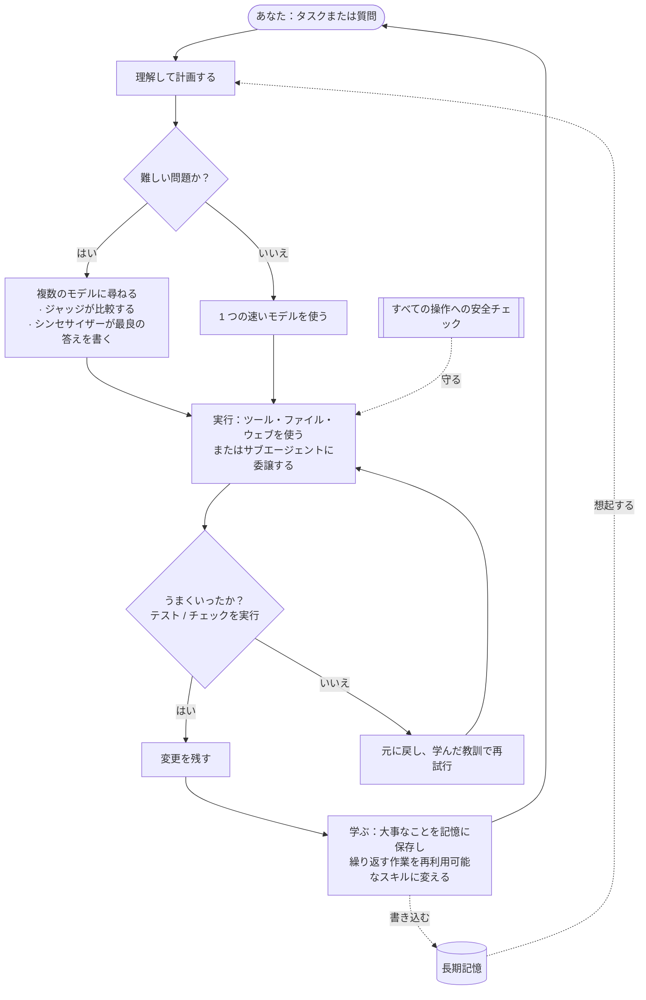

<div align="center">


# Chimera

**多くの知性で考え、そして日々賢くなっていく、オープンソースの AI エージェント。**

[](LICENSE)
[](https://www.python.org/)
[](https://github.com/brcampidelli/chimera-agent/actions/workflows/ci.yml)
[](https://mypy-lang.org/)
[](https://github.com/astral-sh/ruff)
[](https://discord.gg/ACvBbrmguV)


<sub><a href="README.md">English</a> · <a href="README.pt-BR.md">Português</a> · <a href="README.es.md">Español</a> · <a href="README.de.md">Deutsch</a> · <a href="README.fr.md">Français</a> · <a href="README.zh-CN.md">中文</a> · <b>日本語</b></sub>

</div>

ほとんどの AI アシスタントは **1 つの** モデルにすべてを賭けていて、チャットが終わればすべてを忘れてしまいます。
**Chimera は 2 つの点で違います。** 難しい質問には **複数の** AI モデルに同時に尋ね、その答えを 1 つの
より強い結果に混ぜ合わせます。そして **覚えて学ぶ** ので、使えば使うほど役に立つようになります。ただ会話する
だけではありません —— 目標を与えれば、計画を立て、ツールを使い、自分の作業を確認し、実際にうまくいったものだけを残します。

> **無料・オープンソース（Apache-2.0）、初期段階ながら活発に開発中。** すでにひととおり動きます。会話する、
> タスクを自分で最後までやらせる、お気に入りのメッセージアプリでボットとして動かす、サーバーにデプロイして
> 24 時間 365 日働かせる、そして自分の作業から学ぶ様子を眺める。まだ **alpha** です —— 堅牢で入念にテスト
> されています（460 件以上の自動テスト、変更ごとに厳格な型チェックと lint）が、本番環境で鍛え上げられた
> 段階にはまだ達していません。

---

## なぜ Chimera か

ほとんどの AI ツールは **1 人** の専門家に尋ねて、その人が正しいことを願うようなものだと考えてください。Chimera は
議論する **専門家のパネル**、その答えを比較する **公平なジャッジ**、そして一番よい組み合わせの結果を届ける
**執筆者** がいるようなものです —— さらに実際に **作業をこなし**、そこから **学ぶ** チームメイトでもあります。
Chimera を特別にしているものを、平易な言葉で説明します。

- 🧠 **多くの知性、1 つの答え。** 難しい質問には、Chimera は複数のモデルに同じことを尋ね、1 つのモデルにそれらの答えを比較させ、最後のモデルに一番よい組み合わせの回答を書かせます —— だから、どれか 1 つのモデル単独よりもバランスがよく、間違いにくい答えが得られます。（速く安く保つため、価値のあるときにだけこれを行います。）
- 🚀 **話すだけでなく、作業をこなす。** 目標を与えてください。それを分解し、ツールを使い、ファイルを編集し、テストを実行し、**合格したときにだけ変更を残します**。何かが壊れたら、それを元に戻してもう一度試します —— だから、あとに散らかしを残しません。
- 🧬 **使うほど賢くなる。** 会話をまたいであなたの好みや大事な事実を覚え、繰り返すタスクをそっと再利用可能なスキルに変えます。長く動かすうちにじわじわ劣化するのではなく、改善し続けるように作られています —— これは多くのエージェントを密かに蝕む問題です。
- 🛡️ **設計からして安全。** 危険な操作はすべて先に安全チェックを通り、破壊的なものは確認を求め、信頼できないコードは隔離されたサンドボックスの中で実行できます。
- 🔌 **どんなモデルでも、どこでも動く。** 大きなホスト型モデルでも、自分のローカルモデルでも、1 つのインターフェースで使えます —— ノート PC でも、月 5 ドルのサーバーでも、24 時間ずっと。
- 🧩 **本当にあなたのもの。** オープンソース、囲い込みなし、ベンダーのアカウント不要。あなたが動かし、あなたが所有し、何でも変えられます。

## 機能

### 🧠 考える・こなす
- **複数のモデルを 1 つの答えに混ぜ合わせる**（`chimera fuse`）—— モデルのパネル、どこで一致し・食い違い・見落としているかを浮かび上がらせるジャッジ、そして最終的な答えを書くシンセサイザー。賢いルーターは難しい問題にだけこの追加の労力を割きます。
- **タスクを自分で最後までやる**（`chimera solve`）—— 計画を立て、ツールで実行し、そして **検証して元に戻す**：あなたのチェック（例：テスト）を走らせ、合格したときにだけ変更を残し、そうでなければ元に戻して再試行します。任意で、プロジェクトの隔離されたコピー上で作業でき、証明されるまで何も触れられません。
- **専門家チーム**（`chimera crew`、`chimera crew-isolated`）—— 役割に特化した複数のエージェントが 1 つの仕事を分担します。分離モードでは、それぞれが **自分専用のコピー上で並列に** 作業します。安全な編集はマージされ、衝突は黙って上書きされる代わりにフラグが立ち、まずいワーカーの変更はワーカーごとのテストで却下できます。スーパーバイザーが全員の作業を 1 つの統一レポートにまとめられます。
- **委譲と探索** —— どのエージェントも、自己完結したサブタスクを新しい **サブエージェント** に渡せます。サブエージェントは結果だけを報告し、メインの文脈をきれいに保ちます。**Context Explorer**（`chimera explore`）はコードベースの中から適切なファイルと行を見つけ出し、すべてを吐き出す代わりに短い答えを返します。

### 🧬 記憶と自己改善
- **長期記憶** —— 短期・最近・事実・あなたについての記憶に加え、物事がどう関連しているかのマップを保持します。記憶を高速な全文データベースに保存し、あなたの好みのプロフィールをどのチャットにも持ち込み、重複したメモを自動でマージし、あなたが好みを口にしたときにそっと保存を提案できます。
- **新しいスキルを学ぶ** —— 同じ種類のタスクに複数回成功すると、それをテスト済みで再利用可能なスキルに自動で変えます。
- **任意の自己トレーニング（上級者向け）** —— 自分自身の経験を記録できるので、あとでそこからモデルをファインチューニングできます。既定ではオフ。あなたが頼まない限り、何もトレーニングされません。

### 🔌 つなぐ・自動化する
- **どこでも話しかけられる** —— ターミナルのチャット、フルスクリーンのターミナルアプリ、あるいは **Discord、Telegram、Slack、Signal、WhatsApp** 上のボットとして。シンプルな HTTP エンドポイントもあります。
- **スケジューリングと能動性** —— 繰り返しの仕事を平易な言葉で与えられます（「毎朝、ニュースを要約して」）。組み込みのスケジューラを動かしておけば、あなたがメッセージを送ったときだけでなく **時間どおりに動きます**。
- **ツールと連携** —— ファイルの読み書き、シェルコマンドの実行、ウェブの閲覧、そしてサンドボックスでの安全なコード実行。ほぼどんなウェブサービス（その API 経由）や外部ツールともつながり、すでに使っている他のエージェントツールから設定をインポートできます。
- **すぐ使える機能同梱** —— ウェブ検索、画像生成、テキスト読み上げ、メール、カレンダー、コード実行などが、オンにするだけで使えます。

### 🚀 どこでも、安全に動かす
- **どんなモデルでも、1 つのインターフェース** —— ホスト型モデルでも自分のローカルモデルでも、1 つがダウンしたら自動で切り替わるフォールバックと、複数キーのローテーション付き。
- **1 コマンドでサーバーにデプロイ** —— Docker（またはベアメタル）で動かせば、起動したままで再起動後も自動で立ち上がります。**[docs/deploy.md](docs/deploy.md)** を参照。
- **セーフティ・カーネル** —— すべての操作へのチェック（許可 / 警告 / ブロック / 確認）、信頼できないコードのためのサンドボックス、そして何をしたかの完全な監査ログ。

## クイックスタート

**Python 3.11+** と [uv](https://docs.astral.sh/uv/)（高速な Python インストーラ）が必要です。

**1. インストール**
```bash
git clone https://github.com/brcampidelli/chimera-agent.git
cd chimera-agent
uv sync --extra dev
```

**2. AI プロバイダのキーを 1 つ追加。** 一番かんたんなのは [OpenRouter](https://openrouter.ai) のキーです —— 1 つのキーで
100 以上のモデルが使えます。
```bash
cp .env.example .env
# .env を開いて、たとえば次のように設定：  CHIMERA_OPENROUTER_KEYS=sk-or-...
```

**3. すべて準備できているか確認**
```bash
uv run chimera doctor
```

**4. 試してみる**
```bash
uv run chimera chat                         # 会話する（覚えています）
uv run chimera run "Explain what you can do in 3 bullets"
uv run chimera fuse "What's the best way to learn to cook?" --show-panel   # 複数モデルが混ざる様子を見る
uv run chimera solve "add a hello() function to app.py and a test for it" --verify "pytest -q"
```

**サーバーで動かす（24 時間 365 日働かせる）：**
```bash
docker compose up -d      # ゲートウェイ + スケジューラ；自動で再起動
```
詳しいガイド（Docker または systemd、スケジューリング、バックアップ、セキュリティ）：**[docs/deploy.md](docs/deploy.md)**。

## 仕組み

Chimera にタスクを与えると、計画を立て、考え（問題が難しいときはモデルを混ぜ合わせ）、ツールで実行し、
**自分の作業を確認して合格したものだけを残し**、そしてその結果から学びます —— 記憶と新しいスキルを次のタスクへ
還元しながら。



## コマンド

どのコマンドも `chimera <name>` です（インストール前は `uv run chimera <name>`）。

```bash
chimera doctor / models / features    # セットアップを確認、モデル一覧、オプション機能を見る
chimera chat                          # ターンをまたいで覚える対話型アシスタント
chimera tui                           # フルスクリーン端末アプリ
chimera run "PROMPT" --image pic.png  # 単発の答え（画像を読める）
chimera fuse "PROMPT" --show-panel    # 複数モデルを混ぜ合わせる：パネル -> ジャッジ -> シンセサイザー
chimera solve "TASK" --verify "pytest -q" --isolate   # タスクをこなす；チェックに合格したときだけ変更を残す
chimera crew "TASK" --mode supervisor         # 専門家チームが 1 つのタスクに取り組む
chimera crew-isolated "TASK" -W "name:role" --verify "..." --synthesize   # チーム、各自が隔離されたコピーで
chimera explore "where is login handled?"     # 適切なファイル/行を見つけ、短い答えを得る
chimera deliver "a launch plan" -o plan.md    # 洗練された文書を生成する
chimera serve --cron [--discord|--telegram|--slack|--signal]   # サービスとして動かす：チャットボット + スケジューラ
chimera cron add "brief" "0 8 * * *" "Summarize the news"       # 繰り返しの仕事をスケジュールする
chimera memory add / graph / consolidate      # 長期記憶：保存する、関連づける、整理する
chimera kanban add/board/run                   # 作業をエージェントに振り分けるタスクボード
chimera workflow flow.yaml                     # ファイルに記述した繰り返し可能な自動化を実行する
chimera migrate <source> <dir> --apply         # 別のエージェントツールから設定・スキル・記憶をインポートする
chimera evolve status / tune / recipe          # 任意：自己最適化する；モデルをファインチューニングするデータを準備する
chimera pet new --name Chimi                   # 小さな仮想コンパニオンを迎える :)
```

すべてのコマンドをコピペ例つきで見るには **[使い方ガイド](docs/usage.md)** を参照してください。

## アーキテクチャ

Chimera は各パートが明確に分かれた Python パッケージなので、どの部分も単独で理解したり拡張したりできます。

```
chimera/
  core/          エージェント・ループ：計画、実行、検証、残すか元に戻すか、そして隔離された作業コピー
  fusion/        「多くの知性」エンジン：パネル -> ジャッジ -> シンセサイザー + 賢いルーター
  memory/        短期 / 最近 / 事実 / あなたについての記憶 + 関係グラフ
  skills/        組み込みスキルライブラリと、関連スキルの見つけ方
  evolution/     成功から新しいスキルを学ぶこと、そしてそこから学ぶ経験
  governance/    セーフティ・カーネル（許可/警告/ブロック/確認）、監査ログ、変更管理
  orchestration/ エージェントのチーム：役割、クルー、隔離された並列ワーカー、統一レポート
  ecosystem/     高度な自己改善：エージェントを設計するエージェント、任意のモデル・トレーニング
  kanban/        エージェントにカードを渡すタスクボード
  workflow/      繰り返し可能な自動化をシンプルなファイルに記述して実行する
  tools/         組み込みツール（ファイル、シェル、ウェブ、検索）+ コード実行
  sandbox/       ツールをローカルまたは隔離されたコンテナの中で実行する
  integrations/  外部ツールと任意のウェブ API をつなぐ
  scheduler/     繰り返しの仕事 + それらを時間どおりに発火させるデーモン
  migration/     他のエージェントツールから設定を移してくる
  providers/     すべてのモデルへの 1 つのインターフェース、フォールバックとキー・ローテーション付き
  interface/     共有の会話エンジン（チャット、アプリ、ボットで使われる）
  server/        メッセージング・ゲートウェイと HTTP エンドポイント
  cli/           `chimera` コマンド
```

完全な設計については [docs/architecture.md](docs/architecture.md) を参照してください。

## ビジョンとゴール

**Chimera のゴールはシンプルです：誰でも動かせて、1 つを信じるのではなく多くのモデルを組み合わせてより良く推論し、
使えば使うほど本当に賢くなり、そしてその過程でずっと安全かつ完全にオープンであり続ける AI エージェント。**

今日のほとんどの AI ツールは、賢いけれど忘れっぽい（チャットが終わればすべてを失う）か、有能だけれど閉じている
（あなたが制御できない）かのどちらかです。そして「自己改善」しようとする多くのものは、長く動かすうちに密かに
*悪く* なっていきます。Chimera は、別の道を目指す私たちの試みです。

- **より良い思考、けれど請求額は増やさない** —— 役に立つときにだけ複数のモデルを組み合わせるので、無駄なく品質が上がります。
- **本物の記憶と本物のスキル** —— 大事なことを覚え、繰り返す作業を再利用可能な能力に変えます。
- **長続きする改善** —— 自分の作業を確認し、状態をモデルの外に安全に保つことで、他のエージェントを蝕むじわじわとした劣化に抗います。
- **安全で透明** —— すべての操作は確認可能で、破壊的なものは先に尋ねます。
- **みんなに開かれている** —— 無料、Apache-2.0 ライセンス、コミュニティ主導、囲い込みなし。

まだ初期（alpha）で、私たちは正直さを大切にしています：ヘビーな本番利用ではまだ証明されていません。このビジョンに
わくわくするなら、ぜひそこへたどり着くのを手伝ってください。

## 開発

```bash
git clone https://github.com/brcampidelli/chimera-agent.git
cd chimera-agent
uv sync --extra dev

uv run ruff check .      # スタイル/lint
uv run mypy chimera      # 厳格な型チェック
uv run pytest -q         # テストスイート
```

貢献は大歓迎です —— コード、ドキュメント、アイデア、バグ報告。まずは
[CONTRIBUTING.md](CONTRIBUTING.md) と [行動規範](CODE_OF_CONDUCT.md) からどうぞ。
セキュリティ問題を見つけましたか？ [SECURITY.md](SECURITY.md) を参照してください。

## コミュニティ

質問、アイデア、あるいは貢献したいことがありますか？ **[Discord に参加してください](https://discord.gg/ACvBbrmguV)** —— どなたでも歓迎します。

## ライセンス

[Apache-2.0](LICENSE) —— 自由に使い、変更し、その上に作れます。
