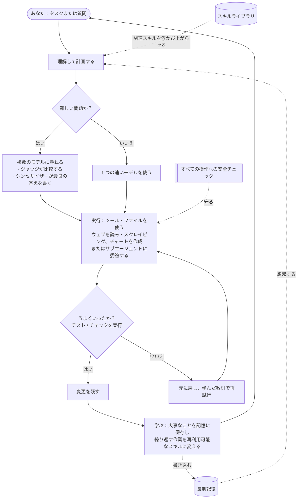

<div align="center">


# Chimera

**統制された自己進化エージェント — 実証済み、そして統制済み。**<br/>
<sub>多くの知性で考え、自ら実際の作業をこなし、実証されたものだけを学び、アーキテクチャによって安全です。</sub>

[](https://pypi.org/project/chimera-agent/)
[](LICENSE)
[](https://www.python.org/)
[](https://github.com/brcampidelli/chimera-agent/actions/workflows/ci.yml)
[](https://mypy-lang.org/)
[](https://github.com/astral-sh/ruff)
[](https://discord.gg/ACvBbrmguV)
[](https://www.reddit.com/r/ChimeraAgent/)

[](https://donate.stripe.com/9B63cofM491m4SBfe177O00)

<sub><a href="README.md">English</a> · <a href="README.pt-BR.md">Português</a> · <a href="README.es.md">Español</a> · <a href="README.de.md">Deutsch</a> · <a href="README.fr.md">Français</a> · <a href="README.zh-CN.md">中文</a> · <b>日本語</b></sub>

</div>

ほとんどの AI アシスタントは **1 つの** モデルにすべてを賭けていて、チャットが終わればすべてを忘れてしまいます。
**Chimera は 2 つの点で違います。** 難しい質問には **複数の** AI モデルに同時に尋ね、その答えを 1 つの
より強い結果に混ぜ合わせます。そして **覚えて学ぶ** ので、使えば使うほど役に立つようになります。ただ会話する
だけではありません —— 目標を与えれば、計画を立て、ツールを使い、自分の作業を確認し、実際にうまくいったものだけを残します。

> **無料・オープンソース（Apache-2.0）、初期段階ながら活発に開発中。** すでにひととおり動きます。会話する、
> タスクを自分で最後までやらせる、お気に入りのメッセージアプリでボットとして動かす、サーバーにデプロイして
> 24 時間 365 日働かせる、そして自分の作業から学ぶ様子を眺める。まだ **alpha** です —— 堅牢で入念にテスト
> されています（**1000 件以上の自動テスト**、変更ごとに厳格な型チェックと lint）が、本番環境で鍛え上げられた
> 段階にはまだ達していません。

---

## なぜ Chimera か

ほとんどの AI ツールは **1 人** の専門家に尋ねて、その人が正しいことを願うようなものだと考えてください。Chimera は
議論する **専門家のパネル**、その答えを比較検討する **公平なジャッジ**、そして一番よい組み合わせの結果を届ける
**執筆者** がいるようなものです —— さらに実際に **作業をこなし**、そこから **学ぶ** チームメイトでもあります。
Chimera を特別にしているものを、平易な言葉で説明します。

- 🧠 **多くの知性、1 つの答え。** 難しい質問には、Chimera は複数のモデルに同じことを尋ね、1 つのモデルにそれらの答えを比較させ、最後のモデルに一番よい組み合わせの回答を書かせます —— だから、どれか 1 つのモデル単独よりもバランスがよく、間違いにくい答えが得られます。（速く安く保つため、価値のあるときにだけこれを行います。）
- 🚀 **話すだけでなく、作業をこなす。** 目標を与えてください。それを分解し、ツールを使い、ファイルを編集し、テストを実行し、**合格したときにだけ変更を残します**。何かが壊れたら、それを元に戻してもう一度試します —— だから、あとに散らかしを残しません。
- 🧬 **使うほど賢くなる。** 会話をまたいであなたの好みや大事な事実を覚え、繰り返すタスクをそっと再利用可能なスキルに変えます。長く動かすうちにじわじわ劣化するのではなく、改善し続けるように作られています —— これは多くのエージェントを密かに蝕む問題です。
- 🛡️ **設計からして安全。** 危険な操作はすべて先に安全チェックを通り、破壊的なものは確認を求め、信頼できないコードはネットワークを切ったロックダウン済みのコンテナの中で実行できます。（こうしたチェックは安価な一次フィルタであって、本当の境界ではありません——境界はサンドボックスです。かつコンテナ分離はオプトインです。[SECURITY.md](SECURITY.md) を参照。）
- 🔌 **どんなモデルでも、どこでも動く。** 大きなホスト型モデルでも、自分のローカルモデルでも、1 つのインターフェースで使えます —— ノート PC でも、月 5 ドルのサーバーでも、24 時間ずっと。
- 🧩 **本当にあなたのもの。** オープンソース、囲い込みなし、ベンダーのアカウント不要。あなたが動かし、あなたが所有し、何でも変えられます。

## Chimera はどう違うのか

Chimera は巨大なエージェントプロジェクトと *機能の数* で張り合おうとはしません。5 つのリーダー（OpenClaw、Hermes、
nanobot、CrewAI、LangGraph）を実際にリバースエンジニアリングした調査が、それらが **いずれも未解決のまま残している** と
突き止めた 3 つのことに賭け、それを Chimera の核心に据えています。

- 🧬 **適応度シグナルを伴う自己進化。** 他のツールは、起きたことをそのまま追記するか、人間のプルリクエストで「学習」します —— 学んだ変更が実際に役立ったかを測るものは何もありません。Chimera は **検証済みの結果がそれを証明したときにだけ** 変更を残します：進化のステップは、実際のワーキングツリーの diff と正直な A/B にゲートされていて、モデルの言い分では決してありません。これが重要である独立した証拠：[EvoAgentBench（arXiv 2607.05202）](https://arxiv.org/abs/2607.05202) は、*自動的*でゲートされていない経験エンコード手法がしばしば **負の転移** を生むことを計測しました —— ある人気の手法は、チューニングされていないタスクで **−12.3 ポイント** 後退しました。Chimera のゲートは今や **転移ホールドアウト** も実行します：学んだ変更は、昇格される前に、重ならない同一能力のスライスを後退させてはならず、だから自分自身の評価を丸暗記することはできません。
- 🛡️ **アーキテクチャによるセキュリティ。** プロンプトインジェクションは今や広く *パッチ不能* と見なされています。人気のエージェントはアプリ層で緩和するか、対象外だと宣言しています（あるツールは 13.5 万件の公開インスタンスを出荷し、マーケットプレイスの約 12% が悪意あるスキルで埋まっていました）。Chimera は本物の防御レイヤーを備えています — **`--taint` によるオプトインで、既定はオフ**：テイントの由来を *ヒューリスティックに*（逐語的な参照／内容フローで、真のデータフローではない — テイント内容を言い換えるモデルはそれを「洗浄」できる）追跡し、信頼できないコンテンツから制御トークンを取り除き、汚染された実行の残りで危険なツールへのアクセスを絞り込み、副作用のあるリトライを守ります。信頼できないコードはオプトインのロックダウン済みコンテナ内で実行されます。主張ではなく計測: 組み込みの **7 件の攻撃** コーパスで、攻撃成功率を **100% → 約14%** に下げます（[`chimera/eval/injection.py`](chimera/eval/injection.py)）。[`SECURITY.md`](SECURITY.md) は、何がなお通り抜けるか（サブエージェント間の受け渡し、フュージョン／要約、CLI 以外の入口）を明記しています。封じ込めの境界はサンドボックスであり、このレイヤーはその上の多層防御です。
- 📊 **正直で、公開されたベンチマーク。** ある人気のリーダーボードの「解決済み」ケースの約 20% は、実は間違っています。Chimera はすべての数字を信頼区間つきで報告します —— **勝てなかった実行も含めて** —— そして有意性を得るために振り直すことは決してしません。記録されたペア実行では、フルループが **事前登録した 100 タスクのスイートで弱いモデルを引き上げる —— 9% → 15%（+6pp）、95% 信頼区間 [+1.3%, +6.0%] —— 統計的に有意**（区間がゼロを除外）であることが示されました。**ループが回復させた 6 つのタスク**（素の失敗 → 検証済みの合格）によるもので、**リグレッションはゼロ**。絶対値が低いのは意図的で、100 タスクのうち 85 が両方のアームで失敗するほど難しいためです（ループに余地を残すための意図的な床）。1 回の実行、振り直しなし。そして **公式の Terminal-Bench** では、事前登録した N=40 の A/B が **分散に支配された床にとどまり、どちらの向きにも有意差なし** という結果になり、そのまま公開されました（[`bench/terminal_bench/RESULTS.md`](bench/terminal_bench/RESULTS.md)）—— 対照群を計測した時点で **誤った中間結果を撤回した** ことも含めて。ヌル結果や自己修正も出荷します。それが要点です。

**一言で言えば：統制された自己進化エージェント — 実証済み、そして統制済み。** alpha であり、それをそう明言しています。

## トークン経済 — 主張ではなく、計測

「モデルが多いほど良い」という 2 つの直感を、実際の実行でストレステストしました（予測は各実行の
*前に* 登録し、勝ちも **負けも** 公開しています —— [`bench/`](bench/) を参照）。

**フュージョンは既定ではなく、控えめに使う。** 12 タスクの推論スイートで、中位ティア単独が
846 トークンで 100% を記録しました。フルフュージョンも 100% を記録しました —— ただし **9,526 トークン（約 11 倍）** で。
だからフュージョンは、安価→ゲート→中位→フュージョンというカスケードの背後に置かれ、無料のゲートが失敗したときにだけ
エスカレートし、フュージョンのおよそ 1/12 のコストで中位相当の品質に達します。

**階層的オーケストレーションは、効くべきところでだけ勝つ —— しかも書き下せる法則によって。**
`chimera orchestrate` はタスクを 1 つの大きな文脈ではなく、スコープを絞ったワーカーに分割します。単一の
エージェントはすべてのドキュメントを毎ターン送り直しますが、スコープを絞ったワーカーは各ドキュメントを一度だけ読みます。だからトークンの節約は
ドキュメント数 D に対して **(D−1)/D** としてスケールします —— 実際の実行で <0.2% の誤差で確認済み：

| ドキュメント数 (D) | 計測されたトークン節約 | (D−1)/D |
|---|---|---|
| 2 | 49.9% | 50% |
| 3 | 66.7% | 66.7% |
| 4 | 74.8% | 75% |
| 5 | 79.9% | 80% |

節約は会話が長くなっても横ばいのまま保たれ、ドキュメントが大きくなるにつれて同じ
限界へと上昇します（[3 軸の完全スイープ](bench/hierarchy_sweep/README.md)）。そして *割に合わない* ところ —— 
1 ターンの単発タスク —— では、分類器がそれを検出して **単一エージェントにフォールバックします**
（その実行はトークンが +47% 多くかかりました。それも公開しました）。

**正直な注記。** これらは *トークン* 数です。プロンプトキャッシュを使うと、プロバイダは単一
エージェントの繰り返されるドキュメントを約 0.1 倍で課金するので、*金額* 面での勝ちはより小さくなります —— そして数ターンを超えると
**逆転** することさえあります（独立したワーカーは、単一エージェントがキャッシュするコールドな文脈を再び支払います）。私たちは
トークン数をこっそり金額として主張する代わりに、[これを定量化するモデル](bench/hierarchy_sweep/cache_cost.py) を出荷しています。

## 機能

### 🧠 考える・こなす
- **複数のモデルを 1 つの答えに混ぜ合わせる**（`chimera fuse`）—— モデルのパネル、どこで一致し・食い違い・見落としているかを浮かび上がらせるジャッジ、そして最終的な答えを書くシンセサイザー。賢いルーターは難しい問題にだけこの追加の労力を割き、最初のモデルどうしがすでに一致しているときは早めに打ち切ります —— 私たちのベンチマークでは、精度を損なうことなくトークンを **約 20〜28% 削減** できることが計測されています。（フュージョン / mixture-of-agents 自体は独自のものではなく——OpenRouter や他のツールにもあります。ここでの違いは、それがコストを意識したルーターの背後でエージェントのループに組み込まれ、かつ実測されている点で、あなたが選ぶ「モデル」ではありません。）
- **タスクを自分で最後までやる**（`chimera solve`）—— 計画を立て、ツールで実行し、そして **検証して元に戻す**：あなたのチェック（例：テスト）を走らせ、合格したときにだけ変更を残し、そうでなければ元に戻して再試行します。任意で、プロジェクトの隔離されたコピー上で作業でき、証明されるまで何も触れられません。
- **専門家チーム**（`chimera crew`、`chimera crew-isolated`）—— 役割に特化した複数のエージェントが 1 つの仕事を分担します。分離モードでは、それぞれが **自分専用のコピー上で並列に** 作業します。安全な編集はマージされ、衝突は黙って上書きされる代わりにフラグが立ち、まずいワーカーの変更はワーカーごとのテストで却下できます。スーパーバイザーが全員の作業を 1 つの統一レポートにまとめられます。
- **委譲と探索** —— どのエージェントも、自己完結したサブタスクを新しい **サブエージェント** に渡せます。サブエージェントは結果だけを報告し、メインの文脈をきれいに保ちます。**Context Explorer**（`chimera explore`）はコードベースの中から適切なファイルと行を見つけ出し、すべてを吐き出す代わりに短い答えを返します。

### 🧬 記憶と自己改善
- **長期記憶** —— 短期・最近・事実・あなたについての記憶に加え、物事がどう関連しているかのマップを保持します。記憶を高速な全文データベースに保存し、あなたの好みのプロフィールをどのチャットにも持ち込み、重複したメモを自動でマージし、あなたが好みを口にしたときにそっと保存を提案できます。
- **新しいスキルを学ぶ** —— 同じ種類のタスクに複数回成功すると、それをテスト済みで再利用可能なスキルに自動で変えます。
- **任意の自己トレーニング（上級者向け）** —— 自分自身の経験を記録できるので、あとでそこからモデルをファインチューニングできます。既定ではオフ。あなたが頼まない限り、何もトレーニングされません。

### 🔌 つなぐ・自動化する
- **どこでも話しかけられる** —— ターミナルのチャット、フルスクリーンのターミナルアプリ、あるいは **Discord、Telegram、Slack、Signal、WhatsApp** 上のボットとして。シンプルな HTTP エンドポイントもあります。
- **スケジューリングと能動性** —— 繰り返しの仕事を平易な言葉で与えられます（「毎朝、ニュースを要約して」）。組み込みのスケジューラを動かしておけば、あなたがメッセージを送ったときだけでなく **時間どおりに動きます**。
- **ツールと連携** —— ファイルの読み書き、シェルコマンドの実行、**完全にレンダリングされたウェブページの読み取りと、サイト全体のスクレイピングやクロール**（インジェクションに強い構造化抽出つき）、そしてサンドボックスでの安全なコード実行。ほぼどんなウェブサービス（その API 経由）や外部ツールともつながり —— どんな **MCP サーバー**（[ガイド + 実行可能な例](docs/mcp.md)）とも —— すでに使っている他のエージェントツールから設定をインポートできます。
- **すぐ使える機能同梱** —— ウェブ検索、画像生成（ホスト型**または完全ローカル**）、**音声認識（speech-to-text）**とテキスト読み上げ、**メディアのダウンロード**、**データ分析とチャート**、メール、カレンダー、コード実行などが、オンにするだけで使えます。

### 🚀 どこでも、安全に動かす
- **どんなモデルでも、1 つのインターフェース** —— ホスト型モデルでも自分のローカルモデルでも、1 つがダウンしたら自動で切り替わるフォールバックと、複数キーのローテーション付き。
- **1 コマンドでサーバーにデプロイ** —— Docker（またはベアメタル）で動かせば、起動したままで再起動後も自動で立ち上がります。**[docs/deploy.md](docs/deploy.md)** を参照。
- **セーフティ・カーネル** —— すべての操作へのチェック（許可 / 警告 / ブロック / 確認）、信頼できないコードのための**オプトインの**ネットワーク分離コンテナ（`CHIMERA_SANDBOX=docker`。デフォルトの local ランナーは分離**されません**）、そして何をしたかの完全な監査ログ。

## クイックスタート

**Python 3.11+** と [uv](https://docs.astral.sh/uv/)（高速な Python インストーラ）が必要です。

**1. インストール** — PyPI から：
```bash
pip install chimera-agent
```
これで `chimera` コマンドが使えます。（以下の例では、ソースからのチェックアウト向けに `uv run chimera` を使っています。pip でインストールした場合は `chimera …` だけで実行できます。）Chimera 自体を開発する場合は、リポジトリをクローンしてください：
```bash
git clone https://github.com/brcampidelli/chimera-agent.git
cd chimera-agent
uv sync --extra dev
```

**2. AI プロバイダのキーを 1 つ追加。** 一番かんたんなのは [OpenRouter](https://openrouter.ai) のキーです —— 1 つのキーで
100 以上のモデルが使えます。
```bash
cp .env.example .env
# .env を開いて、たとえば次のように設定：  CHIMERA_OPENROUTER_KEYS=sk-or-...
```

**3. すべて準備できているか確認**
```bash
uv run chimera doctor
```

**4. 試してみる**
```bash
uv run chimera chat                         # 会話する（覚えています）
uv run chimera run "Explain what you can do in 3 bullets"
uv run chimera fuse "What's the best way to learn to cook?" --show-panel   # 複数モデルが混ざる様子を見る
uv run chimera solve "add a hello() function to app.py and a test for it" --verify "pytest -q"
```

**サーバーで動かす（24 時間 365 日働かせる）：**
```bash
docker compose up -d      # ゲートウェイ + スケジューラ；自動で再起動
```
詳しいガイド（Docker または systemd、スケジューリング、バックアップ、セキュリティ）：**[docs/deploy.md](docs/deploy.md)**。

**5. 5 分で何か実のあることを：メールのトリアージ。** Chimera を自分の受信トレイに向けて、10 秒の
ダイジェストを受け取りましょう —— 読み取り専用で、URGENT / PERSONAL / NEWSLETTER / COLD-SALES に分類し、
任意で毎朝スケジュールできます：
```bash
uv run chimera workflow examples/email_triage/triage.yaml -w ./triage_workspace
```
セットアップ + 毎日のスケジューリング + 正直な注意点：**[examples/email_triage/README.md](examples/email_triage/README.md)**。

## 🧰 Chimera にできること —— そして各機能の有効化方法

はじめての方へ。`pip install chimera-agent` と AI キーが 1 つあれば Chimera はすぐ使えます。一部の機能
（ドキュメントを読む、音声を聞く、グラフを作る、動画をダウンロードする…）は **「extra（追加パッケージ）」**
という小さな任意パッケージが必要で、いくつかはサービスのキーが必要です。このセクションでは**各機能、
何をインストールすればよいか、そして試すためのコマンド**を一覧にします。予備知識は不要です。

### すべて一度に有効化
```bash
pip install 'chimera-agent[full]'     # 下記の非 GPU 機能すべてを 1 コマンドで
```
音声と動画にはお使いのパソコンに **ffmpeg** も必要です：
`macOS：brew install ffmpeg` · `Ubuntu/Debian：sudo apt install ffmpeg` · `Windows：choco install ffmpeg`。
軽くしたい場合は `pip install chimera-agent` のままで、必要な extra だけ追加してください（「必要なもの」列参照）。
**Docker を使う場合、公式イメージには以下すべてが最初から入っています。**

### 各機能、ひとつずつ
**必要なもの** = 追加するもの：`—` 基本インストールで動く · `[extra]` = `pip install 'chimera-agent[extra]'` · `キー：X` = `.env` に設定するプロバイダのキー。

| できること | 必要なもの | 使い方 |
|---|---|---|
| **あなたを覚えるチャット** | — | `chimera chat` |
| **質問を 1 つする** | — | `chimera run "X を 3 点で説明して"` |
| **フルスクリーンのターミナルアプリ** | — | `chimera tui` |
| **タスクを実行し、チェックに通った時だけ残す** | — | `chimera solve "app.py に hello() とテストを追加" --verify "pytest -q"` |
| **複数モデルを 1 つの回答に融合** | — | `chimera fuse "あなたの質問" --show-panel` |
| **専門エージェントのチーム** | — | `chimera crew "あなたのタスク" --mode supervisor` |
| **プロジェクト全体を最後までやり切る**（危険な手順の前に確認で一時停止） | — | `chimera project start spec.yaml -w .` |
| **画像を見る**（ビジョン） | キー：Gemini か OpenAI | `chimera run --image photo.jpg "これは何？" --model gemini/gemini-2.0-flash` |
| **音声を聞く**（音声 → 文字） | `[stt]` + ffmpeg | `chimera run "meeting.mp3 を文字起こしして"` |
| **話す**（文字 → 音声） | キー：ElevenLabs か OpenAI | 任意のタスクに「これを読み上げて speech.mp3 に保存して」 |
| **ドキュメントを読む**（PDF・Word・Excel → 文字） | `[documents]` | `chimera run "report.pdf を要約して"` |
| **動画/音声をダウンロード**（YouTube ほか 1000+ サイト） | `[media-dl]` + ffmpeg | `chimera run "<url> の音声をダウンロードして"` |
| **データ分析とグラフ作成** | `[data,viz]` | `chimera run "sales.csv を読み込んで月次売上をグラフに"` |
| **ウェブ検索** | キー：Tavily | `chimera run "ウェブ検索：最新の Python バージョン"` |
| **実際のウェブページを読む・スクレイプ**（本物のブラウザ） | — | `chimera run "example.com を開いて見出しを教えて"` |
| **長期記憶** | — | `chimera memory add "..."` · `chimera memory search "..."` |
| **再利用可能なスキルを自分で学習** | — | `chimera solve` の実行中に起こる；`chimera skills` で一覧 |
| **定期的な作業をスケジュール** | — | `chimera cron add brief "0 8 * * *" "ニュースを要約して"` |
| **チャットボットとして稼働**（Discord/Telegram/Slack/Signal/WhatsApp） | `[messaging]` | `chimera serve --cron --discord` |
| **任意の外部ツールに接続**（MCP） | `[mcp]` | ガイド：[docs/mcp.md](docs/mcp.md) |
| **画像生成**（クラウド） | キー：OpenAI | タスクに「…の画像を生成して」 |
| **画像生成**（完全ローカル、GPU 必要） | `[imagegen-local]` | 同上、オフライン |

> 軽くしたい場合は extra を個別にインストール —— `messaging`・`mcp`・`documents`・`media-dl`・`stt`・
> `data`・`viz`・`youtube`（すべて `full` に含まれます）に加え、GPU 専用の `imagegen-local` と `train`。
> 例：`pip install 'chimera-agent[documents,stt]'`。

### 初めてですか？初心者向けの 6 ステップ
1. **Python 3.11+ をインストール**（[python.org](https://www.python.org/downloads/)）；`python --version` で確認。
2. **Chimera をインストール：** `pip install 'chimera-agent[full]'`（または軽量コアなら `chimera-agent` だけ）。
3. **AI キーを 1 つ入手** —— [OpenRouter](https://openrouter.ai) のキーが一番簡単（1 キー → 100+ モデル）。
4. **キーを Chimera に渡す：** `.env.example` を `.env` にコピーし、`CHIMERA_OPENROUTER_KEYS=sk-or-...` を設定。
5. **準備できたか確認：** `chimera doctor` —— 何が設定済みで何が足りないか教えてくれます。
6. **試す：** `chimera chat`。

ここから先は、上の表のどのコマンドもそのまま動きます。コピペ例つきの完全なコマンドリファレンス：
**[docs/usage.md](docs/usage.md)**。

## 仕組み

Chimera にタスクを与えると、計画を立て（最も関連性の高い組み込みスキルを浮かび上がらせ）、考え（問題が難しいときは
モデルを混ぜ合わせ）、ツールで実行し —— ウェブを読み・スクレイピングし、ファイルを編集し、チャートを作り ——
**自分の作業を確認して合格したものだけを残し**、そしてその結果から学びます —— 記憶と新しいスキルを次のタスクへ
還元しながら。



## コマンド

どのコマンドも `chimera <name>` です（インストール前は `uv run chimera <name>`）。

```bash
chimera doctor / models / features    # セットアップを確認、モデル一覧、オプション機能を見る
chimera chat                          # ターンをまたいで覚える対話型アシスタント
chimera tui                           # フルスクリーン端末アプリ
chimera run "PROMPT" --image pic.png  # 単発の答え（画像を読める）
chimera fuse "PROMPT" --show-panel    # 複数モデルを混ぜ合わせる：パネル -> ジャッジ -> シンセサイザー
chimera solve "TASK" --verify "pytest -q" --isolate   # タスクをこなす；チェックに合格したときだけ変更を残す
chimera crew "TASK" --mode supervisor         # 専門家チームが 1 つのタスクに取り組む
chimera crew-isolated "TASK" -W "name:role" --verify "..." --synthesize   # チーム、各自が隔離されたコピーで
chimera explore "where is login handled?"     # 適切なファイル/行を見つけ、短い答えを得る
chimera deliver "a launch plan" -o plan.md    # 洗練された文書を生成する
chimera serve --cron [--discord|--telegram|--slack|--signal]   # サービスとして動かす：チャットボット + スケジューラ
chimera cron add "brief" "0 8 * * *" "Summarize the news"       # 繰り返しの仕事をスケジュールする
chimera memory add / graph / consolidate      # 長期記憶：保存する、関連づける、整理する
chimera kanban add/board/run                   # 作業をエージェントに振り分けるタスクボード
chimera workflow flow.yaml                     # ファイルに記述した繰り返し可能な自動化を実行する
chimera migrate <source> <dir> --apply         # 別のエージェントツールから設定・スキル・記憶をインポートする
chimera evolve status / tune / recipe          # 任意：自己最適化する；モデルをファインチューニングするデータを準備する
chimera fusion-bench / skillcard-bench / schema-bench / sandbox-bench   # 正直な A/B ベンチマーク：機能を信頼する前にコスト・品質・副作用を計測する
chimera pet new --name Chimi                   # 小さな仮想コンパニオンを迎える :)
```

すべてのコマンドをコピペ例つきで見るには **[使い方ガイド](docs/usage.md)** を参照してください。

## アーキテクチャ

Chimera は各パートが明確に分かれた Python パッケージなので、どの部分も単独で理解したり拡張したりできます。

```
chimera/
  core/          エージェント・ループ：計画、実行、検証、残すか元に戻すか、そして隔離された作業コピー
  fusion/        「多くの知性」エンジン：パネル -> ジャッジ -> シンセサイザー + 賢いルーター
  memory/        短期 / 最近 / 事実 / あなたについての記憶 + 関係グラフ
  skills/        組み込みスキルライブラリと、関連スキルの見つけ方
  evolution/     成功から新しいスキルを学ぶこと、そしてそこから学ぶ経験
  governance/    セーフティ・カーネル（許可/警告/ブロック/確認）、監査ログ、変更管理
  orchestration/ エージェントのチーム：役割、クルー、隔離された並列ワーカー、統一レポート
  ecosystem/     高度な自己改善：エージェントを設計するエージェント、任意のモデル・トレーニング
  kanban/        エージェントにカードを渡すタスクボード
  workflow/      繰り返し可能な自動化をシンプルなファイルに記述して実行する
  tools/         組み込みツール（ファイル、シェル、ウェブ、検索）+ コード実行
  sandbox/       ツールをローカルまたは隔離されたコンテナの中で実行する
  integrations/  外部ツールと任意のウェブ API をつなぐ
  scheduler/     繰り返しの仕事 + それらを時間どおりに発火させるデーモン
  migration/     他のエージェントツールから設定を移してくる
  providers/     すべてのモデルへの 1 つのインターフェース、フォールバックとキー・ローテーション付き
  interface/     共有の会話エンジン（チャット、アプリ、ボットで使われる）
  server/        メッセージング・ゲートウェイと HTTP エンドポイント
  cli/           `chimera` コマンド
```

完全な設計については [docs/architecture.md](docs/architecture.md) を参照してください。

## ビジョンとゴール

**Chimera のゴールはシンプルです：誰でも動かせて、1 つを信じるのではなく多くのモデルを組み合わせてより良く推論し、
使えば使うほど本当に賢くなり、そしてその過程でずっと安全かつ完全にオープンであり続ける AI エージェント。**

今日のほとんどの AI ツールは、賢いけれど忘れっぽい（チャットが終わればすべてを失う）か、有能だけれど閉じている
（あなたが制御できない）かのどちらかです。そして「自己改善」しようとする多くのものは、長く動かすうちに密かに
*悪く* なっていきます。Chimera は、別の道を目指す私たちの試みです。

- **より良い思考、けれど請求額は増やさない** —— 役に立つときにだけ複数のモデルを組み合わせるので、無駄なく品質が上がります。
- **本物の記憶と本物のスキル** —— 大事なことを覚え、繰り返す作業を再利用可能な能力に変えます。
- **長続きする改善** —— 自分の作業を確認し、状態をモデルの外に安全に保つことで、他のエージェントを蝕むじわじわとした劣化に抗います。
- **安全で透明** —— すべての操作は確認可能で、破壊的なものは先に尋ねます。
- **みんなに開かれている** —— 無料、Apache-2.0 ライセンス、コミュニティ主導、囲い込みなし。

まだ初期（alpha）で、私たちは正直さを大切にしています：ヘビーな本番利用ではまだ証明されていません。このビジョンに
わくわくするなら、ぜひそこへたどり着くのを手伝ってください。

## 開発

```bash
git clone https://github.com/brcampidelli/chimera-agent.git
cd chimera-agent
uv sync --extra dev

uv run ruff check .      # スタイル/lint
uv run mypy chimera      # 厳格な型チェック
uv run pytest -q         # テストスイート
```

貢献は大歓迎です —— コード、ドキュメント、アイデア、バグ報告。まずは
[CONTRIBUTING.md](CONTRIBUTING.md) と [行動規範](CODE_OF_CONDUCT.md) からどうぞ。
セキュリティ問題を見つけましたか？ [SECURITY.md](SECURITY.md) を参照してください。

## コミュニティ

質問、アイデア、あるいは貢献したいことがありますか？ **[Discord に参加してください](https://discord.gg/ACvBbrmguV)** —— どなたでも歓迎します。

Reddit 派ですか？ アップデートやディスカッションは **[r/ChimeraAgent](https://www.reddit.com/r/ChimeraAgent/)** で。

## プロジェクトを支援する

Chimera は無料のオープンソースで、オープンに開発されています。もし役に立ったら、一度きりの寄付で開発を応援していただけます —— どんな支援もとても励みになり、心から感謝します。💜

**[💜 Stripe で寄付する](https://donate.stripe.com/9B63cofM491m4SBfe177O00)**

## ライセンス

[Apache-2.0](LICENSE) —— 自由に使い、変更し、その上に作れます。
