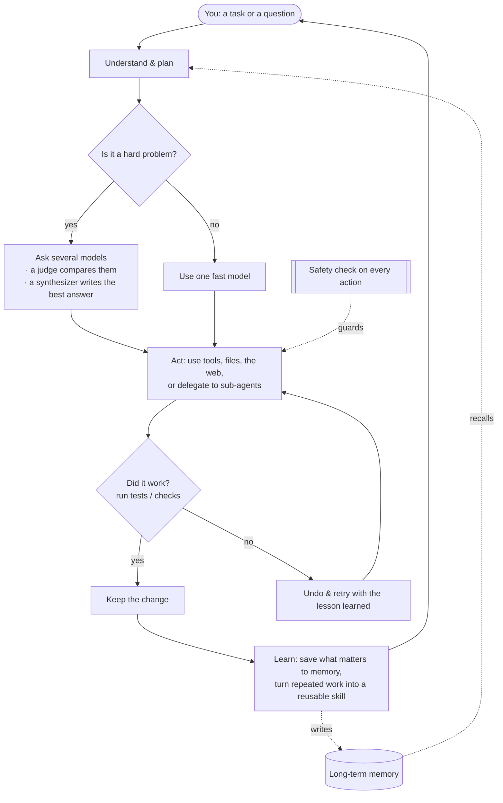

<div align="center">


# Chimera

**The open-source AI agent that thinks with many minds — and gets better every day.**

[](LICENSE)
[](https://www.python.org/)
[](https://github.com/brcampidelli/chimera-agent/actions/workflows/ci.yml)
[](https://mypy-lang.org/)
[](https://github.com/astral-sh/ruff)
[](https://discord.gg/ACvBbrmguV)

[](https://donate.stripe.com/9B63cofM491m4SBfe177O00)

<sub><b>English</b> · <a href="README.pt-BR.md">Português</a> · <a href="README.es.md">Español</a> · <a href="README.de.md">Deutsch</a> · <a href="README.fr.md">Français</a> · <a href="README.zh-CN.md">中文</a> · <a href="README.ja.md">日本語</a></sub>

</div>

Most AI assistants bet everything on a **single** model and forget everything when the chat ends.
**Chimera does two things differently:** for hard questions it asks **several** AI models at once and
blends their answers into one stronger result, and it **remembers and learns** so it becomes more
useful the more you use it. It doesn't just chat — give it a goal and it plans, uses tools, checks
its own work, and keeps only what actually works.

> **Free and open-source (Apache-2.0), in early but active development.** It already works end to
> end: chat with it, let it finish tasks on its own, run it as a bot on your favourite messaging app,
> deploy it on a server so it works 24/7, and watch it learn from what it does. It's **alpha** — solid
> and heavily tested (460+ automated tests, strict type-checking and linting on every change), but not
> yet battle-hardened in production.

---

## Why Chimera

Think of most AI tools as asking **one** expert and hoping they're right. Chimera is like having a
**panel of experts** that debate, a **fair judge** that weighs their answers, and a **writer** that
delivers the best combined result — then a teammate who actually **does the work** and **learns** from
it. Here's what makes it special, in plain terms:

- 🧠 **Many minds, one answer.** For tough questions, Chimera asks several models the same thing, lets one model compare their answers, and has a final model write the best combined response — so you get something more balanced and less likely to be wrong than any single model alone. (It does this only when it's worth it, to stay fast and cheap.)
- 🚀 **It does the work, not just talk.** Give it a goal. It breaks it down, uses tools, edits files, runs the tests, and **keeps a change only if it passes**. If something breaks, it undoes it and tries again — so it doesn't leave a mess behind.
- 🧬 **It gets better the more you use it.** It remembers your preferences and important facts across conversations, and quietly turns tasks it repeats into reusable skills. It's built to keep improving instead of slowly getting worse over long runs — a problem that quietly degrades many agents.
- 🛡️ **Safe by design.** Every risky action passes a safety check first, anything destructive asks for confirmation, and it can run untrusted code inside a locked-down sandbox.
- 🔌 **Any model, runs anywhere.** Use big hosted models or your own local ones through a single interface — on your laptop or a $5 server, around the clock.
- 🧩 **Truly yours.** Open-source, no lock-in, no vendor account required. You run it, you own it, you can change anything.

## Features

### 🧠 Thinking & doing
- **Blend several models into one answer** (`chimera fuse`) — a panel of models, a judge that surfaces where they agree, disagree, or miss something, and a synthesizer that writes the final answer. A smart router only spends this extra effort on hard problems.
- **Finish tasks on its own** (`chimera solve`) — it plans, acts with tools, then **verifies and reverts**: it runs your check (e.g. tests) and keeps the change only if it passes, otherwise undoes it and retries. Optionally works on an isolated copy of your project so nothing is touched until it's proven.
- **Teams of specialists** (`chimera crew`, `chimera crew-isolated`) — several role-focused agents split one job. In isolated mode each works on its **own private copy in parallel**; safe edits are merged, clashes are flagged instead of silently overwritten, and a bad worker's changes can be rejected by a per-worker test. A supervisor can fold everyone's work into one unified report.
- **Delegate and explore** — any agent can hand a self-contained subtask to a fresh **sub-agent** that reports back only the result, keeping the main context clean. The **Context Explorer** (`chimera explore`) finds the right files and lines in a codebase and returns a short answer instead of dumping everything.

### 🧬 Memory & self-improvement
- **Long-term memory** — it keeps short-term, recent, factual, and about-you memories, plus a map of how things relate. It can store memories in a fast full-text database, carry a profile of your preferences into every chat, merge duplicate notes automatically, and gently suggest saving a preference when you mention one.
- **Learns new skills** — when it succeeds at the same kind of task more than once, it turns that into a tested, reusable skill automatically.
- **Optional self-training (advanced)** — it can record its own experience so you can later fine-tune a model from it. Off by default; nothing trains without you asking.

### 🔌 Connect & automate
- **Talk to it anywhere** — a terminal chat, a full-screen terminal app, or as a bot on **Discord, Telegram, Slack, Signal, and WhatsApp**. There's also a simple HTTP endpoint.
- **Scheduling & proactivity** — give it recurring jobs in plain language ("every morning, summarize the news"). With the built-in scheduler running, it **acts on time**, not only when you message it.
- **Tools & integrations** — read and write files, run shell commands, browse the web, and run code safely in a sandbox. Connect almost any web service (through its API) or external tool, and import your setup from other agent tools you already use.
- **Batteries included** — web search, image generation, text-to-speech, email, calendar, code execution, and more, ready to switch on.

### 🚀 Run anywhere, safely
- **Any model, one interface** — hosted models or your own local ones, with automatic fallback if one is down and rotation across multiple keys.
- **One-command server deploy** — run it with Docker (or bare-metal) so it stays up and restarts on reboot. See **[docs/deploy.md](docs/deploy.md)**.
- **Safety kernel** — a check on every action (allow / warn / block / ask), a sandbox for untrusted code, and a full audit log of what it did.

## Quickstart

You need **Python 3.11+** and [uv](https://docs.astral.sh/uv/) (a fast Python installer).

**1. Install**
```bash
git clone https://github.com/brcampidelli/chimera-agent.git
cd chimera-agent
uv sync --extra dev
```

**2. Add one AI provider key.** The easiest is an [OpenRouter](https://openrouter.ai) key — one key
unlocks 100+ models.
```bash
cp .env.example .env
# open .env and set, for example:  CHIMERA_OPENROUTER_KEYS=sk-or-...
```

**3. Check everything is ready**
```bash
uv run chimera doctor
```

**4. Try it**
```bash
uv run chimera chat                         # have a conversation (it remembers)
uv run chimera run "Explain what you can do in 3 bullets"
uv run chimera fuse "What's the best way to learn to cook?" --show-panel   # see several models blended
uv run chimera solve "add a hello() function to app.py and a test for it" --verify "pytest -q"
```

**Run it on a server (so it works 24/7):**
```bash
docker compose up -d      # gateway + scheduler; restarts automatically
```
Full guide (Docker or systemd, scheduling, backups, security): **[docs/deploy.md](docs/deploy.md)**.

## How it works

Give Chimera a task; it plans, thinks (blending models when the problem is hard), acts with tools,
**checks its own work and keeps only what passes**, then learns from the result — feeding memory and
new skills back into the next task.



## Commands

Every command is `chimera <name>` (or `uv run chimera <name>` before installing).

```bash
chimera doctor / models / features    # check setup, list models, see optional capabilities
chimera chat                          # interactive assistant that remembers across turns
chimera tui                           # full-screen terminal app
chimera run "PROMPT" --image pic.png  # one-shot answer (can read an image)
chimera fuse "PROMPT" --show-panel    # blend several models: panel -> judge -> synthesizer
chimera solve "TASK" --verify "pytest -q" --isolate   # do a task; keep the change only if the check passes
chimera crew "TASK" --mode supervisor         # a team of specialists tackles one task
chimera crew-isolated "TASK" -W "name:role" --verify "..." --synthesize   # team, each in its own isolated copy
chimera explore "where is login handled?"     # find the right files/lines, get a short answer
chimera deliver "a launch plan" -o plan.md    # produce a polished document
chimera serve --cron [--discord|--telegram|--slack|--signal]   # run as a service: chat bot + scheduler
chimera cron add "brief" "0 8 * * *" "Summarize the news"       # schedule recurring work
chimera memory add / graph / consolidate      # long-term memory: save, relate, tidy up
chimera kanban add/board/run                   # a task board that dispatches work to the agent
chimera workflow flow.yaml                     # run a repeatable automation described in a file
chimera migrate <source> <dir> --apply         # import settings, skills, and memory from another agent tool
chimera evolve status / tune / recipe          # optional: self-optimize; prepare data to fine-tune a model
chimera pet new --name Chimi                   # adopt a small virtual companion :)
```

See the **[Usage Guide](docs/usage.md)** for every command with copy-paste examples.

## Architecture

Chimera is a Python package with clearly separated parts, so you can understand or extend any piece
on its own:

```
chimera/
  core/          the agent loop: plan, act, verify, keep-or-undo, and isolated work copies
  fusion/        the "many minds" engine: panel -> judge -> synthesizer + the smart router
  memory/        short-term / recent / factual / about-you memory + a relationship graph
  skills/        the built-in skill library and how relevant skills are found
  evolution/     learning new skills from success, and the experience it learns from
  governance/    the safety kernel (allow/warn/block/ask), audit log, and change controls
  orchestration/ teams of agents: roles, crews, isolated parallel workers, unified reports
  ecosystem/     advanced self-improvement: agents that design agents, optional model training
  kanban/        a task board that hands cards to the agent
  workflow/      describe a repeatable automation in a simple file and run it
  tools/         built-in tools (files, shell, web, search) + code execution
  sandbox/       run tools locally or inside a locked-down container
  integrations/  connect external tools and any web API
  scheduler/     recurring jobs + the daemon that fires them on time
  migration/     bring your setup over from other agent tools
  providers/     one interface to every model, with fallback and key rotation
  interface/     the shared conversation engine (used by chat, the app, and bots)
  server/        the messaging gateway and HTTP endpoint
  cli/           the `chimera` command
```

See [docs/architecture.md](docs/architecture.md) for the full design.

## Vision & goals

**Chimera's goal is simple: an AI agent that anyone can run, that reasons better by combining many
models instead of trusting one, that truly gets better the more it's used, and that stays safe and
fully open along the way.**

Most AI tools today are either smart-but-forgetful (they lose everything when the chat ends) or
capable-but-closed (you don't control them). And many that try to "improve themselves" quietly get
*worse* over long runs. Chimera is our attempt at a different path:

- **Better thinking, not a bigger bill** — combine several models only when it helps, so quality goes up without waste.
- **Real memory and real skills** — remember what matters and turn repeated work into reusable abilities.
- **Improvement that lasts** — resist the slow decay that degrades other agents, by checking its own work and keeping state safely outside the model.
- **Safe and transparent** — every action is checkable, and destructive ones ask first.
- **Open to everyone** — free, Apache-2.0 licensed, community-driven, no lock-in.

It's early (alpha), and honesty matters to us: it's not yet proven in heavy production use. If that
vision excites you, we'd love your help getting there.

## Development

```bash
git clone https://github.com/brcampidelli/chimera-agent.git
cd chimera-agent
uv sync --extra dev

uv run ruff check .      # style/lint
uv run mypy chimera      # strict type checks
uv run pytest -q         # the test suite
```

Contributions are very welcome — code, docs, ideas, bug reports. Start with
[CONTRIBUTING.md](CONTRIBUTING.md) and our [Code of Conduct](CODE_OF_CONDUCT.md).
Found a security issue? See [SECURITY.md](SECURITY.md).

## Community

Have a question, an idea, or want to contribute? **[Join us on Discord](https://discord.gg/ACvBbrmguV)** — everyone's welcome.

## Support

Chimera is free and open-source, built in the open. If it's useful to you, you can help fund
its development with a one-time donation — every bit helps and is hugely appreciated. 💜

**[💜 Donate via Stripe](https://donate.stripe.com/9B63cofM491m4SBfe177O00)**

## License

[Apache-2.0](LICENSE) — free to use, change, and build on.
