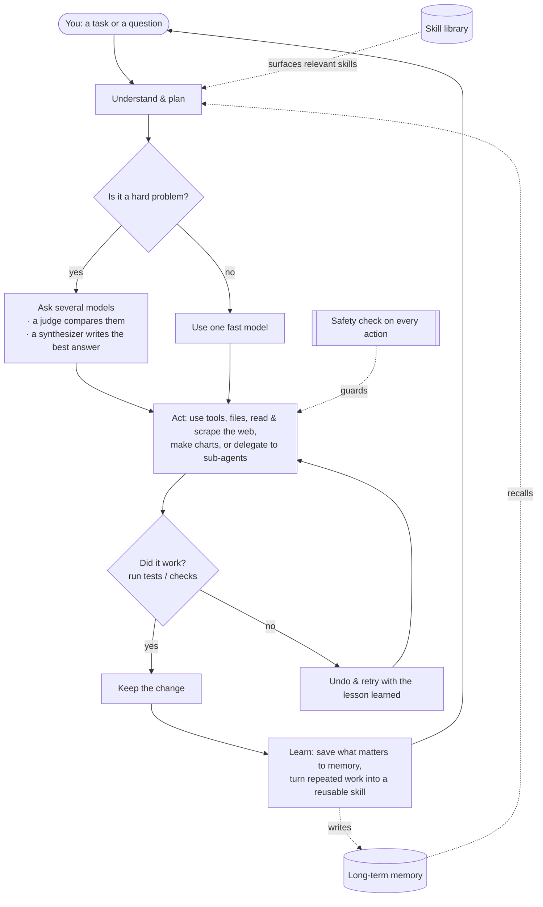

<div align="center">


# Chimera

**The governed, self-evolving agent — proved and governed.**<br/>
<sub>Thinks with many minds, does real work on its own, learns only what's proven, and is safe by architecture.</sub>

[](https://pypi.org/project/chimera-agent/)
[](LICENSE)
[](https://www.python.org/)
[](https://github.com/brcampidelli/chimera-agent/actions/workflows/ci.yml)
[](https://mypy-lang.org/)
[](https://github.com/astral-sh/ruff)
[](https://discord.gg/ACvBbrmguV)
[](https://www.reddit.com/r/ChimeraAgent/)

[](https://donate.stripe.com/9B63cofM491m4SBfe177O00)

<sub><b>English</b> · <a href="README.pt-BR.md">Português</a> · <a href="README.es.md">Español</a> · <a href="README.de.md">Deutsch</a> · <a href="README.fr.md">Français</a> · <a href="README.zh-CN.md">中文</a> · <a href="README.ja.md">日本語</a></sub>

</div>

Most AI assistants bet everything on a **single** model and forget everything when the chat ends.
**Chimera does two things differently:** for hard questions it asks **several** AI models at once and
blends their answers into one stronger result, and it **remembers and learns** so it becomes more
useful the more you use it. It doesn't just chat — give it a goal and it plans, uses tools, checks
its own work, and keeps only what actually works.

> **Free and open-source (Apache-2.0), in early but active development.** It already works end to
> end: chat with it, let it finish tasks on its own, run it as a bot on your favourite messaging app,
> deploy it on a server so it works 24/7, and watch it learn from what it does. It's **alpha** — solid
> and heavily tested (**1000+ automated tests**, strict type-checking and linting on every change), but
> not yet battle-hardened in production.

---

## Why Chimera

Think of most AI tools as asking **one** expert and hoping they're right. Chimera is like having a
**panel of experts** that debate, a **fair judge** that weighs their answers, and a **writer** that
delivers the best combined result — then a teammate who actually **does the work** and **learns** from
it. Here's what makes it special, in plain terms:

- 🧠 **Many minds, one answer.** For tough questions, Chimera asks several models the same thing, lets one model compare their answers, and has a final model write the best combined response — so you get something more balanced and less likely to be wrong than any single model alone. (It does this only when it's worth it, to stay fast and cheap.)
- 🚀 **It does the work, not just talk.** Give it a goal. It breaks it down, uses tools, edits files, runs the tests, and **keeps a change only if it passes**. If something breaks, it undoes it and tries again — so it doesn't leave a mess behind.
- 🧬 **It gets better the more you use it.** It remembers your preferences and important facts across conversations, and quietly turns tasks it repeats into reusable skills. It's built to keep improving instead of slowly getting worse over long runs — a problem that quietly degrades many agents.
- 🛡️ **Safe by design.** Every risky action passes a safety check first, anything destructive asks for confirmation, and untrusted code can run in a locked-down, network-off container. (Those checks are a cheap first filter, not the real boundary — the sandbox is; and container isolation is opt-in. See [SECURITY.md](SECURITY.md).)
- 🔌 **Any model, runs anywhere.** Use big hosted models or your own local ones through a single interface — on your laptop or a $5 server, around the clock.
- 🧩 **Truly yours.** Open-source, no lock-in, no vendor account required. You run it, you own it, you can change anything.

## How Chimera compares

Chimera doesn't try to out-*channel* the giant agent projects. It bets on the three things a real
reverse-engineering study of five leaders (OpenClaw, Hermes, nanobot, CrewAI, LangGraph) found they
**all leave open** — and makes them its core:

- 🧬 **Self-evolution with a fitness signal.** The others "learn" by appending whatever happened, or by human pull requests — nothing measures whether a learned change actually helped. Chimera keeps a change **only when a verified result proves it did**: the evolution step is gated on the real working-tree diff and an honest A/B, never the model's say-so. Independent evidence this matters: [EvoAgentBench (arXiv 2607.05202)](https://arxiv.org/abs/2607.05202) measured that *automatic*, ungated experience-encoding methods routinely produce **negative transfer** — one popular method regressed **−12.3 points** on tasks it wasn't tuned on. Chimera's gate now also runs a **transfer holdout**: a learned change must not regress a disjoint, same-capability slice before it's promoted, so it can't just memorize its own eval.
- 🛡️ **Security by architecture.** Prompt injection is now widely considered *unpatchable*; the popular agents mitigate at the app layer or declare it out of scope (one shipped 135k publicly-exposed instances and a marketplace ~12% full of malicious skills). Chimera tracks taint provenance end-to-end, strips control tokens from untrusted content, narrows tool access on a tainted run, guards side-effecting retries, and runs untrusted code in an opt-in locked-down container.
- 📊 **Honest, published benchmarks.** ~20% of a popular leaderboard's "solved" cases are actually wrong. Chimera reports every number with a confidence interval — **including the runs where it didn't win** — and never re-rolls for significance. A recorded paired run shows the loop **lifting a weak model on a pre-registered 15-task suite — 60% → 73% (+13pp), from two tasks it recovered (raw fail → verified pass) with zero regressions** — reported honestly as not-yet-significant. And on the **official Terminal-Bench**, a pre-registered N=40 A/B landed at a **variance-dominated floor with no significant difference either way** — published as-is ([`bench/terminal_bench/RESULTS.md`](bench/terminal_bench/RESULTS.md)), including **retracting a wrong intermediate read** once the control arm was measured. Null results and self-corrections ship too; that's the point.

**In one line: the governed, self-evolving agent — proved and governed.** It's alpha, and it says so.

## Benchmarks (honest)

Two recorded numbers, both true, published together on purpose — one promising, one humbling, neither
yet statistically significant. (Also surfaced in the desktop app's **Maturity & Benchmarks** screen,
straight from the shipped snapshot.)

- **Weak-model lift (modest, honest).** A cheap model (`mistral-small-3.2-24b`) + Chimera's retry loop
  vs the same model alone, on a pre-registered 15-task suite: **60.0% → 73.3% (+13.3pp)** — the lift is
  two tasks the loop recovered (raw fail → verified pass) with **zero regressions** — but **n=15, 95%
  CI [−4.2%, +13.3%] — not statistically significant** (the CI includes 0). Internal Docker-free suite
  (`local_lift`), pytest-graded — **NOT** SWE-bench/Terminal-Bench. Source: [`bench/local_lift/results/paired.json`](bench/local_lift/results/paired.json).
- **Terminal-Bench (humbling).** Pre-registered N=40 A/B on the official benchmark, same model both
  arms (`deepseek-chat-v3.1`): **7.5% → 2.5%** with the scaffold, paired **Δ −5.0pp, 95% CI [−5.0%,
  +1.6%] — not significant**. The scaffold **did not lift an already-competent model** (this isn't the
  weak "goldilocks" regime where scaffolding helps); both arms sit at a variance-dominated floor.
  Source: [`bench/terminal_bench/RESULTS.md`](bench/terminal_bench/RESULTS.md).

Promising-but-not-yet-significant internally; humbling externally. We publish both and don't re-roll
for significance — that would be p-hacking.

## Token economy — measured, not claimed

Two "more models = better" instincts, stress-tested on real runs (predictions registered
*before* each run, wins **and** losses published — see [`bench/`](bench/)):

**Fusion is reserved, not default.** On a 12-task reasoning suite the mid tier alone scored
100% at 846 tokens; full fusion also scored 100% — for **9,526 tokens (~11×)**. So fusion sits
behind a cheap→gate→mid→fusion cascade that escalates only when a free gate fails, reaching
~mid quality at ~1/12 of fusion's cost.

**Hierarchical orchestration wins only where it should — and by a law we can write down.**
`chimera orchestrate` splits a task across scoped workers instead of one big context. A single
agent re-sends every document on every turn; scoped workers read each once. So the token saving
scales as **(D−1)/D** in the number of documents D — confirmed on real runs to <0.2%:

| documents (D) | measured token saving | (D−1)/D |
|---|---|---|
| 2 | 49.9% | 50% |
| 3 | 66.7% | 66.7% |
| 4 | 74.8% | 75% |
| 5 | 79.9% | 80% |

The saving holds flat as the conversation lengthens and rises with document size toward the same
limit ([full sweep, 3 axes](bench/hierarchy_sweep/README.md)). And where it *doesn't* pay — a
single-shot task with one turn — the classifier detects that and **falls back to a single agent**
(that run cost +47% more tokens; we published it too).

**The honest asterisk.** These are *token* counts. With prompt caching a provider bills the single
agent's repeated documents at ~0.1×, so the *dollar* win is smaller — and past a few turns it can
**invert** (independent workers re-pay cold context the single agent caches). We ship the
[model that quantifies this](bench/hierarchy_sweep/cache_cost.py) rather than quietly claiming the
token number as a dollar number.

## Features

### 🧠 Thinking & doing
- **Blend several models into one answer** (`chimera fuse`) — a panel of models, a judge that surfaces where they agree, disagree, or miss something, and a synthesizer that writes the final answer. A smart router only spends this extra effort on hard problems, and when the first models already agree it stops early — measured at **~20–28% fewer tokens with no loss of accuracy** on our benchmarks. (Fusion / mixture-of-agents itself isn't unique — you'll find it in OpenRouter and other tools; the difference here is it's wired into the agent loop behind that cost-aware router and measured, not a model you pick.)
- **Finish tasks on its own** (`chimera solve`) — it plans, acts with tools, then **verifies and reverts**: it runs your check (e.g. tests) and keeps the change only if it passes, otherwise undoes it and retries. Optionally works on an isolated copy of your project so nothing is touched until it's proven.
- **Teams of specialists** (`chimera crew`, `chimera crew-isolated`) — several role-focused agents split one job. In isolated mode each works on its **own private copy in parallel**; safe edits are merged, clashes are flagged instead of silently overwritten, and a bad worker's changes can be rejected by a per-worker test. A supervisor can fold everyone's work into one unified report.
- **Delegate and explore** — any agent can hand a self-contained subtask to a fresh **sub-agent** that reports back only the result, keeping the main context clean. The **Context Explorer** (`chimera explore`) finds the right files and lines in a codebase and returns a short answer instead of dumping everything.

### 🧬 Memory & self-improvement
- **Long-term memory** — it keeps short-term, recent, factual, and about-you memories, plus a map of how things relate. It can store memories in a fast full-text database, carry a profile of your preferences into every chat, merge duplicate notes automatically, and gently suggest saving a preference when you mention one.
- **Learns new skills** — when it succeeds at the same kind of task more than once, it turns that into a tested, reusable skill automatically.
- **Optional self-training (advanced)** — it can record its own experience so you can later fine-tune a model from it. Off by default; nothing trains without you asking.

### 🔌 Connect & automate
- **Talk to it anywhere** — a terminal chat, a full-screen terminal app, or as a bot on **Discord, Telegram, Slack, Signal, and WhatsApp**. There's also a simple HTTP endpoint.
- **Scheduling & proactivity** — give it recurring jobs in plain language ("every morning, summarize the news"). With the built-in scheduler running, it **acts on time**, not only when you message it.
- **Tools & integrations** — read and write files, run shell commands, **read fully-rendered web pages and scrape or crawl whole sites** (with injection-safe structured extraction), and run code safely in a sandbox. Connect almost any web service (through its API) or external tool — including any **MCP server** ([guide + runnable example](docs/mcp.md)) — and import your setup from other agent tools you already use.
- **Batteries included** — web search, image generation (hosted **or fully local**), **speech-to-text** and text-to-speech, **media download**, **data analysis & charts**, email, calendar, code execution, and more, ready to switch on.

### 🚀 Run anywhere, safely
- **Any model, one interface** — hosted models or your own local ones, with automatic fallback if one is down and rotation across multiple keys.
- **One-command server deploy** — run it with Docker (or bare-metal) so it stays up and restarts on reboot. See **[docs/deploy.md](docs/deploy.md)**.
- **Safety kernel** — a check on every action (allow / warn / block / ask), an **opt-in** network-isolated container for untrusted code (`CHIMERA_SANDBOX=docker`; the default local runner is *not* isolated), and a full audit log of what it did.

## Quickstart

You need **Python 3.11+** and [uv](https://docs.astral.sh/uv/) (a fast Python installer).

**1. Install** — from PyPI:
```bash
pip install chimera-agent
```
That gives you the `chimera` command. (The examples below use `uv run chimera` for a from-source
checkout — with a pip install, just run `chimera …`.) To hack on Chimera itself, clone the repo:
```bash
git clone https://github.com/brcampidelli/chimera-agent.git
cd chimera-agent
uv sync --extra dev
```

**2. Add one AI provider key.** The easiest is an [OpenRouter](https://openrouter.ai) key — one key
unlocks 100+ models.
```bash
cp .env.example .env
# open .env and set, for example:  CHIMERA_OPENROUTER_KEYS=sk-or-...
```

**3. Check everything is ready**
```bash
uv run chimera doctor
```

**4. Try it**
```bash
uv run chimera chat                         # have a conversation (it remembers)
uv run chimera run "Explain what you can do in 3 bullets"
uv run chimera fuse "What's the best way to learn to cook?" --show-panel   # see several models blended
uv run chimera solve "add a hello() function to app.py and a test for it" --verify "pytest -q"
```

**Run it on a server (so it works 24/7):**
```bash
docker compose up -d      # gateway + scheduler; restarts automatically
```
Full guide (Docker or systemd, scheduling, backups, security): **[docs/deploy.md](docs/deploy.md)**.

**5. Do something real in 5 minutes: email triage.** Point Chimera at your inbox and get a
ten-second digest — read-only, classify URGENT / PERSONAL / NEWSLETTER / COLD-SALES, and
optionally schedule it every morning:
```bash
uv run chimera workflow examples/email_triage/triage.yaml -w ./triage_workspace
```
Setup + daily scheduling + honest caveats: **[examples/email_triage/README.md](examples/email_triage/README.md)**.

## 🧰 What Chimera can do — and how to switch each thing on

New here? Chimera works right after `pip install chimera-agent` + one AI key. A few abilities
(reading documents, hearing audio, making charts, downloading video…) need a small optional
package — called an **"extra"** — and some need a service key. This section lists **every ability,
exactly what to install, and the command to try it**. No prior knowledge assumed.

### Turn everything on at once
```bash
pip install 'chimera-agent[full]'     # every non-GPU feature below, one command
```
Audio and video also need **ffmpeg** on your computer:
`macOS: brew install ffmpeg` · `Ubuntu/Debian: sudo apt install ffmpeg` · `Windows: choco install ffmpeg`.
Prefer a lean install? Keep `pip install chimera-agent` and add only the extras you want (see the
"Needs" column). **Using Docker? The official image already has everything below built in.**

### Every ability, point by point
**Needs** = what to add: `—` works in the core install · `[extra]` = `pip install 'chimera-agent[extra]'` · `key: X` = a provider key you put in `.env`.

| What you get | Needs | How to use it |
|---|---|---|
| **Chat that remembers you** | — | `chimera chat` |
| **Ask one question** | — | `chimera run "explain X in 3 bullets"` |
| **Full-screen terminal app** | — | `chimera tui` |
| **Do a task, keep it only if a check passes** | — | `chimera solve "add hello() to app.py + a test" --verify "pytest -q"` |
| **Blend several models into one answer** | — | `chimera fuse "your question" --show-panel` |
| **A team of specialist agents** | — | `chimera crew "your task" --mode supervisor` |
| **Run a whole project to completion** (asks you before risky steps) | — | `chimera project start spec.yaml -w .` |
| **See images** (vision) | key: Gemini or OpenAI | `chimera run --image photo.jpg "what's in this?" --model gemini/gemini-2.0-flash` |
| **Hear audio** (speech → text) | `[stt]` + ffmpeg | `chimera run "transcribe meeting.mp3"` |
| **Speak** (text → speech) | key: ElevenLabs or OpenAI | ask any task to "read this out loud to speech.mp3" |
| **Read documents** (PDF, Word, Excel → text) | `[documents]` | `chimera run "summarize report.pdf"` |
| **Download video/audio** (YouTube + 1000+ sites) | `[media-dl]` + ffmpeg | `chimera run "download the audio of <url>"` |
| **Analyze data & make charts** | `[data,viz]` | `chimera run "load sales.csv and chart monthly revenue"` |
| **Search the web** | key: Tavily | `chimera run "search the web: the latest Python version"` |
| **Read & scrape real web pages** (a real browser) | — | `chimera run "open example.com and tell me the heading"` |
| **Long-term memory** | — | `chimera memory add "..."` · `chimera memory search "..."` |
| **Learn reusable skills automatically** | — | happens during `chimera solve`; list with `chimera skills` |
| **Schedule recurring work** | — | `chimera cron add brief "0 8 * * *" "summarize the news"` |
| **Run as a chat bot** (Discord/Telegram/Slack/Signal/WhatsApp) | `[messaging]` | `chimera serve --cron --discord` |
| **Connect any external tool** (MCP) | `[mcp]` | guide: [docs/mcp.md](docs/mcp.md) |
| **Generate images** (hosted) | key: OpenAI | ask a task to "generate an image of …" |
| **Generate images** (fully local, needs a GPU) | `[imagegen-local]` | same, offline |

> Install extras individually if you want a lean setup — `messaging`, `mcp`, `documents`, `media-dl`,
> `stt`, `data`, `viz`, `youtube` (all bundled in `full`), plus the GPU-only `imagegen-local` and
> `train`. Example: `pip install 'chimera-agent[documents,stt]'`.

### First time? Six steps for total beginners
1. **Install Python 3.11+** ([python.org](https://www.python.org/downloads/)); check with `python --version`.
2. **Install Chimera:** `pip install 'chimera-agent[full]'` (or just `chimera-agent` for the lean core).
3. **Get one AI key** — an [OpenRouter](https://openrouter.ai) key is easiest (one key → 100+ models).
4. **Give Chimera the key:** copy `.env.example` to `.env`, set `CHIMERA_OPENROUTER_KEYS=sk-or-...`.
5. **Check it's ready:** `chimera doctor` — it says what's set up and what's missing.
6. **Try it:** `chimera chat`.

From here, any command in the table above just works. Full command reference with copy-paste
examples: **[docs/usage.md](docs/usage.md)**.

> **Install trouble?** Chimera itself is pure Python (a wheel for every OS), but a transitive
> dependency can occasionally make `pip` try to build from source (asking for Rust/Cargo) if it
> backtracks onto an older version lacking a prebuilt wheel for your platform. If you hit that:
> upgrade pip first (`python -m pip install --upgrade pip`), and if it persists, use Python
> 3.12/3.13 (which have the widest wheel coverage). A clean `pip install` is smoke-tested in CI
> across Linux/macOS/Windows × Python 3.11/3.13.

## How it works

Give Chimera a task; it plans (surfacing the most relevant built-in skills), thinks (blending models
when the problem is hard), acts with tools — reading and scraping the web, editing files, making
charts — **checks its own work and keeps only what passes**, then learns from the result, feeding
memory and new skills back into the next task.



## Commands

Every command is `chimera <name>` (or `uv run chimera <name>` before installing).

```bash
chimera doctor / models / features    # check setup, list models, see optional capabilities
chimera chat                          # interactive assistant that remembers across turns
chimera tui                           # full-screen terminal app
chimera run "PROMPT" --image pic.png  # one-shot answer (can read an image)
chimera fuse "PROMPT" --show-panel    # blend several models: panel -> judge -> synthesizer
chimera solve "TASK" --verify "pytest -q" --isolate   # do a task; keep the change only if the check passes
chimera crew "TASK" --mode supervisor         # a team of specialists tackles one task
chimera crew-isolated "TASK" -W "name:role" --verify "..." --synthesize   # team, each in its own isolated copy
chimera explore "where is login handled?"     # find the right files/lines, get a short answer
chimera deliver "a launch plan" -o plan.md    # produce a polished document
chimera serve --cron [--discord|--telegram|--slack|--signal]   # run as a service: chat bot + scheduler
chimera cron add "brief" "0 8 * * *" "Summarize the news"       # schedule recurring work
chimera memory add / graph / consolidate      # long-term memory: save, relate, tidy up
chimera kanban add/board/run                   # a task board that dispatches work to the agent
chimera workflow flow.yaml                     # run a repeatable automation described in a file
chimera migrate <source> <dir> --apply         # import settings, skills, and memory from another agent tool
chimera evolve status / tune / recipe          # optional: self-optimize; prepare data to fine-tune a model
chimera fusion-bench / skillcard-bench / schema-bench / sandbox-bench   # honest A/B benchmarks: measure cost, quality & side effects before trusting a feature
chimera pet new --name Chimi                   # adopt a small virtual companion :)
```

See the **[Usage Guide](docs/usage.md)** for every command with copy-paste examples.

## Architecture

Chimera is a Python package with clearly separated parts, so you can understand or extend any piece
on its own:

```
chimera/
  core/          the agent loop: plan, act, verify, keep-or-undo, and isolated work copies
  fusion/        the "many minds" engine: panel -> judge -> synthesizer + the smart router
  memory/        short-term / recent / factual / about-you memory + a relationship graph
  skills/        the built-in skill library and how relevant skills are found
  evolution/     learning new skills from success, and the experience it learns from
  governance/    the safety kernel (allow/warn/block/ask), audit log, and change controls
  orchestration/ teams of agents: roles, crews, isolated parallel workers, unified reports
  ecosystem/     advanced self-improvement: agents that design agents, optional model training
  kanban/        a task board that hands cards to the agent
  workflow/      describe a repeatable automation in a simple file and run it
  tools/         built-in tools (files, shell, web, search) + code execution
  sandbox/       run tools locally or inside a locked-down container
  integrations/  connect external tools and any web API
  scheduler/     recurring jobs + the daemon that fires them on time
  migration/     bring your setup over from other agent tools
  providers/     one interface to every model, with fallback and key rotation
  interface/     the shared conversation engine (used by chat, the app, and bots)
  server/        the messaging gateway and HTTP endpoint
  cli/           the `chimera` command
```

See [docs/architecture.md](docs/architecture.md) for the full design.

## Vision & goals

**Chimera's goal is simple: an AI agent that anyone can run, that reasons better by combining many
models instead of trusting one, that truly gets better the more it's used, and that stays safe and
fully open along the way.**

Most AI tools today are either smart-but-forgetful (they lose everything when the chat ends) or
capable-but-closed (you don't control them). And many that try to "improve themselves" quietly get
*worse* over long runs. Chimera is our attempt at a different path:

- **Better thinking, not a bigger bill** — combine several models only when it helps, so quality goes up without waste.
- **Real memory and real skills** — remember what matters and turn repeated work into reusable abilities.
- **Improvement that lasts** — resist the slow decay that degrades other agents, by checking its own work and keeping state safely outside the model.
- **Safe and transparent** — every action is checkable, and destructive ones ask first.
- **Open to everyone** — free, Apache-2.0 licensed, community-driven, no lock-in.

It's early (alpha), and honesty matters to us: it's not yet proven in heavy production use. If that
vision excites you, we'd love your help getting there.

## Development

```bash
git clone https://github.com/brcampidelli/chimera-agent.git
cd chimera-agent
uv sync --extra dev

uv run ruff check .      # style/lint
uv run mypy chimera      # strict type checks
uv run pytest -q         # the test suite
```

Contributions are very welcome — code, docs, ideas, bug reports. Start with
[CONTRIBUTING.md](CONTRIBUTING.md) and our [Code of Conduct](CODE_OF_CONDUCT.md).
Want to teach Chimera something new? The **[Extending guide](docs/extending.md)** walks through
adding your own **tool, skill, or recipe** (with copy-paste examples). Found a security issue? See
[SECURITY.md](SECURITY.md).

## Community

Have a question, an idea, or want to contribute? **[Join us on Discord](https://discord.gg/ACvBbrmguV)** — everyone's welcome.

Prefer Reddit? Follow **[r/ChimeraAgent](https://www.reddit.com/r/ChimeraAgent/)** for updates and discussion.

## Support

Chimera is free and open-source, built in the open. If it's useful to you, you can help fund
its development with a one-time donation — every bit helps and is hugely appreciated. 💜

**[💜 Donate via Stripe](https://donate.stripe.com/9B63cofM491m4SBfe177O00)**

## License

[Apache-2.0](LICENSE) — free to use, change, and build on.
