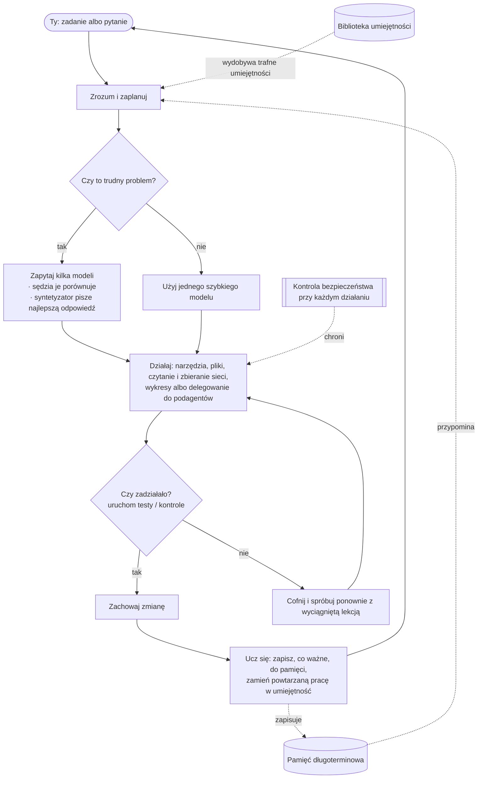

<div align="center">


# Chimera

**Nadzorowany, samorozwijający się agent — udowodniony i nadzorowany.**<br/>
<sub>Myśli wieloma umysłami, sam wykonuje prawdziwą pracę, uczy się tylko tego, co udowodnione, i jest bezpieczny z architektury.</sub>

[](https://chimeraagent.space)
[](https://pypi.org/project/chimera-agent/)
[](LICENSE)
[](https://www.python.org/)
[](https://github.com/brcampidelli/chimera-agent/actions/workflows/ci.yml)
[](https://mypy-lang.org/)
[](https://github.com/astral-sh/ruff)
[](https://discord.gg/ACvBbrmguV)
[](https://www.reddit.com/r/ChimeraAgent/)

[](https://buy.stripe.com/9B6aEQ57q91m1Gp7Lz77O01)

<sub><a href="README.md">English</a> · <a href="README.pt-BR.md">Português</a> · <a href="README.es.md">Español</a> · <a href="README.de.md">Deutsch</a> · <a href="README.fr.md">Français</a> · <a href="README.it.md">Italiano</a> · <b>Polski</b> · <a href="README.zh-CN.md">中文</a> · <a href="README.ja.md">日本語</a> · <a href="README.ru.md">Русский</a></sub>

</div>

Większość asystentów AI stawia wszystko na **jeden** model i zapomina wszystko, gdy rozmowa się
kończy. **Chimera robi dwie rzeczy inaczej:** przy trudnych pytaniach pyta **kilka** modeli AI naraz i
łączy ich odpowiedzi w jeden mocniejszy wynik, oraz **pamięta i uczy się**, więc staje się tym
bardziej użyteczna, im częściej z niej korzystasz. Nie tylko rozmawia — daj jej cel, a zaplanuje,
użyje narzędzi, sprawdzi własną pracę i zachowa tylko to, co naprawdę działa.

> **Darmowa i otwartoźródłowa (Apache-2.0), we wczesnym, ale aktywnym rozwoju.** Działa już od
> początku do końca: porozmawiaj z nią, pozwól jej samodzielnie kończyć zadania, uruchom ją jako bota
> w ulubionym komunikatorze, postaw ją na serwerze, by pracowała 24/7, i patrz, jak uczy się z tego,
> co robi. To **alpha** — solidna i mocno przetestowana (**ponad 2800 testów automatycznych**, ścisłe
> sprawdzanie typów i lint przy każdej zmianie), ale jeszcze niezahartowana w ciężkiej produkcji.

---

## Dlaczego Chimera

Pomyśl o większości narzędzi AI jak o pytaniu **jednego** eksperta i liczeniu, że ma rację. Chimera
jest jak panel **ekspertów**, którzy dyskutują, **bezstronny sędzia**, który waży ich odpowiedzi, i
**redaktor**, który dostarcza najlepszy połączony wynik — a do tego współpracownik, który faktycznie
**wykonuje pracę** i **uczy się** z niej. Oto, co ją wyróżnia, po ludzku:

- 🧠 **Wiele umysłów, jedna odpowiedź.** Przy trudnych pytaniach Chimera zadaje to samo pytanie kilku modelom, pozwala jednemu modelowi porównać ich odpowiedzi i każe końcowemu modelowi napisać najlepszą połączoną odpowiedź — dostajesz coś bardziej wyważonego, z mniejszą szansą na błąd niż od pojedynczego modelu. (Robi to tylko wtedy, gdy się opłaca, żeby pozostać szybką i tanią.)
- 🚀 **Wykonuje pracę, a nie tylko mówi.** Daj jej cel. Rozbije go na części, użyje narzędzi, zmieni pliki, uruchomi testy i **zachowa zmianę tylko wtedy, gdy przejdzie**. Jeśli coś się zepsuje, cofa i próbuje ponownie — nie zostawia bałaganu.
- 🧬 **Pamięta i jest zbudowana tak, by dalej się poprawiać.** Pamięta twoje preferencje i ważne fakty pomiędzy rozmowami i po cichu zamienia powtarzane zadania w umiejętności wielokrotnego użytku, opierając się powolnemu rozkładowi, który na długich przebiegach degraduje wiele agentów. **Uczciwe zastrzeżenie:** to, że nagromadzona nauka czyni ją mierzalnie *lepszą w zadaniach*, nie jest dowiedzione — siedem prerejestrowanych przebiegów nie wykazało istotnego efektu, a jedyny wynik pozytywny wycofaliśmy, bo się nie zreplikował ([`bench/learning_lift/RESULTS.md`](bench/learning_lift/RESULTS.md)).
- 🛡️ **Bezpieczna z założenia.** Każde ryzykowne działanie przechodzi najpierw kontrolę bezpieczeństwa, wszystko destrukcyjne prosi o potwierdzenie, a niezaufany kod może działać w zamkniętym kontenerze bez sieci. (Te kontrole to tani pierwszy filtr, a nie prawdziwa granica — jest nią sandbox; izolacja w kontenerze jest opcjonalna. Zobacz [SECURITY.md](SECURITY.md).)
- 🔌 **Dowolny model, działa wszędzie.** Używaj dużych modeli w chmurze albo własnych lokalnych przez jeden interfejs — na laptopie albo na serwerze za 5 dolarów, przez całą dobę.
- 🧩 **Naprawdę twoja.** Otwartoźródłowa, bez uzależnienia od dostawcy, bez konta u kogokolwiek. Ty ją uruchamiasz, ty jesteś właścicielem, możesz zmienić wszystko.

## Jak Chimera wypada na tle innych

Chimera nie próbuje przelicytować gigantycznych projektów agentowych *liczbą kanałów*. Stawia na trzy
rzeczy, które prawdziwe studium inżynierii wstecznej pięciu liderów (OpenClaw, Hermes, nanobot,
CrewAI, LangGraph) wskazało jako **pozostawione otwartymi przez wszystkich** — i czyni z nich swój
rdzeń:

- 🧬 **Samoewolucja z sygnałem dopasowania.** Inni „uczą się", dopisując cokolwiek się wydarzyło, albo przez pull requesty ludzi — nic nie mierzy, czy wyuczona zmiana faktycznie pomogła. Chimera zachowuje zmianę **tylko wtedy, gdy zweryfikowany wynik dowiedzie, że pomogła**: krok ewolucji jest uzależniony od rzeczywistego diffa drzewa roboczego i uczciwego testu A/B, nigdy od słowa modelu. Niezależny dowód, że to ma znaczenie: [EvoAgentBench (arXiv 2607.05202)](https://arxiv.org/abs/2607.05202) zmierzył, że *automatyczne*, niebramkowane metody kodowania doświadczenia regularnie dają **negatywny transfer** — popularna metoda cofnęła się o **−12,3 punktu** na zadaniach, pod które nie była strojona. Bramka Chimery uruchamia teraz również **holdout transferowy**: wyuczona zmiana nie może pogorszyć rozłącznego wycinka o tej samej zdolności, zanim zostanie promowana — więc nie może po prostu wykuć własnej ewaluacji.
- 🛡️ **Bezpieczeństwo z architektury.** Prompt injection jest dziś powszechnie uznawany za *niemożliwy do załatania*; popularne agenty łagodzą go na poziomie aplikacji albo uznają za poza zakresem (jeden wypuścił 135 tys. publicznie wystawionych instancji i marketplace w ~12% pełen złośliwych umiejętności). Chimera wnosi prawdziwą warstwę obrony — **opcjonalną przez `--taint`, domyślnie wyłączoną**: śledzi pochodzenie skażenia *heurystycznie* (dosłowny przepływ odniesień/treści, **nie** prawdziwy dataflow — model, który parafrazuje skażony tekst, „pierze" go), usuwa tokeny sterujące z niezaufanych treści, zawęża dostęp do niebezpiecznych narzędzi na resztę skażonego przebiegu i chroni ponowne próby z efektami ubocznymi; niezaufany kod działa w opcjonalnym, zamkniętym kontenerze. Na wbudowanym korpusie **7 ataków** blokowanych jest **6 z 7** szkodliwych wywołań (**~14%** wciąż przechodzi) — mierzone na agencie, który *już został wstrzyknięty* i próbuje wykonać wywołanie narzędzia zlecone przez atakującego, bez modelu w pętli. Tego wskaźnika blokowania nigdy nie publikujemy samego: ten sam raport niesie, ile *uprawnionej* pracy odmawia to zawężenie, zmierzone na łagodnym korpusie przechodzącym przez tę samą maszynerię, a bramka nie czyta jednej połowy bez drugiej (`chimera redteam` wypisuje obie — obrona oceniana wyłącznie na atakach ma trywialne maksimum: odmawiać wszystkiego). Nie mówi to nic o tym, jak łatwo model daje się wstrzyknąć na samym początku — to trudniejsza, otwarta połowa ([`chimera/eval/injection.py`](chimera/eval/injection.py)). [`SECURITY.md`](SECURITY.md) mówi wprost, co nadal przechodzi (przekazania między podagentami, fuzja/streszczanie, punkty wejścia inne niż CLI) — granicą izolacji jest sandbox, a ta warstwa to obrona w głąb nad nim.
- 📊 **Uczciwe, opublikowane benchmarki.** Około 20% „rozwiązanych" przypadków w popularnym rankingu jest w rzeczywistości błędnych. Chimera podaje każdą liczbę z przedziałem ufności — **łącznie z przebiegami, w których nie wygrała** — nigdy nie przetacza kości dla istotności i wycofuje własne twierdzenia, gdy replikacja je zabija. Liczby, wyniki zerowe i wycofania są w całości w sekcji [Benchmarki](#benchmarki-uczciwie).

**W jednym zdaniu: nadzorowany, samorozwijający się agent — udowodniony i nadzorowany.** To alpha i
mówi to wprost.

## Benchmarki (uczciwie)

Cztery zarejestrowane wyniki, opublikowane razem celowo: dwa wspierają tezę (jeden istotny dopiero
po zsumowaniu), jeden wypadł przeciwko nam, a jeden wycofaliśmy. (Widoczne także na ekranie
**Dojrzałość i benchmarki** w aplikacji desktopowej, prosto z dołączonego snapshotu — ten ekran
raportuje pokrycie testami samego projektu, więc renderuje się wyłącznie pod serwerem deweloperskim
Vite (`npm --prefix apps/desktop run dev`). `chimera app` serwuje build produkcyjny i go nie
pokazuje — natywny instalator również nie.)

- **Podniesienie słabego modelu (istotne).** Tani model (`mistral-small-3.2-24b`) + pętla ponawiania
  Chimery kontra ten sam model sam, na **prerejestrowanym zestawie n=100** (projekt i zadania
  zacommitowane i wypchnięte przed jakimkolwiek wywołaniem modelu): **48,0% → 71,0% (+23,0pp)**,
  sparowane **95% CI [+12,6%, +28,6%] — istotne statystycznie** (CI nie obejmuje 0), z **28 zadań
  odzyskanych przez pętlę** (surowa porażka → zweryfikowane zaliczenie) przy 5 regresjach. Jeden
  model, jedno ziarno/zadanie, małe samodzielne zadania w Pythonie — **NIE** jest to SWE-bench i nie
  uogólnia się na prawdziwe repozytoria. Jeden przebieg, bez przetaczania.
  **To zastępuje wcześniejszy przebieg tego samego zestawu** (9,0% → 15,0%, +6,0pp), którego harness
  oceniał plikiem testowym, który badany agent mógł edytować. Powtórka z przywróconym oryginalnym
  testem przyłapała agenta na przepisywaniu własnego testu oceniającego w jednym zadaniu — czyli dziura
  była prawdziwa — a podniesienie zreplikowało się *większe*, nie mniejsze. Twierdzenie wcześniejszego
  przebiegu, że „85 ze 100 zadań jest na tyle trudnych, by oba ramiona poległy", również się nie
  utrzymało: powtórka mierzy 24. Pełna errata, zachowane dowody manipulacji i to, czego nie dało się
  ponownie zweryfikować, są w [`bench/local_lift/RESULTS.md`](bench/local_lift/RESULTS.md).
  Źródło: [`bench/local_lift/_reverify_n100/paired.json`](bench/local_lift/_reverify_n100/paired.json), [`PREREGISTRATION.md`](bench/local_lift/PREREGISTRATION.md).
- **SWE-bench Verified — najmocniejszy zewnętrzny dowód, i przetrwał replikację zaprojektowaną tak, by
  go zabić.** Cztery prerejestrowane przebiegi na wycinkach `django/django`, oceniane **wyłącznie** przez
  oficjalny harness `swebench` 4.1.0 w Dockerze — nigdy samodzielnie raportowane.

  | przebieg | wycinek | punkt odniesienia | + Chimera | sparowana Δ | 95% CI | |
  |---|---|---|---|---|---|---|
  | 1 (`max_steps=8`) | 19 | 36,8% | 36,8% | +0,0% | [−8,5%, +8,5%] | ni |
  | 2 (`max_steps=30`) | te same 19 | 42,1% | 57,9% | +15,8% | [−1,9%, +15,8%] | ni |
  | **3 (replikacja)** | **41 niewidzianych** | 34,1% | 43,9% | **+9,8%** | [−3,5%, +16,7%] | ni |
  | zbiorczo *(drugorzędne)* | 60 | 36,7% | 48,3% | **+11,7%** | **[+0,8%, +16,4%]** | **istotne** |

  +15,8% z przebiegu 2 to było 3–0 na trzech informatywnych parach, a prerejestracja dawała temu
  **jedną szansę na trzy, że jest to dokładnie to — szczęśliwa próbka**, z wycofaniem zadeklarowanym
  z góry. Przebieg 3 sprawdził to na **41 instancjach, których wyników nigdy nie widzieliśmy**, nie
  zmieniając nic innego. Efekt **pojawił się ponownie** (+9,8%, w zarejestrowanym paśmie od +5 do
  +20) na wycinku, który okazał się *trudniejszy* niż ten z przebiegu 2. Łącznie pary niezgodne
  wypadają **9 dla Chimery przeciw 2** (p ≈ 2,6% przy hipotezie zerowej).

  **Mechanizm też się zreplikował i to jest najciekawsza część.** Czwarty przebieg przywrócił środkowe
  ramię (samo rusztowanie, bez bramki na diffie) na tych samych 41 instancjach, więc wszystkie trzy
  różnią się dokładnie jednym komponentem. Wszystkie trzy **edytują z tą samą częstością** (27–28
  łatek z 41); zmienia się to, jak często edycja jest *trafna*:

  | ramię | rozwiązane | **precyzja, gdy edytowało** |
  |---|---|---|
  | punkt odniesienia | 14/41 | 50% |
  | + rusztowanie | 16/41 | 59% |
  | + rusztowanie **i** bramka na diffie | 18/41 | 67% |

  **Oba komponenty wnoszą wkład, mniej więcej po połowie** (+4,9% każdy, żaden istotny osobno) — co
  **przeczy naszej własnej zarejestrowanej predykcji**, że rusztowanie odpowie za większość, i wycofuje
  odczyt z przebiegu 2, jakoby bramka na diffie „nie była tym, co dało zysk". Wycofanie jest w
  [`RESULTS.md`](bench/swe_bench/RESULTS.md); tej ładnej addytywności *nie* przedstawiamy jako
  zmierzonego podziału 50/50, bo każde porównanie opiera się na 5–6 niezgodnych parach.

  ⚠️ Czytaj uczciwie: **pierwszorzędny wynik poza próbą NIE jest istotny.** Istotna liczba to
  **drugorzędny wynik zbiorczy**, prerejestrowany jako drugorzędny właśnie dlatego, że miesza dane
  widziane z niewidzianymi — nie awansujemy go na nagłówek teraz, gdy przekroczył próg. I **48,3% NIE
  jest wynikiem SWE-bench Verified**: to celowo łatwy wycinek z jednego repozytorium; prawdziwy wynik
  wymaga pełnych 500. Dokładne zero z przebiegu 1 publikujemy bez zmian, a przebieg 2 przyniósł
  **wycofanie, na które zasłużył** (mechanizm, który przypisywaliśmy jego pustym łatkom, był błędny —
  lekarstwem był budżet kroków).
  Źródło: [`bench/swe_bench/RESULTS.md`](bench/swe_bench/RESULTS.md), [`PREREGISTRATION.md`](bench/swe_bench/PREREGISTRATION.md).
- **Terminal-Bench (otrzeźwiający).** Prerejestrowany test A/B przy N=40 na oficjalnym benchmarku, ten
  sam model w obu ramionach (`deepseek-chat-v3.1`): **7,5% → 2,5%** z rusztowaniem, sparowana
  **Δ −5,0pp, 95% CI [−5,0%, +1,6%] — nieistotna**. Rusztowanie **nie podniosło już kompetentnego
  modelu** (to nie jest słaby reżim „w sam raz", w którym rusztowanie pomaga); oba ramiona siedzą na
  podłodze zdominowanej przez wariancję.
  Źródło: [`bench/terminal_bench/RESULTS.md`](bench/terminal_bench/RESULTS.md).
- **Czy nagromadzona nauka pomaga? Siedem przebiegów mówi: nie w sposób dowiedziony (a jeden wynik
  pozytywny został wycofany).** Koło zamachowe — umiejętności bramkowane powtarzalnością plus test
  transferu, karty antywzorców, pamięć trwała — zmierzono w **siedmiu prerejestrowanych przebiegach**.
  Przebieg 6 dał jedyny pozytywny wynik w serii (istotne +6,7% na metryce transferu wewnątrz rodziny);
  **przebieg 7, z większą mocą statystyczną, ściął to do +2,0% i nieistotne — więc został wycofany**,
  dokładnie tak, jak zobowiązywała prerejestracja. Uczciwy werdykt: **żaden przebieg o odpowiedniej
  mocy nie pokazuje, że nagromadzona nauka poprawia skuteczność w zadaniach**, a wąskim gardłem jest
  przyrząd pomiarowy — trzy próby napisania zestawu mieszczącego się w informatywnym paśmie 40–60%
  wylądowały wszystkie na 84–92%. „Im więcej używasz, tym lepsza" pozostaje **bez dowodu**.
  Źródło: [`bench/learning_lift/RESULTS.md`](bench/learning_lift/RESULTS.md).

Istotne wewnętrznie (na naszym własnym trudnym zestawie). Na prawdziwych repozytoriach **zreplikowane
poza próbą i istotne dopiero po zsumowaniu** — to uczciwa etykieta, nie ta pochlebna. Otrzeźwiające na
Terminal-Benchu. Twierdzenie o uczeniu się jest **wycofane**. Publikujemy to wszystko, zapisujemy
*przed* uruchomieniem gałąź, w której wynik zabija nasze własne twierdzenie, i nie przetaczamy kości
dla istotności — to byłby p-hacking.

## Ekonomia tokenów — zmierzona, nie deklarowana

Dwa odruchy typu „więcej modeli = lepiej", poddane próbie na prawdziwych przebiegach (predykcje
zarejestrowane *przed* każdym przebiegiem, zwycięstwa **i** porażki opublikowane — zobacz
[`bench/`](bench/)):

**Fuzja jest zarezerwowana, nie domyślna.** Na 12-zadaniowym zestawie rozumowania sam środkowy poziom
uzyskał 100% przy 846 tokenach; pełna fuzja też uzyskała 100% — za **9526 tokenów (~11×)**. Dlatego
fuzja siedzi za kaskadą tani→bramka→środkowy→fuzja, która eskaluje tylko wtedy, gdy darmowa bramka
zawiedzie, osiągając jakość ~środkową za ~1/12 kosztu fuzji. Jej własne kryterium, zarejestrowane
przed przebiegiem — *kaskada ≥ zdawalność samego środkowego poziomu przy istotnie niższym koszcie* —
**nie zostało spełnione**: kaskada wylądowała na 91,7% wobec 100% środkowego poziomu, bo na tym
zestawie środkowy poziom już się nasyca i nie zostawia zapasu. Jedno pudło jest pouczające: darmowa
bramka leksykalna nie wyłapie odpowiedzi pewnej siebie i błędnej
([`bench/cascade/RESULTS.md`](bench/cascade/RESULTS.md)).

**Orkiestracja hierarchiczna wygrywa tylko tam, gdzie powinna — i według prawa, które da się
zapisać.** `chimera orchestrate` dzieli zadanie między workerów o wąskim zakresie zamiast jednego
wielkiego kontekstu. Pojedynczy agent wysyła ponownie każdy dokument w każdej turze; workerzy o wąskim
zakresie czytają każdy raz. Dlatego oszczędność tokenów skaluje się jak **(D−1)/D** względem liczby
dokumentów D — potwierdzone na prawdziwych przebiegach z dokładnością do <0,2%:

| dokumenty (D) | zmierzona oszczędność tokenów | (D−1)/D |
|---|---|---|
| 2 | 49,9% | 50% |
| 3 | 66,7% | 66,7% |
| 4 | 74,8% | 75% |
| 5 | 79,9% | 80% |

Oszczędność utrzymuje się płasko wraz z wydłużaniem rozmowy i rośnie wraz z rozmiarem dokumentu w
stronę tej samej granicy ([pełny przemiat, 3 osie](bench/hierarchy_sweep/README.md)). A tam, gdzie się
*nie* opłaca — zadanie jednostrzałowe z jedną turą — klasyfikator to wykrywa i **wraca do pojedynczego
agenta** (tamten przebieg kosztował +47% tokenów więcej; też to opublikowaliśmy).

**Uczciwa gwiazdka.** To są liczby *tokenów*. Przy cache'owaniu promptów dostawca nalicza powtarzane
dokumenty pojedynczego agenta po ~0,1×, więc wygrana w *dolarach* jest mniejsza — a po kilku turach
może się wręcz **odwrócić** (niezależni workerzy na nowo płacą za zimny kontekst, który pojedynczy
agent cache'uje). Publikujemy [model, który to
kwantyfikuje](bench/hierarchy_sweep/cache_cost.py), zamiast po cichu podawać liczbę tokenów jako
liczbę w dolarach.

## Funkcje

### 🧠 Myślenie i działanie
- **Połącz kilka modeli w jedną odpowiedź** (`chimera fuse`) — panel modeli, sędzia, który pokazuje, gdzie się zgadzają, różnią lub czegoś nie zauważyły, i syntetyzator, który pisze końcową odpowiedź. Inteligentny router wydaje ten dodatkowy wysiłek tylko na trudnych problemach, a gdy pierwsze modele już się zgadzają, zatrzymuje się wcześniej — zmierzone na **~20–28% mniej tokenów** na naszych benchmarkach — przy trafności między 0 a −8,3 pp w trzech przebiegach; wahanie to odczytujemy jako niedeterminizm modelu, bo w całości przypada na koszyk eskalowany, gdzie tryb selektywny i pełny wykonują ten sam pipeline. (Sama fuzja / mixture-of-agents nie jest unikalna — znajdziesz ją w OpenRouterze i innych narzędziach; różnica polega na tym, że tutaj jest wpięta w pętlę agenta za tym świadomym kosztów routerem i jest zmierzona, a nie jest modelem, który wybierasz.)
- **Kończy zadania sam** (`chimera solve`) — planuje, działa narzędziami, a potem **weryfikuje i cofa**: uruchamia twoją kontrolę (np. testy) i zachowuje zmianę tylko wtedy, gdy przejdzie, w przeciwnym razie cofa i próbuje ponownie. Opcjonalnie pracuje na odizolowanej kopii twojego projektu, żeby nic nie zostało tknięte, dopóki nie zostanie udowodnione. **A przekonujący akapit to nie rozwiązanie:** bez `--verify`, na które można się powołać, przebieg, który nie zmienił nic na dysku, jest raportowany jako porażka, a nie sukces — bo jedyne, co zostałoby do oceny, to model czytający prozę, który nigdy nie widzi diffa. Każda próba zapisuje, *kto* ją zatwierdził (`verifier` / `diff+manager` / `diff` / `manager` / `none`), więc pokwitowanie nigdy nie mówi „sukces" bez wskazania stojącej za tym instancji.
- **Zespoły specjalistów** (`chimera crew`, `chimera crew-isolated`) — kilku agentów skupionych na rolach dzieli jedno zadanie. W trybie izolowanym każdy pracuje na **własnej prywatnej kopii równolegle**; bezpieczne zmiany są scalane, kolizje zgłaszane zamiast po cichu nadpisywane, a zmiany złego workera mogą zostać odrzucone przez jego własny test. Nadzorca potrafi złożyć pracę wszystkich w jeden spójny raport.
- **Delegowanie i eksploracja** — dowolny agent może przekazać samodzielne podzadanie świeżemu **podagentowi**, który raportuje tylko wynik, utrzymując główny kontekst w czystości. **Eksplorator kontekstu** (`chimera explore`) znajduje właściwe pliki i linie w bazie kodu i zwraca krótką odpowiedź zamiast wysypywać wszystko.

### 🧬 Pamięć i samodoskonalenie
- **Pamięć długoterminowa** — trzyma pamięć krótkoterminową, świeżą, faktograficzną i o tobie, plus mapę powiązań między rzeczami. Potrafi przechowywać wspomnienia w szybkiej bazie pełnotekstowej, wnosić profil twoich preferencji do każdej rozmowy, automatycznie scalać zduplikowane notatki i delikatnie podpowiadać zapisanie preferencji, gdy o niej wspomnisz.
- **Uczy się nowych umiejętności** — gdy więcej niż raz uda jej się to samo zadanie, automatycznie zamienia to w przetestowaną, wielokrotnego użytku umiejętność.
- **Kuratorowana biblioteka umiejętności, którą możesz czytać i rozszerzać** — 23 karty umiejętności w [`skills/`](skills/), 13 z nich napisanych na podstawie incydentów tego właśnie projektu. Karta to **dane, nie kod**: frontmatter plus Trigger / Do / Avoid / Check / Risk, i nic nie wykonuje — agent wczytuje ją do promptu, gdy karta pasuje, **opcjonalnie przez `--skill-cards` (albo `CHIMERA_SKILL_CARDS=1`), domyślnie wyłączone**: zarejestrowany test A/B, który miałby włączyć czytanie kart, dał +16,7 pp, ale *nieistotne statystycznie* przy +300% tokenów, więc nie przeszedł własnej bramki przełączenia i pozostał wyłączony ([`bench/skillcard/RESULTS.md`](bench/skillcard/RESULTS.md)). Karty są pogrupowane według miejsca w pracy, w którym mają zastosowanie (define · build · verify · review · ship), z opisem, treścią i etykietami wyzwalaczy przetłumaczonymi na dziewięć języków — pilnowanymi przez test, który nie przechodzi, gdy tłumaczenie się zdezaktualizowało albo zrobiono je w połowie. Zaimportuj kartę przez `chimera skills-import skills/<nazwa>`. To także miejsce o najniższym progu wejścia do współtworzenia: przejrzenie twojego pull requesta to przeczytanie strony markdown, a nie audyt diffa ([`skills/README.md`](skills/README.md)).
- **Opcjonalny samotrening (zaawansowane)** — może zapisywać własne doświadczenie, żebyś mógł później dostroić na nim model. Domyślnie wyłączone; nic nie jest trenowane bez twojej prośby.

### 📏 Pętla, którą da się zmierzyć — i która mówi, kiedy się zgubiła
Agent to model **plus wszystko wokół niego**. Ta otaczająca maszyneria decyduje, czy długi przebieg
pozostaje użyteczny, a większość z niej jest niewidoczna, dopóki nie zawiedzie. Chimera mierzy swoją:

- **Każdy przebieg zostawia pokwitowanie.** Jedna linia JSONL na przebieg w `traces.jsonl`: tokeny na krok, wywołane narzędzia wraz z tym, co zwróciły, miejsce, w którym porzucono historię — oraz **współczynnik trafień cache'u**, czyli udział tokenów promptu podanych przez dostawcę z cache'u. To jest prawdziwa liczba kosztowa pętli (token z cache'u kosztuje mniej więcej jedną dziesiątą świeżego, więc identyczne liczby tokenów mogą różnić się w cenie ~10×) *oraz* alarm projektowy: załamuje się, ilekroć coś przepisze początek promptu, co nie ma żadnego innego objawu. Dostawca, który nie raportuje cache'u, czytany jest jako **nieznany**, nigdy jako chybienie.
- **Zauważa, kiedy przestała dokądkolwiek zmierzać.** Dwie różne rzeczy nazywa się „problemem kontekstu": rozrzedzenie uwagi wewnątrz długiego promptu oraz *trajektoria*, która po cichu przestaje akumulować i zaczyna krążyć — każdy pojedynczy krok w porządku, a przebieg jako całość nie idzie donikąd. Wyłącznik pętli w Chimerze łapie wersję ciasną (okno 12 wywołań); przebieg, który wraca do tych samych trzech plików co dwadzieścia tur, przechodzi przez nie bez śladu. Dlatego jest drugi detektor, porównujący **pierwszą połowę przebiegu z drugą**: praca wyprowadzona ponownie, którą przebieg już miał, rosnące porażki albo redundancja skacząca tuż po porzuceniu historii. **Raportuje i nie działa** — zatrzymanie, przeplanowanie i wymuszona kompaktacja to wszystko wiarygodne lekarstwa, a nie mamy dowodu, które pomaga; wybranie jednego teraz wbudowałoby dokładnie to niezmierzone założenie, które ta praca ma usunąć.
- **Długie przebiegi przeżywają własny kontekst.** Wyczerpanie okna kiedyś po prostu kończyło przebieg, przez co to okno — a nie trudność zadania — było prawdziwym sufitem. Kompaktacja teraz nie tyka wiadomości systemowej (to stabilny prefiks, na którym zakotwiczony jest cały cache promptu), nigdy nie zostawia wyniku narzędzia osieroconego od jego wywołania i **przywraca to, czego przebieg potrzebuje, by wciąż być sobą**: otwarty plik, plan, listę zadań, bieżący stan. Mówi wprost, co porzuciła, zamiast to streszczać — agent może przeczytać plik ponownie, ale nie potrafi „odwierzyć" w zmyślone streszczenie.

### 🔌 Łączenie i automatyzacja
- **Rozmawiaj z nią wszędzie** — czat w terminalu, pełnoekranowa aplikacja terminalowa albo bot na **Discordzie, Telegramie, Slacku, Signalu i WhatsAppie**. Jest też prosty endpoint HTTP.
- **Harmonogram i proaktywność** — zlecaj cykliczne zadania zwykłym językiem („co rano streszczaj wiadomości"). Z działającym wbudowanym schedulerem **działa na czas**, a nie tylko wtedy, gdy do niej napiszesz.
- **Narzędzia i integracje** — czyta i zapisuje pliki, uruchamia polecenia powłoki, **czyta w pełni wyrenderowane strony i zbiera lub przeczesuje całe witryny** (ekstrakcja strukturalna przechodzi przez odizolowany czytnik bez narzędzi, który może emitować wyłącznie pola zwalidowane schematem — ograniczając zasięg rażenia ukrytej instrukcji, a nie usuwając go) i uruchamia kod w sandboxie. Podłącz niemal dowolną usługę webową (przez jej API) albo narzędzie zewnętrzne — w tym dowolny **serwer MCP** ([przewodnik + działający przykład](docs/mcp.md)) — i zaimportuj swoją konfigurację z innych narzędzi agentowych, których już używasz.
- **Wszystko w zestawie** — wyszukiwanie w sieci, generowanie obrazów (w chmurze **lub w pełni lokalnie**), **mowa na tekst** i tekst na mowę, **pobieranie mediów**, **analiza danych i wykresy**, e-mail, kalendarz, wykonywanie kodu i więcej, gotowe do włączenia.

### 🚀 Uruchom wszędzie, bezpiecznie
- **Dowolny model, jeden interfejs** — modele w chmurze albo twoje lokalne, z automatycznym przełączeniem, gdy jeden padnie, i rotacją wielu kluczy.
- **Wdrożenie na serwer jedną komendą** — uruchom z Dockerem (albo bez), żeby działała bez przerwy i wstawała po restarcie. Zobacz **[docs/deploy.md](docs/deploy.md)**.
- **Jądro bezpieczeństwa** — kontrola przy każdym działaniu (pozwól / ostrzeż / sprawdź / zablokuj), **opcjonalny** kontener z odciętą siecią dla niezaufanego kodu (`CHIMERA_SANDBOX=docker`; domyślny lokalny runner *nie* jest odizolowany) i pełny dziennik audytu tego, co zrobiła. To, czy werdykt `review` zatrzyma się, by zapytać, czy po prostu odmówi, zależy od trybu zatwierdzania (`CHIMERA_APPROVAL_MODE=ask|deny|allow`) — bez nadzoru odmawia, zamiast wymyślać zgodę.
- **Zatrzymaj ją, zanim coś zatwierdzi, gdy przeczytała coś, czemu nie należy ufać** (`--pause-on-taint`) — przebieg, który wchłonął niezaufaną treść, sam się parkuje zamiast finalizować i czeka na ciebie. Możesz zaakceptować wynik, zaakceptować wersję, którą sam poprawiłeś, wysłać wskazówki i pozwolić spróbować ponownie albo odrzucić w całości — z terminala *lub* z aplikacji desktopowej. Nic nie jest zapisywane i nic nie jest uczone, dopóki nie zdecydujesz, a pauza nigdy nie jest raportowana jako porażka: nie doszła do werdyktu, czeka na człowieka.
- **Aplikacja desktopowa, która pilotuje przebieg, a nie tylko go uruchamia** — pięć miejsc docelowych zamiast menu z piętnastoma, w dziesięciu językach. Uruchom przebieg i odejdź: postęp nadal tam jest, gdy wrócisz, pasek stanu z każdego ekranu nazywa to, co robi agent, a Stop działa ze wszystkich. Natywne instalatory dla Windows / macOS / Linux w [Releases](https://github.com/brcampidelli/chimera-agent/releases).

## Szybki start

Potrzebujesz **Pythona 3.11–3.13** ([python.org](https://www.python.org/downloads/) — sprawdź swoją
wersję przez `python --version`), a dla kopii ze źródeł także [uv](https://docs.astral.sh/uv/)
(szybkiego instalatora Pythona).

**1. Zainstaluj** — z PyPI:
```bash
pip install chimera-agent
```
To daje ci polecenie `chimera`. (Przykłady poniżej używają `uv run chimera` dla kopii ze źródeł — przy
instalacji pipem wpisuj po prostu `chimera …`.) Żeby dłubać przy samej Chimerze, sklonuj repozytorium:
```bash
git clone https://github.com/brcampidelli/chimera-agent.git
cd chimera-agent
uv sync --extra dev
```

**2. Dodaj klucz jednego dostawcy AI.** Najprościej klucz [OpenRouter](https://openrouter.ai) — jeden
klucz odblokowuje ponad 100 modeli.
```bash
cp .env.example .env
# otwórz .env i ustaw, na przykład:  CHIMERA_OPENROUTER_KEYS=sk-or-...
```

**3. Sprawdź, czy wszystko gotowe**
```bash
uv run chimera doctor
```

**4. Wypróbuj**
```bash
uv run chimera chat                         # porozmawiaj (zapamiętuje)
uv run chimera run "Explain what you can do in 3 bullets"
uv run chimera fuse "What's the best way to learn to cook?" --show-panel   # zobacz kilka modeli połączonych
uv run chimera solve "add a hello() function to app.py and a test for it" --verify "pytest -q"
```

**Uruchom na serwerze (żeby działała 24/7):**
```bash
docker compose up -d      # gateway + scheduler; restartuje się automatycznie
```
Pełny przewodnik (Docker albo systemd, harmonogram, kopie zapasowe, bezpieczeństwo): **[docs/deploy.md](docs/deploy.md)**.

**5. Zrób coś realnego w 5 minut: segregacja e-maili.** Skieruj Chimerę na swoją skrzynkę i dostań
dziesięciosekundowe streszczenie — tylko do odczytu, klasyfikacja PILNE / OSOBISTE / NEWSLETTER /
COLD-SALES i opcjonalnie harmonogram na każdy ranek:
```bash
uv run chimera workflow examples/email_triage/triage.yaml -w ./triage_workspace
```
Konfiguracja + codzienny harmonogram + uczciwe zastrzeżenia: **[examples/email_triage/README.md](examples/email_triage/README.md)**.

## 🧰 Co Chimera potrafi — i jak każdą rzecz włączyć

Jesteś tu nowy? Chimera działa od razu po `pip install chimera-agent` + jednym kluczu AI. Kilka
możliwości (czytanie dokumentów, słuchanie audio, robienie wykresów, pobieranie wideo…) wymaga małego
opcjonalnego pakietu — zwanego **„extra"** — a niektóre klucza usługi. Ta sekcja wymienia **każdą
możliwość, dokładnie co zainstalować i polecenie do wypróbowania**. Bez zakładania wcześniejszej
wiedzy.

### Włącz wszystko naraz
```bash
pip install 'chimera-agent[full]'     # każda niewymagająca GPU funkcja poniżej, jednym poleceniem
```
Audio i wideo wymagają też **ffmpeg** na twoim komputerze:
`macOS: brew install ffmpeg` · `Ubuntu/Debian: sudo apt install ffmpeg` · `Windows: choco install ffmpeg`.
Wolisz szczupłą instalację? Zostań przy `pip install chimera-agent` i dodaj tylko te extra, które
chcesz (zobacz kolumnę „Wymaga"). **Używasz Dockera? Oficjalny obraz ma już wszystko poniżej.**

### Każda możliwość, punkt po punkcie
**Wymaga** = co dodać: `—` działa w podstawowej instalacji · `[extra]` = `pip install 'chimera-agent[extra]'` · `klucz: X` = klucz dostawcy, który wstawiasz do `.env`.

| Co dostajesz | Wymaga | Jak użyć |
|---|---|---|
| **Czat, który cię pamięta** | — | `chimera chat` |
| **Zadaj jedno pytanie** | — | `chimera run "wyjaśnij X w 3 punktach"` |
| **Pełnoekranowa aplikacja terminalowa** | — | `chimera tui` |
| **Aplikacja desktopowa** (kod · edytor · praca · wiedza · automatyzacja, w 10 językach) | `[desktop]` albo pobranie | `chimera app`, albo weź natywny instalator (`.exe`/`.dmg`/`.AppImage`/`.deb`) z [Releases](https://github.com/brcampidelli/chimera-agent/releases) |
| **Wykonaj zadanie i zachowaj je tylko, gdy kontrola przejdzie** | — | `chimera solve "dodaj hello() do app.py + test" --verify "pytest -q"` |
| **Zapytaj mnie, zanim zatwierdzisz coś przeczytanego z sieci** | — | dodaj `--pause-on-taint` do `chimera solve` |
| **Zobacz, ile przebieg naprawdę kosztował, krok po kroku** | — | zapisywane za ciebie w `.chimera/traces.jsonl` (albo `$CHIMERA_HOME`) |
| **Połącz kilka modeli w jedną odpowiedź** | — | `chimera fuse "twoje pytanie" --show-panel` |
| **Zespół agentów-specjalistów** | — | `chimera crew "twoje zadanie" --mode supervisor` |
| **Poprowadź cały projekt do końca** (pyta przed ryzykownymi krokami) | — | `chimera project start spec.yaml -w .` |
| **Widzieć obrazy** (wizja) | klucz: Gemini albo OpenAI | `chimera run --image zdjecie.jpg "co tu jest?" --model gemini/gemini-2.0-flash` |
| **Słyszeć audio** (mowa → tekst) | `[stt]` + ffmpeg | `chimera agent "transkrybuj spotkanie.mp3"` |
| **Mówić** (tekst → mowa) | klucz: ElevenLabs albo OpenAI | poproś dowolne zadanie o „przeczytaj to na głos do speech.mp3" |
| **Czytać dokumenty** (PDF, Word, Excel → tekst) | `[documents]` | `chimera agent "streść raport.pdf"` |
| **Pobierać wideo/audio** (YouTube + 1000+ stron) | `[media-dl]` + ffmpeg | `chimera agent "pobierz audio z <url>"` |
| **Analizować dane i robić wykresy** | `[data,viz]` | `chimera agent "wczytaj sprzedaz.csv i zrób wykres miesięcznych przychodów"` |
| **Szukać w sieci** | klucz: Tavily | `chimera agent "poszukaj w sieci: najnowsza wersja Pythona"` |
| **Czytać i zbierać prawdziwe strony** (prawdziwa przeglądarka) | — | `chimera agent "otwórz example.com i podaj mi nagłówek"` |
| **Pamięć długoterminowa** | — | `chimera memory add "..."` · `chimera memory search "..."` |
| **Uczyć się wielokrotnego użytku umiejętności samodzielnie** | — | dzieje się podczas `chimera solve`; wypisz przez `chimera skills-stats` (`chimera skills` pokazuje wbudowane) |
| **Użyć kuratorowanej karty umiejętności** (jest ich 23, w 9 językach) | — | `chimera skills-import skills/verify-before-claiming` |
| **Planować cykliczną pracę** | — | `chimera cron add brief "0 8 * * *" "streść wiadomości"` |
| **Działać jako bot czatu** (Discord/Telegram/Slack/Signal/WhatsApp) | `[messaging]` | `chimera serve --cron --discord` |
| **Podłączyć dowolne narzędzie zewnętrzne** (MCP) | `[mcp]` | przewodnik: [docs/mcp.md](docs/mcp.md) |
| **Generować obrazy** (w chmurze) | klucz: OpenAI | poproś zadanie o „wygeneruj obraz …" |
| **Generować obrazy** (w pełni lokalnie, potrzebne GPU) | `[imagegen-local]` | tak samo, offline |

> Instaluj extra pojedynczo, jeśli chcesz szczupły zestaw — `messaging`, `mcp`, `documents`,
> `media-dl`, `stt`, `data`, `viz`, `youtube` (wszystkie zawarte w `full`), plus wymagające GPU
> `imagegen-local` i `train`. Przykład: `pip install 'chimera-agent[documents,stt]'`.

Jesteś tu pierwszy raz? Cztery kroki z [Szybkiego startu](#szybki-start) powyżej to cała konfiguracja
— instalacja, jeden klucz, `chimera doctor`, `chimera chat` — a od tego momentu każde polecenie z
tabeli po prostu działa. Pełny wykaz poleceń z przykładami do skopiowania:
**[docs/usage.md](docs/usage.md)**.

> **Kłopoty z instalacją?** Sama Chimera to czysty Python (wheel dla każdego systemu), ale zależność
> przechodnia może czasem sprawić, że `pip` spróbuje budować ze źródeł (prosząc o Rust/Cargo), jeśli
> cofnie się do starszej wersji bez gotowego wheela dla twojej platformy. Jeśli na to trafisz:
> zaktualizuj najpierw pipa (`python -m pip install --upgrade pip`), a jeśli problem zostanie, użyj
> Pythona 3.12/3.13 (mają najszersze pokrycie wheelami). Czysty `pip install` jest testowany w CI na
> Linux/macOS/Windows × Python 3.11/3.13.

## Jak to działa

Daj Chimerze zadanie; ona planuje (wydobywając najtrafniejsze wbudowane umiejętności), myśli (łącząc
modele, gdy problem jest trudny), działa narzędziami — czytając i zbierając sieć, edytując pliki,
robiąc wykresy — **sprawdza własną pracę i zachowuje tylko to, co przechodzi**, a potem uczy się z
wyniku, zawracając pamięć i nowe umiejętności do następnego zadania.



## Polecenia

Każde polecenie to `chimera <nazwa>` (albo `uv run chimera <nazwa>` przed instalacją).

```bash
chimera doctor / models / features    # sprawdź konfigurację, wypisz modele, zobacz opcjonalne możliwości
chimera chat                          # interaktywny asystent, który pamięta między turami
chimera tui                           # pełnoekranowa aplikacja terminalowa
chimera run "PROMPT" --image pic.png  # jednorazowa odpowiedź (może przeczytać obraz)
chimera fuse "PROMPT" --show-panel    # połącz kilka modeli: panel -> sędzia -> syntetyzator
chimera solve "TASK" --verify "pytest -q" --isolate   # wykonaj zadanie; zachowaj zmianę tylko, gdy kontrola przejdzie
chimera crew "TASK" --mode supervisor         # zespół specjalistów bierze się za jedno zadanie
chimera crew-isolated "TASK" -W "name:role" --verify "..." --synthesize   # zespół, każdy we własnej odizolowanej kopii
chimera explore "where is login handled?"     # znajdź właściwe pliki/linie, dostań krótką odpowiedź
chimera deliver "a launch plan" -o plan.md    # wyprodukuj dopracowany dokument
chimera serve --cron [--discord|--telegram|--slack|--signal]   # uruchom jako usługę: bot czatu + scheduler
chimera cron add "brief" "0 8 * * *" "Summarize the news"       # zaplanuj cykliczną pracę
chimera memory add / graph / consolidate      # pamięć długoterminowa: zapisz, powiąż, uporządkuj
chimera kanban add/board/run                   # tablica zadań, która rozdziela pracę agentowi
chimera workflow flow.yaml                     # uruchom powtarzalną automatyzację opisaną w pliku
chimera orchestrate "TASK" --dry-run           # rozdziel na workerów o wąskim zakresie; --dry-run nic nie kosztuje
chimera project start spec.yaml -w .           # poprowadź cały projekt do końca, pytając przed ryzykownymi krokami
chimera skills-import skills/<nazwa>           # wczytaj kuratorowaną kartę umiejętności (dane, nie kod)
chimera skills-stats / skills-pending          # wyuczone umiejętności: użycie, skuteczność, co czeka na przegląd
chimera migrate <source> <dir> --apply         # zaimportuj ustawienia, umiejętności i pamięć z innego narzędzia
chimera evolve status / tune / recipe          # opcjonalnie: samooptymalizacja; przygotuj dane do dostrojenia modelu
chimera fusion-bench / skillcard-bench / schema-bench / sandbox-bench   # uczciwe benchmarki A/B: zmierz koszt, jakość i efekty uboczne, zanim zaufasz funkcji
chimera pet new --name Chimi                   # adoptuj małego wirtualnego towarzysza :)
```

Zobacz **[Przewodnik użytkowania](docs/usage.md)** — każde polecenie z przykładami do skopiowania.

## Architektura

Chimera to pakiet Pythona z wyraźnie rozdzielonymi częściami, żeby dało się zrozumieć albo rozszerzyć
każdy fragment osobno:

```
chimera/
  core/          pętla agenta: planuj, działaj, weryfikuj, zachowaj-lub-cofnij, i odizolowane kopie robocze
  fusion/        silnik „wielu umysłów": panel -> sędzia -> syntetyzator + inteligentny router
  memory/        pamięć krótkoterminowa / świeża / faktograficzna / o-tobie + graf powiązań
  skills/        wbudowana biblioteka umiejętności i sposób znajdowania tych trafnych
  evolution/     uczenie się nowych umiejętności z sukcesu i doświadczenie, z którego się uczy
  governance/    jądro bezpieczeństwa (pozwól/ostrzeż/sprawdź/zablokuj), dziennik audytu i kontrola zmian
  orchestration/ zespoły agentów: role, załogi, odizolowani równolegli workerzy, spójne raporty
  ecosystem/     zaawansowane samodoskonalenie: agenci projektujący agentów, opcjonalne trenowanie modeli
  kanban/        tablica, która podaje karty agentowi
  workflow/      opisz powtarzalną automatyzację w prostym pliku i uruchom ją
  eval/          stanowiska uczciwych benchmarków: SWE-bench, Terminal-Bench, red team od wstrzyknięć
  tools/         wbudowane narzędzia (pliki, powłoka, sieć, wyszukiwanie) + wykonywanie kodu
  scrape/        czytanie w pełni wyrenderowanych stron, zbieranie i przeczesywanie witryn
  rag/           semantyczne wyszukiwanie po repozytorium — pytanie, które nie ma dokładnego ciągu znaków
  sandbox/       uruchamiaj narzędzia lokalnie albo w zamkniętym kontenerze
  integrations/  podłączaj narzędzia zewnętrzne i dowolne API webowe
  scheduler/     cykliczne zadania + demon, który odpala je na czas
  migration/     przenieś swoją konfigurację z innych narzędzi agentowych
  providers/     jeden interfejs do każdego modelu, z przełączaniem i rotacją kluczy
  interface/     wspólny silnik rozmowy (używany przez czat, aplikację i boty)
  server/        gateway komunikatorów i endpoint HTTP
  api/           API HTTP+SSE, z którym rozmawia aplikacja desktopowa
  acp/           Agent Client Protocol w obie strony: steruj innym agentem kodującym albo daj się sterować edytorowi
  lsp/           diagnostyka z prawdziwego serwera języka, żeby edytor zgadzał się z CI
  complete/      uzupełnianie inline — szary tekst przed kursorem
  proc/          długo żyjące procesy potomne: czas życia, ramkowanie, nadzór
  tui/           pełnoekranowa aplikacja terminalowa
  cli/           polecenie `chimera`
```

Zobacz [docs/architecture.md](docs/architecture.md), żeby poznać pełny projekt.

## Wizja i cele

**Cel Chimery jest prosty: agent AI, którego każdy może uruchomić, który rozumuje lepiej dzięki
łączeniu wielu modeli zamiast ufania jednemu, który naprawdę staje się lepszy, im więcej się go
używa, i który po drodze pozostaje bezpieczny i w pełni otwarty.**

Większość dzisiejszych narzędzi AI jest albo mądra-ale-zapominalska (tracą wszystko, gdy czat się
kończy), albo zdolna-ale-zamknięta (nie kontrolujesz ich). A wiele takich, które próbują „się
poprawiać", po cichu staje się *gorszych* na długich przebiegach. Chimera to nasza próba innej drogi:

- **Lepsze myślenie, nie większy rachunek** — łącz kilka modeli tylko wtedy, gdy pomaga, żeby jakość rosła bez marnotrawstwa.
- **Prawdziwa pamięć i prawdziwe umiejętności** — pamiętaj to, co ważne, i zamieniaj powtarzaną pracę w zdolności wielokrotnego użytku.
- **Poprawa, która trwa** — opieraj się powolnemu rozkładowi, który degraduje innych agentów, sprawdzając własną pracę i trzymając stan bezpiecznie poza modelem.
- **Bezpiecznie i przejrzyście** — każde działanie da się sprawdzić, a te destrukcyjne pytają najpierw.
- **Otwarte dla wszystkich** — darmowe, na licencji Apache-2.0, napędzane przez społeczność, bez uzależnienia od dostawcy.

Jest wcześnie (alpha), a uczciwość ma dla nas znaczenie: to nie jest jeszcze sprawdzone w ciężkim
użyciu produkcyjnym. Jeśli ta wizja cię ekscytuje, chętnie przyjmiemy twoją pomoc w jej realizacji.

## Rozwój

```bash
git clone https://github.com/brcampidelli/chimera-agent.git
cd chimera-agent
uv sync --extra dev

uv run ruff check .      # styl/lint
uv run mypy chimera      # ścisłe sprawdzanie typów
uv run pytest -q         # zestaw testów
```

Wkład jest bardzo mile widziany — kod, dokumentacja, pomysły, zgłoszenia błędów. Zacznij od
[CONTRIBUTING.md](CONTRIBUTING.md) i naszego [Kodeksu postępowania](CODE_OF_CONDUCT.md).
Chcesz nauczyć Chimerę czegoś nowego? **[Przewodnik rozszerzania](docs/extending.md)** pokazuje, jak
dodać własne **narzędzie, umiejętność albo przepis** (z przykładami do skopiowania). Najniższy próg
wejścia ma **karta umiejętności** — pojedynczy plik markdown w [`skills/`](skills/), bez Pythona, bez
zakładania zgłoszenia. Znalazłeś problem z bezpieczeństwem? Zobacz [SECURITY.md](SECURITY.md).

## Społeczność

Masz pytanie, pomysł albo chcesz się dołożyć? **[Dołącz do nas na Discordzie](https://discord.gg/ACvBbrmguV)** — każdy jest mile widziany.

Wolisz Reddita? Śledź **[r/ChimeraAgent](https://www.reddit.com/r/ChimeraAgent/)** po aktualizacje i dyskusje.

## Wesprzyj projekt

Chimera jest darmowa i otwartoźródłowa, budowana na widoku. Jeśli jest dla ciebie przydatna, możesz
pomóc sfinansować jej rozwój jednorazową darowizną — każda złotówka pomaga i jest ogromnie doceniana. 💜

**[💜 Wesprzyj przez Stripe](https://buy.stripe.com/9B6aEQ57q91m1Gp7Lz77O01)**

## Licencja

[Apache-2.0](LICENSE) — wolno używać, zmieniać i budować na tym.
