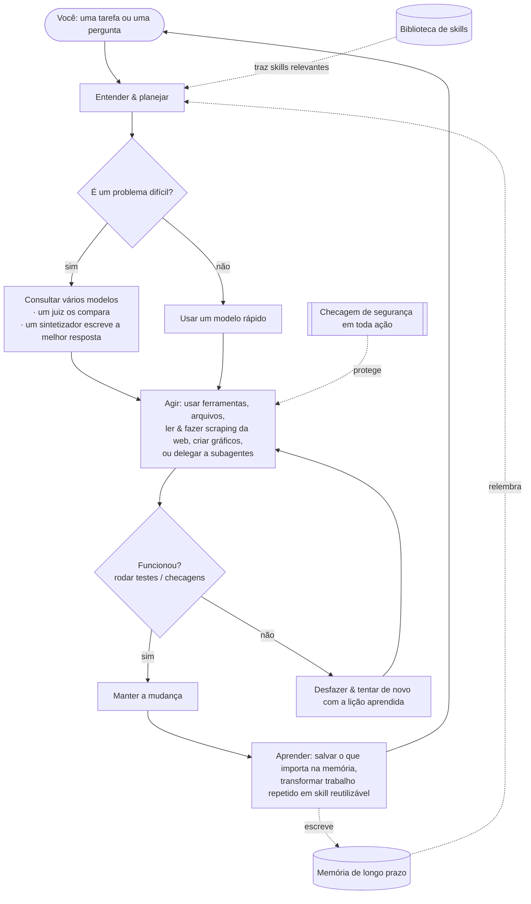

<div align="center">


# Chimera

**O agente auto-evolutivo governado — provado e governado.**<br/>
<sub>Pensa com muitas mentes, faz o trabalho de verdade sozinho, aprende só o que é comprovado, e é seguro por arquitetura.</sub>

[](https://pypi.org/project/chimera-agent/)
[](LICENSE)
[](https://www.python.org/)
[](https://github.com/brcampidelli/chimera-agent/actions/workflows/ci.yml)
[](https://mypy-lang.org/)
[](https://github.com/astral-sh/ruff)
[](https://discord.gg/ACvBbrmguV)
[](https://www.reddit.com/r/ChimeraAgent/)

[](https://donate.stripe.com/9B63cofM491m4SBfe177O00)

<sub><a href="README.md">English</a> · <b>Português</b> · <a href="README.es.md">Español</a> · <a href="README.de.md">Deutsch</a> · <a href="README.fr.md">Français</a> · <a href="README.zh-CN.md">中文</a> · <a href="README.ja.md">日本語</a></sub>

</div>

A maioria dos assistentes de IA aposta tudo em um **único** modelo e esquece tudo quando a conversa
termina. **O Chimera faz duas coisas de forma diferente:** para perguntas difíceis, ele consulta
**vários** modelos de IA ao mesmo tempo e combina as respostas em um resultado único e mais forte,
e ele **lembra e aprende**, ficando mais útil quanto mais você o usa. Ele não apenas conversa — dê
um objetivo a ele e ele planeja, usa ferramentas, confere o próprio trabalho e mantém só o que
realmente funciona.

> **Gratuito e open-source (Apache-2.0), em desenvolvimento inicial mas ativo.** Ele já funciona de
> ponta a ponta: converse com ele, deixe que conclua tarefas sozinho, rode-o como um bot no seu app
> de mensagens favorito, publique-o em um servidor para que trabalhe 24/7 e veja-o aprender com o
> que faz. É **alpha** — sólido e bastante testado (**mais de 1000 testes automatizados**, checagem de
> tipos e lint rigorosos em cada mudança), mas ainda não endurecido em produção pesada.

---

## Por que o Chimera

Pense na maioria das ferramentas de IA como perguntar a **um** especialista e torcer para que ele
esteja certo. O Chimera é como ter um **painel de especialistas** que debatem, um **juiz justo** que
pondera as respostas deles e um **redator** que entrega o melhor resultado combinado — e, além disso,
um colega de equipe que de fato **faz o trabalho** e **aprende** com ele. Veja o que o torna especial,
em termos simples:

- 🧠 **Muitas mentes, uma resposta.** Para perguntas difíceis, o Chimera faz a mesma pergunta a vários modelos, deixa um modelo comparar as respostas e faz um modelo final escrever a melhor resposta combinada — assim você recebe algo mais equilibrado e com menos chance de estar errado do que qualquer modelo sozinho. (Ele só faz isso quando vale a pena, para se manter rápido e barato.)
- 🚀 **Ele faz o trabalho, não só conversa.** Dê um objetivo. Ele o divide em partes, usa ferramentas, edita arquivos, roda os testes e **só mantém a mudança se ela passar**. Se algo quebra, ele desfaz e tenta de novo — então não deixa bagunça para trás.
- 🧬 **Ele melhora quanto mais você o usa.** Ele lembra suas preferências e fatos importantes entre conversas e, silenciosamente, transforma tarefas que se repetem em skills reutilizáveis. Foi feito para continuar melhorando em vez de piorar aos poucos ao longo do tempo — um problema que degrada muitos agentes sem que se perceba.
- 🛡️ **Seguro por design.** Toda ação arriscada passa antes por uma checagem de segurança, qualquer coisa destrutiva pede confirmação, e código não confiável pode rodar dentro de um container isolado, com a rede desligada. (Essas checagens são um primeiro filtro barato, não a fronteira de verdade — o sandbox é; e o isolamento em container é opt-in. Veja [SECURITY.md](SECURITY.md).)
- 🔌 **Qualquer modelo, roda em qualquer lugar.** Use grandes modelos hospedados ou os seus próprios modelos locais por uma única interface — no seu notebook ou em um servidor de US$ 5, o tempo todo.
- 🧩 **Realmente seu.** Open-source, sem lock-in, sem precisar de conta de fornecedor. Você roda, você é dono, você pode mudar qualquer coisa.

## Como o Chimera se compara

O Chimera não tenta ganhar em *quantidade de canais* dos gigantescos projetos de agentes. Ele aposta
nas três coisas que um verdadeiro estudo de engenharia reversa de cinco líderes (OpenClaw, Hermes,
nanobot, CrewAI, LangGraph) descobriu que **todos deixam em aberto** — e faz delas o seu núcleo:

- 🧬 **Auto-evolução com um sinal de aptidão.** Os outros "aprendem" acrescentando o que quer que tenha acontecido, ou por pull requests humanos — nada mede se uma mudança aprendida realmente ajudou. O Chimera mantém uma mudança **só quando um resultado verificado prova que ela ajudou**: o passo de evolução é condicionado ao diff real da árvore de trabalho e a um A/B honesto, nunca à palavra do modelo. Evidência independente de que isso importa: o [EvoAgentBench (arXiv 2607.05202)](https://arxiv.org/abs/2607.05202) mediu que métodos *automáticos* e não condicionados de codificação de experiência produzem rotineiramente **transferência negativa** — um método popular regrediu **−12,3 pontos** em tarefas para as quais não foi ajustado. O gate do Chimera agora também roda um **holdout de transferência**: uma mudança aprendida não pode regredir uma fatia disjunta de mesma capacidade antes de ser promovida, para que ele não possa apenas decorar a própria avaliação.
- 🛡️ **Segurança por arquitetura.** Prompt injection é hoje amplamente considerado *impossível de corrigir*; os agentes populares mitigam na camada da aplicação ou declaram o tema fora de escopo (um deles lançou 135 mil instâncias expostas publicamente e um marketplace ~12% cheio de skills maliciosas). O Chimera traz uma camada de defesa real — **opt-in via `--taint`, desligada por padrão**: rastreia a proveniência da contaminação de forma *heurística* (fluxo de referência/conteúdo literal, **não** dataflow real — um modelo que parafraseia o texto contaminado o "lava"), remove tokens de controle de conteúdo não confiável, restringe o acesso a ferramentas perigosas no restante de uma execução contaminada e protege retentativas com efeitos colaterais; código não confiável roda num container isolado, opt-in. Medido, não afirmado: no corpus embutido de **7 ataques**, isso reduz o sucesso do ataque de **100% → ~14%** ([`chimera/eval/injection.py`](chimera/eval/injection.py)). O [`SECURITY.md`](SECURITY.md) diz claramente o que ainda passa (handoff entre sub-agentes, fusão/sumarização, pontos de entrada fora da CLI) — a fronteira de contenção é o sandbox; esta camada é defesa em profundidade sobre ele.
- 📊 **Benchmarks honestos e publicados.** ~20% dos casos "resolvidos" de um leaderboard popular estão, na verdade, errados. O Chimera reporta cada número com um intervalo de confiança — **incluindo as execuções em que ele não venceu** — e nunca refaz as rodadas em busca de significância. Uma execução pareada registrada mostra o loop completo **elevando um modelo fraco numa suíte pré-registrada de 100 tarefas — 9% → 15% (+6pp), IC 95% [+1,3%, +6,0%] — estatisticamente significativa** (o IC exclui o zero), a partir de **6 tarefas que ele recuperou** (falha crua → aprovação verificada) com **zero regressões**; as taxas absolutas são baixas de propósito, porque 85 das 100 tarefas são difíceis o bastante para falhar nos dois braços (um piso deliberado, para o loop ter margem). Uma execução, sem refazer. E no **Terminal-Bench oficial**, um A/B pré-registrado com N=40 chegou a um **piso dominado por variância, sem diferença significativa em nenhuma direção** — publicado como está ([`bench/terminal_bench/RESULTS.md`](bench/terminal_bench/RESULTS.md)), incluindo a **retratação de uma leitura intermediária errada** assim que o braço de controle foi medido. Resultados nulos e autocorreções também são lançados; esse é justamente o ponto.

**Em uma linha: o agente auto-evolutivo governado — provado e governado.** É alpha, e diz isso.

## Economia de tokens — medida, não alegada

Dois instintos do tipo "mais modelos = melhor", colocados à prova em execuções reais (previsões
registradas *antes* de cada execução, vitórias **e** derrotas publicadas — veja [`bench/`](bench/)):

**A fusão é reservada, não o padrão.** Em uma suíte de raciocínio com 12 tarefas, o tier intermediário
sozinho marcou 100% com 846 tokens; a fusão completa também marcou 100% — por **9.526 tokens (~11×)**.
Então a fusão fica atrás de uma cascata barato→gate→intermediário→fusão que só escala quando um gate
gratuito falha, atingindo qualidade ~intermediária a ~1/12 do custo da fusão.

**A orquestração hierárquica só vence onde deve — e por uma lei que dá para escrever.**
O `chimera orchestrate` divide uma tarefa entre workers de escopo restrito, em vez de um único
contexto gigante. Um único agente reenvia cada documento a cada turno; workers de escopo restrito
leem cada um só uma vez. Então a economia de tokens escala como **(D−1)/D** no número de documentos D
— confirmado em execuções reais a <0,2%:

| documentos (D) | economia de tokens medida | (D−1)/D |
|---|---|---|
| 2 | 49,9% | 50% |
| 3 | 66,7% | 66,7% |
| 4 | 74,8% | 75% |
| 5 | 79,9% | 80% |

A economia se mantém estável conforme a conversa se alonga e cresce com o tamanho do documento na
direção do mesmo limite ([varredura completa, 3 eixos](bench/hierarchy_sweep/README.md)). E onde *não*
compensa — uma tarefa de tiro único com um só turno — o classificador detecta isso e **volta para um
único agente** (aquela execução custou +47% de tokens a mais; publicamos também).

**O asterisco honesto.** Essas são contagens de *tokens*. Com prompt caching, um provedor cobra os
documentos repetidos do único agente a ~0,1×, então a vitória em *dólar* é menor — e, passados alguns
turnos, ela pode **inverter** (workers independentes repagam contexto frio que o único agente coloca
em cache). Nós lançamos o [modelo que quantifica isso](bench/hierarchy_sweep/cache_cost.py) em vez de,
sorrateiramente, apresentar o número de tokens como se fosse o número em dólar.

## Recursos

### 🧠 Pensar & fazer
- **Combine vários modelos em uma resposta** (`chimera fuse`) — um painel de modelos, um juiz que revela onde eles concordam, discordam ou deixam algo passar, e um sintetizador que escreve a resposta final. Um roteador inteligente só gasta esse esforço extra em problemas difíceis, e quando os primeiros modelos já concordam ele para mais cedo — medido em **~20–28% menos tokens sem perda de precisão** em nossos benchmarks. (Fusão / mixture-of-agents em si não é exclusividade nossa — você encontra no OpenRouter e em outras ferramentas; a diferença aqui é que ela fica embutida no loop do agente, atrás desse roteador consciente de custo, e é medida, não um modelo que você escolhe.)
- **Conclua tarefas sozinho** (`chimera solve`) — ele planeja, age com ferramentas e então **verifica e reverte**: roda a sua checagem (por exemplo, testes) e só mantém a mudança se ela passar, senão desfaz e tenta de novo. Opcionalmente trabalha em uma cópia isolada do seu projeto, para que nada seja tocado até estar comprovado.
- **Times de especialistas** (`chimera crew`, `chimera crew-isolated`) — vários agentes com papéis específicos dividem uma tarefa. No modo isolado, cada um trabalha em sua **própria cópia privada em paralelo**; edições seguras são mescladas, conflitos são sinalizados em vez de sobrescritos em silêncio, e as mudanças de um worker ruim podem ser rejeitadas por um teste próprio dele. Um supervisor pode juntar o trabalho de todos em um relatório unificado.
- **Delegar e explorar** — qualquer agente pode passar uma subtarefa autocontida para um **subagente** novo, que devolve apenas o resultado, mantendo limpo o contexto principal. O **Explorador de Contexto** (`chimera explore`) encontra os arquivos e as linhas certas em uma base de código e retorna uma resposta curta em vez de despejar tudo.

### 🧬 Memória & autoaperfeiçoamento
- **Memória de longo prazo** — ele guarda memórias de curto prazo, recentes, factuais e sobre você, além de um mapa de como as coisas se relacionam. Pode armazenar memórias em um banco de dados de busca textual rápido, levar um perfil das suas preferências para cada conversa, mesclar notas duplicadas automaticamente e sugerir gentilmente salvar uma preferência quando você menciona uma.
- **Aprende novas skills** — quando tem sucesso no mesmo tipo de tarefa mais de uma vez, ele transforma isso em uma skill testada e reutilizável automaticamente.
- **Autotreinamento opcional (avançado)** — ele pode registrar a própria experiência para que você possa, depois, ajustar (fine-tune) um modelo a partir dela. Desligado por padrão; nada é treinado sem você pedir.

### 🔌 Conectar & automatizar
- **Fale com ele em qualquer lugar** — um chat no terminal, um app de tela cheia no terminal ou como um bot no **Discord, Telegram, Slack, Signal e WhatsApp**. Também há um endpoint HTTP simples.
- **Agendamento & proatividade** — dê tarefas recorrentes em linguagem simples ("toda manhã, resuma as notícias"). Com o agendador embutido rodando, ele **age na hora certa**, não só quando você manda mensagem.
- **Ferramentas & integrações** — ler e escrever arquivos, rodar comandos de shell, **ler páginas web totalmente renderizadas e fazer scraping ou crawling de sites inteiros** (com extração estruturada à prova de injeção) e executar código com segurança em um sandbox. Conecte quase qualquer serviço web (pela API dele) ou ferramenta externa — incluindo qualquer **servidor MCP** ([guia + exemplo executável](docs/mcp.md)) — e importe sua configuração de outras ferramentas de agente que você já usa.
- **Já vem com tudo** — busca na web, geração de imagens (hospedada **ou totalmente local**), **fala para texto** e texto para fala, **download de mídia**, **análise de dados & gráficos**, e-mail, calendário, execução de código e mais, prontos para ativar.

### 🚀 Rode em qualquer lugar, com segurança
- **Qualquer modelo, uma interface** — modelos hospedados ou os seus próprios modelos locais, com fallback automático se um estiver fora do ar e rotação entre várias chaves.
- **Deploy em servidor com um comando** — rode com Docker (ou direto na máquina) para que ele fique no ar e reinicie ao ligar o servidor. Veja **[docs/deploy.md](docs/deploy.md)**.
- **Kernel de segurança** — uma checagem em toda ação (permitir / avisar / bloquear / perguntar), um container de rede isolada **opt-in** para código não confiável (`CHIMERA_SANDBOX=docker`; o runner local padrão *não* é isolado) e um log de auditoria completo do que ele fez.

## Início rápido

Você precisa de **Python 3.11–3.13** e do [uv](https://docs.astral.sh/uv/) (um instalador Python rápido).

**1. Instale** — pelo PyPI:
```bash
pip install chimera-agent
```
Isso te dá o comando `chimera`. (Os exemplos abaixo usam `uv run chimera` para quem clonou o
repositório — com o pip install, é só `chimera …`.) Para desenvolver o próprio Chimera, clone o repo:
```bash
git clone https://github.com/brcampidelli/chimera-agent.git
cd chimera-agent
uv sync --extra dev
```

**2. Adicione a chave de um provedor de IA.** O mais fácil é uma chave do [OpenRouter](https://openrouter.ai) — uma
chave libera mais de 100 modelos.
```bash
cp .env.example .env
# abra o .env e defina, por exemplo:  CHIMERA_OPENROUTER_KEYS=sk-or-...
```

**3. Confira se está tudo pronto**
```bash
uv run chimera doctor
```

**4. Experimente**
```bash
uv run chimera chat                         # converse (ele lembra)
uv run chimera run "Explain what you can do in 3 bullets"
uv run chimera fuse "What's the best way to learn to cook?" --show-panel   # veja vários modelos combinados
uv run chimera solve "add a hello() function to app.py and a test for it" --verify "pytest -q"
```

**Rode em um servidor (para que trabalhe 24/7):**
```bash
docker compose up -d      # gateway + agendador; reinicia automaticamente
```
Guia completo (Docker ou systemd, agendamento, backups, segurança): **[docs/deploy.md](docs/deploy.md)**.

**5. Faça algo real em 5 minutos: triagem de e-mails.** Aponte o Chimera para a sua caixa de entrada
e receba um resumo de dez segundos — somente leitura, classifica em URGENTE / PESSOAL / NEWSLETTER /
COLD-SALES e, opcionalmente, agenda isso toda manhã:
```bash
uv run chimera workflow examples/email_triage/triage.yaml -w ./triage_workspace
```
Configuração + agendamento diário + ressalvas honestas: **[examples/email_triage/README.md](examples/email_triage/README.md)**.

## 🧰 O que o Chimera faz — e como ligar cada coisa

Chegou agora? O Chimera já funciona logo após `pip install chimera-agent` + uma chave de IA. Algumas
capacidades (ler documentos, ouvir áudio, fazer gráficos, baixar vídeo…) precisam de um pacote
opcional — chamado **"extra"** — e algumas precisam de uma chave de serviço. Esta seção lista **cada
capacidade, exatamente o que instalar e o comando para experimentar**. Sem exigir conhecimento prévio.

### Ligue tudo de uma vez
```bash
pip install 'chimera-agent[full]'     # toda funcionalidade não-GPU abaixo, num comando
```
Áudio e vídeo também precisam do **ffmpeg** no seu computador:
`macOS: brew install ffmpeg` · `Ubuntu/Debian: sudo apt install ffmpeg` · `Windows: choco install ffmpeg`.
Prefere instalação enxuta? Mantenha `pip install chimera-agent` e adicione só os extras que quiser
(veja a coluna "Precisa"). **Usando Docker? A imagem oficial já vem com tudo abaixo.**

### Cada capacidade, ponto a ponto
**Precisa** = o que adicionar: `—` funciona na instalação básica · `[extra]` = `pip install 'chimera-agent[extra]'` · `chave: X` = uma chave de provedor no `.env`.

| O que você ganha | Precisa | Como usar |
|---|---|---|
| **Chat que lembra de você** | — | `chimera chat` |
| **Fazer uma pergunta** | — | `chimera run "explique X em 3 tópicos"` |
| **App de terminal em tela cheia** | — | `chimera tui` |
| **Fazer uma tarefa, e só manter se passar num teste** | — | `chimera solve "adicione hello() em app.py + um teste" --verify "pytest -q"` |
| **Fundir vários modelos numa resposta só** | — | `chimera fuse "sua pergunta" --show-panel` |
| **Um time de agentes especialistas** | — | `chimera crew "sua tarefa" --mode supervisor` |
| **Tocar um projeto inteiro até o fim** (pausa antes de passos arriscados) | — | `chimera project start spec.yaml -w .` |
| **Ver imagens** (visão) | chave: Gemini ou OpenAI | `chimera run --image foto.jpg "o que há aqui?" --model gemini/gemini-2.0-flash` |
| **Ouvir áudio** (fala → texto) | `[stt]` + ffmpeg | `chimera run "transcreva reuniao.mp3"` |
| **Falar** (texto → fala) | chave: ElevenLabs ou OpenAI | peça a qualquer tarefa "leia isto em voz alta para speech.mp3" |
| **Ler documentos** (PDF, Word, Excel → texto) | `[documents]` | `chimera run "resuma relatorio.pdf"` |
| **Baixar vídeo/áudio** (YouTube + 1000+ sites) | `[media-dl]` + ffmpeg | `chimera run "baixe o áudio de <url>"` |
| **Analisar dados e fazer gráficos** | `[data,viz]` | `chimera run "carregue vendas.csv e faça um gráfico da receita mensal"` |
| **Buscar na web** | chave: Tavily | `chimera run "busque na web: a versão mais recente do Python"` |
| **Ler e raspar páginas web reais** (um navegador de verdade) | — | `chimera run "abra example.com e me diga o título"` |
| **Memória de longo prazo** | — | `chimera memory add "..."` · `chimera memory search "..."` |
| **Aprender skills reutilizáveis sozinho** | — | acontece durante o `chimera solve`; liste com `chimera skills` |
| **Agendar trabalho recorrente** | — | `chimera cron add brief "0 8 * * *" "resuma as notícias"` |
| **Rodar como bot de chat** (Discord/Telegram/Slack/Signal/WhatsApp) | `[messaging]` | `chimera serve --cron --discord` |
| **Conectar qualquer ferramenta externa** (MCP) | `[mcp]` | guia: [docs/mcp.md](docs/mcp.md) |
| **Gerar imagens** (na nuvem) | chave: OpenAI | peça a uma tarefa "gere uma imagem de …" |
| **Gerar imagens** (100% local, precisa de GPU) | `[imagegen-local]` | igual, offline |

> Instale extras individualmente se quiser algo enxuto — `messaging`, `mcp`, `documents`, `media-dl`,
> `stt`, `data`, `viz`, `youtube` (todos incluídos no `full`), além do `imagegen-local` e `train` (só GPU).
> Exemplo: `pip install 'chimera-agent[documents,stt]'`.

### Primeira vez? Seis passos para iniciantes
1. **Instale o Python 3.11–3.13** ([python.org](https://www.python.org/downloads/)); confira com `python --version`.
2. **Instale o Chimera:** `pip install 'chimera-agent[full]'` (ou só `chimera-agent` para o núcleo enxuto).
3. **Pegue uma chave de IA** — uma chave do [OpenRouter](https://openrouter.ai) é a mais fácil (uma chave → 100+ modelos).
4. **Dê a chave ao Chimera:** copie `.env.example` para `.env` e defina `CHIMERA_OPENROUTER_KEYS=sk-or-...`.
5. **Verifique se está pronto:** `chimera doctor` — ele diz o que está configurado e o que falta.
6. **Experimente:** `chimera chat`.

Daqui pra frente, qualquer comando da tabela acima já funciona. Referência completa de comandos com
exemplos para copiar e colar: **[docs/usage.md](docs/usage.md)**.

## Como funciona

Dê uma tarefa ao Chimera; ele planeja (trazendo à tona as skills embutidas mais relevantes), pensa
(combinando modelos quando o problema é difícil), age com ferramentas — lendo e fazendo scraping da
web, editando arquivos, criando gráficos —, **confere o próprio trabalho e mantém só o que passa** e
então aprende com o resultado — realimentando memória e novas skills na próxima tarefa.



## Comandos

Todo comando é `chimera <nome>` (ou `uv run chimera <nome>` antes de instalar).

```bash
chimera doctor / models / features    # verifica setup, lista modelos, vê capacidades opcionais
chimera chat                          # assistente interativo que lembra entre turnos
chimera tui                           # app full-screen no terminal
chimera run "PROMPT" --image pic.png  # resposta única (pode ler uma imagem)
chimera fuse "PROMPT" --show-panel    # combina vários modelos: painel -> juiz -> sintetizador
chimera solve "TASK" --verify "pytest -q" --isolate   # faz uma tarefa; mantém a mudança só se a checagem passar
chimera crew "TASK" --mode supervisor         # um time de especialistas encara uma tarefa
chimera crew-isolated "TASK" -W "name:role" --verify "..." --synthesize   # time, cada um em sua própria cópia isolada
chimera explore "where is login handled?"     # encontra os arquivos/linhas certos, dá uma resposta curta
chimera deliver "a launch plan" -o plan.md    # produz um documento caprichado
chimera serve --cron [--discord|--telegram|--slack|--signal]   # roda como serviço: bot de chat + agendador
chimera cron add "brief" "0 8 * * *" "Summarize the news"       # agenda trabalho recorrente
chimera memory add / graph / consolidate      # memória de longo prazo: salvar, relacionar, organizar
chimera kanban add/board/run                   # um quadro de tarefas que despacha trabalho para o agente
chimera workflow flow.yaml                     # roda uma automação repetível descrita em um arquivo
chimera migrate <source> <dir> --apply         # importa config, skills e memória de outra ferramenta de agente
chimera evolve status / tune / recipe          # opcional: auto-otimizar; preparar dados para fine-tune de um modelo
chimera fusion-bench / skillcard-bench / schema-bench / sandbox-bench   # benchmarks A/B honestos: mede custo, qualidade e efeitos colaterais antes de confiar em um recurso
chimera pet new --name Chimi                   # adote um pequeno companheiro virtual :)
```

Veja o **[Guia de Uso](docs/usage.md)** para cada comando com exemplos prontos para copiar e colar.

## Arquitetura

O Chimera é um pacote Python com partes bem separadas, para que você possa entender ou estender
qualquer pedaço isoladamente:

```
chimera/
  core/          o loop do agente: planejar, agir, verificar, manter-ou-desfazer, e cópias de trabalho isoladas
  fusion/        o motor "muitas mentes": painel -> juiz -> sintetizador + o roteador inteligente
  memory/        memória de curto prazo / recente / factual / sobre-você + um grafo de relacionamentos
  skills/        a biblioteca de skills embutida e como as skills relevantes são encontradas
  evolution/     aprender novas skills a partir do sucesso, e a experiência com que aprende
  governance/    o kernel de segurança (permitir/avisar/bloquear/perguntar), log de auditoria e controles de mudança
  orchestration/ times de agentes: papéis, crews, workers paralelos isolados, relatórios unificados
  ecosystem/     autoaperfeiçoamento avançado: agentes que projetam agentes, treino de modelo opcional
  kanban/        um quadro de tarefas que entrega cards ao agente
  workflow/      descreva uma automação repetível em um arquivo simples e rode-a
  tools/         ferramentas embutidas (arquivos, shell, web, busca) + execução de código
  sandbox/       roda ferramentas localmente ou dentro de um container isolado
  integrations/  conecta ferramentas externas e qualquer API web
  scheduler/     tarefas recorrentes + o daemon que as dispara na hora certa
  migration/     traga sua configuração de outras ferramentas de agente
  providers/     uma interface para todo modelo, com fallback e rotação de chaves
  interface/     o motor de conversa compartilhado (usado pelo chat, pelo app e pelos bots)
  server/        o gateway de mensageria e o endpoint HTTP
  cli/           o comando `chimera`
```

Veja [docs/architecture.md](docs/architecture.md) para o design completo.

## Visão & objetivos

**O objetivo do Chimera é simples: um agente de IA que qualquer um pode rodar, que raciocina melhor
ao combinar muitos modelos em vez de confiar em um só, que de fato melhora quanto mais é usado e que
se mantém seguro e totalmente aberto durante o caminho.**

A maioria das ferramentas de IA hoje é ou esperta-mas-esquecida (perdem tudo quando a conversa
termina) ou capaz-mas-fechada (você não as controla). E muitas que tentam "se aperfeiçoar" acabam,
silenciosamente, ficando *piores* ao longo do tempo. O Chimera é a nossa tentativa de um caminho
diferente:

- **Pensar melhor, sem uma conta maior** — combinar vários modelos só quando ajuda, para que a qualidade suba sem desperdício.
- **Memória de verdade e skills de verdade** — lembrar o que importa e transformar trabalho repetido em habilidades reutilizáveis.
- **Melhoria que dura** — resistir à lenta degradação que corrói outros agentes, conferindo o próprio trabalho e guardando o estado com segurança fora do modelo.
- **Seguro e transparente** — toda ação é verificável, e as destrutivas perguntam antes.
- **Aberto a todos** — gratuito, licenciado sob Apache-2.0, movido pela comunidade, sem lock-in.

É cedo (alpha), e a honestidade importa para nós: ele ainda não está comprovado em uso pesado de
produção. Se essa visão te empolga, adoraríamos sua ajuda para chegar lá.

## Desenvolvimento

```bash
git clone https://github.com/brcampidelli/chimera-agent.git
cd chimera-agent
uv sync --extra dev

uv run ruff check .      # estilo/lint
uv run mypy chimera      # checagem de tipos rigorosa
uv run pytest -q         # a suíte de testes
```

Contribuições são muito bem-vindas — código, docs, ideias, relatos de bugs. Comece pelo
[CONTRIBUTING.md](CONTRIBUTING.md) e pelo nosso [Código de Conduta](CODE_OF_CONDUCT.md).
Encontrou um problema de segurança? Veja [SECURITY.md](SECURITY.md).

## Comunidade

Tem uma pergunta, uma ideia ou quer contribuir? **[Junte-se a nós no Discord](https://discord.gg/ACvBbrmguV)** — todo mundo é bem-vindo.

Prefere Reddit? Acompanhe **[r/ChimeraAgent](https://www.reddit.com/r/ChimeraAgent/)** para novidades e discussões.

## Apoie o projeto

O Chimera é gratuito e open-source, feito de forma aberta. Se ele te for útil, você pode ajudar a
financiar o desenvolvimento com uma doação única — toda ajuda faz diferença e é muito bem-vinda. 💜

**[💜 Doar via Stripe](https://donate.stripe.com/9B63cofM491m4SBfe177O00)**

## Licença

[Apache-2.0](LICENSE) — livre para usar, modificar e construir em cima.
