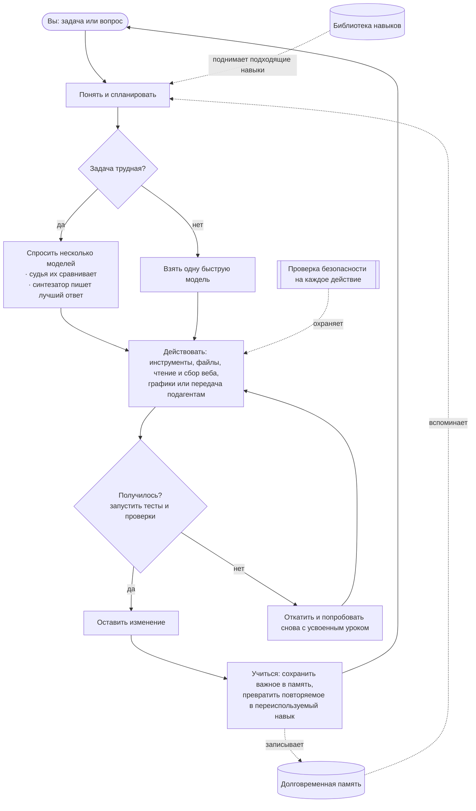

<div align="center">


# Chimera

**Управляемый самоэволюционирующий агент — доказанный и управляемый.**<br/>
<sub>Думает многими умами, сам делает настоящую работу, учится только доказанному и безопасен по своей архитектуре.</sub>

[](https://chimeraagent.space)
[](https://pypi.org/project/chimera-agent/)
[](LICENSE)
[](https://www.python.org/)
[](https://github.com/brcampidelli/chimera-agent/actions/workflows/ci.yml)
[](https://mypy-lang.org/)
[](https://github.com/astral-sh/ruff)
[](https://discord.gg/ACvBbrmguV)
[](https://www.reddit.com/r/ChimeraAgent/)

[](https://buy.stripe.com/9B6aEQ57q91m1Gp7Lz77O01)

<sub><a href="README.md">English</a> · <a href="README.pt-BR.md">Português</a> · <a href="README.es.md">Español</a> · <a href="README.de.md">Deutsch</a> · <a href="README.fr.md">Français</a> · <a href="README.it.md">Italiano</a> · <a href="README.pl.md">Polski</a> · <a href="README.zh-CN.md">中文</a> · <a href="README.ja.md">日本語</a> · <b>Русский</b></sub>

</div>

Большинство ИИ-помощников ставят всё на **одну** модель и забывают всё, когда чат заканчивается.
**Chimera делает две вещи иначе:** для сложных вопросов она спрашивает **несколько** моделей сразу и
смешивает их ответы в один более сильный результат, а ещё она **запоминает и учится**, поэтому
становится тем полезнее, чем больше вы ею пользуетесь. Она не только беседует — дайте ей цель, и она
составит план, применит инструменты, проверит собственную работу и оставит только то, что
действительно работает.

> **Бесплатная и с открытым исходным кодом (Apache-2.0), в ранней, но активной разработке.** Она уже
> работает от начала до конца: общайтесь с ней, поручайте ей задачи целиком, запускайте её ботом в
> любимом мессенджере, разворачивайте на сервере, чтобы она работала круглосуточно, и наблюдайте,
> как она учится на сделанном. Это **альфа** — надёжная и хорошо протестированная
> (**более 2000 автоматических тестов**, строгая проверка типов и линтинг на каждое изменение), но
> ещё не закалённая в бою на производстве.

---

## Зачем Chimera

Представьте, что большинство ИИ-инструментов — это вопрос **одному** эксперту в надежде, что он прав.
Chimera — это **панель экспертов**, которые спорят, **беспристрастный судья**, который взвешивает их
ответы, и **редактор**, который выдаёт лучший объединённый результат; а затем — коллега, который
действительно **делает работу** и **учится** на ней. Вот что делает её особенной, простыми словами:

- 🧠 **Много умов, один ответ.** На трудные вопросы Chimera спрашивает одно и то же у нескольких моделей, даёт одной модели сравнить их ответы, а последней — написать лучший объединённый ответ. Так получается более взвешенно и с меньшей вероятностью ошибки, чем у любой модели поодиночке. (Она делает это, только когда оно того стоит, чтобы оставаться быстрой и дешёвой.)
- 🚀 **Она делает работу, а не только говорит.** Дайте ей цель. Она разложит её на части, применит инструменты, отредактирует файлы, запустит тесты и **оставит изменение, только если оно проходит проверку**. Если что-то ломается, она откатывает и пробует снова — так что беспорядка после себя не оставляет.
- 🧬 **Она становится лучше, чем больше вы ею пользуетесь.** Она помнит ваши предпочтения и важные факты между разговорами и тихо превращает повторяющиеся задачи в переиспользуемые навыки. Она построена так, чтобы улучшаться, а не медленно деградировать на длинных дистанциях — проблема, которая незаметно портит многих агентов.
- 🛡️ **Безопасность по замыслу.** Каждое рискованное действие сначала проходит проверку, всё разрушительное спрашивает подтверждения, а недоверенный код может выполняться в запертом контейнере без сети. (Эти проверки — дешёвый первый фильтр, а не настоящая граница; граница — песочница, и изоляция контейнером включается по желанию. Смотрите [SECURITY.md](SECURITY.md).)
- 🔌 **Любая модель, запуск где угодно.** Пользуйтесь большими облачными моделями или своими локальными через один интерфейс — на ноутбуке или на сервере за $5, круглые сутки.
- 🧩 **По-настоящему ваша.** Открытый код, никакой привязки, никакой обязательной учётной записи у поставщика. Вы её запускаете, вы ею владеете, вы можете изменить в ней что угодно.

## Чем Chimera отличается

Chimera не пытается перещеголять гигантские проекты агентов по числу возможностей. Она ставит на три
вещи, которые настоящее исследование пяти лидеров (OpenClaw, Hermes, nanobot, CrewAI, LangGraph)
нашло **открытыми у всех**, — и делает их своей сердцевиной:

- 🧬 **Самоэволюция с сигналом пригодности.** Остальные «учатся», дописывая всё, что произошло, или через пул-реквесты людей — ничто не измеряет, помогло ли усвоенное изменение на самом деле. Chimera сохраняет изменение **только когда подтверждённый результат доказывает, что оно помогло**: шаг эволюции опирается на настоящую разницу в рабочем дереве и на честный A/B, а не на слово модели. Независимое подтверждение, что это важно: [EvoAgentBench (arXiv 2607.05202)](https://arxiv.org/abs/2607.05202) измерил, что *автоматические* методы кодирования опыта без такой проверки регулярно дают **отрицательный перенос** — один популярный метод просел на **−12,3 пункта** на задачах, под которые его не настраивали. Проверка Chimera теперь включает и **отложенную выборку на перенос**: усвоенное изменение не должно ухудшить непересекающийся срез той же способности, прежде чем его примут, — так оно не может просто заучить собственную оценку.
- 🛡️ **Безопасность через архитектуру.** Внедрение в промпт сегодня широко считается *непатчабельным*; популярные агенты смягчают его на уровне приложения или объявляют вне области. Chimera поставляет настоящий слой защиты — **включается через `--taint`, по умолчанию выключен**: она отслеживает происхождение заражения *эвристически* (дословный поток ссылок и содержимого, а **не** настоящий поток данных — модель, пересказавшая заражённый текст, отмывает его), убирает управляющие токены из недоверенного содержимого, сужает доступ к опасным инструментам на остаток заражённого запуска и охраняет повторы действий с побочными эффектами; недоверенный код выполняется в запертом контейнере, включаемом по желанию. На встроенном корпусе из **7 атак** блокируются **6 из 7** вредоносных вызовов (**около 14%** всё же проходят) — измерено на агенте, который *уже внедрён* и пытается сделать вызов, нужный атакующему, без модели в контуре. Плечо «без защиты» равно 100% по построению, а не по измерению: необёрнутый инструмент выполняется всегда, поэтому считайте это определением нижней границы, с которой сравнивается слой, а не базовой системой. Это ничего не говорит о том, насколько легко модель внедрить изначально, — это более трудная, открытая половина ([`chimera/eval/injection.py`](chimera/eval/injection.py)). [`SECURITY.md`](SECURITY.md) прямо перечисляет, что всё ещё проходит (передачи подагентам, слияние и пересказ, точки входа помимо командной строки): граница удержания — песочница, а этот слой лежит поверх неё.
- 📊 **Честные, опубликованные замеры.** Около 20% «решённых» случаев на популярной таблице лидеров на самом деле решены неверно. Chimera сообщает каждое число с доверительным интервалом — **включая запуски, где она не выиграла**, — и никогда не перезапускает замер ради значимости. Записанный парный запуск показывает, что цикл **поднимает слабую модель на заранее объявленном наборе из 100 задач — 48% → 71% (+23 пункта), 95% ДИ [+12,6%, +28,6%] — статистически значимо** (интервал не включает ноль), из **28 задач, которые он вытянул** (провал → подтверждённое прохождение) против 5 ухудшений. Один запуск, без перезапусков. Это **заменяет более ранний запуск того же набора** (9% → 15%, +6 пунктов), где стенд оценивал файлом тестов, который агент мог править, — и при перезапуске он его однажды правил. Направление и значимость воспроизвелись и усилились после того, как оценивание ужесточили; поправка, сохранённые доказательства подмены и объяснение, почему абсолютные значения в первом запуске были настолько ниже, — всё в [`bench/local_lift/RESULTS.md`](bench/local_lift/RESULTS.md). А на **официальном Terminal-Bench** заранее объявленный A/B при N=40 упёрся в **пол, где всё определяет разброс, без значимой разницы в любую сторону** — опубликовано как есть ([`bench/terminal_bench/RESULTS.md`](bench/terminal_bench/RESULTS.md)), включая **отзыв неверного промежуточного вывода** после того, как контрольное плечо было измерено. Нулевые результаты и самоопровержения тоже публикуются; в этом весь смысл.

**Одной строкой: управляемый самоэволюционирующий агент — доказанный и управляемый.** Это альфа, и она об этом говорит.

## Замеры (честные)

Два записанных числа, оба верные, опубликованы вместе намеренно — одно теперь значимое, другое
отрезвляющее. (Они же выведены на экран **«Зрелость и замеры»** в приложении для рабочего стола,
прямо из поставляемого снимка.)

- **Подъём слабой модели (значимо).** Дешёвая модель (`mistral-small-3.2-24b`) с циклом повторов
  Chimera против той же модели в одиночку, на **заранее объявленном наборе из 100 задач** (замысел и
  задачи закоммичены и отправлены до единого обращения к модели): **48,0% → 71,0% (+23,0 пункта)**,
  парный **95% ДИ [+12,6%, +28,6%] — статистически значимо** (интервал не включает 0), из
  **28 задач, которые цикл вытянул** (провал → подтверждённое прохождение) против 5 ухудшений. Одна
  модель, одно зерно на задачу, небольшие самодостаточные задачи на Python — это **НЕ** SWE-bench и
  не переносится на настоящие репозитории. Один запуск, без перезапусков.
  **Это заменяет более ранний запуск того же набора** (9,0% → 15,0%, +6,0 пункта), где стенд оценивал
  файлом тестов, который испытуемый агент мог править. Перезапуск с восстановленным нетронутым тестом
  застал агента за переписыванием собственного оценивающего теста на одной задаче — то есть дыра была
  настоящей, — а подъём воспроизвёлся *больше*, а не меньше. Утверждение раннего запуска, что «85 из
  100 задач достаточно трудны, чтобы провалить оба плеча», тоже не подтвердилось: перезапуск намерил
  24. Полная поправка, сохранённые доказательства подмены и то, что не удалось перепроверить, — в
  [`bench/local_lift/RESULTS.md`](bench/local_lift/RESULTS.md).
  Источник: [`bench/local_lift/_reverify_n100/paired.json`](bench/local_lift/_reverify_n100/paired.json), [`PREREGISTRATION.md`](bench/local_lift/PREREGISTRATION.md).
- **SWE-bench Verified — самое весомое внешнее свидетельство, и оно пережило воспроизведение,
  задуманное его убить.** Три заранее объявленных запуска на срезах `django/django`, оценённые
  **только** официальным стендом `swebench` 4.1.0 в Docker — никогда не по собственным словам.

  | запуск | срез | база | + Chimera | парная Δ | 95% ДИ | |
  |---|---|---|---|---|---|---|
  | 1 (`max_steps=8`) | 19 | 36,8% | 36,8% | +0,0% | [−8,5%, +8,5%] | нз |
  | 2 (`max_steps=30`) | те же 19 | 42,1% | 57,9% | +15,8% | [−1,9%, +15,8%] | нз |
  | **3 (воспроизведение)** | **41 невиданная** | 34,1% | 43,9% | **+9,8%** | [−3,5%, +16,7%] | нз |
  | объединённо *(вторично)* | 60 | 36,7% | 48,3% | **+11,7%** | **[+0,8%, +16,4%]** | **значимо** |

  Плюс 15,8% во втором запуске сложились из счёта 3:0 на трёх информативных парах, и предварительная
  регистрация давала этому **один шанс из трёх оказаться именно тем, чем оно и выглядит — удачной
  выборкой**, с заранее обещанным отзывом. Третий запуск проверил это на **41 случае, исходов которых
  мы никогда не видели**, не меняя больше ничего. Эффект **появился снова** (+9,8%, внутри
  зарегистрированной полосы от +5 до +20) на срезе, который оказался *труднее* второго. По обоим
  запускам расходящиеся пары идут **9 за Chimera против 2** (p ≈ 2,6% при нулевой гипотезе).

  **Механизм воспроизвёлся, и это самое интересное.** Четвёртый запуск вернул среднее плечо (простой
  каркас без проверки разницы) на тех же 41 случаях, так что все три различаются ровно одним
  компонентом. Все три **правят с одинаковой частотой** (27–28 патчей из 41); меняется то, как часто
  правка *верна*:

  | плечо | решено | **точность, когда правил** |
  |---|---|---|
  | база | 14/41 | 50% |
  | + каркас | 16/41 | 59% |
  | + каркас **и** проверка разницы | 18/41 | 67% |

  **Оба компонента вносят вклад, примерно поровну** (+4,9% каждый, поодиночке ни один не значим) —
  что **противоречит нашему собственному зарегистрированному предсказанию**, будто каркас вытянет
  большую часть, и отзывает вывод второго запуска о том, что проверка разницы «не то, что дало
  прирост». Отзыв — в [`RESULTS.md`](bench/swe_bench/RESULTS.md); аккуратная аддитивность *не*
  заявляется как измеренное деление пополам, поскольку каждое сравнение держится на 5–6 расходящихся
  парах.

  ⚠️ Читайте честно: **основной результат вне обучающей выборки НЕ значим.** Значимо
  **объединённое вторичное** число, заранее объявленное вторичным именно потому, что смешивает
  виденные данные с невиданными, — и оно не переводится в заголовок теперь, когда перешло черту. И
  **48,3% — это НЕ оценка по SWE-bench Verified**: срез намеренно лёгкий и из одного репозитория,
  настоящая оценка требует всех 500. Ровный ноль первого запуска опубликован без изменений, а второй
  запуск получил **заслуженный отзыв** (механизм, которым мы объясняли его пустые патчи, оказался
  неверным — лекарством был бюджет шагов).
  Источник: [`bench/swe_bench/RESULTS.md`](bench/swe_bench/RESULTS.md), [`PREREGISTRATION.md`](bench/swe_bench/PREREGISTRATION.md).
- **Terminal-Bench (отрезвляюще).** Заранее объявленный A/B при N=40 на официальном замере, одна и та
  же модель в обоих плечах (`deepseek-chat-v3.1`): **7,5% → 2,5%** с каркасом, парная
  **Δ −5,0 пункта, 95% ДИ [−5,0%, +1,6%] — не значимо**. Каркас **не поднял и без того умелую
  модель** (это не тот слабый режим «золотой середины», где каркас помогает); оба плеча стоят на полу,
  где всё определяет разброс.
  Источник: [`bench/terminal_bench/RESULTS.md`](bench/terminal_bench/RESULTS.md).
- **Помогает ли накопленное обучение? Семь запусков отвечают: доказательно — нет (и один
  положительный результат отозван).** Маховик — навыки, допускаемые по повторяемости и тесту на
  перенос, карточки антипаттернов, постоянная память — измерялся в **семи заранее объявленных
  запусках**. Шестой дал единственный положительный результат серии (значимые +6,7% по метрике
  переноса внутри семейства); **седьмой, с большей мощностью, срезал его до +2,0% и незначимости —
  поэтому он отозван**, ровно как обещала предварительная регистрация. Честный вывод: **ни один
  достаточно мощный запуск не показывает, что накопленное обучение улучшает решение задач**, и
  препятствие — сам инструмент: три попытки составить набор, попадающий в информативную полосу
  40–60%, все дали 84–92%. «Она становится лучше, чем больше вы ею пользуетесь» остаётся
  **недоказанным**.
  Источник: [`bench/learning_lift/RESULTS.md`](bench/learning_lift/RESULTS.md).

Значимо внутренне (на нашем собственном трудном наборе). На настоящих репозиториях —
**воспроизвелось вне выборки и значимо только при объединении**: честная формулировка, а не лестная.
Отрезвляюще на Terminal-Bench. Утверждение об обучении **отозвано**. Мы публикуем всё это, записываем
ветку, в которой результат убивает наше же утверждение, *до* запуска, и не перезапускаем замеры ради
значимости — это была бы подгонка.

## Экономика токенов — измеренная, а не заявленная

Два инстинкта в духе «больше моделей = лучше», проверенные на настоящих запусках (предсказания
регистрировались *до* каждого запуска, победы **и** поражения публикуются — смотрите [`bench/`](bench/)):

**Слияние — редкое средство, а не режим по умолчанию.** На наборе из 12 задач на рассуждение средняя
ступень в одиночку набрала 100% за 846 токенов; полное слияние тоже набрало 100% — за
**9526 токенов (примерно в 11 раз больше)**. Поэтому слияние стоит за каскадом
дёшево→проверка→средняя→слияние, который поднимается по ступеням, только когда бесплатная проверка
не проходит, достигая качества средней ступени примерно за 1/12 стоимости слияния.

**Иерархическая оркестрация выигрывает только там, где и должна, — и по закону, который можно
записать.** `chimera orchestrate` делит задачу между работниками с ограниченной областью вместо
одного большого контекста. Одиночный агент пересылает каждый документ на каждом ходе; работники с
областью читают каждый один раз. Поэтому экономия токенов масштабируется как **(D−1)/D** по числу
документов D — подтверждено на настоящих запусках с точностью лучше 0,2%:

| документов (D) | измеренная экономия токенов | (D−1)/D |
|---|---|---|
| 2 | 49,9% | 50% |
| 3 | 66,7% | 66,7% |
| 4 | 74,8% | 75% |
| 5 | 79,9% | 80% |

Экономия держится ровно по мере удлинения разговора и растёт с размером документа к тому же пределу
([полный обход, 3 оси](bench/hierarchy_sweep/README.md)). А там, где это *не* окупается — задача в
один ход, — классификатор это распознаёт и **возвращается к одиночному агенту** (тот запуск стоил на
47% больше токенов; мы опубликовали и его).

**Честная сноска.** Это счёт *токенов*. При кэшировании промпта поставщик берёт за повторяемые
документы одиночного агента примерно 0,1× — поэтому выигрыш *в деньгах* меньше, а через несколько
ходов он может **перевернуться** (независимые работники заново платят за холодный контекст, который
одиночный агент кэширует). Мы поставляем
[модель, которая это считает](bench/hierarchy_sweep/cache_cost.py), а не выдаём тихо число токенов за
число долларов.

## Возможности

### 🧠 Думать и делать
- **Смешивать несколько моделей в один ответ** (`chimera fuse`) — панель моделей, судья, который показывает, где они сходятся, расходятся или чего-то не заметили, и синтезатор, пишущий итоговый ответ. Умный маршрутизатор тратит эти дополнительные усилия только на трудные задачи, а когда первые модели уже согласны — останавливается досрочно: измерено **примерно на 20–28% меньше токенов** на наших замерах — при точности от 0 до −8,3 п.п. за три прогона; этот разброс мы трактуем как недетерминизм модели, потому что он целиком приходится на эскалированную часть, где выборочный и полный режимы выполняют одинаковый конвейер. (Само по себе слияние не уникально — оно есть и в OpenRouter, и в других инструментах; разница в том, что здесь оно вшито в цикл агента за этим маршрутизатором, знающим цену, и измерено, а не выбирается как модель.)
- **Доводить задачи до конца самостоятельно** (`chimera solve`) — она планирует, действует инструментами, а затем **проверяет и откатывает**: запускает вашу проверку (например, тесты) и оставляет изменение, только если оно проходит, иначе отменяет и пробует снова. По желанию работает на изолированной копии проекта, так что ничего не трогается, пока не доказано. **И убедительный абзац — это не решение:** если нет `--verify`, на который можно сослаться, запуск, ничего не изменивший на диске, отмечается как провал, а не как успех, — потому что судить о нём осталось бы только модели, читающей текст, а она никогда не видит разницу файлов. Каждая попытка записывает, *кто* её одобрил (`verifier` / `diff+manager` / `manager` / `none`), так что расписка никогда не говорит «успех», не назвав стоящую за ним инстанцию.
- **Команды специалистов** (`chimera crew`, `chimera crew-isolated`) — несколько агентов с ролями делят одну работу. В изолированном режиме каждый работает на **своей частной копии параллельно**; безопасные правки сливаются, столкновения помечаются, а не переписываются молча, и изменения плохого работника могут быть отклонены его собственным тестом. Руководитель может свести работу всех в один общий отчёт.
- **Делегировать и исследовать** — любой агент может передать самодостаточную подзадачу свежему **подагенту**, который вернёт только результат, оставляя основной контекст чистым. **Исследователь контекста** (`chimera explore`) находит нужные файлы и строки в кодовой базе и возвращает короткий ответ вместо того, чтобы вываливать всё.

### 🧬 Память и самосовершенствование
- **Долговременная память** — она хранит кратковременные, недавние, фактические и относящиеся к вам воспоминания, плюс карту их связей. Она может хранить память в быстрой полнотекстовой базе, переносить профиль ваших предпочтений в каждый разговор, автоматически объединять повторяющиеся заметки и мягко предлагать сохранить предпочтение, когда вы его упоминаете.
- **Усваивает новые навыки** — когда она дважды справляется с задачей одного вида, она автоматически превращает это в проверенный переиспользуемый навык.
- **Необязательное самообучение (для продвинутых)** — она может записывать собственный опыт, чтобы вы позже дообучили на нём модель. По умолчанию выключено; ничего не обучается без вашей просьбы.

### 📏 Цикл, который можно измерить — и который скажет, когда заблудился
Агент — это модель **плюс всё вокруг неё**. Именно эта окружающая механика решает, останется ли
длинный запуск полезным, и почти вся она невидима, пока не сломается. Chimera измеряет свою:

- **Каждый запуск оставляет расписку.** Одна строка JSONL на запуск в `traces.jsonl`: токены по шагам, вызванные инструменты и что они вернули, где отбрасывалась история — и **доля попаданий в кэш**, то есть какая часть токенов промпта пришла у поставщика из кэша. Последнее — настоящее число стоимости цикла (кэшированный токен стоит примерно в десять раз меньше свежего, поэтому одинаковый счёт токенов может отличаться в цене раз в десять) *и* сигнал тревоги для архитектуры: она обваливается всякий раз, когда что-то переписывает начало промпта, а других симптомов у этого нет. Поставщик, который не сообщает о кэше, читается как **неизвестно**, а не как промах.
- **Она замечает, когда перестала продвигаться.** «Проблемами контекста» называют две разные вещи: истончение внимания внутри одного длинного промпта и *траекторию*, которая тихо перестаёт накапливать и начинает ходить по кругу — каждый отдельный шаг в порядке, а запуск в целом никуда не идёт. Прерыватель цикла Chimera ловит тесную версию (окно в 12 вызовов); запуск, возвращающийся к одним и тем же трём файлам каждые двадцать ходов, проходит сквозь него насквозь. Поэтому есть второй детектор, сравнивающий **первую половину запуска со второй**: заново выведенная работа, которая у запуска уже была, растущие сбои или скачок избыточности сразу после отбрасывания истории. Он **сообщает и не действует** — остановка, перепланирование и принудительное сжатие все выглядят правдоподобными лекарствами, а свидетельств, какое из них помогает, у нас нет, поэтому выбрать одно значило бы вшить ровно то неизмеренное допущение, ради устранения которого эта работа и существует.
- **Длинные запуски переживают собственный контекст.** Раньше исчерпание окна попросту заканчивало запуск, из-за чего настоящим потолком было окно, а не трудность задачи. Теперь сжатие оставляет системное сообщение нетронутым (это устойчивое начало, на котором держится весь кэш промпта), никогда не отрывает результат инструмента от его вызова и **восстанавливает то, без чего запуск перестал бы быть собой**: открытый файл, план, список задач, текущее состояние. Оно прямо говорит, что отбросило, вместо того чтобы это пересказать, — агент может перечитать файл, но не может разувериться в выдуманном пересказе.

### 🔌 Подключать и автоматизировать
- **Говорить с ней где угодно** — чат в терминале, полноэкранное терминальное приложение или бот в **Discord, Telegram, Slack, Signal и WhatsApp**. Есть и простая конечная точка HTTP.
- **Расписание и инициатива** — задавайте повторяющиеся задания обычными словами («каждое утро кратко излагай новости»). Со встроенным планировщиком она **действует по часам**, а не только когда вы ей пишете.
- **Инструменты и интеграции** — читать и записывать файлы, выполнять команды оболочки, **читать полностью отрисованные веб-страницы и собирать данные с целых сайтов** (структурное извлечение идёт через изолированный читатель без инструментов, который может выдать только поля, прошедшие проверку схемы, — это ограничивает радиус поражения скрытой инструкции, а не устраняет его), и запускать код в песочнице. Подключайте почти любой веб-сервис (через его API) или внешний инструмент — включая любой **сервер MCP** ([руководство и рабочий пример](docs/mcp.md)) — и переносите свою настройку из других агентских инструментов, которыми вы уже пользуетесь.
- **Всё в комплекте** — веб-поиск, генерация изображений (в облаке **или полностью локально**), **распознавание речи** и синтез речи, **скачивание медиа**, **анализ данных и графики**, почта, календарь, выполнение кода и другое — остаётся только включить.

### 🚀 Запуск где угодно, безопасно
- **Любая модель, один интерфейс** — облачные модели или ваши локальные, с автоматическим переходом на запасную, если одна недоступна, и ротацией нескольких ключей.
- **Развёртывание на сервере одной командой** — запустите её в Docker (или на голом железе), чтобы она не падала и поднималась после перезагрузки. Смотрите **[docs/deploy.md](docs/deploy.md)**.
- **Ядро безопасности** — проверка на каждое действие (разрешить / предупредить / заблокировать / спросить), **включаемый по желанию** контейнер без доступа к сети для недоверенного кода (`CHIMERA_SANDBOX=docker`; локальный запуск по умолчанию *не* изолирован) и полный журнал аудита сделанного.
- **Остановиться до фиксации, если прочитано что-то недоверенное** (`--pause-on-taint`) — запуск, поглотивший недоверенное содержимое, паркуется вместо завершения и ждёт вас. Вы можете принять результат, принять исправленную вами версию, дать указание и позволить попробовать снова или отклонить совсем — из терминала *или* из приложения для рабочего стола. Ничего не сохраняется и ничему не учится, пока вы не решите, а пауза никогда не отмечается как провал: она не пришла к вердикту, она ждёт человека.
- **Приложение для рабочего стола, которое ведёт запуск, а не только его начинает** — пять пунктов назначения вместо меню из пятнадцати, на десяти языках. Запустите и уходите: прогресс никуда не денется к вашему возвращению, строка состояния называет, чем занят агент, с любого экрана, и «Остановить» работает отовсюду. Родные установщики для Windows / macOS / Linux — на странице [Releases](https://github.com/brcampidelli/chimera-agent/releases).

## Быстрый старт

Нужны **Python 3.11–3.13** и [uv](https://docs.astral.sh/uv/) (быстрый установщик для Python).

**1. Установка** — из PyPI:
```bash
pip install chimera-agent
```
Это даёт команду `chimera`. (В примерах ниже используется `uv run chimera` для работы из исходников —
при установке через pip просто выполняйте `chimera …`.) Чтобы дорабатывать саму Chimera, склонируйте
репозиторий:
```bash
git clone https://github.com/brcampidelli/chimera-agent.git
cd chimera-agent
uv sync --extra dev
```

**2. Добавьте один ключ поставщика ИИ.** Проще всего ключ [OpenRouter](https://openrouter.ai) — один
ключ открывает более 100 моделей.
```bash
cp .env.example .env
# откройте .env и задайте, например:  CHIMERA_OPENROUTER_KEYS=sk-or-...
```

**3. Проверьте, что всё готово**
```bash
uv run chimera doctor
```

**4. Попробуйте**
```bash
uv run chimera chat                         # поговорить (она запоминает)
uv run chimera run "Explain what you can do in 3 bullets"
uv run chimera fuse "What's the best way to learn to cook?" --show-panel   # посмотреть, как смешиваются несколько моделей
uv run chimera solve "add a hello() function to app.py and a test for it" --verify "pytest -q"
```

**Запустить на сервере (чтобы работала круглосуточно):**
```bash
docker compose up -d      # шлюз и планировщик; перезапускается автоматически
```
Полное руководство (Docker или systemd, расписание, резервные копии, безопасность):
**[docs/deploy.md](docs/deploy.md)**.

**5. Сделайте что-то настоящее за 5 минут: разбор почты.** Направьте Chimera на свой ящик и получите
десятисекундную сводку — только чтение, разбор на URGENT / PERSONAL / NEWSLETTER / COLD-SALES и, по
желанию, запуск этого каждое утро:
```bash
uv run chimera workflow examples/email_triage/triage.yaml -w ./triage_workspace
```
Настройка, ежедневное расписание и честные оговорки:
**[examples/email_triage/README.md](examples/email_triage/README.md)**.

## 🧰 Что умеет Chimera — и как включить каждую вещь

Впервые здесь? Chimera работает сразу после `pip install chimera-agent` и одного ключа ИИ. Нескольким
способностям (чтение документов, слух, графики, скачивание видео…) нужен небольшой необязательный
пакет — так называемый **«extra»**, — а некоторым нужен ключ сервиса. В этом разделе перечислены
**все способности, что именно поставить и какой командой попробовать**. Никаких предварительных
знаний не требуется.

### Включить всё сразу
```bash
pip install 'chimera-agent[full]'     # все возможности ниже, кроме требующих GPU, одной командой
```
Для звука и видео на компьютере также нужен **ffmpeg**:
`macOS: brew install ffmpeg` · `Ubuntu/Debian: sudo apt install ffmpeg` · `Windows: choco install ffmpeg`.
Предпочитаете лёгкую установку? Оставьте `pip install chimera-agent` и добавьте только нужные extra
(смотрите столбец «Нужно»). **Пользуетесь Docker? В официальном образе всё нижеперечисленное уже
собрано.**

### Каждая способность, по пунктам
**Нужно** = что добавить: `—` работает в базовой установке · `[extra]` = `pip install 'chimera-agent[extra]'` · `key: X` = ключ поставщика, который вы кладёте в `.env`.

| Что вы получаете | Нужно | Как этим пользоваться |
|---|---|---|
| **Чат, который вас помнит** | — | `chimera chat` |
| **Задать один вопрос** | — | `chimera run "explain X in 3 bullets"` |
| **Полноэкранное терминальное приложение** | — | `chimera tui` |
| **Приложение для рабочего стола** (чат · работа · код · знания · автоматизация, на 10 языках) | `[desktop]` или загрузка | `chimera app` либо возьмите родной установщик (`.exe`/`.dmg`/`.AppImage`/`.deb`) на странице [Releases](https://github.com/brcampidelli/chimera-agent/releases) |
| **Сделать задачу и оставить результат, только если проверка проходит** | — | `chimera solve "add hello() to app.py + a test" --verify "pytest -q"` |
| **Спросить меня перед фиксацией того, что прочитано из веба** | — | добавьте `--pause-on-taint` к `chimera solve` |
| **Увидеть, во что реально обошёлся запуск, по шагам** | — | пишется для вас в `.chimera/traces.jsonl` (или в `$CHIMERA_HOME`) |
| **Смешать несколько моделей в один ответ** | — | `chimera fuse "your question" --show-panel` |
| **Команда агентов-специалистов** | — | `chimera crew "your task" --mode supervisor` |
| **Довести целый проект до конца** (спрашивает перед рискованными шагами) | — | `chimera project start spec.yaml -w .` |
| **Видеть изображения** (зрение) | key: Gemini или OpenAI | `chimera run --image photo.jpg "what's in this?" --model gemini/gemini-2.0-flash` |
| **Слышать звук** (речь → текст) | `[stt]` + ffmpeg | `chimera run "transcribe meeting.mp3"` |
| **Говорить** (текст → речь) | key: ElevenLabs или OpenAI | попросите любую задачу «прочитать это вслух в speech.mp3» |
| **Читать документы** (PDF, Word, Excel → текст) | `[documents]` | `chimera run "summarize report.pdf"` |
| **Скачивать видео и звук** (YouTube и 1000+ сайтов) | `[media-dl]` + ffmpeg | `chimera run "download the audio of <url>"` |
| **Анализировать данные и строить графики** | `[data,viz]` | `chimera run "load sales.csv and chart monthly revenue"` |
| **Искать в вебе** | key: Tavily | `chimera run "search the web: the latest Python version"` |
| **Читать и собирать настоящие веб-страницы** (настоящий браузер) | — | `chimera run "open example.com and tell me the heading"` |
| **Долговременная память** | — | `chimera memory add "..."` · `chimera memory search "..."` |
| **Автоматически усваивать переиспользуемые навыки** | — | происходит во время `chimera solve`; список — командой `chimera skills` |
| **Планировать повторяющуюся работу** | — | `chimera cron add brief "0 8 * * *" "summarize the news"` |
| **Работать чат-ботом** (Discord/Telegram/Slack/Signal/WhatsApp) | `[messaging]` | `chimera serve --cron --discord` |
| **Подключить любой внешний инструмент** (MCP) | `[mcp]` | руководство: [docs/mcp.md](docs/mcp.md) |
| **Генерировать изображения** (в облаке) | key: OpenAI | попросите задачу «сгенерировать изображение …» |
| **Генерировать изображения** (полностью локально, нужен GPU) | `[imagegen-local]` | то же самое, без сети |

> Ставьте extra по отдельности, если хотите лёгкую сборку — `messaging`, `mcp`, `documents`,
> `media-dl`, `stt`, `data`, `viz`, `youtube` (все входят в `full`), плюс требующие GPU
> `imagegen-local` и `train`. Пример: `pip install 'chimera-agent[documents,stt]'`.

### Первый раз? Шесть шагов для совсем начинающих
1. **Поставьте Python 3.11–3.13** ([python.org](https://www.python.org/downloads/)); проверьте командой `python --version`.
2. **Поставьте Chimera:** `pip install 'chimera-agent[full]'` (или просто `chimera-agent` для лёгкого ядра).
3. **Получите один ключ ИИ** — проще всего ключ [OpenRouter](https://openrouter.ai) (один ключ → более 100 моделей).
4. **Отдайте ключ Chimera:** скопируйте `.env.example` в `.env`, задайте `CHIMERA_OPENROUTER_KEYS=sk-or-...`.
5. **Проверьте готовность:** `chimera doctor` — она скажет, что настроено, а чего не хватает.
6. **Попробуйте:** `chimera chat`.

Дальше любая команда из таблицы выше просто работает. Полный справочник команд с примерами для
копирования: **[docs/usage.md](docs/usage.md)**.

> **Проблемы с установкой?** Сама Chimera — чистый Python (колесо для каждой ОС), но транзитивная
> зависимость иногда может заставить `pip` собирать из исходников (запрашивая Rust/Cargo), если он
> откатится на старую версию без готового колеса для вашей платформы. Если столкнулись с этим:
> сначала обновите pip (`python -m pip install --upgrade pip`), а если не помогло — возьмите Python
> 3.12/3.13 (у них самое широкое покрытие колёсами). Чистая установка через `pip` проверяется в CI на
> Linux/macOS/Windows × Python 3.11/3.13.

## Как это работает

Дайте Chimera задачу; она планирует (поднимая наиболее подходящие встроенные навыки), думает (смешивая
модели, когда задача трудна), действует инструментами — читает и собирает веб, правит файлы, строит
графики, — **проверяет собственную работу и оставляет только то, что прошло**, а затем учится на
результате, возвращая память и новые навыки в следующую задачу.



## Команды

Каждая команда — это `chimera <имя>` (или `uv run chimera <имя>` до установки).

```bash
chimera doctor / models / features    # проверить настройку, список моделей, необязательные возможности
chimera chat                          # интерактивный помощник, помнящий между ходами
chimera tui                           # полноэкранное терминальное приложение
chimera run "PROMPT" --image pic.png  # разовый ответ (может прочитать изображение)
chimera fuse "PROMPT" --show-panel    # смешать несколько моделей: панель -> судья -> синтезатор
chimera solve "TASK" --verify "pytest -q" --isolate   # сделать задачу; оставить изменение, только если проверка проходит
chimera crew "TASK" --mode supervisor         # команда специалистов берётся за одну задачу
chimera crew-isolated "TASK" -W "name:role" --verify "..." --synthesize   # команда, каждый в своей изолированной копии
chimera explore "where is login handled?"     # найти нужные файлы и строки, получить короткий ответ
chimera deliver "a launch plan" -o plan.md    # выдать готовый документ
chimera serve --cron [--discord|--telegram|--slack|--signal]   # работать службой: чат-бот и планировщик
chimera cron add "brief" "0 8 * * *" "Summarize the news"       # запланировать повторяющуюся работу
chimera memory add / graph / consolidate      # долговременная память: сохранить, связать, прибрать
chimera kanban add/board/run                   # доска задач, раздающая работу агенту
chimera workflow flow.yaml                     # выполнить повторяемую автоматизацию, описанную в файле
chimera migrate <source> <dir> --apply         # перенести настройки, навыки и память из другого агентского инструмента
chimera evolve status / tune / recipe          # необязательно: самооптимизация; подготовка данных для дообучения модели
chimera fusion-bench / skillcard-bench / schema-bench / sandbox-bench   # честные A/B-замеры: измерить стоимость, качество и побочные эффекты до того, как доверять возможности
chimera pet new --name Chimi                   # завести маленького виртуального питомца :)
```

Полный справочник с примерами для копирования — в **[руководстве по использованию](docs/usage.md)**.

## Архитектура

Chimera — это пакет на Python с чётко разделёнными частями, так что любую можно понять или расширить
отдельно:

```
chimera/
  core/          цикл агента: план, действие, проверка, оставить-или-откатить и изолированные рабочие копии
  fusion/        движок «многих умов»: панель -> судья -> синтезатор + умный маршрутизатор
  memory/        кратковременная / недавняя / фактическая / о вас память + граф связей
  skills/        встроенная библиотека навыков и то, как находятся подходящие
  evolution/     усвоение новых навыков из успеха и опыт, на котором она учится
  governance/    ядро безопасности (разрешить/предупредить/заблокировать/спросить), журнал аудита и контроль изменений
  orchestration/ команды агентов: роли, экипажи, изолированные параллельные работники, общие отчёты
  ecosystem/     продвинутое самосовершенствование: агенты, проектирующие агентов, необязательное обучение моделей
  kanban/        доска задач, передающая карточки агенту
  workflow/      описать повторяемую автоматизацию простым файлом и выполнить её
  tools/         встроенные инструменты (файлы, оболочка, веб, поиск) + выполнение кода
  sandbox/       выполнять инструменты локально или внутри запертого контейнера
  integrations/  подключение внешних инструментов и любого веб-API
  scheduler/     повторяющиеся задания и демон, запускающий их вовремя
  migration/     перенос вашей настройки из других агентских инструментов
  providers/     один интерфейс к каждой модели, с запасными вариантами и ротацией ключей
  interface/     общий движок разговора (используется чатом, приложением и ботами)
  server/        шлюз мессенджеров и конечная точка HTTP
  cli/           команда `chimera`
```

Полное описание замысла — в [docs/architecture.md](docs/architecture.md).

## Видение и цели

**Цель Chimera проста: ИИ-агент, которого может запустить кто угодно, который рассуждает лучше,
объединяя много моделей вместо доверия одной, который действительно становится лучше от
использования и который при этом остаётся безопасным и полностью открытым.**

Большинство сегодняшних ИИ-инструментов либо умны, но забывчивы (теряют всё, когда чат заканчивается),
либо способны, но закрыты (вы их не контролируете). А многие из тех, что пытаются «улучшать себя»,
тихо становятся *хуже* на длинных дистанциях. Chimera — наша попытка пойти другим путём:

- **Лучше думать, а не больше платить** — объединять несколько моделей только тогда, когда это помогает, чтобы качество росло без лишних трат.
- **Настоящая память и настоящие навыки** — помнить то, что важно, и превращать повторяемую работу в переиспользуемые умения.
- **Улучшение, которое держится** — сопротивляться медленному распаду, портящему других агентов, проверяя собственную работу и храня состояние за пределами модели.
- **Безопасно и прозрачно** — каждое действие можно проверить, а разрушительные спрашивают заранее.
- **Открыто для всех** — бесплатно, под лицензией Apache-2.0, силами сообщества, без привязки.

Это ранняя стадия (альфа), и честность нам важна: в тяжёлой промышленной эксплуатации она ещё не
проверена. Если это видение вам близко, мы будем рады вашей помощи.

## Разработка

```bash
git clone https://github.com/brcampidelli/chimera-agent.git
cd chimera-agent
uv sync --extra dev

uv run ruff check .      # стиль и линтинг
uv run mypy chimera      # строгая проверка типов
uv run pytest -q         # набор тестов
```

Вклад очень приветствуется — код, документация, идеи, сообщения об ошибках. Начните с
[CONTRIBUTING.md](CONTRIBUTING.md) и нашего [кодекса поведения](CODE_OF_CONDUCT.md).
Хотите научить Chimera чему-то новому? **[Руководство по расширению](docs/extending.md)** проводит
через добавление собственного **инструмента, навыка или рецепта** (с примерами для копирования).
Нашли проблему безопасности? Смотрите [SECURITY.md](SECURITY.md).

## Сообщество

Есть вопрос, идея или желание помочь? **[Присоединяйтесь к нам в Discord](https://discord.gg/ACvBbrmguV)** — рады каждому.

Больше нравится Reddit? Следите за **[r/ChimeraAgent](https://www.reddit.com/r/ChimeraAgent/)** — там новости и обсуждения.

## Поддержать

Chimera бесплатна, с открытым исходным кодом и делается в открытую. Если она вам полезна, вы можете
помочь её развитию разовым пожертвованием — важна любая сумма, и мы очень благодарны. 💜

**[💜 Пожертвовать через Stripe](https://buy.stripe.com/9B6aEQ57q91m1Gp7Lz77O01)**

## Лицензия

[Apache-2.0](LICENSE) — свободно использовать, изменять и строить на этом.
