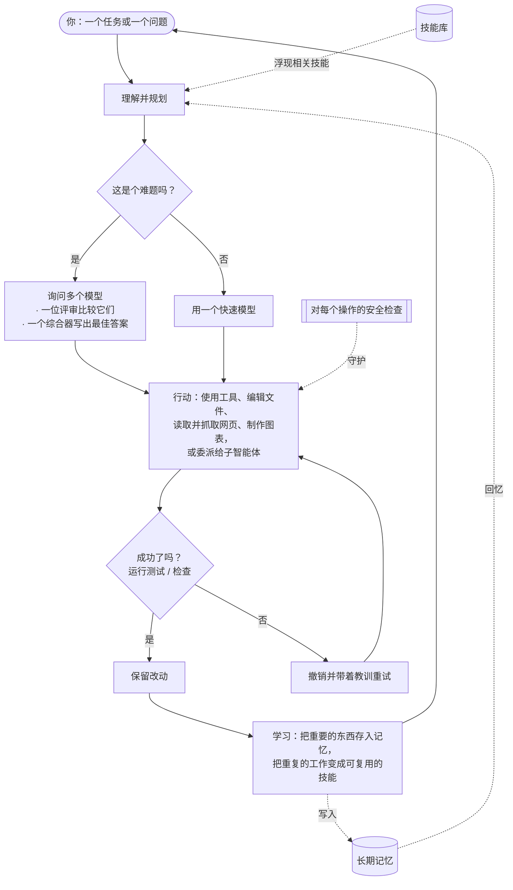

<div align="center">


# Chimera

**受治理的自我进化智能体 —— 经过验证，受到治理。**<br/>
<sub>用众多智慧思考，自主完成真正的工作，只学习经过验证的东西，并且从架构上保证安全。</sub>

[](https://pypi.org/project/chimera-agent/)
[](LICENSE)
[](https://www.python.org/)
[](https://github.com/brcampidelli/chimera-agent/actions/workflows/ci.yml)
[](https://mypy-lang.org/)
[](https://github.com/astral-sh/ruff)
[](https://discord.gg/ACvBbrmguV)
[](https://www.reddit.com/r/ChimeraAgent/)

[](https://donate.stripe.com/9B63cofM491m4SBfe177O00)

<sub><a href="README.md">English</a> · <a href="README.pt-BR.md">Português</a> · <a href="README.es.md">Español</a> · <a href="README.de.md">Deutsch</a> · <a href="README.fr.md">Français</a> · <b>中文</b> · <a href="README.ja.md">日本語</a></sub>

</div>

大多数 AI 助手都把宝押在**单一**模型上，而且聊天一结束就把一切都忘光了。
**Chimera 有两点不一样：** 遇到难题时，它会**同时**询问好几个 AI 模型，把它们的答案融合成一个更强的结果；
而且它会**记住并学习**，用得越多就越好用。它不只是聊天 —— 给它一个目标，它就会规划、使用工具、检查自己的成果，
只保留真正有效的部分。

> **免费且开源（Apache-2.0），处于早期但活跃的开发阶段。** 它已经能端到端地工作：和它聊天、让它自己完成任务、
> 把它当作机器人跑在你喜欢的聊天软件上、部署到服务器让它 24/7 运行，并看着它从自己的行动中学习。它目前是
> **alpha 版** —— 扎实且经过大量测试（**1000+ 项自动化测试**，每次改动都做严格的类型检查和代码风格检查），但还没有
> 在生产环境中千锤百炼。

---

## 为什么选择 Chimera

把大多数 AI 工具想象成只问**一位**专家，然后祈祷他是对的。而 Chimera 就像拥有一个会互相讨论的**专家小组**、
一位权衡各方答案的**公正评审**，以及一位交付最佳综合结果的**写手** —— 然后再加上一位真正**动手干活**并从中
**学习**的队友。用大白话说，它的特别之处在于：

- 🧠 **众多智慧，一个答案。** 遇到难题时，Chimera 会拿同一个问题去问好几个模型，让一个模型来比较它们的答案，再让最后一个模型写出最佳的综合回复 —— 这样你得到的结果比任何单一模型都更均衡、更不容易出错。（它只在值得的时候才这么做，以保持快速又省钱。）
- 🚀 **它真的干活，不只是嘴上说说。** 给它一个目标。它会把目标拆解开来，使用工具、编辑文件、运行测试，而且**只有通过测试才保留这次改动**。如果哪里出了问题，它会撤销并重试 —— 所以它不会给你留下一堆烂摊子。
- 🧬 **用得越多，它就越好用。** 它会跨对话记住你的偏好和重要事实，并默默地把它反复做的任务变成可复用的技能。它天生就是为了持续进步而设计的，而不是在长期运行中慢慢退化 —— 后者正是许多智能体在悄悄变糟的毛病。
- 🛡️ **从设计上就安全。** 每个有风险的操作都要先通过一道安全检查，任何破坏性动作都会先请你确认，而且不受信任的代码可以在一个封闭隔离、断网的容器里运行。（这些检查只是一道廉价的初筛，并不是真正的边界——沙箱才是；而且容器隔离是需要手动开启的。见 [SECURITY.md](SECURITY.md)。）
- 🔌 **任意模型，随处运行。** 通过同一个界面，既能用大型托管模型，也能用你自己的本地模型 —— 无论是在你的笔记本上还是一台 5 美元的服务器上，全天候运行。
- 🧩 **真正属于你。** 开源、无锁定、无需注册厂商账号。你运行它，你拥有它，你可以修改任何东西。

## Chimera 与众不同之处

Chimera 并不打算在*渠道数量*上去和那些巨型智能体项目一较高下。它押注于三件事 —— 一项对五个头部项目
（OpenClaw、Hermes、nanobot、CrewAI、LangGraph）的真实逆向工程研究发现，它们**全都没有做到** —— 并把这三件事
作为自己的核心：

- 🧬 **带适应度信号的自我进化。** 其他项目"学习"的方式，要么是把发生过的一切追加记录下来，要么靠人工提交 pull request —— 没有任何东西去衡量一次学到的改动是否真的有帮助。Chimera **只在一个经过验证的结果证明它确实有用时**才保留这次改动：进化步骤以真实的工作树 diff 和一次诚实的 A/B 为门槛，绝不凭模型的一面之词。这一点很重要的独立证据：[EvoAgentBench（arXiv 2607.05202）](https://arxiv.org/abs/2607.05202) 测得，*自动的*、无门槛的经验编码方法常常产生**负迁移** —— 一种流行的方法在未经调优的任务上倒退了 **−12.3 分**。Chimera 的门槛如今还会跑一次**迁移留出（transfer holdout）**：一次学到的改动，在被提升之前，不得让一个互不相交、同等能力的切片出现倒退，所以它不能只是把自己的评测背下来。
- 🛡️ **架构级安全。** prompt injection 如今被广泛认为是*无法根治的*；那些流行的智能体要么在应用层做缓解，要么干脆声明它超出范围（其中一个上线时有 13.5 万个公开暴露的实例，还有一个约 12% 充斥恶意技能的市场）。Chimera 提供了一层真正的防御 —— **通过 `--taint` 手动开启，默认关闭**：它以*启发式*方式追踪污点来源（逐字的引用／内容流，而**非**真正的数据流 —— 会改写污染内容的模型可以将其“洗白”），从不受信任内容中剥离控制 token，在被污染运行的其余部分收窄对危险工具的访问，并守护带副作用的重试；不受信任的代码在一个需手动开启、封闭隔离的容器里运行。是实测而非声称：在内置的 **7 个攻击** 语料上，它把攻击成功率从 **100% 降到约 14%**（[`chimera/eval/injection.py`](chimera/eval/injection.py)）。[`SECURITY.md`](SECURITY.md) 明确说明了哪些仍会漏过（子智能体之间的交接、融合／摘要、CLI 之外的入口）—— 遏制边界是沙箱，这一层是其上的纵深防御。
- 📊 **诚实、公开的基准测试。** 某个流行排行榜上约 20% 被标为"已解决"的用例其实是错的。Chimera 报告每一个数字时都附上置信区间 —— **包括它没有胜出的那些运行** —— 而且绝不为了显著性而重新掷骰子。一次记录在案的配对运行显示，完整循环在一个**预注册的 100 项任务套件上提升了一个弱模型 —— 48% → 71%（+23pp），95% 置信区间 [+12.6%, +28.6%] —— 具有统计显著性**（置信区间不含零），提升来自它**恢复的 6 项任务**（原始失败 → 验证通过），**零回归**；绝对通过率偏低是有意为之，因为 100 项任务中有 85 项难到两个分支都失败（刻意设置的下限，好给循环留出空间）。单次运行，不重掷。而在**官方的 Terminal-Bench** 上，一次预注册的 N=40 A/B 落在一个**由方差主导、两边都无显著差异**的底部 —— 原样发布（[`bench/terminal_bench/RESULTS.md`](bench/terminal_bench/RESULTS.md)），其中还包括在测出对照组之后**撤回了一个错误的中间读数**。零结果和自我纠正同样会发布出来；这正是重点所在。

**一句话概括：受治理的自我进化智能体 —— 经过验证，受到治理。** 它是 alpha 版，而且它坦率承认这一点。

## Token 经济学 —— 实测，而非空谈

两条"模型越多 = 越好"的直觉，在真实运行中经受了压力测试（每次运行*之前*都登记好预测，胜绩**和**败绩一并
公开 —— 见 [`bench/`](bench/)）：

**融合是备用手段，而非默认选项。** 在一套 12 项推理任务上，仅中档一层就以 846 个 token 拿下
100%；完整融合也拿到 100% —— 却花了 **9,526 个 token（约 11 倍）**。所以融合被放在一条
便宜→门槛→中档→融合的级联之后，只有在免费的门槛失败时才升级，从而以融合约 1/12 的成本达到约中档的质量。

**分层编排只在它该赢的地方赢 —— 而且赢得有一条我们能写下来的定律。**
`chimera orchestrate` 把一个任务拆分到多个限定范围的 worker 上，而不是塞进一个庞大的上下文。单个
智能体每一轮都要重发每一份文档；限定范围的 worker 各自只读一次。所以 token 的节省
随文档数 D 以 **(D−1)/D** 的规律递增 —— 在真实运行中得到确认，误差 <0.2%：

| 文档数 (D) | 实测 token 节省 | (D−1)/D |
|---|---|---|
| 2 | 49.9% | 50% |
| 3 | 66.7% | 66.7% |
| 4 | 74.8% | 75% |
| 5 | 79.9% | 80% |

随着对话变长，节省幅度保持平稳，并随文档变大而朝同一个
上限攀升（[完整扫描，3 个维度](bench/hierarchy_sweep/README.md)）。而在它*不*划算的地方 —— 一个
只有一轮的单发任务 —— 分类器会检测到这一点，并**回退到单个智能体**
（那次运行多花了 +47% 的 token；我们也把它发布了出来）。

**诚实的附注。** 这些都是 *token* 计数。有了 prompt caching，提供方会把单个
智能体重复的文档按约 0.1 倍计费，所以以*美元*计的胜幅会更小 —— 而且过了几轮之后甚至可能
**反转**（相互独立的 worker 要重新支付单个智能体所缓存的冷上下文）。我们发布的是
[量化这一点的模型](bench/hierarchy_sweep/cache_cost.py)，而不是悄悄把 token 数字当成美元数字来宣称。

## 功能

### 🧠 思考与行动
- **把多个模型融合成一个答案**（`chimera fuse`）—— 一个模型专家小组，一位评审指出它们在哪里达成一致、产生分歧或有所遗漏，还有一位综合器写出最终答案。一个智能路由器只在遇到难题时才投入这份额外的功夫，而当最先给出答案的几个模型已经达成一致时，它就会提前停下 —— 在我们的基准测试中实测为**减少约 20–28% 的 token，且准确率毫无损失**。（融合 / mixture-of-agents 本身并非我们独有——OpenRouter 和其他工具里都有；这里的不同在于它被接进了智能体的循环、藏在那个成本感知路由器后面，并且是经过实测的，而不是一个你去挑选的模型。）
- **自己完成任务**（`chimera solve`）—— 它会规划、用工具行动，然后**验证并回退**：它会运行你设定的检查（例如测试），只有通过才保留改动，否则就撤销并重试。还可以选择在你项目的一份隔离副本上工作，在验证成功之前不碰任何东西。
- **专家团队**（`chimera crew`、`chimera crew-isolated`）—— 好几个各司其职的智能体分工完成同一件事。在隔离模式下，每个都在**自己的私有副本上并行**工作；安全的编辑会被合并，冲突之处会被标记出来而不是被悄悄覆盖，而且表现不佳的成员的改动可以被针对该成员的测试拒绝掉。一位主管可以把所有人的成果汇总成一份统一的报告。
- **委派与探索** —— 任何智能体都可以把一个自成一体的子任务交给一个全新的**子智能体**，后者只回报结果，让主上下文保持干净。**上下文探索器**（`chimera explore`）能在代码库里找到正确的文件和行，返回一个简短的答案，而不是把所有东西都一股脑倒出来。

### 🧬 记忆与自我改进
- **长期记忆** —— 它会保留短期、近期、事实性和关于你的记忆，还有一张记录事物之间如何关联的关系图。它可以把记忆存进一个快速的全文数据库、把你的偏好档案带进每一次对话、自动合并重复的笔记，并在你提到某个偏好时温和地建议把它保存下来。
- **学习新技能** —— 当它不止一次成功完成同一类任务时，会自动把它变成一个经过测试、可复用的技能。
- **可选的自我训练（进阶）** —— 它可以记录自己的经历，方便你日后据此微调一个模型。默认关闭；没有你的要求，什么都不会被拿去训练。

### 🔌 连接与自动化
- **随处与它对话** —— 一个终端聊天、一个全屏终端应用，或者作为机器人跑在 **Discord、Telegram、Slack、Signal 和 WhatsApp** 上。还有一个简单的 HTTP 接口。
- **定时与主动性** —— 用大白话给它安排周期性任务（"每天早上，总结一下新闻"）。只要内置的调度器在运行，它就会**准时行动**，而不仅仅是在你给它发消息时。
- **工具与集成** —— 读写文件、运行 shell 命令、**读取完整渲染的网页并抓取或爬取整个网站**（带有防注入的结构化提取），并在沙箱中安全地运行代码。几乎可以接入任何 Web 服务（通过它的 API）或外部工具 —— 包括任何 **MCP 服务器**（[指南 + 可运行示例](docs/mcp.md)）—— 还能从你已经在用的其他智能体工具里导入你的配置。
- **开箱即用** —— 网页搜索、图像生成（托管**或完全本地**）、**语音转文字**和文字转语音、**媒体下载**、**数据分析与图表**、邮件、日历、代码执行等等，都已备好，随时可以开启。

### 🚀 随处运行，安全无忧
- **任意模型，一个界面** —— 托管模型或你自己的本地模型，如果某个模型宕机会自动切换（fallback），并在多个密钥之间轮换。
- **一条命令部署到服务器** —— 用 Docker（或裸机）运行它，让它持续在线并在重启后自动恢复。详见 **[docs/deploy.md](docs/deploy.md)**。
- **安全内核** —— 对每个操作进行一道检查（允许 / 警告 / 拦截 / 询问）、一个**需手动开启的**、网络隔离的容器用于运行不受信任代码（`CHIMERA_SANDBOX=docker`；默认的 local 运行器**并不**隔离），以及一份完整的行为审计日志。

## 快速开始

你需要 **Python 3.11–3.13** 和 [uv](https://docs.astral.sh/uv/)（一个快速的 Python 安装器）。

**1. 安装** — 从 PyPI：
```bash
pip install chimera-agent
```
这样就能使用 `chimera` 命令。（下面的示例用 `uv run chimera` 是针对从源码检出的情况——用 pip 安装后，直接运行 `chimera …` 即可。）若要参与 Chimera 本身的开发，请克隆仓库：
```bash
git clone https://github.com/brcampidelli/chimera-agent.git
cd chimera-agent
uv sync --extra dev
```

**2. 添加一个 AI 提供方密钥。** 最简单的是一个 [OpenRouter](https://openrouter.ai) 密钥 —— 一个密钥就能
解锁 100+ 个模型。
```bash
cp .env.example .env
# 打开 .env 并设置，例如：  CHIMERA_OPENROUTER_KEYS=sk-or-...
```

**3. 检查一切是否就绪**
```bash
uv run chimera doctor
```

**4. 试一试**
```bash
uv run chimera chat                         # 来一场对话（它会记住）
uv run chimera run "Explain what you can do in 3 bullets"
uv run chimera fuse "What's the best way to learn to cook?" --show-panel   # 看看多个模型融合的效果
uv run chimera solve "add a hello() function to app.py and a test for it" --verify "pytest -q"
```

**在服务器上运行它（让它 24/7 工作）：**
```bash
docker compose up -d      # 网关 + 调度器；自动重启
```
完整指南（Docker 或 systemd、定时任务、备份、安全）：**[docs/deploy.md](docs/deploy.md)**。

**5. 5 分钟内做一件真实的事：邮件分拣。** 把 Chimera 指向你的收件箱，得到一份
十秒钟的摘要 —— 只读，分类为 URGENT / PERSONAL / NEWSLETTER / COLD-SALES，
还可以选择每天早上定时运行：
```bash
uv run chimera workflow examples/email_triage/triage.yaml -w ./triage_workspace
```
配置 + 每日定时 + 诚实的注意事项：**[examples/email_triage/README.md](examples/email_triage/README.md)**。

## 🧰 Chimera 能做什么 —— 以及如何开启每项功能

刚上手？装好 `pip install chimera-agent` 加一个 AI 密钥后，Chimera 就能用了。一些能力（读文档、听音频、
画图表、下载视频……）需要一个可选的小包 —— 叫做 **“extra（附加项）”** —— 有些还需要一个服务密钥。本节
列出**每一项能力、具体要装什么、以及试用的命令**。无需任何基础。

### 一次性全部开启
```bash
pip install 'chimera-agent[full]'     # 下面所有非 GPU 功能，一条命令
```
音频和视频还需要你电脑上装有 **ffmpeg**：
`macOS：brew install ffmpeg` · `Ubuntu/Debian：sudo apt install ffmpeg` · `Windows：choco install ffmpeg`。
想要精简安装？保留 `pip install chimera-agent`，只加你需要的 extra（见“需要”列）。**用 Docker？官方镜像
已内置以下全部功能。**

### 每项能力，逐条说明
**需要** = 要额外加什么：`—` 基础安装即可 · `[extra]` = `pip install 'chimera-agent[extra]'` · `密钥：X` = 在 `.env` 里设置的服务商密钥。

| 你能得到 | 需要 | 如何使用 |
|---|---|---|
| **记住你的聊天** | — | `chimera chat` |
| **问一个问题** | — | `chimera run "用 3 点解释 X"` |
| **全屏终端应用** | — | `chimera tui` |
| **做一个任务，只有通过检查才保留** | — | `chimera solve "给 app.py 加 hello() 和一个测试" --verify "pytest -q"` |
| **把多个模型融合成一个答案** | — | `chimera fuse "你的问题" --show-panel` |
| **一支专家智能体团队** | — | `chimera crew "你的任务" --mode supervisor` |
| **把整个项目做到完成**（危险步骤前会暂停征询你） | — | `chimera project start spec.yaml -w .` |
| **看图片**（视觉） | 密钥：Gemini 或 OpenAI | `chimera run --image photo.jpg "这是什么？" --model gemini/gemini-2.0-flash` |
| **听音频**（语音 → 文字） | `[stt]` + ffmpeg | `chimera run "转写 meeting.mp3"` |
| **说话**（文字 → 语音） | 密钥：ElevenLabs 或 OpenAI | 让任意任务“把这段读出来存到 speech.mp3” |
| **读文档**（PDF、Word、Excel → 文字） | `[documents]` | `chimera run "总结 report.pdf"` |
| **下载视频/音频**（YouTube 等 1000+ 网站） | `[media-dl]` + ffmpeg | `chimera run "下载 <url> 的音频"` |
| **分析数据并画图** | `[data,viz]` | `chimera run "加载 sales.csv 并画月度收入图"` |
| **网络搜索** | 密钥：Tavily | `chimera run "上网搜：最新的 Python 版本"` |
| **读取并抓取真实网页**（真实浏览器） | — | `chimera run "打开 example.com 并告诉我标题"` |
| **长期记忆** | — | `chimera memory add "..."` · `chimera memory search "..."` |
| **自动学会可复用技能** | — | 在 `chimera solve` 过程中发生；用 `chimera skills` 查看 |
| **安排周期性工作** | — | `chimera cron add brief "0 8 * * *" "总结新闻"` |
| **作为聊天机器人运行**（Discord/Telegram/Slack/Signal/WhatsApp） | `[messaging]` | `chimera serve --cron --discord` |
| **接入任意外部工具**（MCP） | `[mcp]` | 指南：[docs/mcp.md](docs/mcp.md) |
| **生成图片**（云端） | 密钥：OpenAI | 让任务“生成一张……的图片” |
| **生成图片**（完全本地，需要 GPU） | `[imagegen-local]` | 同上，离线 |

> 想精简就单独安装 extra —— `messaging`、`mcp`、`documents`、`media-dl`、`stt`、`data`、`viz`、`youtube`
> （都已包含在 `full` 里），以及仅限 GPU 的 `imagegen-local` 和 `train`。例如：`pip install 'chimera-agent[documents,stt]'`。

### 第一次用？新手六步
1. **安装 Python 3.11–3.13**（[python.org](https://www.python.org/downloads/)）；用 `python --version` 检查。
2. **安装 Chimera：** `pip install 'chimera-agent[full]'`（或只装 `chimera-agent` 精简核心）。
3. **拿一个 AI 密钥** —— [OpenRouter](https://openrouter.ai) 密钥最简单（一把密钥 → 100+ 模型）。
4. **把密钥给 Chimera：** 把 `.env.example` 复制为 `.env`，设置 `CHIMERA_OPENROUTER_KEYS=sk-or-...`。
5. **检查是否就绪：** `chimera doctor` —— 它会告诉你已配置什么、还缺什么。
6. **试一下：** `chimera chat`。

从这里开始，上表里的任何命令都能直接用。完整命令参考与可复制粘贴的示例：**[docs/usage.md](docs/usage.md)**。

## 工作原理

给 Chimera 一个任务；它会规划（浮现出最相关的内置技能）、思考（遇到难题时融合多个模型）、用工具行动 ——
读取并抓取网页、编辑文件、制作图表 —— **检查自己的成果并只保留通过的部分**，然后从结果中学习 —— 把记忆和新技能回灌到下一个任务里。



## 命令

每条命令都是 `chimera <name>`（安装之前是 `uv run chimera <name>`）。

```bash
chimera doctor / models / features    # 检查配置、列出模型、查看可选能力
chimera chat                          # 跨轮次记忆的交互式助手
chimera tui                           # 全屏终端应用
chimera run "PROMPT" --image pic.png  # 单次问答（可以读取一张图片）
chimera fuse "PROMPT" --show-panel    # 融合多个模型：专家组 -> 评审 -> 综合器
chimera solve "TASK" --verify "pytest -q" --isolate   # 完成一个任务；只有检查通过才保留改动
chimera crew "TASK" --mode supervisor         # 一个专家团队攻克一个任务
chimera crew-isolated "TASK" -W "name:role" --verify "..." --synthesize   # 团队，每个都在自己的隔离副本中
chimera explore "where is login handled?"     # 找到正确的文件/行，得到一个简短的答案
chimera deliver "a launch plan" -o plan.md    # 产出一份精致的文档
chimera serve --cron [--discord|--telegram|--slack|--signal]   # 作为服务运行：聊天机器人 + 调度器
chimera cron add "brief" "0 8 * * *" "Summarize the news"       # 安排周期性工作
chimera memory add / graph / consolidate      # 长期记忆：保存、关联、整理
chimera kanban add/board/run                   # 一个把工作分派给智能体的任务板
chimera workflow flow.yaml                     # 运行一个用文件描述的可重复自动化流程
chimera migrate <source> <dir> --apply         # 从另一个智能体工具导入设置、技能和记忆
chimera evolve status / tune / recipe          # 可选：自我优化；准备数据以微调一个模型
chimera fusion-bench / skillcard-bench / schema-bench / sandbox-bench   # 诚实的 A/B 基准测试：在信任某项功能之前，先测量它的成本、质量与副作用
chimera pet new --name Chimi                   # 领养一个小小的虚拟伙伴 :)
```

查看 **[使用指南](docs/usage.md)**，了解每条命令及可复制粘贴的示例。

## 架构

Chimera 是一个 Python 包，各个部分界限分明，因此你可以单独理解或扩展其中任何一块：

```
chimera/
  core/          智能体循环：规划、行动、验证、保留或撤销，以及隔离的工作副本
  fusion/        "众多智慧"引擎：专家组 -> 评审 -> 综合器 + 智能路由器
  memory/        短期 / 近期 / 事实性 / 关于你 的记忆 + 一张关系图
  skills/        内置技能库，以及如何找到相关的技能
  evolution/     从成功中学习新技能，以及它据以学习的经验
  governance/    安全内核（允许/警告/拦截/询问）、审计日志和变更控制
  orchestration/ 智能体团队：角色、crew、隔离的并行 worker、统一报告
  ecosystem/     进阶自我改进：设计智能体的智能体、可选的模型训练
  kanban/        一个把卡片交给智能体的任务板
  workflow/      用一个简单的文件描述一个可重复的自动化流程并运行它
  tools/         内置工具（文件、shell、网页、搜索）+ 代码执行
  sandbox/       在本地或一个封闭隔离的容器内运行工具
  integrations/  连接外部工具和任意 Web API
  scheduler/     周期性任务 + 准时触发它们的守护进程
  migration/     从其他智能体工具迁移你的配置
  providers/     通往每个模型的统一接口，带 fallback 和密钥轮换
  interface/     共享的对话引擎（供聊天、应用和机器人使用）
  server/        消息网关和 HTTP 接口
  cli/           `chimera` 命令
```

完整设计请见 [docs/architecture.md](docs/architecture.md)。

## 愿景与目标

**Chimera 的目标很简单：一个人人都能运行的 AI 智能体，它通过结合多个模型而不是信任单一模型来更好地推理，它真的
会用得越多越好用，并且一路上始终保持安全和完全开放。**

如今大多数 AI 工具，要么聪明却健忘（聊天一结束就丢掉一切），要么强大却封闭（你无法掌控它们）。而且很多试图
"自我改进"的工具，在长期运行中会悄悄变得*更糟*。Chimera 是我们对一条不同道路的尝试：

- **更好的思考，而不是更高的账单** —— 只在有帮助时才结合多个模型，让质量提升而不浪费。
- **真正的记忆和真正的技能** —— 记住重要的东西，把重复的工作变成可复用的能力。
- **能持续的进步** —— 通过检查自己的成果，并把状态安全地保存在模型之外，来抵抗那种拖垮其他智能体的缓慢退化。
- **安全且透明** —— 每个操作都可核查，破坏性的操作会先询问。
- **对所有人开放** —— 免费、采用 Apache-2.0 许可、由社区驱动、无锁定。

它还处于早期（alpha），我们很看重坦诚：它尚未在高强度生产使用中得到检验。如果这个愿景让你心动，我们非常
欢迎你来帮忙一起实现它。

## 开发

```bash
git clone https://github.com/brcampidelli/chimera-agent.git
cd chimera-agent
uv sync --extra dev

uv run ruff check .      # 风格/代码检查
uv run mypy chimera      # 严格类型检查
uv run pytest -q         # 测试套件
```

非常欢迎各种贡献 —— 代码、文档、点子、缺陷报告。从 [CONTRIBUTING.md](CONTRIBUTING.md) 和我们的
[行为准则](CODE_OF_CONDUCT.md) 开始吧。发现了安全问题？请看 [SECURITY.md](SECURITY.md)。

## 社区

有问题、有点子，或者想做贡献？**[来 Discord 加入我们](https://discord.gg/ACvBbrmguV)** —— 欢迎每一个人。

更喜欢 Reddit？在 **[r/ChimeraAgent](https://www.reddit.com/r/ChimeraAgent/)** 关注更新与讨论。

## 支持项目

Chimera 完全免费、开源，公开开发。如果它对你有帮助，欢迎通过一次性捐赠来资助
它的开发 —— 每一份支持都很重要，我们万分感激。💜

**[💜 通过 Stripe 捐赠](https://donate.stripe.com/9B63cofM491m4SBfe177O00)**

## 许可证

[Apache-2.0](LICENSE) —— 可自由使用、修改和在其之上构建。
