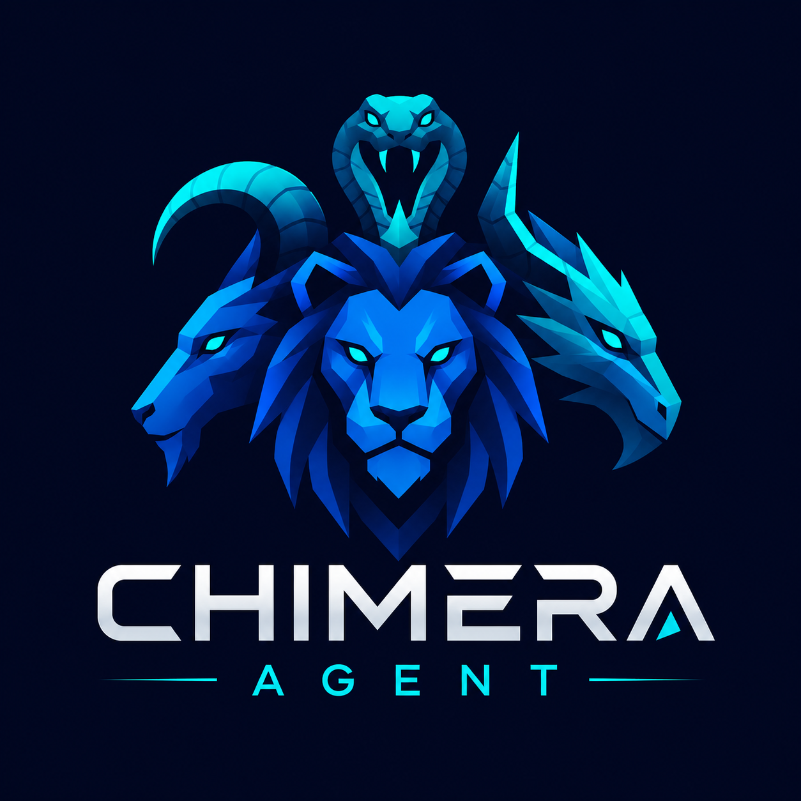

<div align="center">



# Chimera

**一个开源、自我进化的 AI 智能体，其推理核心是 LLM 融合（Fusion）引擎。**

[](LICENSE)
[](https://www.python.org/)
[](https://github.com/brcampidelli/chimera-agent/actions/workflows/ci.yml)
[](https://mypy-lang.org/)
[](https://github.com/astral-sh/ruff)
[](https://discord.gg/ACvBbrmguV)


<sub><a href="README.md">English</a> · <a href="README.pt-BR.md">Português</a> · <a href="README.es.md">Español</a> · <a href="README.de.md">Deutsch</a> · <a href="README.fr.md">Français</a> · <b>中文</b> · <a href="README.ja.md">日本語</a></sub>

</div>

Chimera 在**每次请求时融合多个 LLM**——采用 **面板 → 评审 → 合成器（panel → judge → synthesizer）**
流水线（受 OpenRouter Fusion 启发），而非依赖单一前沿模型；并且会**随时间自我提升**
（记忆 → 技能 → 模型），从而抵御限制当今智能体的*持续进化退化*问题。

> **状态：** 早期 alpha。构建计划的全部 8 个里程碑（M0–M7）均已实现：
> Tier 1–4 + 融合引擎 + 自我进化 + 治理内核。
> 158 项测试 · `mypy --strict` 通过 · `ruff` 通过。

---

## 为什么选择 Chimera

现有框架各自只在**一个维度**上强：Hermes/OpenClaw 能进化技能，但只用单一模型；
CrewAI/LangGraph 编排出色，但不会学习；TrustClaw/NemoClaw/ZeroClaw 提供安全/沙箱，但不会进化。
**Chimera 将这四者结合在一起：**

- 🧬 **以融合作为推理** —— 面板→评审→合成器引擎是推理核心，而非附加组件。提升来自*合成过程本身*，而不仅是模型多样性。
- 🪜 **四个能力层级在同一进阶路径中** —— 增强工具 → 单任务自治 → 多智能体团队 → 自我进化生态系统。
- ♻️ **多层级自我进化**，明确针对持续进化退化（状态外置、抗漂移上下文、verify-or-revert、经验缓冲）。
- 🛡️ **同样会自我改进的治理内核** —— allow/warn/block/review，并配有经过静态校验的自我修改边界。

## 功能特性

- **LLM 融合引擎** —— 与厂商无关的前沿 + 开源模型面板，一个揭示共识/矛盾/盲点的评审，以及一个合成器；**成本感知路由器**只在划算时才融合（涉及工具调用的回合保持单模型）。
- **Tier-2 自治** —— 规划 → 执行 → Manager 复核 → **verify-or-revert**（工作区快照/恢复 + 命令校验器），并带有类似 git 的经验缓冲。
- **自我进化** —— 一个 Memory Manager（ADD/UPDATE/DELETE/NOOP 去重）、一个会*自行编写并测试技能*的技能进化器（提出 → 测试 → 保留/丢弃）、自学习的定时任务，以及一个衡量退化的**持续进化基准**。
- **多智能体团队** —— 角色专精、顺序型与主管型 crew、MOC 消息合并、共享记忆、并行复核。
- **治理与安全** —— 自我改进的信任内核、用于自我修改边界的静态校验器、仅追加的审计日志，以及受治理的工具。
- **集成** —— 一流的 **MCP** 客户端 + **OpenAPI/REST → 工具** 导入器，可接入任意平台或 API。
- **定时任务与主动性** —— 人工指派与自学习的计划任务。
- **迁移** —— 从 Hermes Agent / OpenClaw 导入配置、技能与**长期记忆**（记忆是*合并*的，绝不覆盖）。
- **CLI 优先** —— 一切均可在终端完成；通过 LiteLLM/OpenRouter 实现厂商无关。

## 快速开始

需要 Python **3.11+**（推荐 3.12+）和 [uv](https://docs.astral.sh/uv/)。

```bash
uv sync --extra dev
cp .env.example .env        # 至少设置一个提供商密钥（推荐 OpenRouter）
uv run chimera doctor       # 检查你的环境
```

## 命令

```bash
chimera doctor / models               # 状态与配置
chimera run "PROMPT"                   # 单次 Tier-1 补全
chimera fuse "PROMPT" --show-panel     # LLM 融合：面板 -> 评审 -> 合成器
chimera agent "TASK" --fuse --guard    # ReAct 智能体循环（受治理的工具调用）
chimera solve "TASK" --verify "pytest -q"   # Tier-2 自治：规划 -> verify-or-revert
chimera crew "TASK" --mode supervisor  # Tier-3 多智能体 crew
chimera meta "an agent for X"          # Tier-4 元智能体：设计一个专用智能体
chimera memory add "一条持久的事实"      # 经过整理的长期记忆（去重）
chimera cron add NAME "0 9 * * *" "run report"   # 安排一个任务
chimera cron learn                     # 从重复任务中提议定时任务（默认禁用）
chimera bench                          # 持续进化基准
chimera guard "rm -rf /"               # 预览一次治理裁决
chimera migrate hermes ~/.hermes --apply   # 导入配置 + 技能 + 合并记忆
```

## 架构

```
chimera/
  core/          智能体循环（ReAct）+ Tier-2 自治（规划、verify-or-revert、主管）
  fusion/        面板 -> 评审 -> 合成器 + 成本感知路由器
  memory/        working / episodic / semantic / persona + Memory Manager
  skills/        内置技能库 + skill-context 检索
  evolution/     学习型技能进化器、经验缓冲
  governance/    信任内核（allow/warn/block/review）、静态校验器、审计、受治理工具
  orchestration/ 角色、顺序型与主管型 crew、MOC 通信
  ecosystem/     元智能体、变更节奏治理、轨迹收集
  tools/         原生工具（文件、shell、http）
  integrations/  MCP 客户端 + OpenAPI->工具 导入器
  scheduler/     定时任务（指派 + 自学习）+ SOP 引擎
  migration/     从 Hermes/OpenClaw 导入（配置、技能、记忆合并）
  providers/     LLM 适配器（LiteLLM / OpenRouter）
  eval/          持续进化基准、演示任务
  cli/           `chimera` 命令（CLI 优先）
```

完整设计及其所依据的研究见 [docs/architecture.md](docs/architecture.md)。

## 路线图

| 里程碑 | 状态 |
|---|---|
| M0 — 基础（gateway、配置、CLI） | ✅ |
| M1 — Tier 1 + 工具/技能/集成/定时任务/迁移 | ✅ |
| M2 — LLM 融合引擎 + 成本感知路由器 | ✅ |
| M3 — Tier 2 自治（verify-or-revert） | ✅ |
| M4 — 自我进化（记忆、技能、学习型定时任务、基准） | ✅ |
| M5 — 治理内核 | ✅ |
| M6 — Tier 3 多智能体团队 | ✅ |
| M7 — Tier 4 自我进化生态系统 | ✅ |

下一步：在规模化的真实模型上进行验证、扩展持续进化测试套件，以及一个可选的 LangGraph 持久化后端。

## 开发

```bash
uv run ruff check .      # 代码风格检查
uv run mypy chimera      # 类型检查（strict）
uv run pytest -q         # 测试
```

参见 [CONTRIBUTING.md](CONTRIBUTING.md) 与 [CODE_OF_CONDUCT.md](CODE_OF_CONDUCT.md)。
安全问题：参见 [SECURITY.md](SECURITY.md)。

## 社区

欢迎加入 **[Discord](https://discord.gg/ACvBbrmguV)** 的讨论——欢迎提问、分享想法与贡献。

## 许可证

[Apache-2.0](LICENSE)。
